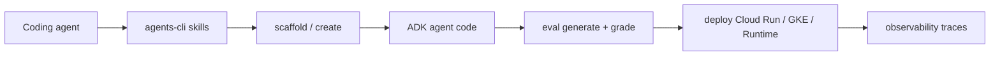
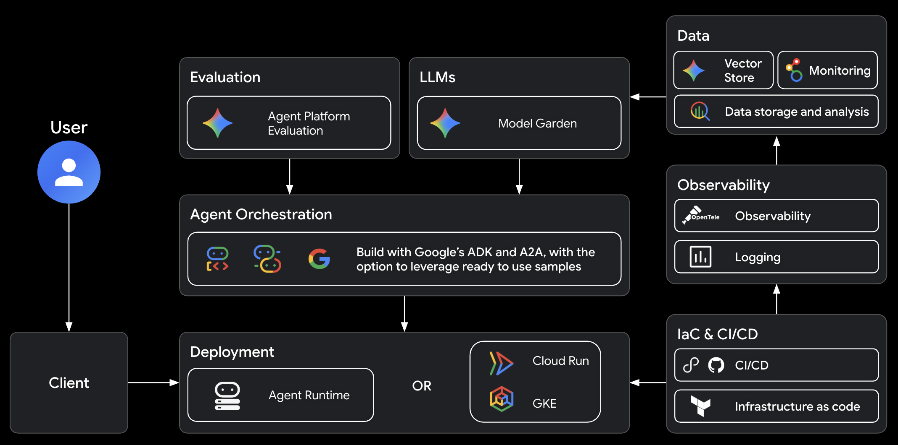
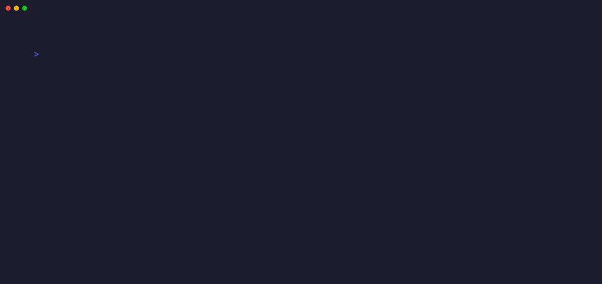
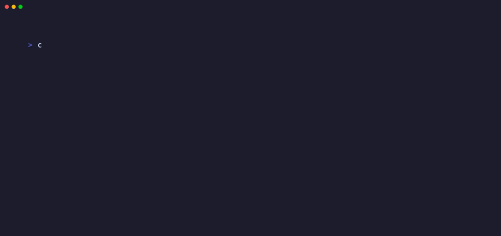

# Google agents-cli Agent Masterclass — Full Tutorial

Everything you need to **install, run, and build extraordinary agents** with [Google agents-cli](https://github.com/google/agents-cli) — the CLI and skills that turn your coding assistant into an ADK + Google Cloud expert.

**Official:** [github.com/google/agents-cli](https://github.com/google/agents-cli) · **Docs:** [google.github.io/agents-cli](https://google.github.io/agents-cli/) · **Quickstart:** [Build Your First Agent](https://google.github.io/agents-cli/guide/quickstart-tutorial/)

All terminal GIFs in this guide are **verified recordings** — captured with [VHS](https://github.com/charmbracelet/vhs) running real `uvx google-agents-cli` commands. No simulated HTML terminals.

---

## Media assets (copy for Medium)

| Asset | URL |
|-------|-----|
| Mega workflow | `https://ayush7614.github.io/agentic-ai-ecosystem/guides/agents-cli-agent-masterclass/assets/mega-agents-cli-workflow.gif` |
| Install verify | `https://ayush7614.github.io/agentic-ai-ecosystem/guides/agents-cli-agent-masterclass/assets/step-01-install-verify.gif` |
| Scaffold create | `https://ayush7614.github.io/agentic-ai-ecosystem/guides/agents-cli-agent-masterclass/assets/step-02-scaffold-create.gif` |
| Install + info | `https://ayush7614.github.io/agentic-ai-ecosystem/guides/agents-cli-agent-masterclass/assets/step-03-install-info.gif` |
| Eval metrics | `https://ayush7614.github.io/agentic-ai-ecosystem/guides/agents-cli-agent-masterclass/assets/step-04-eval-metrics.gif` |
| Run agent | `https://ayush7614.github.io/agentic-ai-ecosystem/guides/agents-cli-agent-masterclass/assets/step-05-run-agent.gif` |
| Login status | `https://ayush7614.github.io/agentic-ai-ecosystem/guides/agents-cli-agent-masterclass/assets/step-06-login-status.gif` |
| Architecture (official) | `https://ayush7614.github.io/agentic-ai-ecosystem/guides/agents-cli-agent-masterclass/assets/architecture-official.png` |
| Blog poster | `https://ayush7614.github.io/agentic-ai-ecosystem/guides/agents-cli-agent-masterclass/assets/blog-poster-1200x600.png` |

---

## What you'll have at the end

- `agents-cli` v1.0+ installed and verified
- Skills loaded into your coding agent (Cursor, Claude Code, Codex, Antigravity)
- A scaffolded **ADK agent project** with eval boilerplate
- Understanding of scaffold → build → eval → deploy → observe lifecycle
- Ideas for **extraordinary** multi-tool, multi-agent, and RAG projects

---

## Introduction — agents-cli is not another chatbot

[agents-cli](https://github.com/google/agents-cli) is Google's **Agent Development Lifecycle toolchain** for the [Gemini Enterprise Agent Platform](https://docs.cloud.google.com/gemini-enterprise-agent-platform/). It wraps the [Agent Development Kit (ADK)](https://adk.dev/) with:

- **CLI commands** — scaffold, run, eval, deploy, publish
- **7 agent skills** — workflow, ADK code, scaffold, eval, deploy, publish, observability
- **Coding-agent integration** — works *with* Claude Code, Codex, Antigravity — not *instead of* them





*Source: [google/agents-cli architecture](https://github.com/google/agents-cli/blob/main/docs/src/assets/architecture.png)*

---

## Part 1 — Prerequisites

| Requirement | Install |
|-------------|---------|
| **Python 3.11+** | `python3 --version` |
| **uv** | [docs.astral.sh/uv](https://docs.astral.sh/uv/getting-started/installation/) |
| **Node.js** | For `npx skills add` |
| **API access (local)** | [AI Studio API key](https://aistudio.google.com/apikey) *or* `agents-cli login` for GCP |
| **API access (deploy)** | Google Cloud project with billing |

You do **not** need Google Cloud for local prototype work — AI Studio key is enough for `run` and `eval`.

---

## Part 2 — Install agents-cli

### Full setup (CLI + skills)

```bash
uvx google-agents-cli setup
```

This installs the CLI and pushes skills to detected coding agents.

### Skills only

```bash
npx skills add google/agents-cli
```

Your coding agent reads skills and invokes `agents-cli` commands on your behalf.

### Verify (recorded GIF)

```bash
uvx google-agents-cli --version    # agents-cli, version 1.0.0
uvx google-agents-cli --help
```


---

## Part 3 — Authenticate

```bash
uvx google-agents-cli login --status
uvx google-agents-cli login -i          # interactive: GCP or AI Studio
```

For **local dev**, set in your project `.env`:

```bash
GOOGLE_GENAI_USE_VERTEXAI=FALSE
GOOGLE_API_KEY=your-aistudio-key
```



---

## Part 4 — The 7 agent skills

| Skill | What your coding agent learns |
|-------|-------------------------------|
| `google-agents-cli-workflow` | Full lifecycle, code preservation, model selection |
| `google-agents-cli-adk-code` | ADK Python — agents, tools, callbacks, state |
| `google-agents-cli-scaffold` | `create`, `enhance`, `upgrade` |
| `google-agents-cli-eval` | Metrics, datasets, LLM-as-judge, prompt optimize |
| `google-agents-cli-deploy` | Agent Runtime, Cloud Run, GKE, CI/CD |
| `google-agents-cli-publish` | Gemini Enterprise registration |
| `google-agents-cli-observability` | Cloud Trace, logging, BigQuery |

**Prompt pattern:** *"Use agents-cli to build …"* activates the right skills automatically.

---

## Part 5 — Scaffold your first agent

### Prototype mode (no cloud deploy)

```bash
uvx google-agents-cli create caveman-agent --prototype --yes
cd caveman-agent
uvx google-agents-cli install
```

Creates:

```
caveman-agent/
├── app/agent.py          # ADK root agent
├── agents-cli-manifest.yaml
├── tests/eval/           # eval datasets + config
├── pyproject.toml
├── Dockerfile
└── GEMINI.md             # agent dev instructions
```


### Check project config

```bash
uvx google-agents-cli info
```

Shows: project name, deployment target, agent directory, region, A2A support.



---

## Part 6 — Build the caveman compressor (official tutorial)

Google's [quickstart tutorial](https://google.github.io/agents-cli/guide/quickstart-tutorial/) walks through a **caveman compressor** — verbose text → terse grunts.

**Tell your coding agent:**

> Use agents-cli to build a caveman-style agent that compresses verbose text into terse, technical grunts

Or edit `app/agent.py` directly — see [examples/caveman-agent.py](./examples/caveman-agent.py):

```python
root_agent = Agent(
    name="caveman_agent",
    model=Gemini(model="gemini-flash-latest"),
    instruction="""You caveman compressor. Human give long words, you make short.
Rules:
- No articles. No filler. No fluff.
- Short grunts. Simple words.
...
""",
)
```

Save spec first: [examples/agents-cli-spec.caveman.md](./examples/agents-cli-spec.caveman.md) → `.agents-cli-spec.md`

---

## Part 7 — Run locally

```bash
uvx google-agents-cli run "Please help me understand deployment options for my project"
```

Starts a local server (default port **18080**), runs one turn, stops.

```bash
uvx google-agents-cli playground    # web UI for manual chat
uvx google-agents-cli run --start-server   # keep server warm for repeated prompts
```


**Expected caveman output:**

```
Deploy options: Agent Runtime, Cloud Run, GKE. Pick one. Ship.
```

---

## Part 8 — Evaluate (the most important phase)

agents-cli ships **17+ built-in metrics**:

```bash
uvx google-agents-cli eval metric list
```

Includes: `FINAL_RESPONSE_QUALITY`, `INSTRUCTION_FOLLOWING`, `TOOL_USE_QUALITY`, `SAFETY`, `HALLUCINATION`, multi-turn variants.


### Run evals

```bash
uvx google-agents-cli eval generate    # run agent on dataset → traces
uvx google-agents-cli eval grade       # LLM-as-judge scoring
# Or chained:
uvx google-agents-cli eval run
```

**Critical rule:** Never assert LLM output in pytest — use eval, not unit tests, for behavioral quality.

**Iterate 5–10+ times** until thresholds pass. Tell your coding agent:

> The greeting test is too polite. Make it more caveman. Re-run eval.

Advanced: `eval dataset synthesize`, `eval compare`, `eval analyze`, `eval optimize`

---

## Part 9 — Deploy to Google Cloud

After eval passes and **you explicitly approve**:

```bash
uvx google-agents-cli scaffold enhance . --deployment-target cloud_run
uvx google-agents-cli deploy
```

| Target | When to use |
|--------|-------------|
| **Agent Runtime** | Managed Gemini Enterprise scale |
| **Cloud Run** | HTTP API, fast iteration |
| **GKE** | Kubernetes control, custom networking |

Cloud Trace enabled by default after deploy.

---

## Part 10 — Publish & observe

```bash
uvx google-agents-cli publish gemini-enterprise
uvx google-agents-cli infra single-project   # observability infra
```

Open Cloud Trace explorer — see spans per LLM call and tool execution.

---

## Part 11 — CLI command reference

| Command | Purpose |
|---------|---------|
| `create <name>` | New agent from template |
| `scaffold enhance` | Add deploy / CI/CD / RAG to existing |
| `run "prompt"` | One-shot local inference |
| `playground` | Web UI |
| `eval generate` / `grade` | Behavioral testing |
| `deploy` | Push to GCP |
| `lint` | Ruff code quality |
| `update` | Reinstall skills to all IDEs |

Full list: [agents-cli README](https://github.com/google/agents-cli#cli-commands)

---

## Part 12 — Mind-blowing project ideas

Use agents-cli skills + ADK to build these — each uses a different superpower:

### 1. **Incident Gruntifier** (caveman++)
On-call Slack bot that turns 500-word postmortem drafts into 3-line caveman summaries *and* opens a Jira ticket via tool. Multi-tool agent with evals for brevity + accuracy.

### 2. **Meeting → Action Agent**
Ingests transcript → outputs ADK tool calls: calendar events, email drafts, Linear tasks. Eval on `TOOL_USE_QUALITY` and `MULTI_TURN_TASK_SUCCESS`.

### 3. **RAG Doc Oracle**
Clone `rag-vector-search` sample from agents-cli catalog. Agent answers from your PDFs with grounding eval (`GROUNDING`, `HALLUCINATION` metrics).

### 4. **A2A Agent Mesh**
Two agents: **Researcher** (search tool) + **Writer** (compression). A2A protocol built into ADK scaffold — agents talk to each other.

### 5. **Self-Optimizing Persona**
Use `eval optimize` to auto-tune instructions until caveman tone scores 95%+ on `INSTRUCTION_FOLLOWING` — watch prompts evolve across eval iterations.

### 6. **Deploy-in-60-Seconds Demo**
Prototype locally → `scaffold enhance --deployment-target cloud_run` → `deploy` → live public URL. Record the VHS GIF of the deploy output for your portfolio.

**Prompt to start any of these:**

```
Use agents-cli workflow skill. Read .agents-cli-spec.md.
Scaffold prototype, implement ADK tools, write 3 eval cases,
run eval generate + grade, show me failures before fixing.
```

---

## Part 13 — Work with Cursor / Claude Code

After `uvx google-agents-cli setup`, skills appear in your agent's skill directory.

**Example prompts:**

| Goal | Prompt |
|------|--------|
| New agent | *Use agents-cli to build a [description] agent* |
| Add deploy | *Use agents-cli deploy skill — enhance for Cloud Run* |
| Fix eval | *Run agents-cli eval grade and fix failing cases* |
| Add tool | *Use google-agents-cli-adk-code to add a Google Search tool* |

Pair with our [MCP Visual Guide](../mcp-visual-guide/TUTORIAL.md) to expose deployed agents as MCP servers.

---

## Part 14 — agents-cli vs raw ADK

| | agents-cli | ADK alone |
|---|------------|-----------|
| **Scaffolding** | `create` + eval + CI boilerplate | Manual |
| **Coding agent skills** | 7 lifecycle skills | None |
| **Eval suite** | Built-in metrics + optimize | Build yourself |
| **Deploy** | One command + enhance | Custom Terraform |
| **Best for** | Enterprise GCP agents | Embedded Python apps |

---

## Part 15 — Troubleshooting

| Symptom | Fix |
|---------|-----|
| `Not authenticated` | `agents-cli login -i` or set `GOOGLE_API_KEY` |
| Empty `run` response | Check API key; verify `.env` |
| `invalid_grant` on create | GCP creds stale — login again or use `--prototype` |
| Eval always fails | Start with 1–2 cases; use `eval analyze` for clusters |
| Model 404 | Don't change model unless asked — use `gemini-flash-latest` |

---

## Part 16 — Regenerate verified GIFs

All GIFs are recorded from `assets/tapes/*.tape` using VHS:

```bash
cd guides/agents-cli-agent-masterclass/assets/tapes
vhs step-01-install.tape
vhs step-02-scaffold.tape
# … or:
cd .. && ./render_real_gifs.sh
```

**Requirement:** `brew install vhs` and `uv` on PATH. Each tape runs **real** shell commands.

---

## Part 17 — Hands-on checklist

```bash
# 1. Install
uvx google-agents-cli setup

# 2. Auth
uvx google-agents-cli login -i    # or AI Studio key in .env

# 3. Scaffold
uvx google-agents-cli create my-agent --prototype --yes
cd my-agent && uvx google-agents-cli install

# 4. Run
uvx google-agents-cli run "Hello from ADK"

# 5. Eval
uvx google-agents-cli eval metric list
uvx google-agents-cli eval run

# 6. (Optional) Deploy — with human approval
uvx google-agents-cli scaffold enhance . --deployment-target cloud_run
uvx google-agents-cli deploy
```

---

## Part 18 — FAQ (from Google)

**Is this an alternative to Claude Code?**  
No — it's a tool *for* coding agents.

**Need Google Cloud for local dev?**  
No — AI Studio API key works for create, run, eval.

**Use without a coding agent?**  
Yes — every CLI command works standalone.

**Extend with other skills?**  
Yes — pair with [google/skills](https://github.com/google/skills) for GCP foundations or [agent-skills](https://github.com/addyosmani/agent-skills) for SWE workflows.

---

## Further reading

- [agents-cli GitHub](https://github.com/google/agents-cli) · [Docs](https://google.github.io/agents-cli/)
- [Quickstart: Caveman Agent](https://google.github.io/agents-cli/guide/quickstart-tutorial/)
- [ADK Documentation](https://adk.dev/)
- [Harness Engineering](../harness-engineering/TUTORIAL.md)

---

## Summary

**agents-cli** turns your existing coding assistant into a **Google Cloud agent factory**. Install with `uvx google-agents-cli setup`, scaffold with `create`, smoke-test with `run`, prove quality with `eval`, ship with `deploy`. The skills handle ADK patterns so you focus on *what* the agent does — caveman compressors, RAG oracles, or multi-agent meshes.

Every GIF in this guide was recorded from a real terminal. Clone the tapes, re-run them, and verify yourself.
