# AI Agents Masterclass — Full Visual Guide

Everything you need to **understand, compare, and build** AI agents: definitions from Google Cloud and IBM, ReAct and ReWOO loops, multi-agent patterns, 15+ frameworks, MCP and A2A protocols, governance, Cloud Run deployment, and **five runnable examples** with animated diagram + terminal GIFs.

**References (original synthesis — not copies):** [ServiceNow — AI Agent Masterclass](https://www.servicenow.com/community/now-assist-articles/ai-agent-masterclass-overview-recordings-and-resources/ta-p/3469262) · [coleam00/ai-agents-masterclass](https://github.com/coleam00/ai-agents-masterclass) · [OpenAI — Building AI agents](https://openai.com/business/guides-and-resources/a-practical-guide-to-building-ai-agents/) · [Google Cloud — What are AI agents?](https://cloud.google.com/discover/what-are-ai-agents) · [IBM — AI agents explained](https://www.ibm.com/think/topics/ai-agents)

Format matches our [MCP Visual Guide](../mcp-visual-guide/TUTORIAL.md) and [Hermes Masterclass](../hermes-agent-masterclass/TUTORIAL.md): long-form prose, lists, **animated white-theme GIFs**, terminal walkthroughs, copy-paste code.

---

## What you'll understand at the end

- What an **AI agent** is — and how it differs from assistants, chatbots, and bots  
- Six core capabilities: **reasoning, acting, observing, planning, collaborating, self-refining**  
- Agent **anatomy**: persona, memory, tools, model  
- **Memory tiers** — working, episodic, semantic, procedural  
- **ReAct** and **ReWOO** reasoning paradigms  
- Five classical agent types on the **reflex → learning** ladder  
- Three lifecycle stages: **goal planning, tool reasoning, learning/reflection**  
- **Single vs multi-agent**, surface vs background deployment  
- **Agentic vs non-agentic** chatbots  
- **Six enterprise use-case families** with healthcare, finance, and emergency examples  
- Benefits, challenges, and **governance** patterns (HITL, activity logs, interruption)  
- **15+ frameworks** — when to pick LangGraph, CrewAI, OpenAI Agents SDK, Pydantic AI, Hermes, OpenClaw, and more  
- **MCP + A2A** interoperability  
- **Cloud Run** production deployment  
- **Five runnable examples** with terminal GIFs and smoke tests  

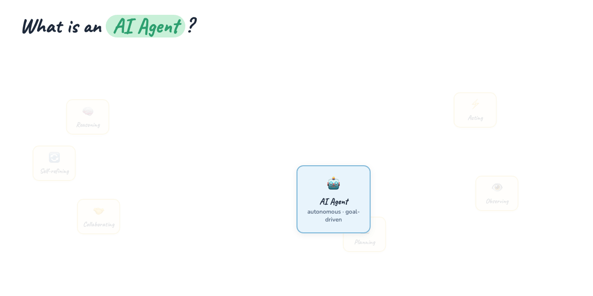

**Blog hero GIF:** [mega-agents-everything.gif](./assets/mega-agents-everything.gif) — definition → anatomy → ReAct → multi-agent → frameworks → protocols → deploy (~14s).

---

## Introduction — why agents now

For years, "AI" in products meant **one-shot generation**: you send a prompt, the model returns text, the transaction ends. That works for drafting emails. It fails for real work — research a market, book travel, triage tickets, reconcile accounts — because real work is **multi-step**, **tool-dependent**, and **stateful**.

An **AI agent** closes that gap. Instead of a single response, the system **pursues a goal** over time: it plans, calls tools, reads results, revises, and stops when the objective is met (or when a human says stop).

Industry definitions converge on the same idea with different emphasis:

**Google Cloud** describes AI agents as systems that combine a foundation model with **reasoning**, **planning**, and **action** — using tools and external data to accomplish tasks on a user's behalf, not just answer questions.

**IBM** frames agents as software entities that **perceive** their environment, **reason** about goals, and **act** through tools or APIs — often with memory that persists across interactions.

**OpenAI's practical guide** adds product reality: agents shine when workflows are **open-ended**, require **judgment**, and benefit from **tool use** — but they demand stronger observability and guardrails than chatbots.

This masterclass synthesizes those views into one buildable mental model, then walks you through code, frameworks, and production patterns.

---

## Part 1 — Agent vs assistant vs bot

Three labels get swapped in marketing. Architecturally they differ:

**Bot (classic)** — rule-based or intent-classifier driven. Fixed dialog trees, slot filling, no genuine planning. Example: "Track my package" → lookup by tracking number. Predictable, cheap, brittle outside trained intents.

**Assistant (LLM chatbot)** — a model in a chat UI. Strong at language, weak at persistence. Each turn is mostly stateless unless you bolt on memory. Example: "Summarize this PDF" in one shot. No tool loop unless explicitly wired.

**Agent** — an LLM (or ensemble) wrapped in a **control loop**: plan → act via tools → observe results → repeat. Carries **goal state**, **memory**, and often **delegation** to other agents. Example: "Find the best week for surfing in Greece next year" → weather DB → tide search → synthesize → recommend dates.

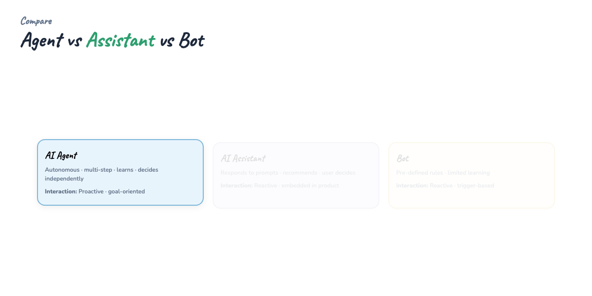

**Rule of thumb in prose:** if the product only needs one model call and no side effects, use an assistant. If it must **change the world** (APIs, DBs, files, tickets) over multiple steps, you are building an agent. If the flow is fully scripted with no LLM judgment, you might not need an agent at all — a workflow engine suffices.

---

## Part 2 — Six defining capabilities

Modern agents are not defined by a single feature but by a **bundle** of behaviors:

**Reasoning** — the model decomposes goals, handles ambiguity, and chooses among strategies. Chain-of-thought and structured planning prompts live here.

**Acting** — execution through **tools**: HTTP calls, SQL, Python, browser automation, MCP servers. Action is what separates agents from chat.

**Observing** — after each action, the agent ingests **tool output** (JSON, logs, errors) and updates its internal state. Bad observation handling is the #1 source of silent failures.

**Planning** — explicit or implicit task graphs: "first gather weather, then check tides, then compare weeks." Plans may be static (ReWOO) or interleaved with execution (ReAct).

**Collaborating** — multi-agent handoffs, human approvals, or role-based crews. No single model must do everything.

**Self-refining** — reflection passes, critique steps, memory writes, skill authoring. The agent improves its approach within or across sessions (see [Hermes learning loop](../hermes-agent-masterclass/TUTORIAL.md)).

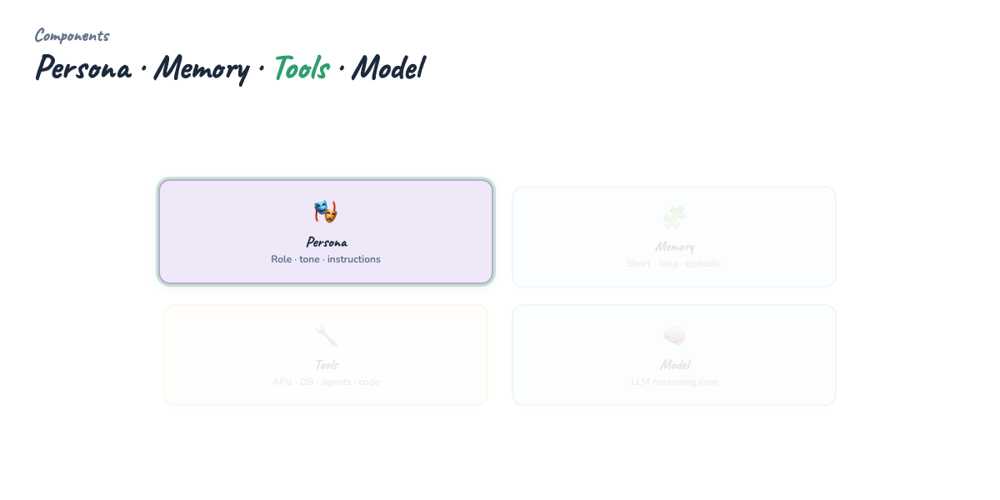

These six capabilities map directly to architecture choices later: tools need MCP or function schemas; collaboration needs handoff or crew abstractions; self-refining needs memory tiers and logging.

---

## Part 3 — Anatomy: persona, memory, tools, model

Every production agent resolves into four layers:

**Persona** — system prompt, SOUL.md, role brief. Sets tone, boundaries, and escalation rules. In enterprise agents, persona also encodes **compliance** ("never disclose account numbers").

**Memory** — what persists beyond the current context window. Short-term: chat history and scratchpad. Long-term: vector stores, markdown files, session DBs. See Part 4.

**Tools** — typed functions the model can invoke. Each tool needs a name, description, JSON schema, and a handler. Tools should be **narrow** and **idempotent where possible**.

**Model** — the reasoning engine. Often one primary model plus smaller models for routing or summarization. Model choice affects cost, latency, and tool-call reliability.

```python
# Conceptual agent stack (not framework-specific)
agent = {
    "persona": "You are a cautious travel planner. Confirm before booking.",
    "memory": {"session": [], "long_term": "vector://user-prefs"},
    "tools": ["weather_db", "search_web", "calendar_create"],
    "model": "gpt-4o",
}
```

The **model** is interchangeable; **tools and memory** encode your product's real value.

---

## Part 4 — Memory tiers

Memory is not one blob. Mature agents use **tiers** with different latency, capacity, and retrieval patterns:

**Working memory** — the current context window: system prompt, recent turns, tool results. Bounded by token limits; compress or summarize when full.

**Episodic memory** — past sessions and events ("last time we planned Greece, user preferred July"). Stored in SQLite, Postgres, or session logs; retrieved by recency or search.

**Semantic memory** — facts and embeddings in a vector store. "User is vegetarian." "API X rate-limits at 100 rpm."

**Procedural memory** — skills, playbooks, SOUL-adjacent instructions. Often markdown files or skill catalogs (Hermes `SKILL.md`, OpenAI custom instructions at scale).

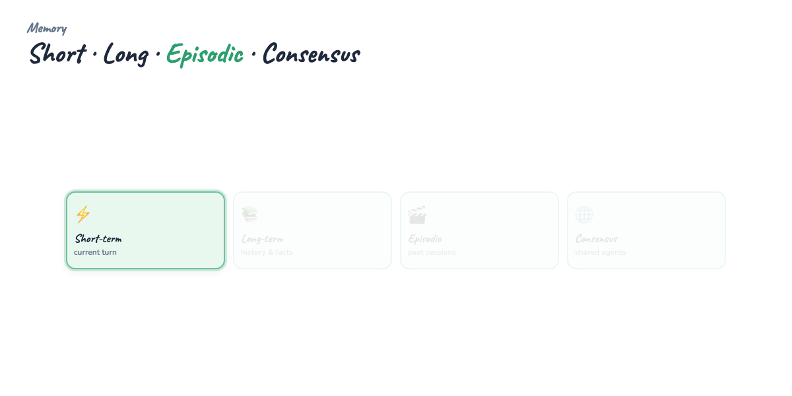

**Design rule:** inject a **small frozen snapshot** at session start (persona + top facts), then let the agent **search** for deeper history on demand. Dumping entire history into every turn burns context and money.

---

## Part 5 — ReAct: interleaved reasoning and action

**ReAct** (Reason + Act) alternates **thought**, **tool call**, and **observation** in one loop. The model decides the next step only after seeing the last observation.

Typical trace:

1. **Think:** "I need historical weather for Greece."  
2. **Act:** `weather_db("Greece")`  
3. **Observe:** `{ "avg_sunny_days_july": 28 }`  
4. **Think:** "Need tide/surf conditions."  
5. **Act:** `search_web("best surfing tide Greece")`  
6. **Observe:** snippet about high tide windows  
7. **Think:** "Combine signals → recommend July 12–19."  
8. **Act:** respond to user  

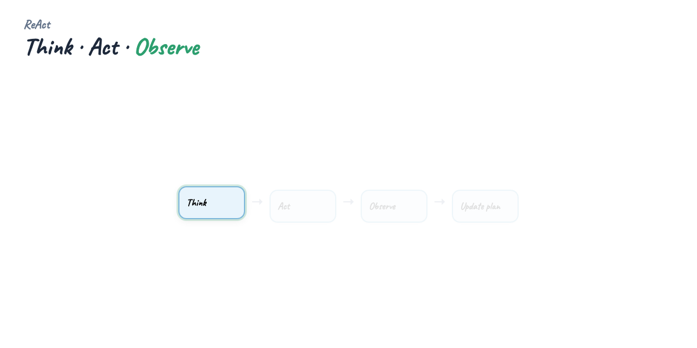

ReAct is flexible — the plan **emerges** from execution. That helps exploratory tasks. Cost: more model turns, harder to audit upfront.

Our minimal example implements this pattern (deterministic demo without an API key):

```python
# examples/minimal_react_agent.py (excerpt)
def think_and_act(state: AgentState, turn: int) -> None:
    if turn == 0:
        state.steps.append("Think: need historical weather for Greece")
        out = TOOLS["weather_db"]("Greece")
        state.steps.append(f"Act: weather_db → {out}")
    elif turn == 1:
        state.steps.append("Think: need surfing conditions (high tide)")
        out = TOOLS["search_web"]("best surfing tide Greece")
        state.steps.append(f"Act: search_web → {out}")
    elif turn == 2:
        state.steps.append("Observe: combine tide + sunny patterns")
        state.steps.append("Act: recommend week of July 12–19 (demo)")
        state.done = True
```

Run:

```bash
cd guides/ai-agents-masterclass
python examples/minimal_react_agent.py
```

---

## Part 6 — ReWOO: plan first, execute second

**ReWOO** (Reasoning WithOut Observation in the loop) separates **planning** from **execution**. A planner emits a structured script of tool calls; a worker runs them; a solver synthesizes the final answer.

Flow:

1. **Planner** — output tool call graph with placeholders  
2. **Worker** — execute all tools (possibly parallel)  
3. **Solver** — read outputs, no further tool access  

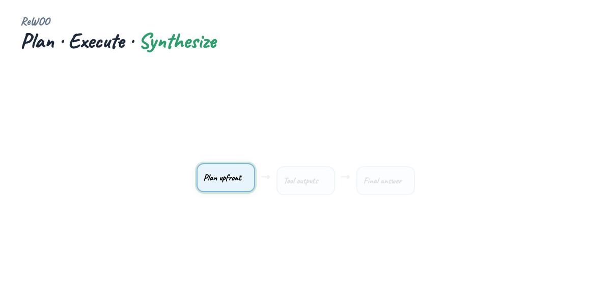

**When ReWOO wins:** predictable pipelines, expensive tools, parallelizable subtasks, audit requirements (plan is reviewable before execution).

**When ReAct wins:** ambiguous goals, errors mid-flight, need to branch on unexpected results.

Many production systems **hybridize**: ReWOO for the macro pipeline, ReAct inside a single step when debugging.

---

## Part 7 — Five classical agent types

Before LLMs, agent literature defined a **ladder of sophistication**. Still useful for scoping:

**Simple reflex** — if condition then action. Thermostat, basic alert bot. No memory, no search.

**Model-based reflex** — internal state tracks the world (last sensor reading). Still no planning.

**Goal-based** — searches action sequences to reach a goal. Classical planning / STRIPS territory.

**Utility-based** — optimizes tradeoffs (cost vs speed vs risk). Portfolio agents, routing.

**Learning** — updates policy from feedback. RL agents, self-refining skill loops, GEPA-style offline evolution.

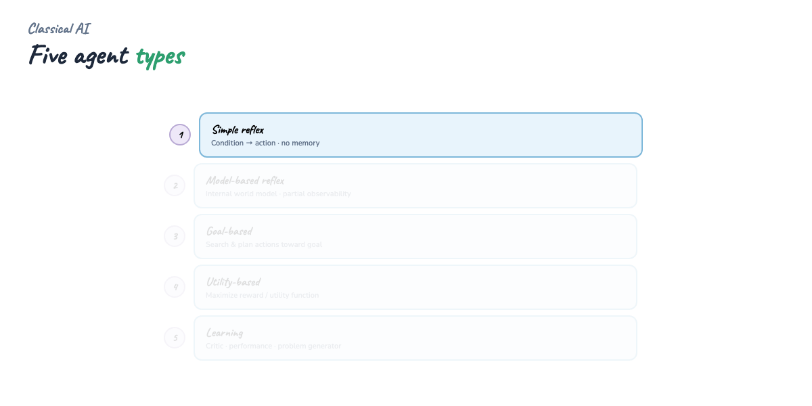

LLM agents usually sit at **goal-based** with hooks toward **learning** (memory writes, reflection, fine-tuning). Don't over-build learning before basic tool reliability works.

---

## Part 8 — Three lifecycle stages (surfing vacation)

OpenAI and ServiceNow-style masterclasses often teach agents as **three stages**. We use one running example: *"Best week for surfing in Greece next year."*

### Stage 1 — Goal planning

Decompose the user goal into subtasks and success criteria.

- Subtask A: historical weather / sunny weeks  
- Subtask B: surf/tide suitability  
- Subtask C: reconcile constraints (user budget, travel dates)  
- Done when: ranked recommendation with confidence  

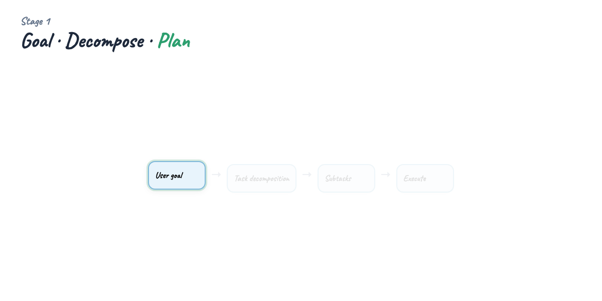

```text
User goal: "Best week for surfing in Greece next year"
Planner output:
  1. Query weather_db(Greece) for sunny weeks
  2. search_web for tide/surf windows
  3. Rank weeks; explain tradeoffs
```

### Stage 2 — Tool reasoning

Select tools, fill arguments, handle errors, retry with backoff. The model must **not** invent tool names — bind to your schema.


```python
TOOLS = {
    "search_web": search_web,
    "weather_db": weather_db,
}
# Model sees JSON schemas; handler validates before side effects
```

### Stage 3 — Learning and reflection

After answering, optionally: log trace, write memory ("user cares about surfing"), critique weak steps, update skills. This is where agents **compound** over time.

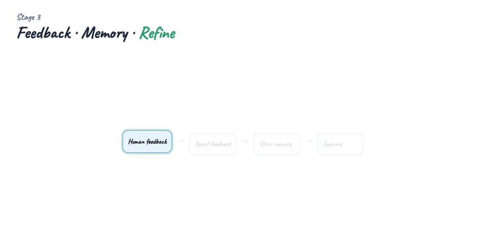

```text
Reflection: "weather_db lacked tide granularity — add surf_forecast tool next sprint"
Memory write: USER prefers July travel
```

Full lifecycle diagram:

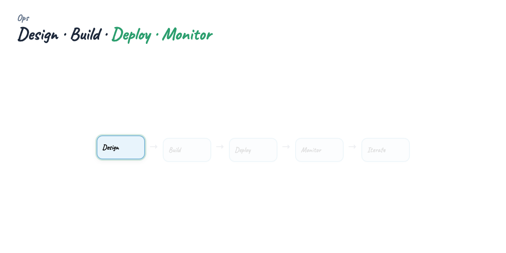

---

## Part 9 — Agentic vs non-agentic chatbots

**Non-agentic chatbot** — single-turn or few-turn Q&A. Retrieval augments context, but no autonomous tool loop. Great for FAQs, doc search, copilot suggestions.

**Agentic chatbot** — same UI, but backend runs a **control loop** with tools and state. User may see "Searching…" / "Calling calendar…" steps.

Differences that matter in production:

- **Latency** — agents take longer; set UX expectations  
- **Cost** — multiple model + tool calls per user message  
- **Failure modes** — tool errors, infinite loops, hallucinated arguments  
- **Observability** — you need step traces, not just final text  

If your feature is "answer from our PDF," start non-agentic. If it is "file this ticket and follow up," go agentic.

---

## Part 10 — Single vs multi-agent

**Single agent** — one model, one loop, one tool namespace. Simplest to debug. Hits limits on long workflows and conflicting roles.

**Multi-agent** — specialized agents with handoffs or parallel crews. Examples: triage → specialist, researcher + writer, planner + executor.

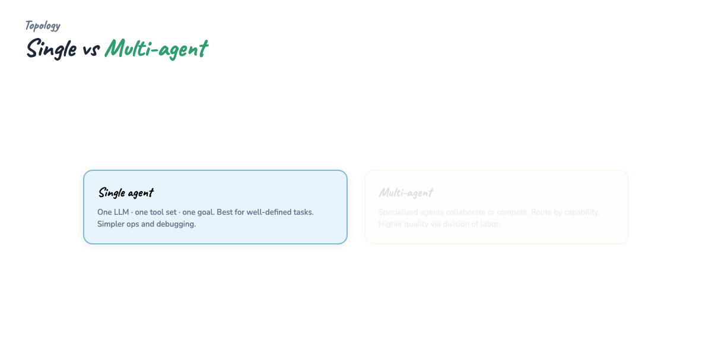

**Patterns in prose:**

- **Sequential crew** — A completes task, passes output to B (CrewAI default)  
- **Handoff** — router agent transfers conversation to specialist (OpenAI Agents SDK)  
- **Supervisor** — orchestrator assigns subtasks to workers (LangGraph, AutoGen)  
- **Debate / review** — generator + critic for quality gates  

Multi-agent adds coordination overhead. Start single-agent until you have clear **role boundaries** and **separate tool permissions** per role.

---

## Part 11 — Surface vs background agents

**Surface agents** — user-facing, synchronous. Chat UI, voice, copilot pane. User waits for steps; HITL approvals live here.

**Background agents** — async jobs: cron digests, ticket sweeps, ETL monitors. Results delivered later via email, Slack, or dashboard.

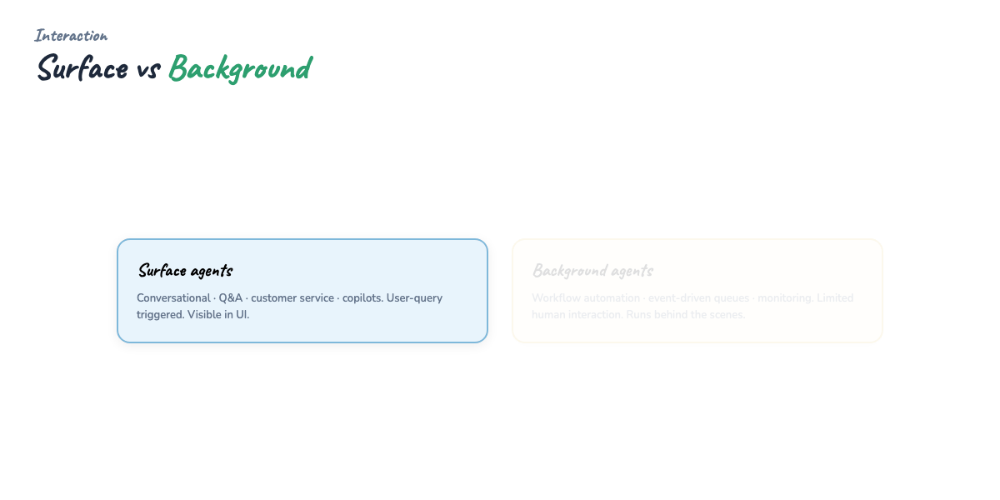

Hermes **cron** and OpenClaw **heartbeats** are background patterns. Cloud Run **jobs** or scheduled Cloud Functions fit the same slot.

Design background agents with **idempotency** and **dead-letter queues** — they will retry at 3am without a human watching.

---

## Part 12 — Six use-case categories

Enterprise agents cluster into six families (plus cross-industry patterns):

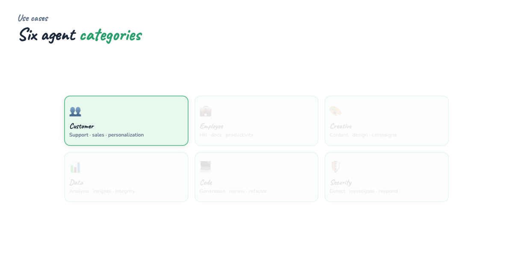

**1. Customer experience** — support triage, order status, personalized recommendations. Needs CRM tools, strict PII handling.

**2. Employee productivity** — draft docs, schedule meetings, summarize threads. Microsoft 365 Copilot, Google Workspace agents.

**3. Software development** — issue → PR agents, test generation, migration assistants. Heavy IDE + repo tool access.

**4. Data and analytics** — natural language to SQL, anomaly explanation, report generation. Guard against destructive queries.

**5. Security and operations** — alert triage, runbook execution, patch verification. Read-only first; HITL for mutations.

**6. Industry workflows** — vertical bundles (see below).

### Healthcare

Clinical **documentation** agents draft notes from visit audio — human sign-off required. **Prior authorization** agents gather payer rules and patient history. **Scheduling** agents coordinate slots across systems. Regulatory constraint: agents **assist**, they do not diagnose autonomously in regulated jurisdictions.

### Finance

**Reconciliation** agents match transactions across ledgers. **Research** agents summarize filings and earnings calls with citations. **Compliance** agents flag policy violations in communications. Audit trails and model risk management are mandatory.

### Emergency and public safety

**Dispatch assist** agents summarize 911 transcripts and suggest resource allocation — always subordinate to human dispatchers. **Disaster response** agents aggregate feeds and produce situational reports. Latency and failure modes can be life-critical; degrade gracefully to static playbooks.

---

## Part 13 — Benefits

**Automation of judgment-heavy workflows** — not just repetitive clicks, but branching decisions with explanations.

**24/7 operation** — background agents monitor queues overnight.

**Composable tools** — same agent core, swap MCP servers for new domains.

**Personalization at scale** — memory tiers remember preferences without re-prompting.

**Faster iteration** — natural language interfaces to internal APIs lower integration cost.

---

## Part 14 — Challenges and risks

**Unpredictability** — same prompt, different tool paths. Mitigate with schemas, evals, and golden traces.

**Cost** — long ReAct loops multiply token usage. Cap turns, summarize observations.

**Security** — prompt injection via tool results, over-privileged tools, SSRF from web fetch tools. Least privilege per tool.

**Compliance** — GDPR, HIPAA, SOC2: log retention, data residency, human approval for sensitive actions.

**Trust** — users need visibility into what the agent did. Black-box answers erode adoption.

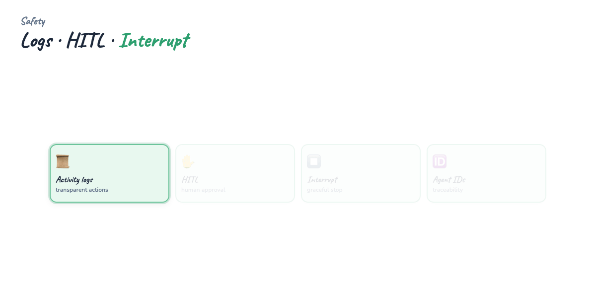

---

## Part 15 — Best practices

**Activity logs** — append-only trace of every thought, tool call, observation, and final output. Store `run_id`, timestamps, user id, model version.

**Interruption** — user can cancel in-flight loops; worker checks cancel token between turns (Hermes models this explicitly).

**Unique IDs** — correlate user session, agent run, and tool invocations across microservices.

**Human-in-the-loop (HITL)** — require approval for payments, deletes, external emails, privilege changes. Pattern: agent prepares action → human clicks approve → tool executes.

**Tool design** — small surface area, explicit errors, no silent defaults on missing args.

**Evals** — regression suite of goals with expected tool sequences or output rubrics.

**Budgets** — max turns, max tool calls, max cost per run.

```python
# Pseudocode: run envelope
@dataclass
class RunContext:
    run_id: str
    user_id: str
    max_turns: int = 12
    cancelled: bool = False

def step(ctx: RunContext):
    if ctx.cancelled:
        raise RunCancelled(ctx.run_id)
    log_event(ctx.run_id, "tool_call", {...})
```

---

## Part 16 — Protocols: MCP and A2A

Agents rarely exist alone. Two interoperability layers matter in 2025–2026:

### Model Context Protocol (MCP)

**MCP** standardizes how hosts discover and invoke **tools, resources, and prompts** from external servers — "USB-C for AI tools." Your agent (or IDE host) runs MCP clients; GitHub, Postgres, filesystem, custom APIs expose MCP servers.

Deep dive: [MCP Visual Guide](../mcp-visual-guide/TUTORIAL.md).

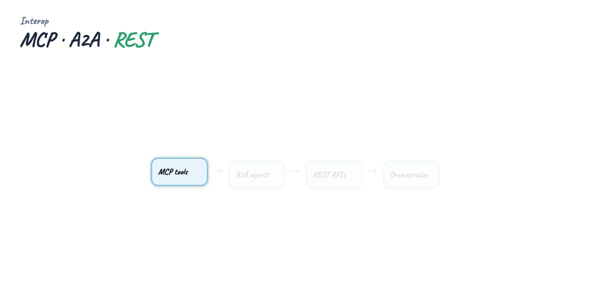

### Agent-to-Agent (A2A)

**A2A** (Google-led, industry collaborators) focuses on **agent ↔ agent** messaging: capability cards, task delegation, status updates across vendor boundaries. Where MCP connects agents to **tools**, A2A connects agents to **each other**.

Use MCP for tool sprawl; use A2A when your orchestrator and specialist run in **different frameworks or clouds** and need a standard task envelope.

---

## Part 17 — Framework landscape

No single framework wins every workload. Map **orchestration style**, **team familiarity**, and **deployment target** first.

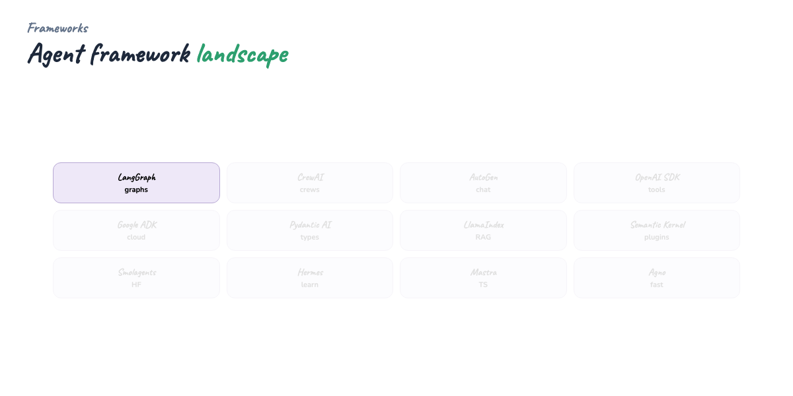

Below: **when to use** prose for each major option. All can coexist with MCP tool servers.

### LangGraph

**LangGraph** models agents as **state machines** — nodes, edges, conditional routing, checkpointing. Best when you need **explicit control flow**, cycles, human-in-the-loop interrupts, and time-travel debugging. LangChain ecosystem; steep learning curve if you only need a simple ReAct loop.

```python
# examples/langgraph_research_agent.py — plan → research → synthesize
g = StateGraph(ResearchState)
g.add_node("plan", plan)
g.add_node("research", research)
g.add_node("synthesize", synthesize)
g.set_entry_point("plan")
g.add_edge("plan", "research")
g.add_edge("research", "synthesize")
g.add_edge("synthesize", END)
app = g.compile()
```

Pick LangGraph for **production workflows** with branching, retries, and persisted state.

### CrewAI

**CrewAI** optimizes **role-based teams**: researcher, writer, analyst with sequential or hierarchical process. Minimal boilerplate for multi-agent prose tasks. Less ideal for fine-grained tool graphs or hard latency SLAs.

```python
crew = Crew(
    agents=[researcher, writer],
    tasks=[research_task, write_task],
    process=Process.sequential,
)
result = crew.kickoff()
```

Pick CrewAI for **content pipelines**, research briefs, and demos where roles are obvious.

### AutoGen (Microsoft)

**AutoGen** emphasizes **conversable agents** and group chat patterns — good for coding assistants, multi-agent debate, and Azure/OpenAI shops. v0.4+ rearchitecture adds async and distributed agents. Choose when you want **Microsoft stack integration** and flexible agent-to-agent chat.

### OpenAI Agents SDK

**OpenAI Agents SDK** (`openai-agents`) provides **Agent**, **Runner**, **handoffs**, and built-in tracing. Tight integration with OpenAI models and Responses API. Handoffs are first-class for triage → specialist routing.

```python
specialist = Agent(name="Specialist", instructions="Answer technical AI agent questions.")
triage = Agent(name="Triage", instructions="Route technical questions.", handoffs=[specialist])
result = await Runner.run(triage, "What is ReAct for AI agents?")
```

Pick it for **OpenAI-native** products and fast handoff prototypes.

### Google Agent Development Kit (ADK)

**Google ADK** targets **Gemini** agents on Vertex AI and Google Cloud — tool use, sub-agents, deployment to Cloud Run. Choose when your stack is **GCP-first** and you want first-party Google tooling for evals and hosting.

### Pydantic AI

**Pydantic AI** centers **type-safe outputs** — `result_type=WeatherReport` validates structured responses. Excellent developer ergonomics for Python teams already using Pydantic v2.

```python
class WeatherReport(BaseModel):
    location: str
    best_week: str
    confidence: float
    notes: str

agent = Agent("openai:gpt-4o-mini", result_type=WeatherReport, system_prompt="...")
result = agent.run_sync("Best surfing week in Greece?")
```

Pick Pydantic AI when **schema correctness** matters more than exotic orchestration.

### LlamaIndex Agents

**LlamaIndex** began as RAG; its agent layer excels when **retrieval** is the core — document Q&A agents, knowledge-base tools, hybrid search. Pair with LlamaParse and workflow events for ingestion-heavy apps.

### Semantic Kernel (Microsoft)

**Semantic Kernel** offers plugins, planners, and enterprise patterns in **.NET and Python**. Strong fit for **Microsoft 365**, Azure AI, and orgs with existing SK investments.

### Smolagents (Hugging Face)

**Smolagents** — lightweight, code-agent focused, Hugging Face hub models. Great for **local/open models** and teaching agents without heavy deps.

### Amazon Bedrock Agents

**Bedrock Agents** — managed AWS service: action groups, knowledge bases, guardrails. Choose when you want **AWS-managed** scaling and IAM-native permissions, less custom loop code.

### Mastra

**Mastra** — TypeScript-first agent framework with workflows, evals, and deployment story. Pick for **Node/TS** teams building product agents alongside Next.js apps.

### Agno (formerly Phidata)

**Agno** — Python toolkit for multi-agent systems with memory, knowledge, and UI. Fast prototyping for **agent OS** style apps.

### ServiceNow AI Agents

**ServiceNow** embeds agents in **ITSM, HR, CSM** workflows — Now Assist, flow designer integration, enterprise guardrails. Choose when the workflow already lives in ServiceNow; extend via Now Platform skills and data classes.

### Hermes Agent

**Hermes** — self-hosted **learning agent**: SOUL.md identity, three memory tiers, self-evolving skills, Curator, optional GEPA, MCP-heavy profiles, gateway + cron. Best when you want an agent that **improves over time** on your machine.

Full tutorial: [Hermes Agent Masterclass](../hermes-agent-masterclass/TUTORIAL.md).

### OpenClaw

**OpenClaw** — messaging-first gateway (WhatsApp, Telegram, Slack), ClawHub skills, proactive heartbeats. Best when **channels and presence** matter more than offline skill evolution. Compare: [Hermes vs OpenClaw](../hermes-vs-openclaw/TUTORIAL.md).

### Framework selection (prose)

- **Explicit graphs, HITL, persistence** → LangGraph  
- **Role crews, content** → CrewAI  
- **OpenAI handoffs** → OpenAI Agents SDK  
- **Typed Python outputs** → Pydantic AI  
- **RAG-heavy** → LlamaIndex  
- **GCP / Gemini** → Google ADK  
- **AWS managed** → Bedrock Agents  
- **TypeScript product** → Mastra  
- **Self-hosted learning agent** → Hermes  
- **Messaging gateway** → OpenClaw  

---

## Part 18 — Environment setup

All examples live under `guides/ai-agents-masterclass/`.

**Prerequisites:**

- Python 3.11+  
- Optional: `OPENAI_API_KEY` for live LLM runs  
- Virtualenv recommended  

```bash
cd guides/ai-agents-masterclass
python3 -m venv .venv
source .venv/bin/activate
pip install -r requirements.txt   # optional deps per framework
cp .env.example .env              # fill OPENAI_API_KEY if desired
```

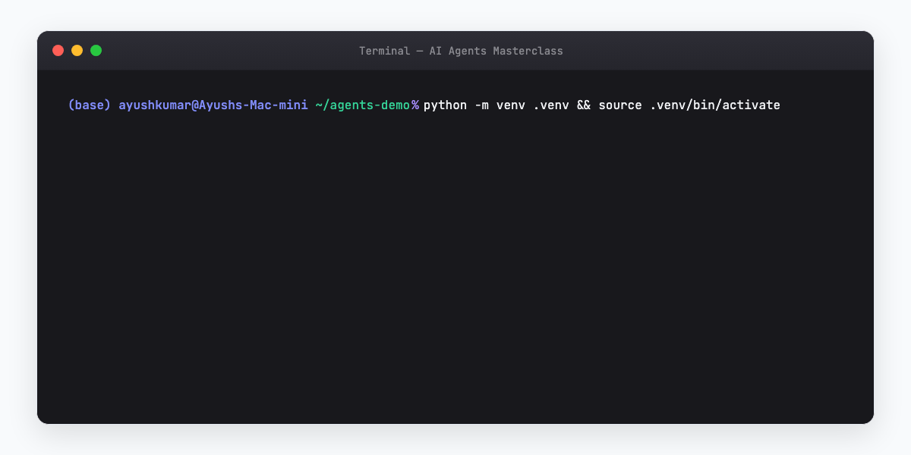

---

## Part 19 — Example 1: minimal ReAct agent

**File:** [examples/minimal_react_agent.py](./examples/minimal_react_agent.py)

No framework — pure Python demonstrating Think → Act → Observe. Uses stub `weather_db` and `search_web` tools. Set `AGENT_GOAL` in `.env`.

```bash
python examples/minimal_react_agent.py
```

Expected output: step trace ending in `✓ ReAct loop completed`.

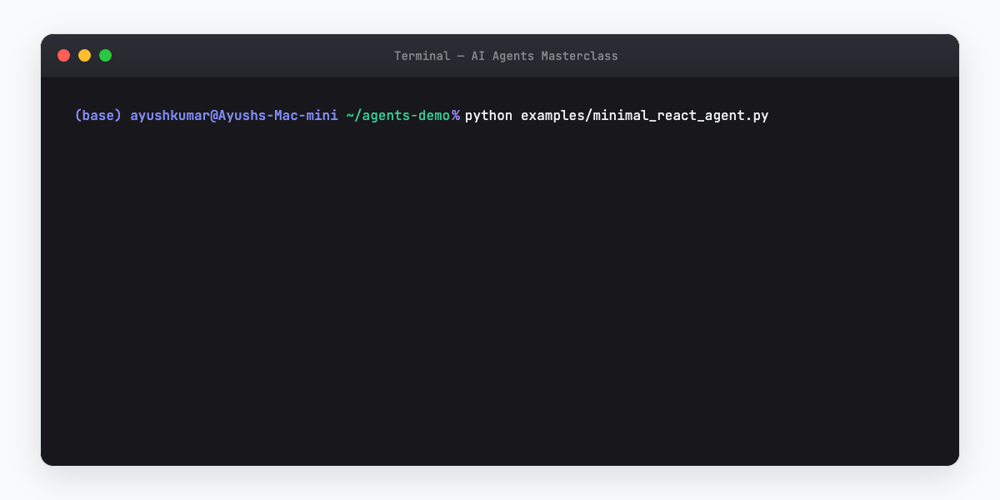

**Teaching point:** understand the loop before adopting LangGraph or CrewAI abstractions.

---

## Part 20 — Example 2: LangGraph research agent

**File:** [examples/langgraph_research_agent.py](./examples/langgraph_research_agent.py)

Three-node graph: **plan → research → synthesize**. Writes `report.md`.

```bash
pip install langgraph langchain-core
export RESEARCH_TOPIC="AI agent governance"
python examples/langgraph_research_agent.py
```


Extend with conditional edges: if research finds insufficient sources, loop back to research.

---

## Part 21 — Example 3: CrewAI content crew

**File:** [examples/crewai_content_crew.py](./examples/crewai_content_crew.py)

Two agents — researcher and writer — sequential tasks. Demo mode writes stub `blog_draft.md` without API key.

```bash
pip install crewai
export CREW_TOPIC="Why AI agents need governance"
python examples/crewai_content_crew.py
```

With `OPENAI_API_KEY`, runs live crew and saves markdown output.


---

## Part 22 — Example 4: OpenAI Agents SDK handoffs

**File:** [examples/openai_agents_sdk.py](./examples/openai_agents_sdk.py)

Async **triage → specialist** handoff via `openai-agents`.

```bash
pip install openai-agents
export OPENAI_API_KEY=sk-...
python examples/openai_agents_sdk.py
```


Tracing in OpenAI dashboard shows handoff boundaries — use for debugging routing.

---

## Part 23 — Example 5: Pydantic AI typed agent

**File:** [examples/pydantic_ai_typed_agent.py](./examples/pydantic_ai_typed_agent.py)

Returns validated `WeatherReport` model — location, best_week, confidence, notes.

```bash
pip install pydantic-ai
python examples/pydantic_ai_typed_agent.py   # demo stub without key
export OPENAI_API_KEY=sk-...
python examples/pydantic_ai_typed_agent.py   # live validated run
```


Use typed agents at API boundaries — downstream code consumes Pydantic models, not raw strings.

---

## Part 24 — Smoke tests

Run the bundled pytest smoke tests (no API key required for stubs):

```bash
pip install pytest
pytest examples/tests/test_agents_smoke.py -v
```

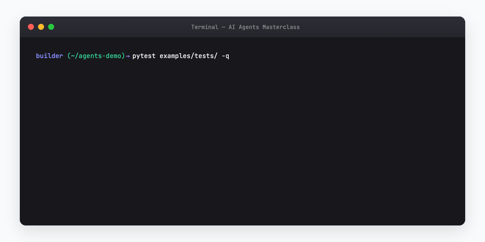

CI should invoke smoke tests on every PR touching `examples/`.

---

## Part 25 — Deploy to Google Cloud Run

Containerize your agent HTTP service or job runner. Cloud Run gives scale-to-zero, IAM, and VPC connectors for private DB access.

**Outline:**

1. **Dockerfile** — slim Python image, install deps, expose port 8080  
2. **Service** — FastAPI or Flask wrapper around agent `run()` with `run_id` logging  
3. **Secrets** — Secret Manager for `OPENAI_API_KEY`, not env files in image  
4. **Deploy** — `gcloud run deploy agent-service --source .`  
5. **Background** — Cloud Run jobs or Cloud Scheduler for cron agents  

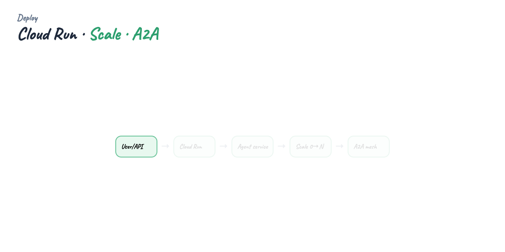

```dockerfile
# Minimal Dockerfile sketch
FROM python:3.12-slim
WORKDIR /app
COPY requirements.txt .
RUN pip install --no-cache-dir -r requirements.txt
COPY . .
ENV PORT=8080
CMD ["uvicorn", "main:app", "--host", "0.0.0.0", "--port", "8080"]
```

```bash
gcloud run deploy ai-agent-demo \
  --source . \
  --region us-central1 \
  --set-secrets OPENAI_API_KEY=openai-key:latest \
  --allow-unauthenticated   # lock down in production
```

**Production notes:**

- Set **request timeout** above worst-case agent duration or return 202 + poll  
- Use **Cloud Logging** for structured trace JSON  
- Attach **service account** with least privilege for GCP tools  
- Consider **Cloud Armor** if endpoint is public  

---

## Part 26 — Production checklist

Before shipping any agent to users:

**Identity and auth** — who can invoke which tools? Map OAuth subject → tool ACL.

**Observability** — structured logs, metrics (turns, latency, tool errors), distributed tracing.

**Safety** — input/output filters, blocked tool list, prompt injection tests on tool results.

**HITL** — approval queue for irreversible actions.

**Cost controls** — per-user budgets, model routing (small model for triage).

**Data** — PII redaction in logs, retention policy, regional storage.

**Reliability** — idempotent tools, retries with jitter, circuit breakers on flaky APIs.

**Evals** — golden tasks in CI; regression when prompts or tools change.

**Incident response** — kill switch to disable tool execution globally.

**Documentation** — runbooks for on-call when agent error rate spikes.

---

## Part 27 — Building your own agent (checklist)

1. Define **one measurable goal** (surf week, ticket triage, report generation)  
2. List **tools** with JSON schemas — prefer MCP servers for reuse  
3. Choose **ReAct vs ReWOO** (or hybrid)  
4. Pick **framework** from Part 17 or start with minimal loop  
5. Add **memory tier** only when sessions need continuity  
6. Instrument **run_id** and step logs from day one  
7. Ship **HITL** before auto-executing side effects  
8. Run **smoke tests** and golden evals  
9. Deploy behind API with timeouts and secrets manager  
10. Iterate from traces — most bugs are bad tool descriptions, not bad models  

---

## Part 28 — Connecting agents to MCP

Any framework above can call MCP tools if the host exposes them (Cursor, Claude Desktop) or you embed an MCP client in your runtime.

Pattern:

1. Run MCP server (stdio or HTTP)  
2. Client handshake → discover tools  
3. Map MCP tool schemas to your framework's function format  
4. Execute tool calls through MCP client  

Cross-reference: [MCP Visual Guide — Part 10–12](../mcp-visual-guide/TUTORIAL.md).

Hermes profiles declare MCP in `config.yaml`; LangGraph nodes can wrap MCP invocations in a dedicated tool node.

---

## Part 29 — Multi-agent orchestration patterns

**Supervisor** — central node assigns subtasks, collects results. LangGraph `Send` API, AutoGen group chat.

**Pipeline** — fixed DAG, no dynamic routing. CrewAI sequential, ReWOO workers.

**Handoff** — conversational transfer with context pack. OpenAI Agents SDK.

**Blackboard** — shared state document agents read/write. Useful for research synthesis.

Pick **supervisor** when tasks are dynamic; **pipeline** when steps are known; **handoff** when user-facing role should change mid-session.

---

## Part 30 — Observability and debugging

**Trace format** (store as JSON lines):

```json
{
  "run_id": "run_abc123",
  "turn": 3,
  "type": "tool_call",
  "tool": "weather_db",
  "args": {"location": "Greece"},
  "latency_ms": 142,
  "status": "ok"
}
```

**Debug workflow:**

1. Reproduce with frozen prompt + tool stubs  
2. Diff tool schemas vs model-emitted args  
3. Check observation truncation — did you cut off the JSON the model needed?  
4. Lower temperature for routing; allow higher for creative synthesis steps  

OpenAI Agents SDK and LangSmith offer hosted tracing; self-host with OpenTelemetry if required.

---

## Part 31 — Cost and latency optimization

- **Route** trivial questions to a small model without tools  
- **Cache** tool results (weather, FX rates) with TTL  
- **Parallelize** independent tool calls (ReWOO worker stage)  
- **Summarize** long observations before next turn  
- **Cap** max turns and fail gracefully with partial answer  
- **Batch** background agents off peak  

---

## Part 32 — Security deep dive

**Tool privilege** — separate read and write tools; never give `shell` and `send_email` to the same agent without HITL.

**Prompt injection via tools** — malicious webpage content instructs "ignore prior instructions." Sanitize and summarize untrusted tool output.

**SSRF** — `fetch_url` tools must block metadata IPs and internal ranges.

**Secrets** — tools receive credentials from env/Secret Manager, not from model context.

**Output** — prevent agents from leaking system prompts or other users' data in multi-tenant setups.

---

## Part 33 — Evals and quality gates

Build a **golden set** of 20–50 tasks:

```yaml
# evals/surf_goal.yaml
goal: "Best week for surfing in Greece next year"
expect_tools: ["weather_db", "search_web"]
rubric: "Must cite weather and tide reasoning; confidence stated"
```

Run in CI on prompt/tool changes. Track pass rate over time. Add adversarial cases (missing tool, API 500, empty search results).

---

## Part 34 — When not to build an agent

Skip agents when:

- Workflow is **fully deterministic** — use Zapier, Temporal, Airflow  
- **Zero side effects** — RAG chatbot suffices  
- **Hard real-time** — sub-100ms SLAs don't fit LLM loops  
- **Regulatory prohibition** on autonomous action — keep human-only execution  

Agents are a **tool**, not a mandate.

---

## Part 35 — Roadmap: from demo to product

**Week 1** — minimal ReAct + one real tool + logs  
**Week 2** — MCP server for tool isolation + HITL on writes  
**Week 3** — LangGraph or SDK with checkpointing + eval suite  
**Week 4** — Cloud Run deploy + secrets + monitoring dashboards  
**Ongoing** — memory tier, multi-agent only when traces prove bottleneck  

---

## Regenerate visuals

```bash
cd guides/ai-agents-masterclass/assets
python3 render_mega_gif.py
python3 render_diagrams.py all
python3 render_terminal_gifs.py all
python3 render_blog_poster.py
cd ../../..
./scripts/prepare-docs.sh
```

---

## Further reading

- [ServiceNow — AI Agent Masterclass (recordings and resources)](https://www.servicenow.com/community/now-assist-articles/ai-agent-masterclass-overview-recordings-and-resources/ta-p/3469262)  
- [coleam00/ai-agents-masterclass](https://github.com/coleam00/ai-agents-masterclass) — companion repo and video series  
- [OpenAI — A practical guide to building AI agents](https://openai.com/business/guides-and-resources/a-practical-guide-to-building-ai-agents/)  
- [Google Cloud — What are AI agents?](https://cloud.google.com/discover/what-are-ai-agents)  
- [IBM — AI agents explained](https://www.ibm.com/think/topics/ai-agents)  
- [MCP Visual Guide](../mcp-visual-guide/TUTORIAL.md) — Model Context Protocol deep dive  
- [Hermes Agent Masterclass](../hermes-agent-masterclass/TUTORIAL.md) — self-hosted learning agent  
- [Model Context Protocol specification](https://modelcontextprotocol.io/)  
- [LangGraph documentation](https://langchain-ai.github.io/langgraph/)  
- [CrewAI documentation](https://docs.crewai.com/)  
- [OpenAI Agents SDK](https://openai.github.io/openai-agents-python/)  
- [Pydantic AI](https://ai.pydantic.dev/)  
- [Google ADK](https://google.github.io/adk-docs/)  
- [A2A protocol](https://google.github.io/A2A/)  

---

## Summary

An **AI agent** pursues goals through a **loop** of reasoning, tool action, and observation — not a single chat completion. **Persona, memory, tools, and model** form the anatomy; **ReAct** and **ReWOO** offer two orchestration strategies; **single vs multi-agent** and **surface vs background** deployments match different products. Enterprise value spans six use-case families; **governance** (logs, HITL, unique run IDs) separates demos from production. Use **MCP** for tools and **A2A** for cross-agent tasks. Start with [minimal_react_agent.py](./examples/minimal_react_agent.py), graduate to **LangGraph**, **CrewAI**, **OpenAI Agents SDK**, or **Pydantic AI** as requirements sharpen, deploy on **Cloud Run** with secrets and evals, and extend with [Hermes](../hermes-agent-masterclass/TUTORIAL.md) or [MCP](../mcp-visual-guide/TUTORIAL.md) when you need learning loops or standardized tool wiring.
