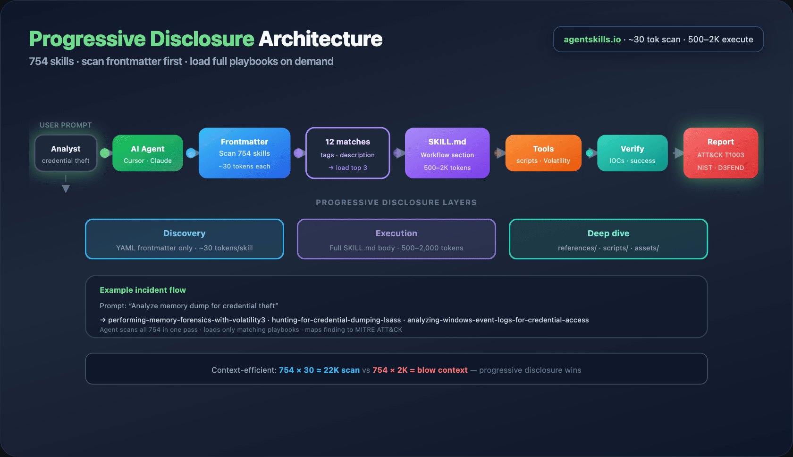
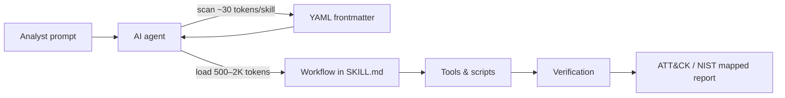
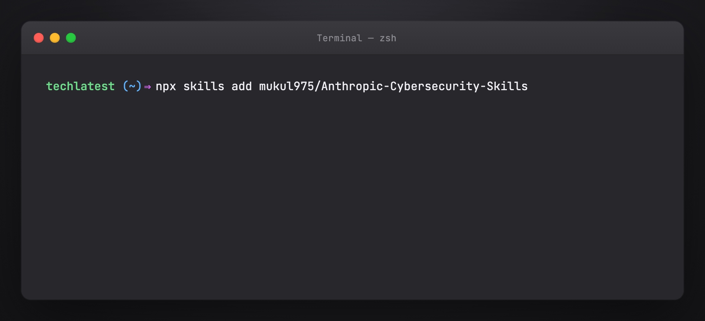

# Anthropic Cybersecurity Skills — Full Setup Guide

Install and use **[Anthropic Cybersecurity Skills](https://github.com/mukul975/Anthropic-Cybersecurity-Skills)** — 754 production-grade security skills for AI agents, mapped to MITRE ATT&CK, NIST CSF 2.0, MITRE ATLAS, D3FEND, and NIST AI RMF.

Part of the [Agentic AI Ecosystem](https://github.com/Ayush7614/agentic-ai-ecosystem).

> **Disclaimer:** Community project by [@mukul975](https://github.com/mukul975). **Not affiliated with Anthropic PBC.** Apache 2.0 license.

## What you get

| | |
|---|---|
| **754 skills** | Structured practitioner playbooks — not random scripts |
| **26 domains** | Cloud, DFIR, threat hunting, web app, OT/ICS, red team, … |
| **5 frameworks** | ATT&CK v19.1 · NIST CSF 2.0 · ATLAS v5.4 · D3FEND v1.3 · AI RMF |
| **Standard** | [agentskills.io](https://agentskills.io) — works with Claude Code, Cursor, Copilot, Codex, Gemini CLI, Hermes, 20+ platforms |

## Architecture





## Quick start



```bash
# Recommended — agentskills.io installer
npx skills add mukul975/Anthropic-Cybersecurity-Skills

# Or clone for inspection / custom path
git clone https://github.com/mukul975/Anthropic-Cybersecurity-Skills.git
```

From this guide folder:

```bash
cd guides/anthropic-cybersecurity-skills
chmod +x install-skills.sh verify-install.sh
./install-skills.sh          # clone to ~/.cybersec-skills or ./vendor/
./verify-install.sh
```

## Guide map

| Doc | Contents |
|-----|----------|
| [Tutorial](https://ayush7614.github.io/agentic-ai-ecosystem/guides/anthropic-cybersecurity-skills/tutorial/) | Full walkthrough — install, platforms, skill anatomy, examples, contributing |
| [Frameworks](https://ayush7614.github.io/agentic-ai-ecosystem/guides/anthropic-cybersecurity-skills/frameworks/) | Five-framework mapping reference + example skill |
| [Domains](https://ayush7614.github.io/agentic-ai-ecosystem/guides/anthropic-cybersecurity-skills/domains/) | All 26 security domains and skill counts |

## Full tutorial

**[Read the full tutorial →](./TUTORIAL.md)** · [Online](https://ayush7614.github.io/agentic-ai-ecosystem/guides/anthropic-cybersecurity-skills/tutorial/)

## Related guides

| Guide | Overlap |
|-------|---------|
| [Claude Code `.claude/`](https://ayush7614.github.io/agentic-ai-ecosystem/guides/claude-code-dot-claude/) | Same agentskills.io skill format in `.claude/skills/` |
| [Awesome Hermes Agent](https://ayush7614.github.io/agentic-ai-ecosystem/guides/awesome-hermes-agent/) | Load skills into `~/.hermes/skills` for SOC automation |
| [Hermes vs OpenClaw](https://ayush7614.github.io/agentic-ai-ecosystem/guides/hermes-vs-openclaw/) | Pick agent runtime; skills port across platforms |

## Links

- [GitHub — mukul975/Anthropic-Cybersecurity-Skills](https://github.com/mukul975/Anthropic-Cybersecurity-Skills)
- [Casky.ai Playground](https://casky.ai) — live skill exercises
- [GARS-2026 Survey](https://github.com/mukul975/Anthropic-Cybersecurity-Skills#-gars-2026--global-agentic-ai-readiness-survey) — agentic AI readiness study

## License

Skills: **Apache 2.0** (upstream). This guide: MIT.
