# Anthropic Cybersecurity Skills — Full Tutorial

Give any AI agent the structured decision-making of a **senior security analyst** — not generic web search, but step-by-step playbooks mapped to MITRE ATT&CK, NIST CSF 2.0, MITRE ATLAS, D3FEND, and NIST AI RMF.

Based on [mukul975/Anthropic-Cybersecurity-Skills](https://github.com/mukul975/Anthropic-Cybersecurity-Skills) (754 skills · 26 domains · Apache 2.0).

> **Community project — not affiliated with Anthropic PBC.**

## What you'll learn

1. What the library is and why it exists  
2. How the [agentskills.io](https://agentskills.io) standard enables progressive disclosure  
3. All **five framework mappings** and how to use them in compliance workflows  
4. Install on **Claude Code, Cursor, Copilot, Codex CLI, Gemini CLI, Hermes**, and MCP agents  
5. Skill anatomy — frontmatter, Workflow, Verification, references, scripts  
6. End-to-end examples: memory forensics, threat hunting, cloud IR  
7. All **26 security domains** and when to activate each  
8. Contributing, responsible use, citation, and troubleshooting  

---

## Table of contents

1. Part 1 — The problem this solves  
2. Part 2 — Library at a glance  
3. Part 3 — Architecture and progressive disclosure  
4. Part 4 — Five frameworks, one skill library  
5. Part 5 — Quick start installation  
6. Part 6 — Claude Code setup  
7. Part 7 — Cursor setup  
8. Part 8 — GitHub Copilot and Codex CLI  
9. Part 9 — Gemini CLI and other platforms  
10. Part 10 — Hermes Agent integration  
11. Part 11 — Skill anatomy deep dive  
12. Part 12 — How agents discover and execute skills  
13. Part 13 — Walkthrough: credential theft in a memory dump  
14. Part 14 — Walkthrough: hypothesis-driven threat hunting  
15. Part 15 — Walkthrough: multi-cloud breach scoping  
16. Part 16 — All 26 security domains  
17. Part 17 — MITRE ATT&CK v19.1 coverage  
18. Part 18 — Compliance and risk frameworks in practice  
19. Part 19 — Casky Playground and GARS-2026  
20. Part 20 — Contributing your own skill  
21. Part 21 — Security, ethics, and authorized use  
22. Part 22 — Troubleshooting  
23. Part 23 — Citation and license  

---

## Part 1 — The problem this solves

The cybersecurity workforce gap hit **4.8 million unfilled roles** globally in 2024 (ISC2). AI agents can help close that gap — but only if they have **structured domain knowledge** to work from.

Today's agents can write code and search the web. They typically **cannot**:

- Pick the right Volatility3 plugin for a suspicious memory dump  
- Know which Sigma rules catch Kerberoasting  
- Scope a cloud breach across AWS, Azure, and GCP with consistent playbooks  
- Map findings to ATT&CK techniques without hallucinating IDs  

Existing security repos give you **wordlists, payloads, or exploit code**. None give an AI agent the **decision workflow** a senior analyst follows: prerequisites, step order, verification, and framework mapping.

**Anthropic Cybersecurity Skills** fills that gap: 754 skills, each a practitioner playbook in agentskills.io format — YAML frontmatter for discovery, Markdown body for execution, optional references/scripts/assets for depth.

---

## Part 2 — Library at a glance

| Metric | Value |
|--------|-------|
| Skills | **754** (production-grade, growing on `main`) |
| Security domains | **26** |
| Framework mappings | **5** — ATT&CK, NIST CSF 2.0, ATLAS, D3FEND, NIST AI RMF |
| Standard | [agentskills.io](https://agentskills.io) |
| License | Apache 2.0 |
| Maintainer | [@mukul975](https://github.com/mukul975) (community) |

### What it is not

- Not an Anthropic official product  
- Not a script dump or payload collection  
- Not a replacement for authorization, legal scope, or human judgment  

### What it is

- An **AI-native knowledge base** built for agent toolchains  
- **Validated ATT&CK v19.1** mappings via `mitreattack-python` — zero revoked IDs  
- The only open-source skills library with **unified five-framework** coverage per skill  

---

## Part 3 — Architecture and progressive disclosure


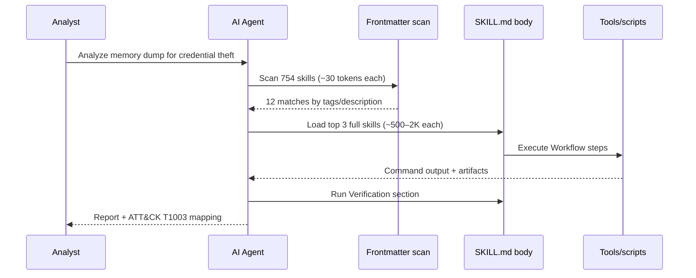

**Progressive disclosure** keeps context windows manageable:

| Stage | Tokens (typical) | Content |
|-------|------------------|---------|
| Discovery | ~30 per skill | YAML frontmatter only |
| Execution | 500–2,000 per skill | Full `SKILL.md` body |
| Deep dive | Variable | `references/`, `scripts/`, `assets/` |

An agent can **scan all 754 skills in one pass**, then load only the three that match the incident.

Regenerate the architecture GIF:

```bash
cd guides/anthropic-cybersecurity-skills/assets
python3 render_architecture_diagram.py
```

---

## Part 4 — Five frameworks, one skill library

No other open-source skills library maps every skill to all five frameworks. One skill, five compliance checkboxes.

| Framework | Version | Scope in repo | What it maps |
|-----------|---------|---------------|--------------|
| **MITRE ATT&CK** | v19.1 | 15 tactics · 286 techniques | Adversary behaviors and TTPs |
| **NIST CSF 2.0** | 2.0 | 6 functions · 22 categories | Organizational security posture |
| **MITRE ATLAS** | v5.4 | 16 tactics · 84 techniques | AI/ML adversarial threats |
| **MITRE D3FEND** | v1.3 | 7 categories · 267 techniques | Defensive countermeasures |
| **NIST AI RMF** | 1.0 | 4 functions · 72 subcategories | AI risk management |

### Example — one skill, five mappings

Skill: `analyzing-network-traffic-of-malware`

| Framework | Mapping |
|-----------|---------|
| ATT&CK | T1071 (Application Layer Protocol) |
| NIST CSF | DE.CM |
| ATLAS | AML.T0047 |
| D3FEND | D3-NTA |
| AI RMF | MEASURE-2.6 |

Full reference: [Framework mappings](https://ayush7614.github.io/agentic-ai-ecosystem/guides/anthropic-cybersecurity-skills/frameworks/).

---

## Part 5 — Quick start installation


### Option A — npx (recommended)

Works with any agentskills.io-compatible platform:

```bash
npx skills add mukul975/Anthropic-Cybersecurity-Skills
```

The installer registers skills in your agent's configured skills directory.

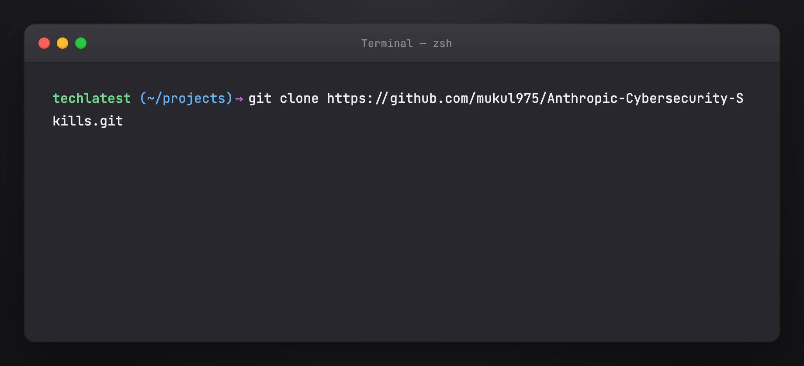

### Option B — Git clone

```bash
git clone https://github.com/mukul975/Anthropic-Cybersecurity-Skills.git
cd Anthropic-Cybersecurity-Skills
```

Inspect `skills/` — each subdirectory is one skill with `SKILL.md` at the root.

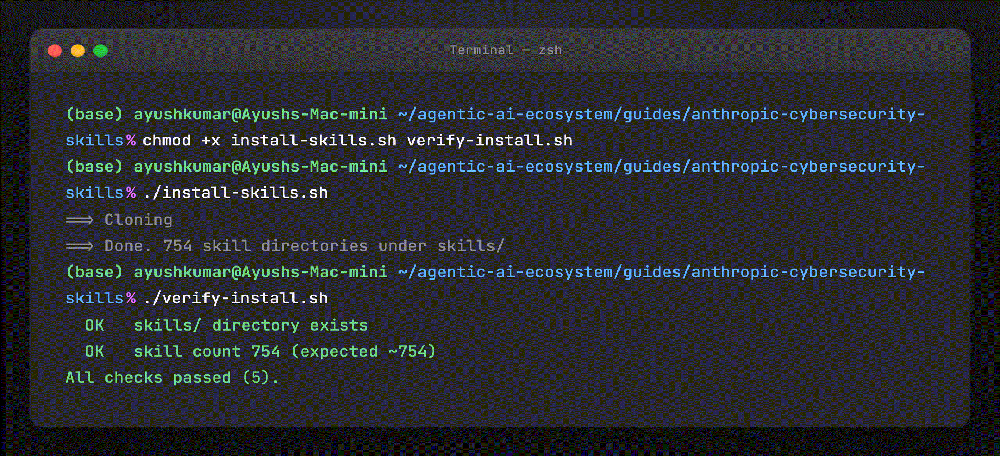

### Option C — This guide's helper script

```bash
cd guides/anthropic-cybersecurity-skills
chmod +x install-skills.sh verify-install.sh
./install-skills.sh
./verify-install.sh
```

Default clone path: `~/.cybersec-skills/Anthropic-Cybersecurity-Skills`. Override:

```bash
export CYBERSEC_SKILLS_DIR=/opt/security-skills/Anthropic-Cybersecurity-Skills
./install-skills.sh
```

Regenerate terminal screenshots (macOS-style window, matching tutorial visuals):

```bash
cd guides/anthropic-cybersecurity-skills/assets
python3 render_install_screenshots.py png    # static PNGs
python3 render_install_screenshots.py gif    # animated typing GIFs per step
```

Requires Playwright + Chromium (`pip install playwright && playwright install chromium`) and `ffmpeg` for GIFs.

---

## Part 6 — Claude Code setup

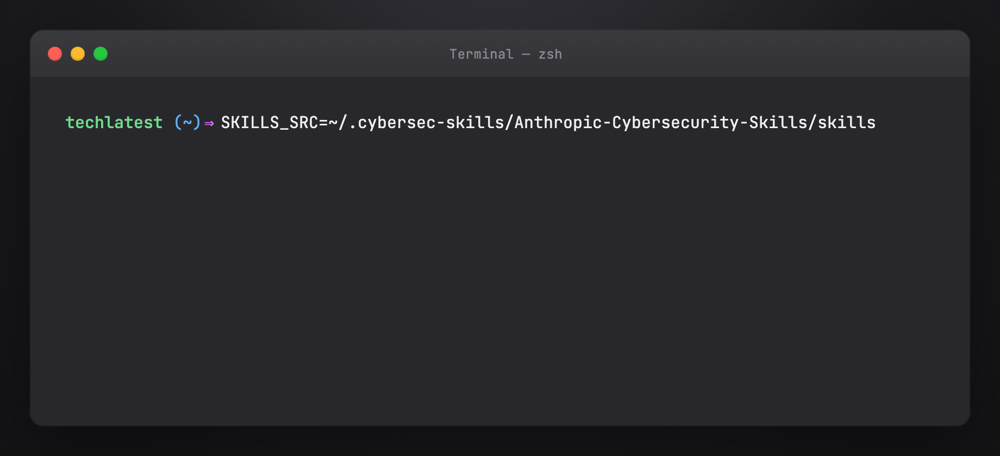

Claude Code loads skills from `.claude/skills/` (project) or `~/.claude/skills/` (global).

### Global install (all projects)

```bash
SKILLS_SRC=~/.cybersec-skills/Anthropic-Cybersecurity-Skills/skills
mkdir -p ~/.claude/skills

# Symlink entire library (754 skills — high discovery surface)
ln -sf "${SKILLS_SRC}"/* ~/.claude/skills/

# Or copy a subset — e.g. DFIR only
cp -r "${SKILLS_SRC}"/performing-memory-forensics-with-volatility3 ~/.claude/skills/
cp -r "${SKILLS_SRC}"/hunting-for-credential-dumping-lsass ~/.claude/skills/
```

### Project-scoped (one engagement)

```bash
mkdir -p .claude/skills
ln -sf ~/.cybersec-skills/Anthropic-Cybersecurity-Skills/skills/* .claude/skills/
```

### Verify in Claude Code

Start a session and ask:

> Use the performing-memory-forensics-with-volatility3 skill. List prerequisites and the first three Workflow steps only.

Claude should read `SKILL.md` and cite structured sections — not invent generic Volatility commands.

See also: [Claude Code `.claude/` tutorial](https://ayush7614.github.io/agentic-ai-ecosystem/guides/claude-code-dot-claude/tutorial/).

---

## Part 7 — Cursor setup


Cursor discovers skills listed in agent configuration and from `~/.cursor/skills/` (user skills).

### Install via npx

```bash
npx skills add mukul975/Anthropic-Cybersecurity-Skills
```

Follow Cursor-specific prompts if the installer detects your environment.

### Manual symlink

```bash
mkdir -p ~/.cursor/skills
ln -sf ~/.cybersec-skills/Anthropic-Cybersecurity-Skills/skills/* ~/.cursor/skills/
```

### Project rules (optional)

Add to `.cursor/rules/` or project instructions:

```markdown
For security investigations, prefer skills from Anthropic Cybersecurity Skills.
Scan skill frontmatter by tags (dfir, threat-hunting, cloud-security) before loading full SKILL.md.
Always complete the Verification section before closing an investigation step.
```

### Verify in Cursor

Open Agent mode and prompt:

> I have a Windows memory dump. Which cybersecurity skills apply? Load the best match and show Prerequisites.

---

## Part 8 — GitHub Copilot and Codex CLI

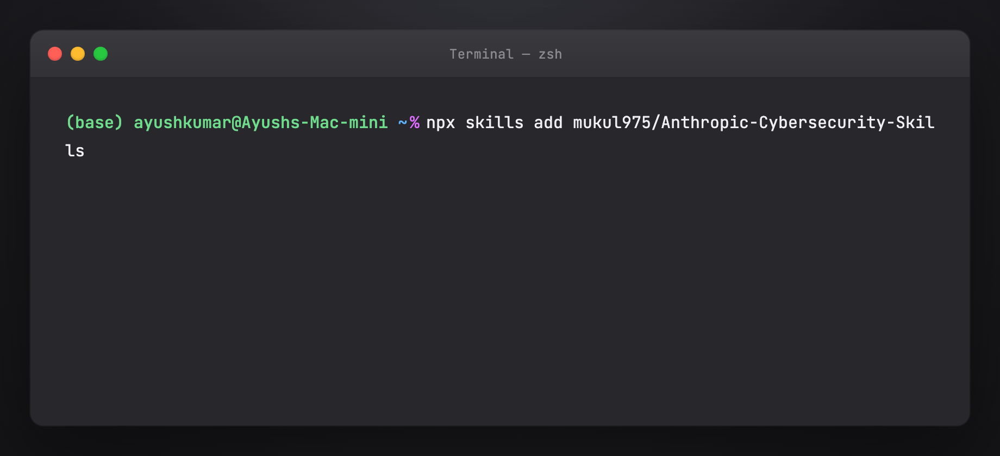

Both support agentskills.io when configured with a skills path.

### Copilot (VS Code / JetBrains)

1. Clone or `npx skills add` the repo  
2. Point Copilot's agent skills setting at `skills/`  
3. In agent chat: reference skill **name** in kebab-case (e.g. `hunting-for-lateral-movement-with-sysmon`)

### OpenAI Codex CLI

```bash
npx skills add mukul975/Anthropic-Cybersecurity-Skills
codex  # or your configured entrypoint
```

Codex reads frontmatter for routing; load full skills for multi-step IR workflows.

---

## Part 9 — Gemini CLI and other platforms

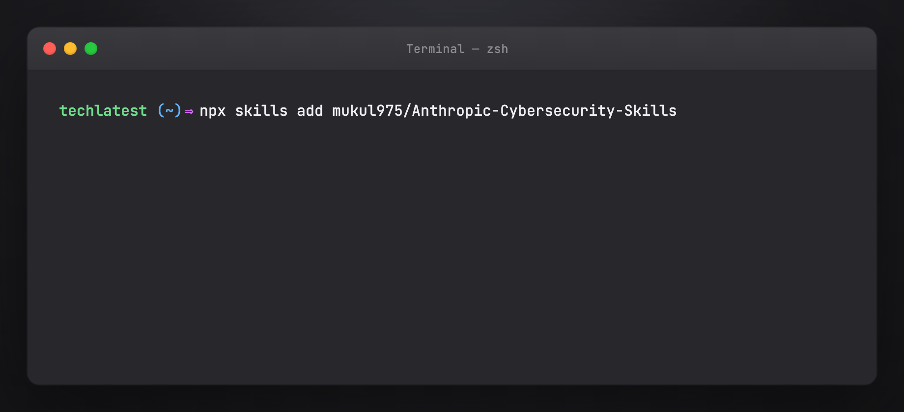

**Compatible without custom forks:**

| Category | Platforms |
|----------|-----------|
| AI assistants | Claude Code, GitHub Copilot, Cursor, Windsurf, Cline, Aider, Continue, Roo Code, Amazon Q, Tabnine, Cody |
| CLI agents | OpenAI Codex CLI, Gemini CLI |
| Autonomous | Devin, Replit Agent, SWE-agent, OpenHands |
| Frameworks | LangChain, CrewAI, AutoGen, Semantic Kernel, Haystack, Vercel AI SDK, **any MCP-compatible agent** |

**Gemini CLI:** install skills via `npx skills add`, then invoke by skill name in prompts.

**LangChain / CrewAI:** mount `skills/<name>/SKILL.md` as tool description or system prompt segment; use frontmatter `tags` for retrieval routing.

**MCP agents:** expose skill search as an MCP resource listing frontmatter; fetch full `SKILL.md` on match.

---

## Part 10 — Hermes Agent integration

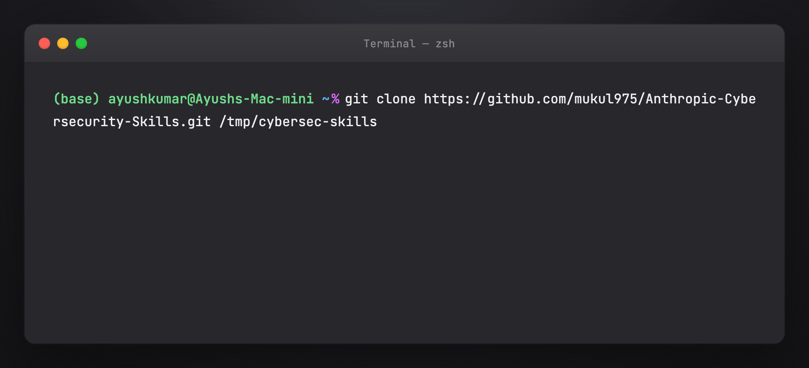

Hermes uses `~/.hermes/skills/` (same agentskills.io layout).

```bash
git clone https://github.com/mukul975/Anthropic-Cybersecurity-Skills.git /tmp/cybersec-skills
cp -r /tmp/cybersec-skills/skills/* ~/.hermes/skills/
hermes skills list | head
```

For SOC automation, combine with Hermes cron/Curator so frequently used skills stay prioritized. See [Awesome Hermes Agent tutorial](https://ayush7614.github.io/agentic-ai-ecosystem/guides/awesome-hermes-agent/tutorial/).

Example Hermes prompt:

> Run a hypothesis-driven hunt for Kerberoasting using the threat hunting skills. Map hits to ATT&CK T1558.003.

---

## Part 11 — Skill anatomy deep dive

> **Previously:** this section was documentation-only (structure + sample YAML).  
> **Now:** you can run a **real read-only example** against the cloned upstream repo — inspect files, frontmatter, and sections. It does **not** execute Volatility or analyze a memory dump (that is Part 13).

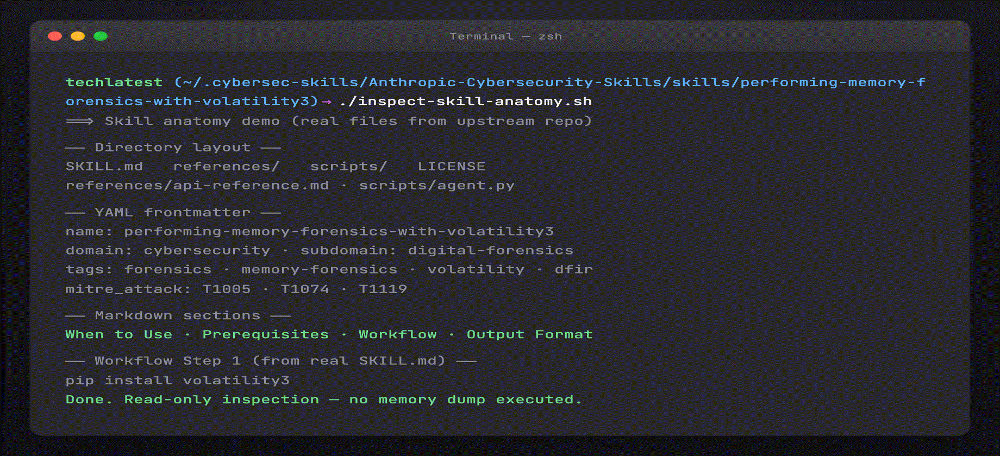

### Run the real example yourself

Prerequisites: `./install-skills.sh` completed (clone at `~/.cybersec-skills/`).

```bash
cd guides/anthropic-cybersecurity-skills
chmod +x inspect-skill-anatomy.sh
./inspect-skill-anatomy.sh
# optional: ./inspect-skill-anatomy.sh hunting-for-credential-dumping-lsass
```

You will see **real output** from the upstream library — directory layout, live frontmatter, section headers, and a Workflow preview. No simulated text.

Every skill follows a consistent directory structure:

```text
skills/performing-memory-forensics-with-volatility3/
├── SKILL.md              ← Definition (YAML + Markdown)
├── references/
│   ├── standards.md      ← Framework mappings
│   └── workflows.md      ← Deep technical reference
├── scripts/
│   └── process.py        ← Helper scripts
└── assets/
    └── template.md       ← Report templates
```

### YAML frontmatter (from live upstream skill)

Output of `./inspect-skill-anatomy.sh` on `performing-memory-forensics-with-volatility3`:

```yaml
---
name: performing-memory-forensics-with-volatility3
description: Analyze volatile memory dumps using Volatility 3 to extract running processes,
  network connections, loaded modules, and evidence of malicious activity.
domain: cybersecurity
subdomain: digital-forensics
tags:
- forensics
- memory-forensics
- volatility
- ram-analysis
- malware-detection
- incident-response
version: '1.0'
author: mahipal
license: Apache-2.0
nist_csf:
- RS.AN-01
- RS.AN-03
- DE.AE-02
- RS.MA-01
mitre_attack:
- T1005
- T1074
- T1119
---
```

**Frontmatter fields:**

| Field | Purpose |
|-------|---------|
| `name` | kebab-case, 1–64 chars — agent invocation ID |
| `description` | Keyword-rich — drives discovery |
| `domain` / `subdomain` | Taxonomy |
| `tags` | Search facets |
| `atlas_techniques` | MITRE ATLAS IDs |
| `d3fend_techniques` | D3FEND countermeasures |
| `nist_ai_rmf` | AI RMF subcategories |
| `nist_csf` | NIST CSF 2.0 categories |
| `mitre_attack` | MITRE ATT&CK technique IDs (also in `references/`) |

Some skills also include `atlas_techniques`, `d3fend_techniques`, and `nist_ai_rmf` in frontmatter.

### Markdown body sections (live skill)

From `grep '^## ' SKILL.md` on the same skill:

| Section | Purpose |
|---------|---------|
| **When to Use** | Trigger conditions — when should the agent activate this skill? |
| **Prerequisites** | Tools, access, environment |
| **Workflow** | Step-by-step commands and decision points |
| **Key Concepts** | Domain terminology and background |
| **Tools & Systems** | Tooling reference |
| **Common Scenarios** | Typical investigation patterns |
| **Output Format** | Expected deliverables / report shape |

Many skills also include a **Verification** block inside Workflow or Output Format. Always read the live `SKILL.md` — section names vary slightly by skill.

Optional directories:

- **references/** — standards, long procedures, tool flags  
- **scripts/** — runnable helpers the agent can execute  
- **assets/** — checklists, report templates, diagrams  

---

## Part 12 — How agents discover and execute skills

**User prompt:** "Analyze this memory dump for signs of credential theft"

**Agent internal process:**

1. **Scan** 754 frontmatters (~30 tokens each)  
   → Match `tags`: forensics, credential-access, memory-analysis  
   → **12 candidate skills**

2. **Load top 3:**  
   - `performing-memory-forensics-with-volatility3`  
   - `extracting-credentials-from-memory-dump`  
   - `detecting-credential-dumping-techniques`

3. **Execute Workflow** — Volatility3 plugins, LSASS access patterns, event log correlation

4. **Verification** — confirm IOCs, map to **ATT&CK T1003** (Credential Dumping)

Without skills, the agent guesses commands and skips steps. With skills, it follows the same playbook a senior DFIR analyst would use.

### Tips for better agent behavior

- Ask the agent to **name the skill** before executing  
- Require **Verification** section output in every response  
- For red team skills, state **authorized scope** in the prompt  
- Use **subset installs** (10–20 skills) if the agent over-loads context  

---

## Part 13 — Walkthrough: credential theft in a memory dump

> **Authorized DFIR only.** Use on images you own or have written permission to analyze.

**Scenario:** IR ticket — suspected Mimikatz on a Windows server. You have a `.raw` memory image (`server01.raw`).

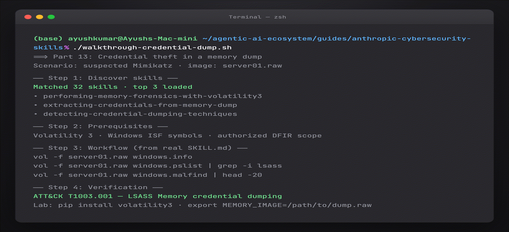

### Run the real walkthrough

```bash
cd guides/anthropic-cybersecurity-skills
./install-skills.sh                    # if not done
chmod +x walkthrough-credential-dump.sh
./walkthrough-credential-dump.sh
```

**What runs for real:** skill discovery (32+ matches from live frontmatter scan), prerequisites pulled from upstream `SKILL.md`, Volatility commands extracted from `extracting-credentials-from-memory-dump`, verification checklist, Sysmon/T1003 correlation lines.

**Lab extension** (optional — runs `vol` when both are present):

```bash
pip install volatility3
export MEMORY_IMAGE=/path/to/your/server01.raw
./walkthrough-credential-dump.sh
```

Without Volatility or a dump file, the script still completes and prints the exact commands to run in your lab.

### Step 1 — Activate the right skills

Agent prompt (or run the script above):

> Authorized DFIR on image `server01.raw`. Find skills for memory forensics and credential dumping. List prerequisites.

**Real skills from upstream library** (names corrected from live repo):

| Skill | Role |
|-------|------|
| `performing-memory-forensics-with-volatility3` | Memory baseline · processes · malfind |
| `extracting-credentials-from-memory-dump` | LSASS · hashdump · credential extraction |
| `detecting-credential-dumping-techniques` | Sysmon Event 10 · SIEM correlation |

### Step 2 — Prerequisites check

From live `SKILL.md` (script prints these):

- Volatility 3 installed (`pip install volatility3`)  
- Windows symbol tables (ISF) for target OS build  
- Memory dump in raw/ELF format + chain of custody  
- Legal authorization for credential extraction  

### Step 3 — Workflow execution

From `extracting-credentials-from-memory-dump` workflow:

```bash
vol -f server01.raw windows.info
vol -f server01.raw windows.pslist | grep -i lsass
vol -f server01.raw windows.malfind | head -20
vol -f server01.raw windows.hashdump
```

Typical order:

1. `windows.info` / `windows.pslist` — baseline processes  
2. `windows.malfind` — injection indicators  
3. LSASS-focused analysis + hashdump  
4. Correlate with Sysmon Event ID 10 via `detecting-credential-dumping-techniques`  

### Step 4 — Verification

- Process accessed `lsass.exe` with suspicious GrantedAccess (Sysmon 10)  
- In-memory injection / malfind hits near dump tools  
- Timeline aligns with alert timestamp  
- **ATT&CK:** T1003.001 — OS Credential Dumping: LSASS Memory  

### Step 5 — Report

Include framework mappings from skill frontmatter (`mitre_attack: T1003`, `nist_csf: RS.AN-*`) and detection rules from `detecting-credential-dumping-techniques`.

Regenerate the Part 13 GIF:

```bash
cd guides/anthropic-cybersecurity-skills/assets
python3 render_install_screenshots.py all --only 10-part13
```

---

## Part 14 — Walkthrough: hypothesis-driven threat hunting

**Scenario:** Hunt for Kerberoasting in Enterprise SIEM.

### Hypothesis

> Service accounts may be targeted via Kerberoasting (T1558.003) in the last 30 days.

### Skill selection

Tags: `threat-hunting`, `kerberos`, `sigma`, `splunk` or `sentinel`.

Agent loads hunting skill → Workflow:

1. Deploy / validate Sigma rule for Kerberoasting  
2. Query rare RC4/HMAC service ticket requests  
3. Enrich service accounts — SPN exposure, password age  
4. Escalate confirmed anomalies to IR queue  

### Verification

- Non-noise hits with service account + weak crypto ticket  
- ATT&CK technique documented  
- Hunt notebook updated for repeatability  

---

## Part 15 — Walkthrough: multi-cloud breach scoping

**Scenario:** Credentials leaked; unknown activity in AWS, Azure, and GCP.

### Skills to combine

| Cloud | Domain skills |
|-------|---------------|
| AWS | CloudTrail analysis, IAM policy review, S3 public access |
| Azure | Entra sign-in logs, role assignment audit |
| GCP | Audit logs, service account key rotation |

Agent workflow:

1. **Contain** — disable keys, force password reset (Incident Response skills)  
2. **Discover** — each provider's log skill in parallel  
3. **Collect** — unified timeline (Digital Forensics)  
4. **Map** — ATT&CK cloud techniques (T1078, T1530, etc.)  
5. **Report** — NIST CSF RS.AN / RS.MI categories  

---

## Part 16 — All 26 security domains

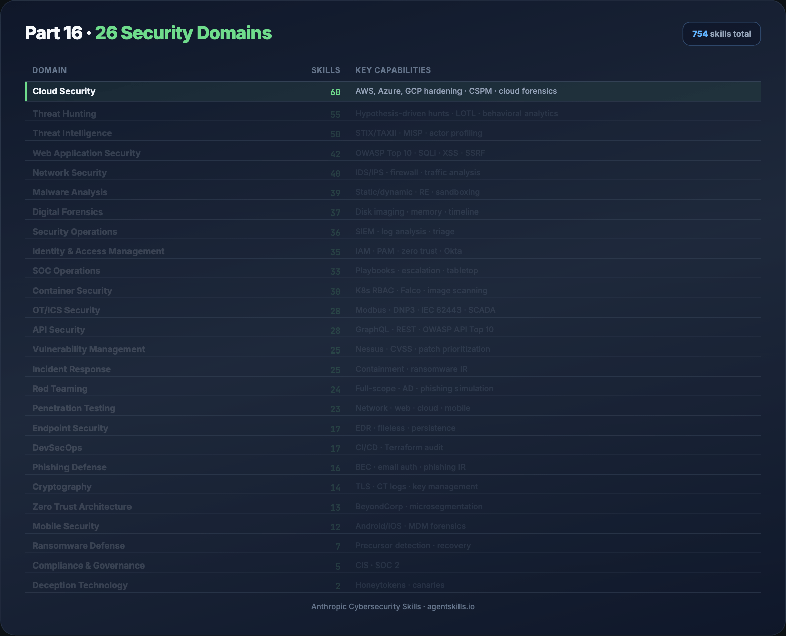

| Domain | Skills | Key capabilities |
|--------|--------|------------------|
| Cloud Security | 60 | AWS, Azure, GCP hardening · CSPM · cloud forensics |
| Threat Hunting | 55 | Hypothesis-driven hunts · LOTL · behavioral analytics |
| Threat Intelligence | 50 | STIX/TAXII · MISP · actor profiling |
| Web Application Security | 42 | OWASP Top 10 · SQLi · XSS · SSRF |
| Network Security | 40 | IDS/IPS · firewall · traffic analysis |
| Malware Analysis | 39 | Static/dynamic · RE · sandboxing |
| Digital Forensics | 37 | Disk imaging · memory · timeline |
| Security Operations | 36 | SIEM · log analysis · triage |
| Identity & Access Management | 35 | IAM · PAM · zero trust · Okta |
| SOC Operations | 33 | Playbooks · escalation · tabletop |
| Container Security | 30 | K8s RBAC · Falco · image scanning |
| OT/ICS Security | 28 | Modbus · DNP3 · IEC 62443 · SCADA |
| API Security | 28 | GraphQL · REST · OWASP API Top 10 |
| Vulnerability Management | 25 | Nessus · CVSS · patch prioritization |
| Incident Response | 25 | Containment · ransomware IR |
| Red Teaming | 24 | Full-scope · AD · phishing simulation |
| Penetration Testing | 23 | Network · web · cloud · mobile |
| Endpoint Security | 17 | EDR · fileless · persistence |
| DevSecOps | 17 | CI/CD · Terraform audit |
| Phishing Defense | 16 | BEC · email auth · phishing IR |
| Cryptography | 14 | TLS · CT logs · key management |
| Zero Trust Architecture | 13 | BeyondCorp · microsegmentation |
| Mobile Security | 12 | Android/iOS · MDM forensics |
| Ransomware Defense | 7 | Precursor detection · recovery |
| Compliance & Governance | 5 | CIS · SOC 2 |
| Deception Technology | 2 | Honeytokens · canaries |

Full domain notes: [Domain catalog](https://ayush7614.github.io/agentic-ai-ecosystem/guides/anthropic-cybersecurity-skills/domains/).

**Underrepresented domains** (good contribution targets): Deception Technology, Compliance & Governance.

Regenerate: `python3 assets/render_table_gifs.py part16`

---

## Part 17 — MITRE ATT&CK v19.1 coverage

**754/754 skills** mapped. Validated with official `mitreattack-python` — no revoked or deprecated IDs.

v19.1 change: **Defense Evasion** split into **Stealth** (TA0005) and **Defense Impairment** (TA0112).

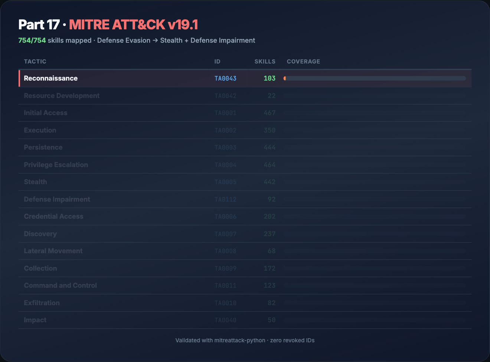

| Tactic | ID | Skills |
|--------|-----|--------|
| Reconnaissance | TA0043 | 103 |
| Resource Development | TA0042 | 22 |
| Initial Access | TA0001 | 467 |
| Execution | TA0002 | 350 |
| Persistence | TA0003 | 444 |
| Privilege Escalation | TA0004 | 464 |
| Stealth | TA0005 | 442 |
| Defense Impairment | TA0112 | 92 |
| Credential Access | TA0006 | 202 |
| Discovery | TA0007 | 237 |
| Lateral Movement | TA0008 | 68 |
| Collection | TA0009 | 172 |
| Command and Control | TA0011 | 123 |
| Exfiltration | TA0010 | 82 |
| Impact | TA0040 | 50 |

Download **ATT&CK Navigator layers** from [GitHub Releases](https://github.com/mukul975/Anthropic-Cybersecurity-Skills/releases) for visualization.

Regenerate: `python3 assets/render_table_gifs.py part17`

---

## Part 18 — Compliance and risk frameworks in practice

### NIST CSF 2.0

Map skill outputs to **Govern, Identify, Protect, Detect, Respond, Recover** for audit trails. Example: memory forensics → **Detect (DE.CM)**, **Respond (RS.AN)**.

### MITRE ATLAS

Use when the incident involves **ML models** — poisoning, evasion, model theft. Frontmatter field: `atlas_techniques`.

### MITRE D3FEND

Pair offensive findings with **defensive countermeasures** — e.g. D3-NTA for network traffic analysis skills.

### NIST AI RMF

For **AI governance** — document which agent skills were used, human-in-the-loop checkpoints, and measurement (MEASURE-* subcategories).

See [Framework mappings](https://ayush7614.github.io/agentic-ai-ecosystem/guides/anthropic-cybersecurity-skills/frameworks/) for crosswalk tables and reporting templates.

---

## Part 19 — Casky Playground and GARS-2026

### Casky.ai Playground

Hands-on exercises without local install:

→ [Launch Playground on Casky.ai](https://casky.ai)

- Live cybersecurity skill exercises  
- Real-time agent execution  
- Interactive ATT&CK-mapped workflows  

### GARS-2026 Survey

Global Agentic AI Readiness Survey (SRH Berlin) — measures readiness for MCP, tool calling, and governance.

- ~10 minutes, anonymous  
- Results published open access (CC-BY 4.0)  
- Link in [upstream README](https://github.com/mukul975/Anthropic-Cybersecurity-Skills#-gars-2026--global-agentic-ai-readiness-survey)  

---

## Part 20 — Contributing your own skill

1. Fork [Anthropic-Cybersecurity-Skills](https://github.com/mukul975/Anthropic-Cybersecurity-Skills)  
2. Copy the skill template from `CONTRIBUTING.md`  
3. Add `skills/your-skill-name/SKILL.md` with full frontmatter + four body sections  
4. Add `references/standards.md` with ATT&CK + framework IDs  
5. PR title: `Add skill: your-skill-name`  
6. Review within ~48 hours for technical accuracy and agentskills.io compliance  

**Improve existing skills:** framework mappings, fixed commands, new scripts/templates.

**Report issues:** inaccurate procedures or broken scripts → GitHub Issues.

Project follows **Contributor Covenant**.

---

## Part 21 — Security, ethics, and authorized use

These skills describe ** offensive and defensive techniques**. Use only:

- On systems you own or have **written authorization** to test  
- Within bug bounty / pentest / red team **scope**  
- With **human oversight** for destructive or exfiltration steps  

AI agents can execute commands quickly — mis-scoped prompts cause real damage. Always:

- State authorization in the prompt  
- Use read-only modes where available  
- Keep humans in the loop for containment and legal notification  

Upstream [Security Policy](https://github.com/mukul975/Anthropic-Cybersecurity-Skills/security/policy): responsible disclosure, 48-hour acknowledgment.

---

## Part 22 — Troubleshooting

| Problem | Fix |
|---------|-----|
| Agent ignores skills | Confirm skills path; ask agent to **name skill** before acting |
| Context overflow | Install subset by domain; scan frontmatter only first |
| Skill not found | Use exact `name` from frontmatter (kebab-case) |
| Outdated ATT&CK IDs | `git pull` upstream; verify release tag |
| verify-install fails count | Shallow clone? Run full clone; expect ~754 dirs |
| npx skills add fails | Node 18+; check network; fall back to git clone |
| Hermes/Cursor path mismatch | Symlink to platform-specific skills dir (see Parts 6–10) |

Run `./verify-install.sh` after every pull.

---

## Part 23 — Citation and license

### Citation (BibTeX)

```bibtex
@software{anthropic_cybersecurity_skills,
  author       = {Jangra, Mahipal},
  title        = {Anthropic Cybersecurity Skills},
  year         = {2026},
  url          = {https://github.com/mukul975/Anthropic-Cybersecurity-Skills},
  license      = {Apache-2.0},
  note         = {754 structured cybersecurity skills for AI agents,
                  mapped to MITRE ATT\&CK, NIST CSF 2.0, MITRE ATLAS,
                  MITRE D3FEND, and NIST AI RMF}
}
```

### License

**Apache License 2.0** — use, modify, and distribute in personal and commercial projects.

---

## Next steps

1. `./install-skills.sh` && `./verify-install.sh`  
2. Wire skills into your daily driver (Cursor or Claude Code)  
3. Run the Part 13 walkthrough: `./walkthrough-credential-dump.sh`  
4. Import ATT&CK Navigator layer from Releases  
5. Contribute a skill in an underrepresented domain  

**Upstream:** [github.com/mukul975/Anthropic-Cybersecurity-Skills](https://github.com/mukul975/Anthropic-Cybersecurity-Skills)
