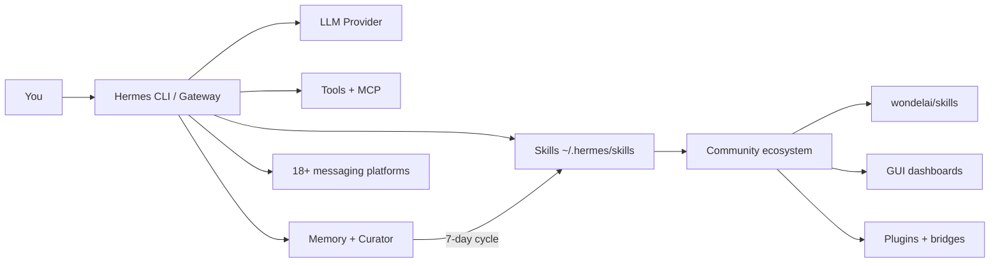

# Awesome Hermes Agent — Full Setup Guide

Install **[Hermes Agent](https://github.com/NousResearch/hermes-agent)** (Nous Research), add skills, GUIs, and integrations from the **[awesome-hermes-agent](https://github.com/0xNyk/awesome-hermes-agent)** ecosystem — the self-improving agent with a built-in learning loop.

Part of the [Agentic AI Ecosystem](https://github.com/Ayush7614/agentic-ai-ecosystem).

## Architecture



| Layer | What it is |
|-------|------------|
| **Hermes core** | CLI, gateway, 60+ tools, cron, profiles |
| **Learning loop** | Creates skills from experience; Curator grades/prunes (v0.12+) |
| **Skills** | Procedural memory — `/skill` or auto-invoked |
| **Plugins / MCP** | Extend tools, memory, search, payments |
| **Ecosystem** | Community skills, GUIs, deployment, multi-agent |

**Maturity tags** (used throughout the [ecosystem catalog](https://ayush7614.github.io/agentic-ai-ecosystem/guides/awesome-hermes-agent/ecosystem/)):

| Tag | Meaning |
|-----|---------|
| `production` | Stable, documented — safe to build on |
| `beta` | Works, still evolving |
| `experimental` | Early POC — learn, don't depend |

## Where do I start?

1. **Install Hermes** — one-line installer ([Part 1](https://ayush7614.github.io/agentic-ai-ecosystem/guides/awesome-hermes-agent/tutorial/#part-1--install-hermes-agent))
2. **Choose provider** — `hermes setup --portal` or `hermes model` ([Part 2](https://ayush7614.github.io/agentic-ai-ecosystem/guides/awesome-hermes-agent/tutorial/#part-2--choose-a-provider))
3. **Add starter skills** — `./install-starter-pack.sh` ([Part 4](https://ayush7614.github.io/agentic-ai-ecosystem/guides/awesome-hermes-agent/tutorial/#part-4--install-community-skills))
4. **Optional GUI** — hermes-workspace or mission-control ([Part 5](https://ayush7614.github.io/agentic-ai-ecosystem/guides/awesome-hermes-agent/tutorial/#part-5--add-a-gui-optional))

## Quick start

```bash
# 1. Install Hermes (macOS / Linux / WSL)
curl -fsSL https://hermes-agent.nousresearch.com/install.sh | bash
source ~/.zshrc   # or ~/.bashrc

# 2. Provider + Tool Gateway (easiest)
hermes setup --portal

# 3. Verify
cd guides/awesome-hermes-agent
chmod +x verify-install.sh install-starter-pack.sh
./verify-install.sh

# 4. First chat
hermes --tui

# 5. Starter skills (optional)
./install-starter-pack.sh
```

Official docs: [hermes-agent.nousresearch.com/docs](https://hermes-agent.nousresearch.com/docs/)

## What's in this guide

| File | Purpose |
|------|---------|
| TUTORIAL.md | Full install → skills → GUI → gateway → level-up |
| ECOSYSTEM.md | Curated catalog ([online](https://ayush7614.github.io/agentic-ai-ecosystem/guides/awesome-hermes-agent/ecosystem/)) |
| `verify-install.sh` | Health check after install |
| `install-starter-pack.sh` | Clone wondelai + litprog skills |
| `.env.example` | Optional API key reference |

## Full tutorial

**[Read the full tutorial →](./TUTORIAL.md)** · [Online](https://ayush7614.github.io/agentic-ai-ecosystem/guides/awesome-hermes-agent/tutorial/)

## Related guides in this repo

| Guide | Overlap |
|-------|---------|
| [OpenClaw + Gemma + RAG](../openclaw-gemma-rag/) | Messaging assistant pattern; Hermes has native gateway + OpenClaw migration |
| [Claude Code `.claude/`](../claude-code-dot-claude/) | Skills standard (agentskills.io) works across Hermes, Claude, Cursor |

## License

MIT — ecosystem list attribution: [awesome-hermes-agent](https://github.com/0xNyk/awesome-hermes-agent) (CC BY 4.0).
