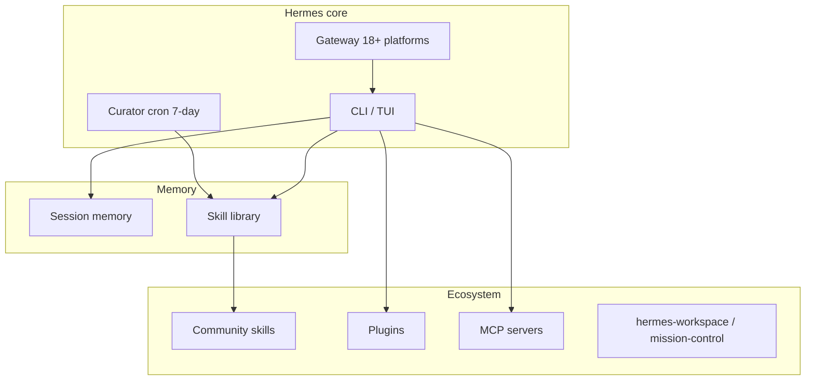
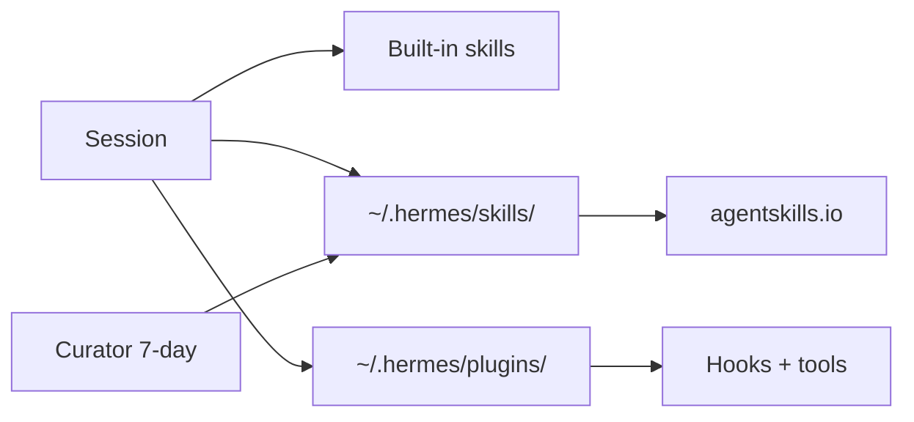
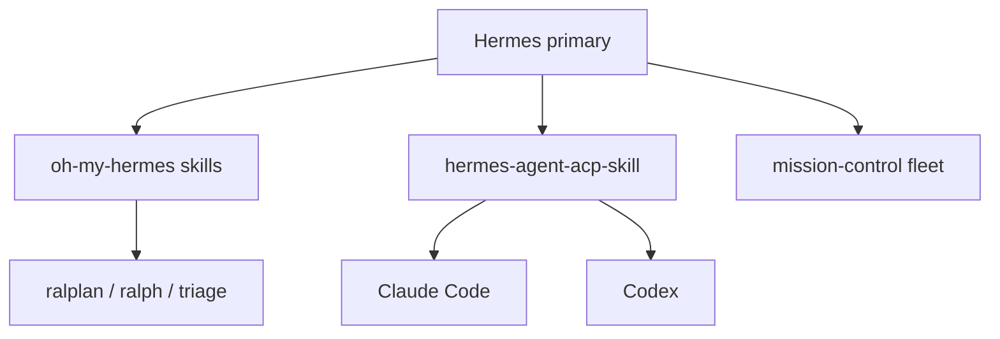

# Awesome Hermes Agent — Full Tutorial

Go from **zero** to a productive **Hermes Agent** setup with community skills, optional GUI, messaging gateway, and a map of the full ecosystem.

Based on [awesome-hermes-agent](https://github.com/0xNyk/awesome-hermes-agent) (last reviewed 2026-05-06, Hermes v0.12.0 “The Curator release”).

## What you'll build

1. **Hermes Agent** CLI on your machine  
2. **LLM provider** + Tool Gateway configured  
3. **Starter skills** from the ecosystem  
4. **Verification scripts** for your team  
5. Full coverage of **Skills & Plugins**, **Tools & Utilities**, **Integrations & Bridges**, and **Multi-Agent & Swarms**

## Architecture



---

## Prerequisites

| Requirement | Check |
|-------------|--------|
| macOS, Linux, WSL2, or Windows | — |
| **Git** installed | `git --version` |
| Internet for installer | — |
| Optional: Telegram/Discord token | For Part 6 gateway |

The Hermes installer pulls **uv**, **Python 3.11**, **Node 22**, **ripgrep**, and **ffmpeg** automatically.

---

## Part 1 — Install Hermes Agent

### macOS / Linux / WSL2 / Termux

```bash
curl -fsSL https://hermes-agent.nousresearch.com/install.sh | bash
source ~/.zshrc   # or source ~/.bashrc
```

Headless VPS (skip browser deps):

```bash
curl -fsSL https://hermes-agent.nousresearch.com/install.sh | bash -s -- --skip-browser
```

### Windows (PowerShell)

```powershell
iex (irm https://hermes-agent.nousresearch.com/install.ps1)
```

Or use the [Hermes Desktop installer](https://hermes-agent.nousresearch.com/desktop) on macOS/Windows.

### Verify from this guide

```bash
cd guides/awesome-hermes-agent
chmod +x verify-install.sh
./verify-install.sh
```

Expected: `hermes` on PATH, `hermes doctor` clean or with fixable warnings.

Config lives under `~/.hermes/` (Windows: `%LOCALAPPDATA%\hermes`).

---

## Part 2 — Choose a provider

### Easiest: Nous Portal (recommended for first run)

One OAuth flow — models + Tool Gateway (search, images, TTS, browser):

```bash
hermes setup --portal
```

### Interactive picker

```bash
hermes model
```

### Bring your own keys

Copy reference keys:

```bash
cp .env.example .env
# Edit .env — then configure via:
hermes config set
```

**Ollama (local)** — set OpenAI-compatible base URL in `hermes model` or config docs.

Docs: [Configuration](https://hermes-agent.nousresearch.com/docs/user-guide/configuration) · [Nous Portal](https://hermes-agent.nousresearch.com/docs/)

---

## Part 3 — First conversation

```bash
hermes --tui      # modern TUI (recommended)
# or
hermes            # classic CLI
```

Try:

- *"What tools do you have enabled?"*
- *"Create a skill for how I like commit messages formatted."*
- `hermes --continue` — resume last session

Quick reference:

| Command | Purpose |
|---------|---------|
| `hermes` | Chat |
| `hermes doctor` | Diagnose |
| `hermes update` | Upgrade |
| `hermes tools` | Enable/disable tools per platform |
| `hermes gateway` | Start messaging bridge |

---

## Part 4 — Skills & Plugins

Hermes **creates skills from experience** and maintains them via the **Curator** (v0.12+). **Plugins** extend core tools (search, memory, shell compression). Together they are procedural + operational memory.



### 4.1 — Install skills layer

```bash
chmod +x install-ecosystem.sh install-starter-pack.sh
./install-ecosystem.sh skills
# or lightweight starter only:
./install-starter-pack.sh
```

| Skill | Tag | Install path | Why |
|-------|-----|--------------|-----|
| [wondelai/skills](https://github.com/wondelai/skills) | production | `~/.hermes/skills/wondelai-skills` | 380+ cross-platform skills |
| [litprog-skill](https://github.com/tlehman/litprog-skill) | beta | `~/.hermes/skills/litprog-skill` | Literate programming |
| [youtube-skills](https://github.com/therohitdas/youtube-skills) | production | `~/.hermes/skills/youtube-skills` | VPS-safe YouTube transcripts |
| [drawio-skill](https://github.com/Agents365-ai/drawio-skill) | production | `~/.hermes/skills/drawio-skill` | NL → architecture diagrams |
| [Anthropic-Cybersecurity-Skills](https://github.com/mukul975/Anthropic-Cybersecurity-Skills) | production | optional clone | 753+ MITRE security skills (large) |
| [open-design](https://github.com/nexu-io/open-design) | production | per repo README | 31 design skills, 129 design systems |
| [hermes-skill-factory](https://github.com/Romanescu11/hermes-skill-factory) | beta | skill folder | Auto-generate skills from workflows |
| [hermes-incident-commander](https://github.com/Lethe044/hermes-incident-commander) | beta | skill folder | Autonomous SRE / self-healing |

**Manual pattern** (any skill):

```bash
git clone --depth 1 <repo-url> ~/.hermes/skills/<name>
# Each skill needs SKILL.md with YAML frontmatter (agentskills.io)
```

Discover more: [skilldock.io](https://skilldock.io) · [hermeshub](https://github.com/amanning3390/hermeshub) · [agentskills.io](https://agentskills.io)

### 4.2 — Install plugins layer

```bash
./install-ecosystem.sh plugins
```

Plugins clone to `~/.hermes/plugins/`. Enable in Hermes config (see [Plugins docs](https://hermes-agent.nousresearch.com/docs/)).

| Plugin | Tag | What it does |
|--------|-----|--------------|
| [hermes-web-search-plus](https://github.com/robbyczgw-cla/hermes-web-search-plus) | beta | Route search across Serper, Tavily, Exa |
| [rtk-hermes](https://github.com/ogallotti/rtk-hermes) | beta | Compress shell output 60–90% before LLM |
| [mnemo-hermes](https://github.com/hernanqwz/mnemo-hermes) | beta | pgvector semantic memory on Ollama |
| [Mnemosyne](https://github.com/AxDSan/Mnemosyne) | beta | Local hybrid search + knowledge graph |
| [hermes-curator-evolver](https://github.com/pingchesu/hermes-curator-evolver) | beta | Evidence-driven Curator companion |
| [plur](https://github.com/plur-ai/plur) | beta | Portable shared memory (YAML engrams) |
| [hermes-payguard](https://github.com/nativ3ai/hermes-payguard) | experimental | USDC / x402 payments with limits |
| [agent-analytics-hermes-plugin](https://github.com/Agent-Analytics/agent-analytics-hermes-plugin) | beta | Signals analytics dashboard tab |

### 4.3 — Curator + skill evolution

Built-in **Curator** (v0.12+) grades, consolidates, and prunes skills every 7 days. Pair with:

| Tool | Tag | Role |
|------|-----|------|
| Built-in Curator | production | Automatic skill library maintenance |
| [SkillClaw](https://github.com/AMAP-ML/SkillClaw) | production | Evolve/dedupe skills from session data |
| [hermes-dojo](https://github.com/Yonkoo11/hermes-dojo) | beta | Find weak skills, auto-iterate |
| [hermes-agent-self-evolution](https://github.com/NousResearch/hermes-agent-self-evolution) | official | DSPy/GEPA prompt evolution |

Verify skills load:

```bash
ls ~/.hermes/skills/
hermes --tui
# Ask: "What skills are available? Try /skill-name if configured."
```

---

## Part 5 — Tools & Utilities

GUIs, linters, browsers, and operator utilities that sit **beside** the CLI — not replacements.

```bash
./install-ecosystem.sh tools
```

Clones to `~/.hermes/ecosystem-tools/`. Follow each repo's README for `npm install`, `pip install`, or Docker.

### 5.1 — GUI dashboards

| Tool | Tag | Best for | Install notes |
|------|-----|----------|---------------|
| [hermes-workspace](https://github.com/outsourc-e/hermes-workspace) | production | Chat + terminal + skills manager | Nous Hackathon winner; Hermes-native |
| [mission-control](https://github.com/builderz-labs/mission-control) | production | Fleet, tasks, cost tracking | SQLite self-hosted dashboard |
| [hermes-web-ui](https://github.com/EKKOLearnAI/hermes-web-ui) | production | Token/cost analytics, cron, 8 channels | Vue 3 + BFF |
| [hermes-ui](https://github.com/pyrate-llama/hermes-ui) | beta | Single-file glassmorphic UI | Python proxy on :3333 |
| [hermes-desktop](https://github.com/dodo-reach/hermes-desktop) | beta | Native macOS workspace | Direct SSH to host |

Example — hermes-workspace:

```bash
cd ~/.hermes/ecosystem-tools/hermes-workspace
# Follow README: typically pnpm install && pnpm dev
# Point at your local Hermes gateway / CLI socket
```

### 5.2 — Operator & quality utilities

| Tool | Tag | Role |
|------|-----|------|
| [SkillClaw](https://github.com/AMAP-ML/SkillClaw) | production | `skillclaw doctor hermes` — skill health |
| [lintlang](https://github.com/roli-lpci/lintlang) | beta | Lint prompts/configs (HERM v1.1 score) |
| [agenttrace](https://github.com/luoyuctl/agenttrace) | beta | Post-run session audit TUI |
| [Clarvia](https://github.com/clarvia-project/clarvia) | production | Score MCP servers for agent-readiness |
| [flowstate-qmd](https://github.com/amanning3390/flowstate-qmd) | beta | Anticipatory memory / pre-fetch RAG |

### 5.3 — Browser & headless tooling

| Tool | Tag | When to use |
|------|-----|-------------|
| [camofox-browser](https://github.com/jo-inc/camofox-browser) | production | VPS blocked by Cloudflare — stealth headless API |
| [vessel-browser](https://github.com/unmodeled-tyler/vessel-browser) | experimental | Full AI-native Linux browser |
| Built-in Playwright | production | Default; skip with `--skip-browser` on install |

### 5.4 — Deployment utilities

| Tool | Tag | Notes |
|------|-----|-------|
| [hermes-agent-docker](https://github.com/xmbshwll/hermes-agent-docker) | beta | Minimal sandbox image |
| [nix-hermes-agent](https://github.com/0xrsydn/nix-hermes-agent) | beta | Reproducible NixOS module |
| [evey-setup](https://github.com/42-evey/evey-setup) | beta | One-command stack + 29 plugins |
| [openclaw-to-hermes](https://github.com/0xNyk/openclaw-to-hermes) | beta | Migration helper |

---

## Part 6 — Integrations & Bridges

Connect Hermes to **memory backends**, **MCP servers**, **productivity suites**, and **other agents**.

```bash
./install-ecosystem.sh integrations
```

### 6.1 — MCP integration pattern

1. Add server block to Hermes MCP config (see [MCP docs](https://hermes-agent.nousresearch.com/docs/user-guide/mcp))
2. Restart session; verify with `hermes tools` or ask Hermes to list MCP tools
3. Score servers with [Clarvia](https://clarvia-project) before trusting production workflows

| MCP / integration | Tag | Surface |
|-------------------|-----|---------|
| [MeiGen-AI-Design-MCP](https://github.com/jau123/MeiGen-AI-Design-MCP) | production | Image/video gen (9 models) |
| [mistral-mcp](https://github.com/Swih/mistral-mcp) | beta | OCR, audio, Codestral FIM, agents |
| [Not Human Search](https://github.com/unitedideas/not-human-search) | production | Discover 8,600+ MCP servers |
| [Global Chat](https://github.com/pumanitro/Global-Chat) | production | Cross-protocol agent discovery |
| [hermes-blockchain-oracle](https://github.com/gizdusum/hermes-blockchain-oracle) | experimental | Solana on-chain data |
| [hermes-council](https://github.com/Ridwannurudeen/hermes-council) | experimental | Adversarial multi-perspective debate |

Example MCP config snippet (adjust paths after clone):

```yaml
# Reference only — merge into your Hermes MCP settings
mcp_servers:
  meigen-design:
    command: node
    args: ["~/.hermes/ecosystem-tools/MeiGen-AI-Design-MCP/dist/index.js"]
```

### 6.2 — Memory bridges

| Integration | Tag | Pattern |
|-------------|-----|---------|
| [hindsight](https://github.com/vectorize-io/hindsight) | production | retain / recall / reflect over long history |
| [honcho-self-hosted](https://github.com/elkimek/honcho-self-hosted) | beta | Self-hosted Honcho user modeling |
| [yantrikdb-hermes-plugin](https://github.com/yantrikos/yantrikdb-hermes-plugin) | beta | Rust backend with explainable recall |
| [plur](https://github.com/plur-ai/plur) | beta | Portable YAML engram memory |

**Memory hygiene:** keep `USER.md` / `MEMORY.md` concise; let Curator prune stale skills.

### 6.3 — Productivity & device bridges

| Integration | Tag | Connects |
|-------------|-----|----------|
| [microsoft-workspace-skill](https://github.com/Andrew-Girgis/microsoft-workspace-skill) | beta | Outlook / M365 via Graph API |
| [hermes-nextcloud](https://github.com/adnw-vinc/hermes-nextcloud) | beta | WebDAV, Notes, CalDAV, CardDAV |
| [hermes-android](https://github.com/raulvidis/hermes-android) | beta | Android device control |
| [agent-android](https://github.com/AIVaneLabs/agent-android) | beta | LAN Android over WiFi |
| [hermes-spotify-skill](https://github.com/Alexeyisme/hermes-spotify-skill) | beta | Headless Linux / Raspberry Pi Spotify |
| [clawsocial-hermes-plugin](https://github.com/mrpeter2025/clawsocial-hermes-plugin) | beta | Social discovery network |

### 6.4 — Cross-agent bridges

| Bridge | Tag | Handoff |
|--------|-----|---------|
| [evey-bridge-plugin](https://github.com/42-evey/evey-bridge-plugin) | beta | Claude Code ↔ Hermes context share |
| [hermes-agent-acp-skill](https://github.com/Rainhoole/hermes-agent-acp-skill) | beta | Route subtasks to Codex / Claude Code |
| [zouroboros-swarm-executors](https://github.com/marlandoj/zouroboros-swarm-executors) | experimental | Local executor bridge for Claude + Hermes |

---

## Part 7 — Multi-Agent & Swarms

When one Hermes session is not enough — **orchestration**, **delegation**, and **fleet visibility**.

```bash
./install-ecosystem.sh multiagent
```



### 7.1 — oh-my-hermes (orchestration skills)

| Skill | Purpose |
|-------|---------|
| `deep-research` | Multi-step research pipeline |
| `deep-interview` | Structured requirements gathering |
| `ralplan` | Planner → Architect → Critic consensus |
| `ralph` | Verified execute → verify → iterate |
| `triage` | Prioritize incoming work |
| `autopilot` | End-to-end dispatcher playbook |

Install: included in `./install-ecosystem.sh multiagent` → `~/.hermes/skills/oh-my-hermes/`

### 7.2 — Specialized agent packs

| Project | Tag | Agents |
|---------|-----|--------|
| [opencode-hermes-multiagent](https://github.com/1ilkhamov/opencode-hermes-multiagent) | beta | 17 role-specialized OpenCode agents |
| [bigiron](https://github.com/supermodeltools/bigiron) | beta | SDLC crew + Supermodel code graph |
| [hermes-plugins](https://github.com/42-evey/hermes-plugins) | beta | Inter-agent bridge between Hermes instances |

### 7.3 — Fleet dashboards

Pair multi-agent skills with **mission-control** (Part 5) for:

- Task dispatch across agents  
- Cost tracking per session  
- SQLite-backed job history  

```bash
cd ~/.hermes/ecosystem-tools/mission-control
# Follow upstream README for self-hosted deploy
```

### 7.4 — Experimental swarms

| Project | Tag | Idea |
|---------|-----|------|
| [Ankh.md](https://github.com/Abruptive/Ankh.md) | experimental | TAW Agent × Hermes swarm framework |
| [gladiator](https://github.com/runtimenoteslabs/gladiator) | experimental | Competing autonomous agent companies |
| [NemoHermes](https://github.com/Hmbown/NemoHermes) | experimental | NVIDIA Spark GPU routing |

### 7.5 — When to use multi-agent

| Scenario | Use |
|----------|-----|
| Single repo, one developer | Hermes CLI + skills |
| Research → plan → execute chain | oh-my-hermes `ralplan` + `ralph` |
| Best tool per subtask | `hermes-agent-acp-skill` |
| Many agents, cost visibility | mission-control + cron |
| Claude Code already in workflow | evey-bridge + ACP skill |

---

## Part 8 — Messaging gateway (optional)

Hermes ships **18 built-in platforms**: Telegram, Discord, Slack, WhatsApp, Signal, Feishu/Lark, WeCom, QQBot, Yuanbao, and more. Microsoft Teams via plugin.

```bash
hermes gateway
```

Configure tokens via `hermes setup` or config — see [Messaging Gateway docs](https://hermes-agent.nousresearch.com/docs/user-guide/messaging-gateway).

**Security:** keep DM pairing / allowlists on until you trust exposure. Run `hermes doctor` after gateway changes.

### Migrating from OpenClaw

```bash
hermes claw migrate
```

Community fallback: [openclaw-to-hermes](https://github.com/0xNyk/openclaw-to-hermes) (older Hermes versions).

---

## Part 9 — Deployment & cron

| Method | Tag | Notes |
|--------|-----|-------|
| Local / `$5 VPS` | — | Default; use `--skip-browser` on headless |
| `hermes-agent-docker` | beta | Minimal sandbox image |
| `nix-hermes-agent` | beta | Reproducible NixOS |
| Modal / Daytona / Vercel Sandbox | — | Serverless terminal backends (built into Hermes) |
| `evey-setup` | beta | Opinionated stack + 29 plugins |

Cron jobs for autonomous loops:

```bash
hermes cron   # see docs for scheduling nightly evolution, monitoring, etc.
```

---

## Part 10 — Level-up blueprints

Opinionated bundles from [awesome-hermes-agent](https://github.com/0xNyk/awesome-hermes-agent#level-up-blueprints):

### Memory that compounds

Built-in memory → **honcho-self-hosted** → **hindsight** → **plur** (portable engrams) → **flowstate-qmd** (anticipatory RAG).

### Self-improvement without drift

**hermes-agent-self-evolution** + scheduled regression + **lintlang** + second evaluation pass.

### Operator cockpit

**hermes-workspace** daily UI + **mission-control** for fleet/costs.

### Multi-agent execution

**hermes-agent-acp-skill** (route to Codex/Claude Code) + **oh-my-hermes** + **opencode-hermes-multiagent**.

### Paperclip-managed ops

**hermes-paperclip-adapter** + cron + dashboard for governed autonomous work.

Full resource list: [ecosystem catalog](https://ayush7614.github.io/agentic-ai-ecosystem/guides/awesome-hermes-agent/ecosystem/).

---

## Part 11 — End-to-end test

Run the full ecosystem stack:

```bash
./verify-install.sh
./install-ecosystem.sh all    # or layer by layer: skills, plugins, tools, integrations, multiagent
hermes doctor
hermes --tui
```

In TUI, verify each layer:

1. **Skills** — *"List skills in ~/.hermes/skills"*
2. **Plugins** — *"Which plugins are enabled?"*
3. **Tools** — open hermes-workspace or mission-control if installed
4. **Integrations** — *"List MCP tools available"*
5. **Multi-agent** — *"Use oh-my-hermes triage on this task"*

```bash
hermes update
```

Optional: `hermes gateway` + Telegram message test.

---

## Troubleshooting

| Symptom | Fix |
|---------|-----|
| `hermes: command not found` | `source ~/.zshrc` or re-run installer |
| Doctor fails on provider | `hermes setup --portal` or `hermes model` |
| YouTube transcripts fail on VPS | Install `youtube-skills` (cloud IP blocked by default) |
| Browser tools OOM on small VPS | Install with `--skip-browser`; use `camofox-browser` plugin |
| Skills not visible | Confirm `SKILL.md` in `~/.hermes/skills/<name>/`; restart session |
| Plugins not loading | `./install-ecosystem.sh plugins`; enable in Hermes config |
| Ecosystem clone failed | Check `git`; retry one layer: `./install-ecosystem.sh skills` |
| MCP tools missing | Add server to Hermes MCP config; restart session |
| Multi-agent handoff fails | Install `hermes-agent-acp-skill`; verify delegate agent installed |
| GUI tool won't start | `cd ~/.hermes/ecosystem-tools/<name>` and follow repo README |
| OpenClaw migration gaps | `hermes claw migrate` then compare cron + channel config |

---

## What's next

- Browse the [ecosystem catalog](https://ayush7614.github.io/agentic-ai-ecosystem/guides/awesome-hermes-agent/ecosystem/) by category  
- Join [Nous Discord](https://discord.gg/nousresearch)  
- Star [NousResearch/hermes-agent](https://github.com/NousResearch/hermes-agent) and [awesome-hermes-agent](https://github.com/0xNyk/awesome-hermes-agent)  
- Contribute new ecosystem entries via awesome-hermes-agent PRs  

---

## Summary

| Step | Command / artifact |
|------|---------------------|
| Install | `curl … install.sh \| bash` |
| Provider | `hermes setup --portal` |
| Verify | `./verify-install.sh` |
| Chat | `hermes --tui` |
| Skills & plugins | `./install-ecosystem.sh skills` + `plugins` |
| Tools & utilities | `./install-ecosystem.sh tools` |
| Integrations | `./install-ecosystem.sh integrations` |
| Multi-agent | `./install-ecosystem.sh multiagent` |
| Full stack | `./install-ecosystem.sh all` |
| Catalog | [ecosystem catalog](https://ayush7614.github.io/agentic-ai-ecosystem/guides/awesome-hermes-agent/ecosystem/) |
| Gateway | `hermes gateway` |

Hermes is the only agent with a **closed learning loop** — install once, let skills compound, curate intentionally, extend from the ecosystem when you need superpowers.
