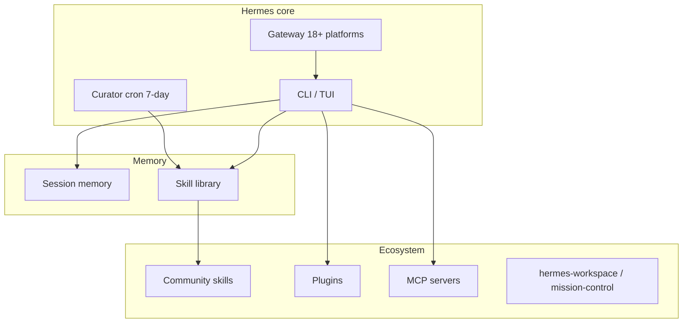

# Awesome Hermes Agent — Full Tutorial

Go from **zero** to a productive **Hermes Agent** setup with community skills, optional GUI, messaging gateway, and a map of the full ecosystem.

Based on [awesome-hermes-agent](https://github.com/0xNyk/awesome-hermes-agent) (last reviewed 2026-05-06, Hermes v0.12.0 “The Curator release”).

## What you'll build

1. **Hermes Agent** CLI on your machine  
2. **LLM provider** + Tool Gateway configured  
3. **Starter skills** from the ecosystem  
4. **Verification scripts** for your team  
5. A mental model of **skills, plugins, GUIs, deployment, and level-up blueprints**

## Architecture



---

## Prerequisites

| Requirement | Check |
|-------------|--------|
| macOS, Linux, WSL2, or Windows | — |
| **Git** installed | `git --version` |
| Internet for installer | — |
| Optional: Telegram/Discord token | For Part 6 gateway |

The Hermes installer pulls **uv**, **Python 3.11**, **Node 22**, **ripgrep**, and **ffmpeg** automatically.

---

## Part 1 — Install Hermes Agent

### macOS / Linux / WSL2 / Termux

```bash
curl -fsSL https://hermes-agent.nousresearch.com/install.sh | bash
source ~/.zshrc   # or source ~/.bashrc
```

Headless VPS (skip browser deps):

```bash
curl -fsSL https://hermes-agent.nousresearch.com/install.sh | bash -s -- --skip-browser
```

### Windows (PowerShell)

```powershell
iex (irm https://hermes-agent.nousresearch.com/install.ps1)
```

Or use the [Hermes Desktop installer](https://hermes-agent.nousresearch.com/desktop) on macOS/Windows.

### Verify from this guide

```bash
cd guides/awesome-hermes-agent
chmod +x verify-install.sh
./verify-install.sh
```

Expected: `hermes` on PATH, `hermes doctor` clean or with fixable warnings.

Config lives under `~/.hermes/` (Windows: `%LOCALAPPDATA%\hermes`).

---

## Part 2 — Choose a provider

### Easiest: Nous Portal (recommended for first run)

One OAuth flow — models + Tool Gateway (search, images, TTS, browser):

```bash
hermes setup --portal
```

### Interactive picker

```bash
hermes model
```

### Bring your own keys

Copy reference keys:

```bash
cp .env.example .env
# Edit .env — then configure via:
hermes config set
```

**Ollama (local)** — set OpenAI-compatible base URL in `hermes model` or config docs.

Docs: [Configuration](https://hermes-agent.nousresearch.com/docs/user-guide/configuration) · [Nous Portal](https://hermes-agent.nousresearch.com/docs/)

---

## Part 3 — First conversation

```bash
hermes --tui      # modern TUI (recommended)
# or
hermes            # classic CLI
```

Try:

- *"What tools do you have enabled?"*
- *"Create a skill for how I like commit messages formatted."*
- `hermes --continue` — resume last session

Quick reference:

| Command | Purpose |
|---------|---------|
| `hermes` | Chat |
| `hermes doctor` | Diagnose |
| `hermes update` | Upgrade |
| `hermes tools` | Enable/disable tools per platform |
| `hermes gateway` | Start messaging bridge |

---

## Part 4 — Install community skills

Hermes **creates skills from experience** and maintains them via the **Curator** (v0.12+). Community skills jump-start common workflows.

### Starter pack (this guide)

```bash
./install-starter-pack.sh
```

Installs into `~/.hermes/skills/`:

| Skill repo | Tag | Why |
|------------|-----|-----|
| [wondelai/skills](https://github.com/wondelai/skills) | production | 380+ cross-platform agentskills.io skills |
| [litprog-skill](https://github.com/tlehman/litprog-skill) | beta | Literate programming notebooks |

### Manual install pattern

```bash
git clone --depth 1 https://github.com/wondelai/skills.git ~/.hermes/skills/wondelai-skills
```

For single skills from [skilldock.io](https://skilldock.io) or [hermeshub](https://github.com/amanning3390/hermeshub): copy the skill folder (with `SKILL.md`) into `~/.hermes/skills/<name>/`.

### agentskills.io standard

Skills use `SKILL.md` + YAML frontmatter — same format as Claude Code and Cursor. See [Skills Hub](https://agentskills.io).

**Production picks** from the [ecosystem catalog](https://ayush7614.github.io/agentic-ai-ecosystem/guides/awesome-hermes-agent/ecosystem/):

- `youtube-skills` — VPS-safe YouTube transcripts  
- `Anthropic-Cybersecurity-Skills` — 753+ MITRE-mapped security skills  
- `drawio-skill` — architecture diagrams from natural language  
- `open-design` — local-first design generation  

---

## Part 5 — Add a GUI (optional)

| Project | Tag | Best for |
|---------|-----|----------|
| [hermes-workspace](https://github.com/outsourc-e/hermes-workspace) | production | Hermes-native chat + terminal + skills manager |
| [mission-control](https://github.com/builderz-labs/mission-control) | production | Multi-agent fleet, tasks, cost tracking |
| [hermes-web-ui](https://github.com/EKKOLearnAI/hermes-web-ui) | production | Analytics-heavy Vue dashboard |

Example (hermes-workspace — follow repo README):

```bash
git clone https://github.com/outsourc-e/hermes-workspace.git
cd hermes-workspace
# Follow upstream install — typically npm/pnpm + Hermes gateway URL
```

Use a GUI when you want **visibility**; the CLI remains the source of truth.

---

## Part 6 — Messaging gateway (optional)

Hermes ships **18 built-in platforms**: Telegram, Discord, Slack, WhatsApp, Signal, Feishu/Lark, WeCom, QQBot, Yuanbao, and more. Microsoft Teams via plugin.

```bash
hermes gateway
```

Configure tokens via `hermes setup` or config — see [Messaging Gateway docs](https://hermes-agent.nousresearch.com/docs/user-guide/messaging-gateway).

**Security:** keep DM pairing / allowlists on until you trust exposure. Run `hermes doctor` after gateway changes.

### Migrating from OpenClaw

```bash
hermes claw migrate
```

Community fallback: [openclaw-to-hermes](https://github.com/0xNyk/openclaw-to-hermes) (older Hermes versions).

---

## Part 7 — Plugins, MCP, and memory

### Plugins

Copy or install plugins into Hermes plugin paths (see official [Plugins](https://hermes-agent.nousresearch.com/docs/) docs). Notable from ecosystem:

| Plugin | Tag | Role |
|--------|-----|------|
| `hermes-web-search-plus` | beta | Multi-provider search routing |
| `rtk-hermes` | beta | Compress shell output (60–90% token savings) |
| `mnemo-hermes` / `Mnemosyne` | beta | Vector memory on top of FTS5 |
| `hindsight` | production | retain/recall/reflect long-term memory |

### MCP

Wire MCP servers in Hermes config — see [MCP Integration](https://hermes-agent.nousresearch.com/docs/user-guide/mcp).

Discovery: [Not Human Search](https://nothumansearch.ai) · [Clarvia](https://clarvia-project) (MCP agent-readiness scoring).

### Memory hygiene

- Curate `USER.md` / `MEMORY.md` — concise, durable facts only  
- Let the **Curator** prune low-grade skills on its 7-day cycle  
- Pair **SkillClaw** or **hermes-curator-evolver** for evidence-driven skill evolution  

---

## Part 8 — Deployment options

| Method | Tag | Notes |
|--------|-----|-------|
| Local / `$5 VPS` | — | Default; use `--skip-browser` on headless |
| `hermes-agent-docker` | beta | Minimal sandbox image |
| `nix-hermes-agent` | beta | Reproducible NixOS |
| Modal / Daytona / Vercel Sandbox | — | Serverless terminal backends (built into Hermes) |
| `evey-setup` | beta | Opinionated stack + 29 plugins |

Cron jobs for autonomous loops:

```bash
hermes cron   # see docs for scheduling nightly evolution, monitoring, etc.
```

---

## Part 9 — Level-up blueprints

Opinionated bundles from [awesome-hermes-agent](https://github.com/0xNyk/awesome-hermes-agent#level-up-blueprints):

### Memory that compounds

Built-in memory → **honcho-self-hosted** → **hindsight** → **plur** (portable engrams) → **flowstate-qmd** (anticipatory RAG).

### Self-improvement without drift

**hermes-agent-self-evolution** + scheduled regression + **lintlang** + second evaluation pass.

### Operator cockpit

**hermes-workspace** daily UI + **mission-control** for fleet/costs.

### Multi-agent execution

**hermes-agent-acp-skill** (route to Codex/Claude Code) + **oh-my-hermes** + **opencode-hermes-multiagent**.

### Paperclip-managed ops

**hermes-paperclip-adapter** + cron + dashboard for governed autonomous work.

Full resource list: [ecosystem catalog](https://ayush7614.github.io/agentic-ai-ecosystem/guides/awesome-hermes-agent/ecosystem/).

---

## Part 10 — End-to-end test

```bash
./verify-install.sh
hermes --tui
# Ask: "List skills in ~/.hermes/skills and summarize what each does."
./install-starter-pack.sh
hermes doctor
hermes update
```

Optional gateway test: message your bot on Telegram after `hermes gateway`.

---

## Troubleshooting

| Symptom | Fix |
|---------|-----|
| `hermes: command not found` | `source ~/.zshrc` or re-run installer |
| Doctor fails on provider | `hermes setup --portal` or `hermes model` |
| YouTube transcripts fail on VPS | Install `youtube-skills` (cloud IP blocked by default) |
| Browser tools OOM on small VPS | Install with `--skip-browser`; use `camofox-browser` plugin |
| Skills not visible | Confirm `SKILL.md` in `~/.hermes/skills/<name>/`; restart session |
| OpenClaw migration gaps | `hermes claw migrate` then compare cron + channel config |

---

## What's next

- Browse the [ecosystem catalog](https://ayush7614.github.io/agentic-ai-ecosystem/guides/awesome-hermes-agent/ecosystem/) by category  
- Join [Nous Discord](https://discord.gg/nousresearch)  
- Star [NousResearch/hermes-agent](https://github.com/NousResearch/hermes-agent) and [awesome-hermes-agent](https://github.com/0xNyk/awesome-hermes-agent)  
- Contribute new ecosystem entries via awesome-hermes-agent PRs  

---

## Summary

| Step | Command / artifact |
|------|---------------------|
| Install | `curl … install.sh \| bash` |
| Provider | `hermes setup --portal` |
| Verify | `./verify-install.sh` |
| Chat | `hermes --tui` |
| Skills | `./install-starter-pack.sh` |
| Catalog | [ecosystem.md](https://ayush7614.github.io/agentic-ai-ecosystem/guides/awesome-hermes-agent/ecosystem/) |
| Gateway | `hermes gateway` |

Hermes is the only agent with a **closed learning loop** — install once, let skills compound, curate intentionally, extend from the ecosystem when you need superpowers.
