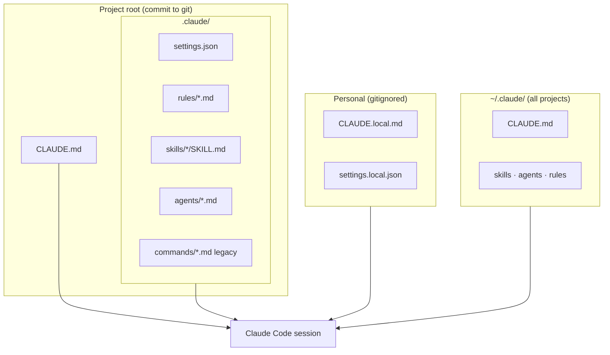
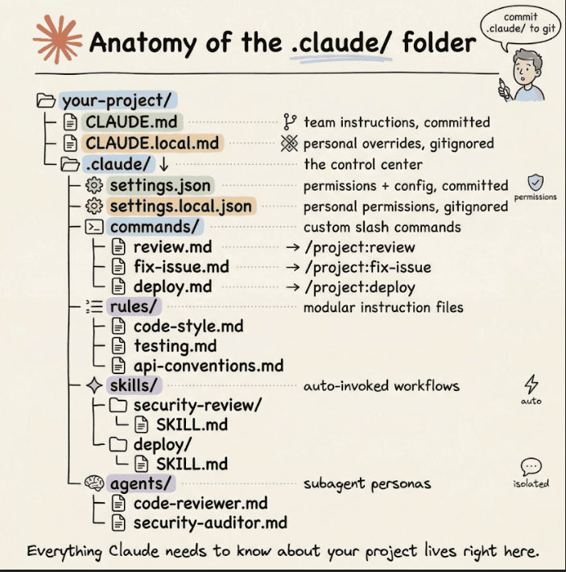

# Claude Code — Anatomy of the `.claude/` Folder

Turn any repository into a **team-aware Claude Code workspace**: shared instructions, permissions, slash commands, auto-invoked skills, and isolated subagents — all version-controlled except personal overrides.

Part of the [Agentic AI Ecosystem](https://github.com/Ayush7614/agentic-ai-ecosystem).

## Architecture



| Piece | Path | Commit? | Role |
|-------|------|---------|------|
| **Team memory** | `CLAUDE.md` | ✓ | Loaded every session — stack, workflow, conventions |
| **Personal memory** | `CLAUDE.local.md` | ✗ | Your overrides on top of team instructions |
| **Permissions** | `.claude/settings.json` | ✓ | Allow/deny tools, env vars, hooks |
| **Personal permissions** | `.claude/settings.local.json` | ✗ | Extra allows (Docker, web, etc.) |
| **Rules** | `.claude/rules/*.md` | ✓ | Modular instructions; can be path-scoped |
| **Skills** | `.claude/skills/*/SKILL.md` | ✓ | `/name` workflows; can auto-invoke |
| **Commands** | `.claude/commands/*.md` | ✓ | Legacy single-file skills (still works) |
| **Agents** | `.claude/agents/*.md` | ✓ | Isolated subagent personas with own tools |

Official reference: [Explore the `.claude` directory](https://code.claude.com/docs/en/claude-directory).

## Anatomy diagram



## Quick start

```bash
cd guides/claude-code-dot-claude
chmod +x install-template.sh
./install-template.sh /path/to/your-project
cd /path/to/your-project
claude
```

Inside Claude Code:

```text
/init                    # optional: bootstrap CLAUDE.md from your repo
/project:code-review     # skill from template
/agents code-reviewer    # delegate review to subagent
```

## What's in this guide

| Path | Purpose |
|------|---------|
| `TUTORIAL.md` | Full step-by-step walkthrough |
| `template/` | Copy-paste `.claude/` layout with working examples |
| `install-template.sh` | Install template into any project directory |
| `assets/claude-folder-anatomy.png` | Visual map of the folder |

## Full tutorial

Step-by-step setup, permissions, rules, skills vs commands, agents, hooks, and team git workflow:

**[Read the full tutorial →](./TUTORIAL.md)** · [Online version](https://ayush7614.github.io/agentic-ai-ecosystem/guides/claude-code-dot-claude/tutorial/)

## Cursor vs Claude Code (quick map)

| Concept | Claude Code | Cursor |
|---------|-------------|--------|
| Project memory | `CLAUDE.md` | `.cursor/rules`, `AGENTS.md` |
| Personal memory | `CLAUDE.local.md` | User rules in settings |
| Workflows | `.claude/skills/` | `.cursor/skills/` |
| Slash commands | `/project:skill-name` | `/skill-name` |
| Subagents | `.claude/agents/` | Task subagents in chat |
| Permissions | `settings.json` | Auto-run / approval settings |

Both ecosystems benefit from the same idea: **commit team config, gitignore personal overrides.**

## License

MIT — same as the parent repo.
