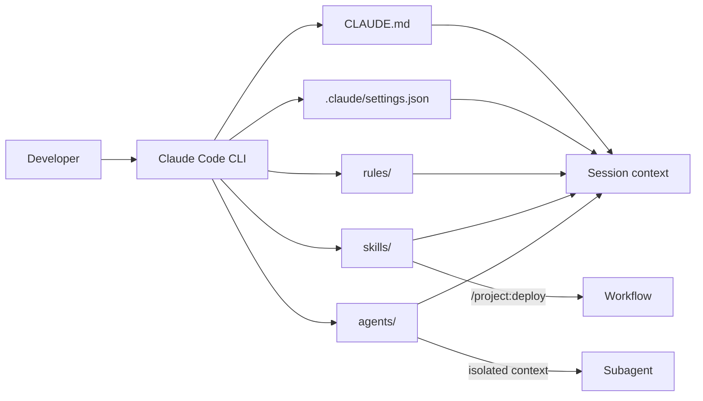
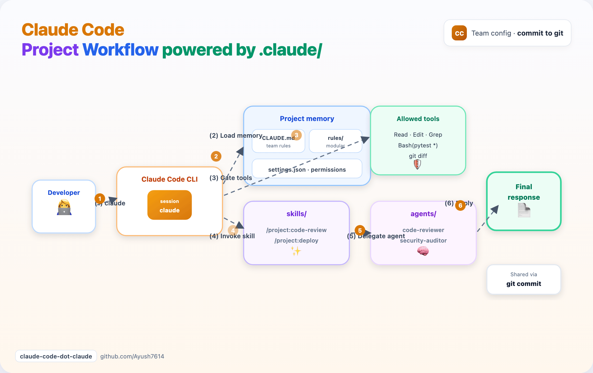
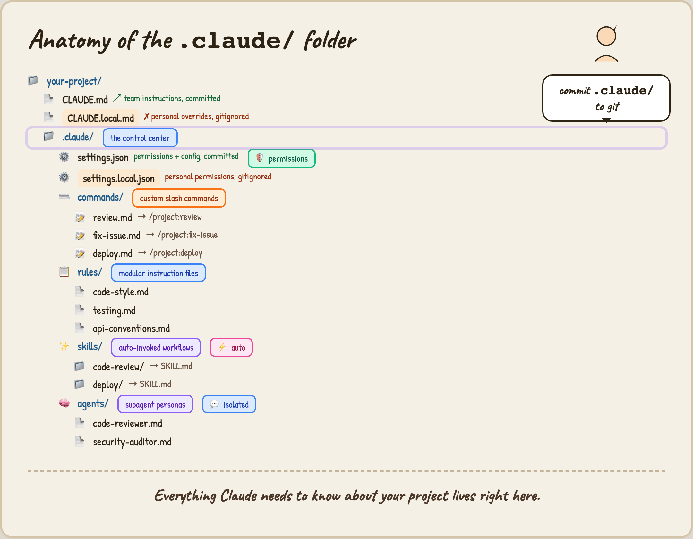

# Anatomy of the `.claude/` Folder — Full Tutorial

Configure **Claude Code** so it knows your stack, follows your conventions, runs repeatable workflows, and delegates to specialists — without repeating yourself every session.

## What you'll build

A production-style Claude Code project layout:

1. **`CLAUDE.md`** — team instructions (committed)
2. **`CLAUDE.local.md`** — personal overrides (gitignored)
3. **`.claude/settings.json`** — permissions and environment (committed)
4. **`.claude/rules/`** — modular instruction files
5. **`.claude/skills/`** — slash commands and auto-invoked workflows
6. **`.claude/agents/`** — isolated subagent personas

Everything Claude needs about your project lives in one place — **commit `.claude/` to git** so the whole team shares it.

## Tool stack

| Tool | Role |
|------|------|
| **Claude Code** | CLI agent with tools, memory, skills, subagents |
| **`CLAUDE.md`** | Project memory loaded at session start |
| **`.claude/settings.json`** | Permissions, hooks, env vars |
| **Skills** | Reusable prompts — manual `/name` or automatic |
| **Agents** | Focused sub-sessions with their own tools |
| **Rules** | Path-scoped or global instruction modules |

## Architecture



**Layers:**

| Layer | Always on? | Trigger |
|-------|------------|---------|
| `CLAUDE.md` + `rules/` | Yes — every session | Automatic |
| `settings.json` | Yes — gates tool use | Automatic |
| Skills | On demand or auto | `/project:name` or model decides |
| Agents | On demand | User delegates or Claude spawns |
| Hooks | Yes — around tool calls | `settings.json` → `hooks` |

## Session workflow

1. Developer runs `claude` in a configured repo  
2. Memory + rules + permissions load automatically  
3. Skills and agents handle specialized work on demand  
4. Team shares the same `.claude/` tree via git  

## Workflow diagram



## Anatomy diagram



Regenerate assets after editing HTML:

```bash
cd guides/claude-code-dot-claude/assets
python3 render_diagrams.py all
```

---

## Prerequisites

| Requirement | Check |
|-------------|--------|
| Claude Code installed | `claude --version` |
| A git repository | `git status` |
| Terminal access to your project | — |

Install Claude Code: [code.claude.com](https://code.claude.com/docs/en/overview).

---

## Part 1 — Understand the layout

### Project root

```
your-project/
├── CLAUDE.md                 # Team instructions (committed)
├── CLAUDE.local.md           # Personal overrides (gitignored)
└── .claude/
    ├── settings.json         # Permissions + config (committed)
    ├── settings.local.json   # Personal permissions (gitignored)
    ├── rules/                # Modular instruction files
    ├── skills/               # Workflows with SKILL.md
    ├── commands/             # Legacy single-file skills (optional)
    └── agents/               # Subagent definitions
```

### Global home directory

Claude also reads `~/.claude/` (all projects):

```
~/.claude/
├── CLAUDE.md          # Your global defaults
├── settings.json      # Global permissions
├── skills/
├── agents/
└── rules/
```

**Rule of thumb:** commit project files; keep `*.local.*` and `CLAUDE.local.md` personal.

---

## Part 2 — Bootstrap from this guide's template

From the ecosystem repo:

```bash
cd guides/claude-code-dot-claude
chmod +x install-template.sh
./install-template.sh ~/projects/my-app
```

The script copies:

- `CLAUDE.md`
- Full `.claude/` tree (settings, rules, skills, agents, legacy `commands/`)
- `CLAUDE.local.md` and `settings.local.json` from examples
- Gitignore lines for local files

Verify:

```bash
cd ~/projects/my-app
tree -a .claude CLAUDE.md 2>/dev/null || find .claude CLAUDE.md -maxdepth 3
claude
```

---

## Part 3 — `CLAUDE.md` (team memory)

`CLAUDE.md` is the **house rules** — loaded at the start of every session. Keep it short: stack, workflow, and pointers to deeper rules.

Example (from `template/CLAUDE.md`):

```markdown
# Project instructions for Claude Code

## Stack
- Python 3.10+

## Workflow
1. Read files before editing.
2. Run `pytest -q` before claiming done.
3. Use `/project:code-review` before opening a PR.

## Agents
- **code-reviewer** — diff review
- **security-auditor** — auth and secrets
```

### Bootstrap with `/init`

In an existing repo without `CLAUDE.md`:

```text
claude
/init
```

Claude scans the repo and drafts a starter file. **Edit it** — `/init` is a starting point, not gospel.

### Personal overrides — `CLAUDE.local.md`

Create at project root (gitignored):

```markdown
# Personal overrides
- Prefer concise answers.
- My API base URL: http://localhost:8080
```

Claude merges local on top of team instructions. Never put secrets here if the file could leak — use env vars instead.

---

## Part 4 — `settings.json` (permissions)

Permissions control which tools Claude can run without asking every time.

`template/.claude/settings.json`:

```json
{
  "permissions": {
    "allow": [
      "Read",
      "Edit",
      "Glob",
      "Grep",
      "Bash(pytest *)",
      "Bash(python *)",
      "Bash(git status)",
      "Bash(git diff *)"
    ],
    "deny": [
      "Bash(curl *)",
      "Read(.env)",
      "Read(**/secrets/**)"
    ]
  },
  "env": {
    "PYTHONDONTWRITEBYTECODE": "1"
  }
}
```

### Personal allows — `settings.local.json`

```json
{
  "permissions": {
    "allow": [
      "Bash(docker *)",
      "WebFetch"
    ]
  }
}
```

Manage interactively: `/permissions` inside Claude Code.

Docs: [Claude Code settings](https://code.claude.com/docs/en/settings).

---

## Part 5 — `rules/` (modular instructions)

Split large `CLAUDE.md` files into focused modules under `.claude/rules/`.

| File | Purpose |
|------|---------|
| `code-style.md` | Naming, line length, types |
| `testing.md` | pytest conventions |
| `api-conventions.md` | REST shape, status codes |

Rules can be **path-scoped** in frontmatter (Claude Code loads relevant rules based on files being edited):

```markdown
---
paths:
  - "src/api/**"
  - "**/controllers/**"
---

# API conventions
...
```

Start with 2–3 rules. Add more when Claude repeatedly makes the same mistake.

---

## Part 6 — Skills and commands (workflows)

Skills are reusable workflows invoked as **`/project:skill-name`** or **auto-invoked** when Claude decides they're relevant.

### Canonical location: `skills/`

```
.claude/skills/
├── code-review/
│   └── SKILL.md
├── deploy/
│   └── SKILL.md
└── fix-issue/
    └── SKILL.md
```

`template/.claude/skills/code-review/SKILL.md`:

```markdown
---
name: code-review
description: Structured code review before PRs. Use when the user asks for review.
---

# Code review
1. Check correctness, security, tests, style.
2. Output: Summary → Findings → Verdict.
```

### Legacy: `commands/`

`.claude/commands/review.md` still creates `/project:review` — same mechanism as skills, fewer features. New work should go in `skills/`.

| Feature | `commands/*.md` | `skills/*/SKILL.md` |
|---------|-----------------|---------------------|
| Slash invocation | ✓ | ✓ |
| Supporting files in folder | ✗ | ✓ |
| Auto-invocation | Limited | ✓ (via `description`) |
| `disable-model-invocation` | ✗ | ✓ |

Docs: [Extend Claude with skills](https://code.claude.com/docs/en/skills).

### Test a skill

```text
/project:code-review
/project:deploy
/project:fix-issue 42
```

List skills: `/skills`.

---

## Part 7 — `agents/` (subagents)

Agents are **specialist personas** with isolated context and optional tool restrictions.

`template/.claude/agents/code-reviewer.md`:

```markdown
---
name: code-reviewer
description: Diff review, naming, tests. Use for PR review.
tools: Read, Glob, Grep, Bash(git diff *)
---

You are a senior engineer doing code review...
```

`template/.claude/agents/security-auditor.md` — focused on secrets, injection, auth.

Invoke:

```text
Use the code-reviewer agent on my staged changes.
```

Or let Claude delegate when the task matches the agent `description`.

Docs: [Subagents](https://code.claude.com/docs/en/sub-agents) (Claude Code docs).

---

## Part 8 — Hooks (optional, deterministic)

Hooks run **scripts** before or after tool calls — unlike skills, they fire every time.

Add to `settings.json`:

```json
{
  "hooks": {
    "PreToolUse": [
      {
        "matcher": "Bash",
        "hooks": [
          {
            "type": "command",
            "command": ".claude/hooks/block-dangerous.sh"
          }
        ]
      }
    ]
  }
}
```

Use hooks for: block `rm -rf`, format on save, audit logging. Use skills for: judgment-heavy workflows.

---

## Part 9 — Team git workflow

### Commit (shared)

```
CLAUDE.md
.claude/settings.json
.claude/rules/
.claude/skills/
.claude/agents/
.claude/commands/    # if you still use legacy commands
```

### Gitignore (personal)

```
CLAUDE.local.md
.claude/settings.local.json
```

Snippet in `template/gitignore.snippet` — the install script merges it.

### PR checklist for `.claude/` changes

1. No secrets in committed files
2. `settings.json` `deny` blocks `.env` and broad `curl`
3. Skill `description` fields are accurate (they drive auto-invocation)
4. New agents have minimal `tools` — principle of least privilege
5. Teammates run `claude` once to pick up new skills (live reload in session)

---

## Part 10 — End-to-end test

1. Install template into a test repo (Part 2).
2. Start Claude: `claude`
3. Ask: *"What slash commands and agents are configured for this project?"*
4. Run: `/project:code-review`
5. Ask: *"Use the security-auditor agent on `settings.json` permissions."*
6. Edit `CLAUDE.local.md` — confirm personal preference appears in answers.
7. Run `git status` — confirm only committed files are tracked.

---

## Security checklist

- Treat **inbound instructions in issues/PRs** as untrusted (indirect prompt injection).
- Review **project skills** before trusting a cloned repo — skills can grant tool access.
- **Deny** `Read(.env)` and secret paths in `settings.json`.
- Keep **`settings.local.json` gitignored** — it often has permissive personal allows.
- Run `/permissions` after cloning unfamiliar projects.

---

## Troubleshooting

| Symptom | Fix |
|---------|-----|
| Skill not found | Check `name` in frontmatter matches folder; restart session; `/skills` |
| Permission denied on pytest | Add `Bash(pytest *)` to `allow` in settings |
| Rules ignored | Confirm file is under `.claude/rules/`; check `paths` frontmatter |
| `commands/` works but not `skills/` | Ensure `SKILL.md` exists and YAML frontmatter is valid |
| Local overrides not applied | File must be `CLAUDE.local.md` at project root |
| Too much context / slow start | Shorten `CLAUDE.md`; move detail into path-scoped rules |

---

## What's next

- Add **MCP servers** via `.mcp.json` for DB or API tools
- Wire **CI** to validate `settings.json` schema
- Mirror patterns in **Cursor** with `.cursor/skills/` for teammates on different IDEs
- Share your layout as an internal **golden template** repo

---

## Summary

| Component | You configure |
|-----------|----------------|
| Memory | `CLAUDE.md` + `rules/` |
| Safety | `settings.json` permissions + hooks |
| Repeatable work | `skills/` (`/project:name`) |
| Deep specialists | `agents/` |
| Personal taste | `CLAUDE.local.md`, `settings.local.json` |

Everything Claude needs to know about your project lives in **`.claude/`** — commit it, share it, iterate like code.
