# Harness Engineering — Full Visual Guide

The **model is smart. The harness makes it reliable.** Build the environment around Claude Code, Codex, or any coding agent so multi-session work finishes with proof — not vibes.

**References (original guide):** [learn-harness-engineering](https://github.com/) · [OpenAI — Harness engineering](https://openai.com/) · [Anthropic — Long-running harnesses](https://www.anthropic.com/)

All visuals are **1200×600 px** — course-style previews, diagrams, terminal walkthroughs, and one mega overview GIF.

---

## Visual previews (course-style)

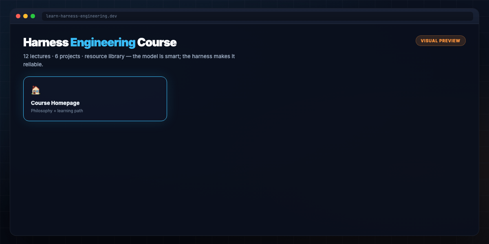

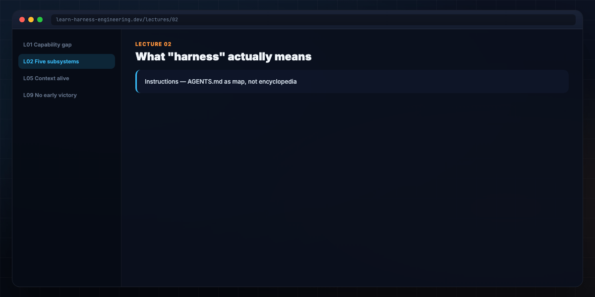

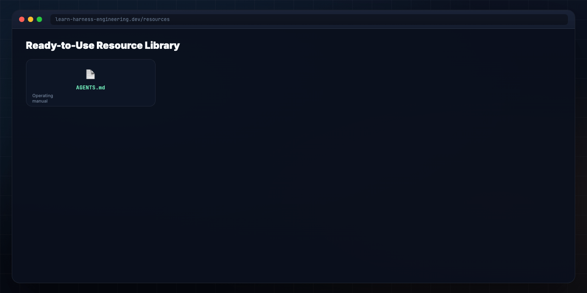

**Mega overview (blog hero):** [mega-harness-everything.gif](./assets/mega-harness-everything.gif)

---

## What you'll understand

- Why the **same model** fails or succeeds based on harness — not IQ  
- The **five subsystems**: instructions, state, verification, scope, lifecycle  
- **AGENTS.md as map**, not encyclopedia — progressive disclosure via `docs/`  
- The **16-step session lifecycle** agents should follow  
- **Planner / generator / evaluator** splits for long runs  
- Copy-ready templates to drop into your repo today  

---

## Introduction — it's a harness problem

You give Claude or GPT a real task. It reads files, writes code, looks productive. Then it skips a step, breaks tests, says "done" — and nothing works. You spend more time **rescuing** than if you'd coded it yourself.

That's not a model problem. It's a **harness problem**.

Anthropic ran a controlled experiment: same model (Opus 4.5), same prompt ("build a 2D retro game editor"). **Without harness:** ~$9 in 20 minutes, broken output. **With harness** (planner + generator + evaluator): ~$200 in 6 hours, **playable game**. The model didn't change. The **environment** did.

OpenAI reported the same shift with Codex: in a well-harnessed repo, reliability moves from "unreliable" to **production-grade** — not a marginal tweak, a qualitative jump.

**Harness engineering** = designing everything the model runs inside: instructions, state files, verification gates, scope boundaries, session lifecycle, hooks, sandboxes, observability.

```
Agent = Model + Harness
If you're not the model, you're the harness.
```

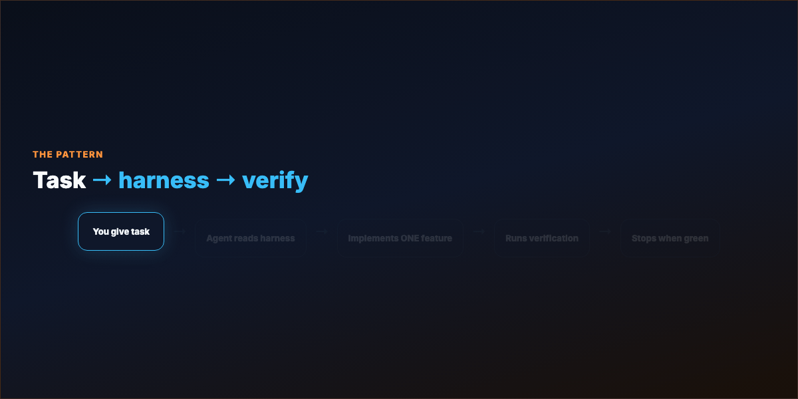

---

## Part 1 — The harness pattern

You give a task. The agent:

1. Reads harness files (not your Slack thread)  
2. Runs `init.sh` — install, health check  
3. Picks **one** unfinished feature  
4. Implements with verification loop  
5. Stops only when **tests/lint/types pass**  

The **model** decides what code to write.  
The **harness** governs when, where, and how — and when "done" is allowed.

---

## Part 2 — Five subsystems

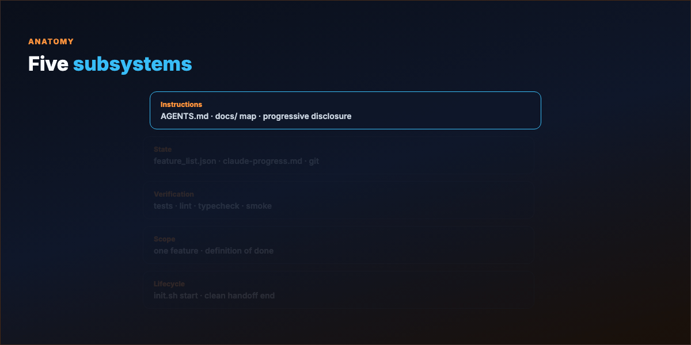

| Subsystem | Job | Artifacts |
|-----------|-----|-----------|
| **Instructions** | What to do, in what order, what to read first | `AGENTS.md`, `CLAUDE.md`, `docs/` |
| **State** | What's done, in progress, next | `feature_list.json`, `claude-progress.md`, git log |
| **Verification** | Proof before victory | tests, lint, typecheck, smoke, e2e |
| **Scope** | One feature at a time; real definition of done | feature list as machine-readable boundary |
| **Lifecycle** | Clean start and handoff | `init.sh`, wrap-up checklist, safe commit |

The harness doesn't make the model smarter. It makes output **reliable**.

---

## Part 3 — Without harness vs with harness

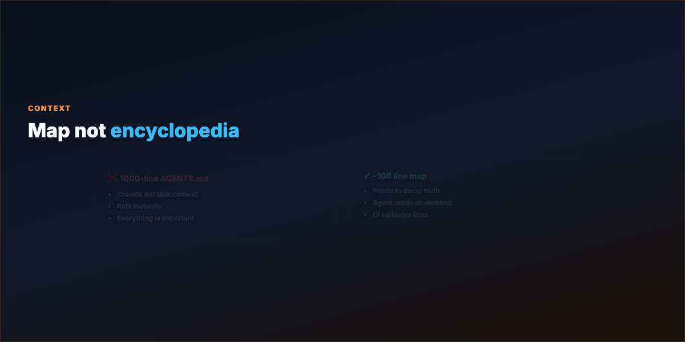

**Without:** Session 2 has no memory. Agent re-does work or wanders. You merge broken code.

**With:** Session 2 reads `claude-progress.md`, continues feature F03, verifies before claiming done. **You review, not rescue.**

---

## Part 4 — AGENTS.md: map, not encyclopedia

The "one giant AGENTS.md" approach fails predictably:

- Context is scarce — a 1,000-line manual crowds out the task  
- Everything "important" means nothing is  
- It rots — agents can't tell what's still true  

**Fix:** ~100-line `AGENTS.md` as **table of contents**. Deep truth lives in structured `docs/` — design docs, architecture, exec plans, quality grades. Agent starts small, **reads on demand**.

OpenAI's Codex team treats `docs/` as **system of record**; linters and doc-gardening agents keep it fresh.

---

## Part 5 — Session lifecycle (16 steps)

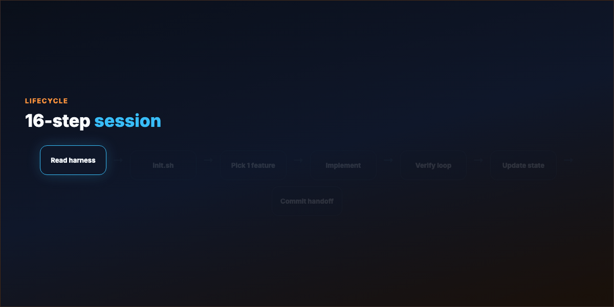

**Start:** Read harness → `init.sh` → progress log → feature list → git log  

**Select:** Pick exactly **one** unfinished feature  

**Execute:** Implement → verify → fix loop until green → record evidence  

**Wrap:** Update progress + feature list → note broken/unverified → commit when safe to resume  

Without harness, step "verify" becomes "agent says it looks fine." With harness, it's **tests pass, lint clean, types check**.

---

## Part 6 — Scope and feature lists

`feature_list.json` is a **harness primitive** — machine-readable scope the agent can't hand-wave away.

Rules:

- One `passes: false` feature active at a time  
- No rewriting the list to hide unfinished work  
- `passes: true` only with evidence (test name, date, log snippet)  

See [examples/feature_list.json](./examples/feature_list.json).

---

## Part 7 — Verification and early victory

Agents declare victory too early because **confidence ≠ correctness**. Fixes:

- Runnable proof required (not "I think it works")  
- Full pipeline runs — unit + lint + typecheck + smoke  
- **Separate evaluator agent** — generation ≠ grading (Anthropic harness pattern)  

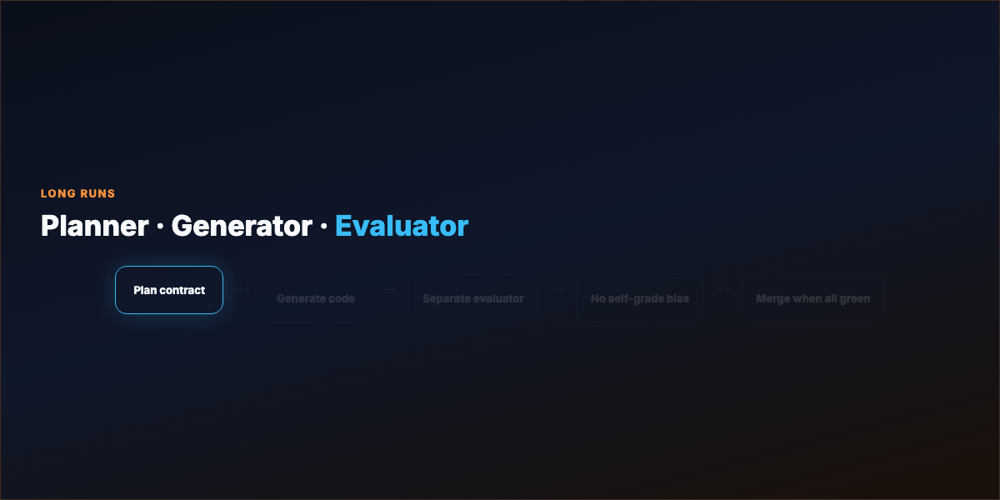

---

## Part 8 — Hooks and the ratchet

**Hooks** enforce what prompts merely suggest: pre-commit typecheck, block `rm -rf`, grep for `.skip(`, require approval before push.

**Ratchet rule:** every agent mistake becomes a **permanent constraint**:

- Agent commented out a test → AGENTS.md rule + hook  
- Agent ignored architecture layer → custom linter  
- Stale docs → doc-gardening agent opens fix PR  

Harness is shaped by **your failure history** — you can't download someone else's.

---

## Part 9 — Agent legibility

If the agent can't see it in-repo at runtime, **it doesn't exist**. Slack decisions, Google Docs, tribal knowledge — illegible. Versioned markdown, schemas, plans, generated DB docs — legible.

Push context **into the repo** over time. Boring, composable stacks often beat clever abstractions agents can't inspect.

---

## Part 10 — Production patterns (Codex / Claude Code)

Mature harnesses add:

- **Per-worktree app boot** — agent drives UI via Chrome DevTools MCP  
- **Local observability stack** — LogQL/PromQL in the loop  
- **Layered architecture** — mechanical dependency rules + structural tests  
- **Garbage collection** — golden principles + recurring refactor agents  
- **Minimal merge gates** — high throughput; fix forward when agent volume exceeds human attention  

Humans steer at **intent and acceptance criteria**. Agents execute and self-review in loops.

---

## Part 11 — Quick start (four files)

Drop into project root:

```
├── AGENTS.md
├── init.sh
├── feature_list.json
└── claude-progress.md
```

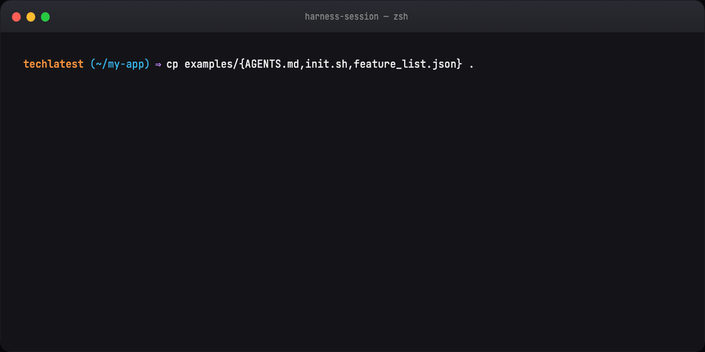

Copy from [examples/](./examples/). Sessions stabilize immediately vs prompt-only.

---

## Part 12 — Hands-on session

```bash
./init.sh                    # bootstrap + health
# agent picks ONE feature
npm test && npm run lint     # verification gate
# update progress + feature_list
git commit                   # clean handoff
```

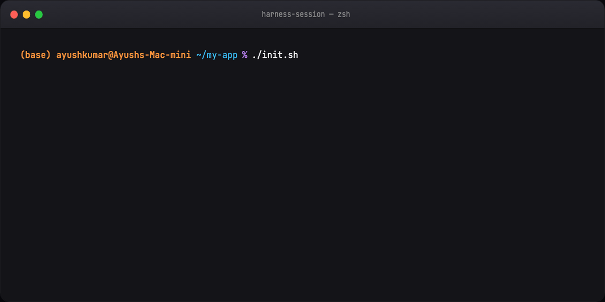

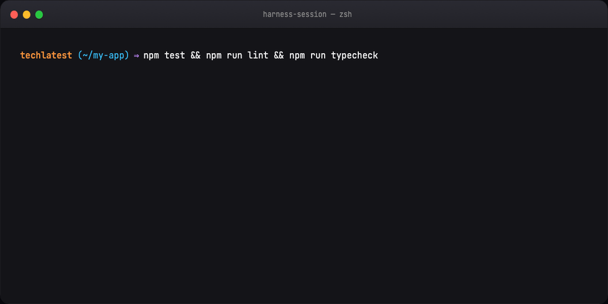


---

## Part 13 — Capstone context (knowledge base app)

The learn-harness-engineering course builds one **Electron knowledge-base app** across six projects — import docs, index, grounded Q&A with citations. Each project adds harness mechanisms; the app evolves as skills grow.

Same pattern works for any real repo: measured **weak vs strong harness** diff, not doc count.

---

## Part 14 — Learning path (12 + 6)

**Lectures L01–L12:** capability gap → harness definition → repo as truth → progressive disclosure → multi-session state → init phase → scope → feature lists → verification → e2e → observability → clean handoff  

**Projects P01–P06:** prompt-only vs rules-first → agent-readable workspace → continuity → runtime feedback → self-verification → full capstone  

---

## Part 15 — Who this is for

**Yes:** engineers using coding agents daily; tech leads owning agent reliability; builders who'll let agents edit real repos  

**No:** zero-code AI intro; prompt-only hobbyists; teams unwilling to add harness files to git  

**Requires:** terminal, git, at least one of Claude Code / Codex / comparable agent CLI  

---

## Image placement (blog)

- Hero → `mega-harness-everything.gif`  
- Previews → `preview-course-home.gif`, `preview-lecture.gif`, `preview-resource-library.gif`  
- Part 1 → `diagram-harness-pattern.gif`  
- Part 2 → `diagram-five-subsystems.gif`  
- Part 3 → `diagram-agents-map.gif`  
- Part 5 → `diagram-session-lifecycle.gif`  
- Part 7 → `diagram-planner-eval.gif`  
- Part 11–12 → terminal steps  

**Blog header:** `assets/blog-poster-1200x600.png`

---

## Regenerate visuals (all 1200×600)

```bash
cd guides/harness-engineering/assets
python3 render_gifs.py all          # previews + diagrams + terminal + mega
python3 render_blog_poster.py
cd ../../..
./scripts/prepare-docs.sh
```

---

## Further reading

- OpenAI: *Harness engineering — leveraging Codex in an agent-first world*  
- Anthropic: *Effective harnesses for long-running agents*  
- Viv Trivedy: *Anatomy of an Agent Harness*  
- [Loop Engineering](../loop-engineering/TUTORIAL.md) — eval gates and closed loops  
- [Claude Code `.claude/`](../claude-code-dot-claude/TUTORIAL.md) — folder anatomy  

---

## Summary

**Harness engineering** is the discipline of making agents finish real work: map-not-encyclopedia instructions, disk-persisted state, verification before "done", one-feature scope, structured session lifecycle, hooks that ratchet on every failure. The model gets the headlines. The harness gets the **merge**.
