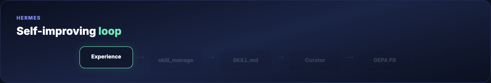

# Hermes Agent Masterclass

The **complete Hermes guide** — learning loop, memory, Curator, GEPA, **Profile Builder**, profiles, MCP, and three isolated agents (designer, programmer, researcher).

**Official:** [Hermes Agent docs](https://hermes-agent.nousresearch.com/docs/) · **Also inspired by:** [Daily Dose of Data masterclass](https://www.dailydoseofds.com/p/hermes-agent-masterclass/)

> This is the **canonical** Hermes tutorial in this repo. Profile Builder is integrated in **Parts 11–12** of the masterclass.

## What you'll build

- Hermes with provider + **Telegram gateway**
- **Profile Builder** dashboard (`hermes dashboard` → `:9119`)
- Three **profiles** with distinct `SOUL.md`, skills, and MCP
- Programmer → **Claude Code** · Researcher → **cron digest**



**One-GIF overview (blog hero):** [mega-hermes-everything.gif](assets/mega-hermes-everything.gif) — install → ReAct → 3 agents → Curator/GEPA → Profile Builder → cron in ~10s.

## Quick start

```bash
curl -fsSL https://hermes-agent.nousresearch.com/install.sh | bash
source ~/.zshrc
hermes setup
pip install 'hermes-agent[web]'
hermes dashboard
```

## Guide map

- **[Full tutorial](./TUTORIAL.md)** — Parts 1–20 (install → Profile Builder → three agents)
- **[Examples](./examples/)** — SOUL templates, skill sample, `config.yaml` for MCP
- **[Assets](./assets/)** — terminal + diagram GIFs, blog poster

## Related guides

- [Hermes Profile Builder](../hermes-profile-builder/) — quick index pointing to Parts 11–12 here
- [Awesome Hermes Agent](../awesome-hermes-agent/) — ecosystem catalog depth
- [Hermes vs OpenClaw](../hermes-vs-openclaw/) · [OpenClaw masterclass](../openclaw/)
- [Claude Code `.claude/`](../claude-code-dot-claude/)

**Blog header:** `assets/blog-poster-1200x600.png` · Regenerate: `cd assets && python3 render_blog_poster.py`

## License

Guide: MIT · Hermes: upstream · Credit: [Daily Dose of Data](https://www.dailydoseofds.com/)
