# Hermes Agent Masterclass — Full Tutorial

Everything you need to **install, understand, and customize** [Hermes Agent](https://github.com/NousResearch/hermes-agent): the learning loop, memory, self-evolving skills, the Curator, GEPA, **Profile Builder**, and three isolated agents on one machine.

**Official:** [hermes-agent.nousresearch.com/docs](https://hermes-agent.nousresearch.com/docs/) · **Inspired by:** [Daily Dose of Data masterclass](https://www.dailydoseofds.com/p/hermes-agent-masterclass/) (Avi Chawla, May 2026)

This guide matches our [OpenClaw masterclass](../openclaw/TUTORIAL.md) format: **prose and lists only** (no comparison tables in the body), plus **terminal and diagram GIFs**.

---

## What you'll have at the end

- Hermes installed with provider, model, and optional **Telegram gateway**
- **Profile Builder** dashboard at `http://127.0.0.1:9119` with the `[web]` extra
- Three **profiles**: `designer`, `programmer`, `researcher` — each isolated
- Distinct **SOUL.md** per profile, **MCP servers**, and Skills Hub installs
- Programmer delegating to **Claude Code**; researcher on **weekday cron**

---

## Introduction — an agent that gets better over time

Hermes ships a **learning loop** most assistants lack:

- **Multi-tier memory** across sessions  
- **Self-authored skills** via `skill_manage`  
- **Curator** background pruning of agent-created skills  
- Optional **GEPA** offline validation from execution traces  

By the end you run **three specialized agents** on one machine — designer, programmer, researcher — each with its own personality, memory, skills, and Telegram bot.

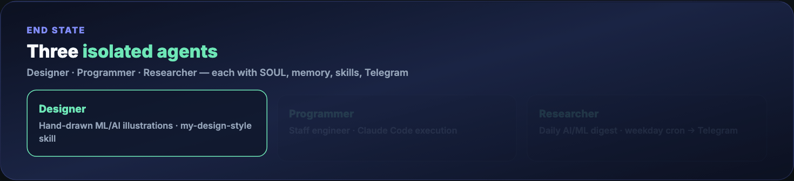

**One-GIF overview (blog hero):** [mega-hermes-everything.gif](./assets/mega-hermes-everything.gif) — full masterclass story in ~10 seconds.

---

## Part 1 — How Hermes is structured

**One-line pitch:** an agent that improves the longer you use it.

Hermes combines runtime skill learning, persistent memory, and an optional weight-training pipeline in one framework. Everything flows through a single **`AIAgent`** class in `run_agent.py`. CLI, gateway, batch runner, and IDE hooks are entry points into the **same core**.

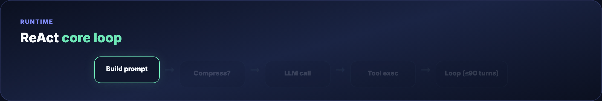

The loop is **ReAct-style and synchronous**:

1. Build system prompt (SOUL → memory snapshot → skills catalog)  
2. Compress context if needed  
3. Interruptible LLM call  
4. Execute tool calls  
5. Repeat until done or **90-turn cap** (subagents share the budget)  

Execution backends include local shell, Docker, SSH, Modal, Daytona, and Singularity — switch via config only. A translation layer routes Anthropic, OpenAI, Gemini, Ollama-compatible, and other providers.

**OpenClaw comparison (prose):** Hermes *packages a gateway around a learning agent*; OpenClaw *packages an agent around a messaging gateway*. Full side-by-side: [Hermes vs OpenClaw](../hermes-vs-openclaw/TUTORIAL.md) · [OpenClaw masterclass](../openclaw/TUTORIAL.md).


---

## Part 2 — Prerequisites

- macOS, Linux, WSL2, or Windows  
- **Python 3.11+** (Hermes installer bundles `uv` and deps)  
- API key or local model endpoint  
- **8GB RAM** minimum for API-based usage  
- Browser on the same machine for **Profile Builder**  

```bash
hermes --version   # after install
python3 --version
```

---

## Part 3 — Install Hermes

```bash
curl -fsSL https://hermes-agent.nousresearch.com/install.sh | bash
source ~/.zshrc   # or ~/.bashrc
```

Headless VPS (skip browser deps):

```bash
curl -fsSL https://hermes-agent.nousresearch.com/install.sh | bash -s -- --skip-browser
```

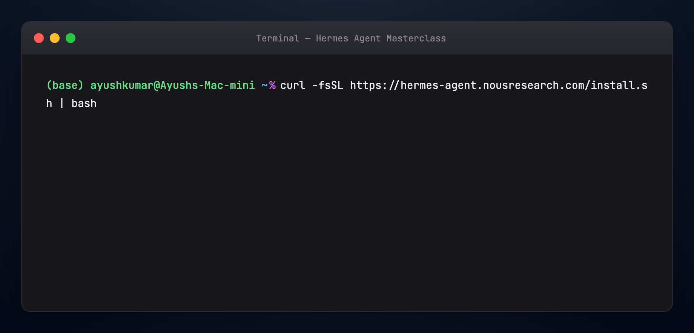

Windows: [Hermes Desktop installer](https://hermes-agent.nousresearch.com/desktop) or install docs.

---

## Part 4 — Setup, chat, and gateway

Run the wizard:

```bash
hermes setup
hermes              # CLI session
```

Connect **Telegram** (fastest phone test):

1. [@BotFather](https://t.me/BotFather) → `/newbot`  
2. [@userinfobot](https://t.me/userinfobot) for your user ID  
3. `hermes gateway setup`  

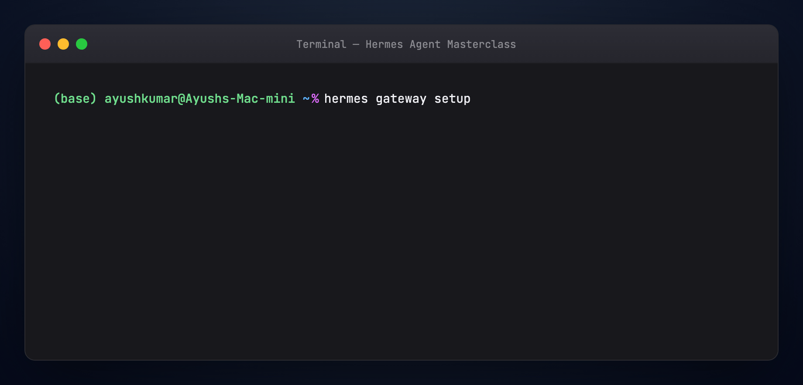

---

## Part 5 — Identity: SOUL.md

Memory = what the agent **knows**. Skills = how it **acts**. **SOUL.md** = who it **is** — slot **#1** in the system prompt, before memory and skills.

Default path: `~/.hermes/SOUL.md`. Per profile: `~/.hermes/profiles/<name>/SOUL.md`.

```markdown
# SOUL.md

You are a pragmatic senior engineer with strong taste.
You optimize for truth, clarity, and usefulness
over politeness theater.
```

Hand-authored and mostly static. All learning — memory writes, skill creation, consolidation — happens through this identity lens.

---

## Part 6 — Memory (three tiers)

Hermes uses **three layers**, not one blob:

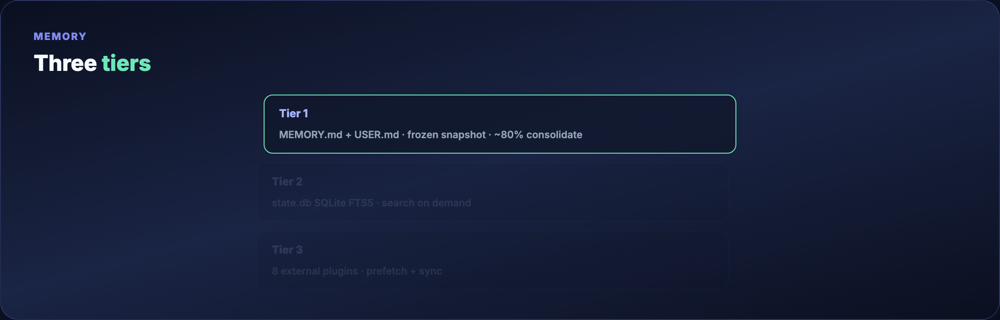

**Tier 1 — tiny Markdown files**

- `MEMORY.md` (~2,200 chars) — environment, conventions, tool quirks  
- `USER.md` (~1,375 chars) — your preferences and avoid-list  

Injected as a **frozen snapshot** at session start. Mid-session writes persist to disk but appear in the prompt **next session**. At ~**80% capacity**, the agent **consolidates** entries.

**Tier 2 — session search**

All conversations live in **`state.db`** (SQLite + FTS5). Search weeks of history on demand. Unlimited capacity, but requires search + summarization.

**Tier 3 — external plugins**

Eight pluggable memory providers run **alongside** built-in memory (never replace it). Only one active at a time. When enabled: prefetch before each turn, sync after each response, extract on session end.

---

## Part 7 — Self-evolving skills and the Curator

Skills are `SKILL.md` + YAML frontmatter — procedural memory. Sample anatomy: [examples/skill-k8s-pod-debug.md](./examples/skill-k8s-pod-debug.md).


**Progressive disclosure:** catalog descriptions only (~3k tokens) → full skill when matched → optional `references/` drill-down.

**Self-improvement loop:** the agent uses **`skill_manage`** after complex tasks, error recovery, user corrections, or new workflows. Actions: `create`, `patch` (preferred), `edit`, `delete`, `write_file`, `remove_file`.

**Curator** prunes agent-authored skills (never bundled/Hub skills):

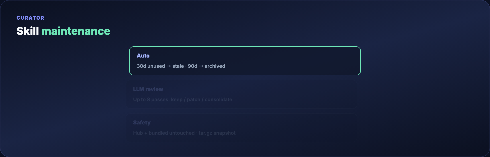

Runs after **7 days** since last pass and **2+ hours idle** — background fork, separate prompt cache. Automatic: 30 days unused → stale; 90 days → archived. LLM review: up to 8 iterations per skill. Snapshot before each pass; `hermes curator pin <skill>` protects favorites.

---

## Part 8 — GEPA (offline skill evolution)

In-agent learning can self-congratulate or overwrite good manual edits. **GEPA** (Genetic-Pareto Prompt Evolution) in [hermes-agent-self-evolution](https://github.com/NousResearch/hermes-agent-self-evolution) validates skills **offline** from execution traces.

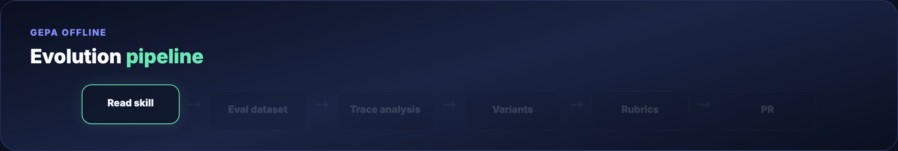

Read skill → build eval set → trace analysis → candidate variants → LLM-as-judge rubrics → gates (100% tests, &lt;15KB, no drift) → **PR only**, never direct commit. Roughly **$2–10/run**, no GPU. Skip until you hit a wall before full finetuning.

**Chain:** SOUL.md → runtime loop → Curator → GEPA validates.

---

## Part 9 — What's inside `~/.hermes/`

```
~/.hermes/
├── config.yaml
├── .env
├── SOUL.md
├── memories/          # MEMORY.md, USER.md
├── skills/
├── profiles/          # isolated agents (see Part 11)
├── sessions/
├── state.db
├── cron/
└── logs/
```

Edit `config.yaml` with `hermes config edit` or `hermes config set`. Secrets go to `.env`. Skills land under `skills/` or per-profile `profiles/<name>/skills/`.

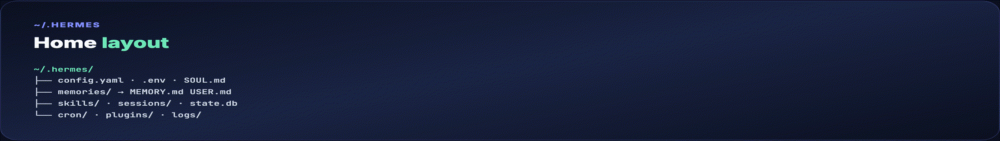

---

## Part 10 — Skills Hub

Official **Skills Hub**: hundreds of skills across built-in, optional, Anthropic, and LobeHub catalogs (counts change upstream).

```bash
hermes skills tap add yourname/your-skills-repo
hermes skills install yourname/your-skills-repo/<skill-name>
hermes skills install openai/skills/k8s
```

Ecosystem depth: [Awesome Hermes Agent](../awesome-hermes-agent/TUTORIAL.md).

---

## Part 11 — Profile Builder (web dashboard)

**Profiles** are isolated Hermes homes under `~/.hermes/profiles/<name>/` — separate `config.yaml`, `.env`, `SOUL.md`, memory, sessions, skills, cron, and state. A coding agent and a research agent never share state.

The **Profile Builder** is a guided browser flow. It requires the web extra (base install has no HTTP stack):

```bash
pip install 'hermes-agent[web]'
hermes dashboard
```

Opens **http://127.0.0.1:9119** (loopback by default). Non-loopback bind needs an auth provider or Hermes fails closed.

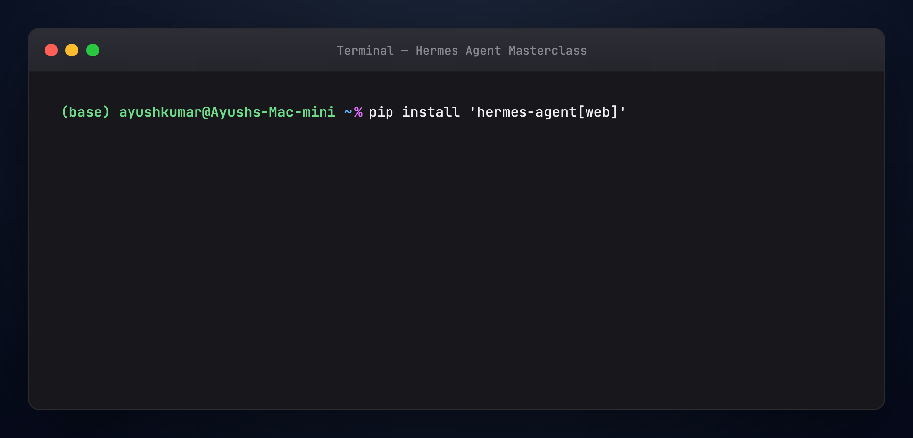

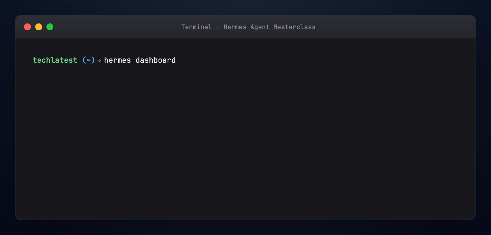

### Five configuration groups (GUI = CLI)

The builder collects the same inputs as terminal commands:

1. **Identity** — name (becomes shell alias: `coder` → `coder chat`), description, `SOUL.md`  
2. **Model and provider** — Nous Portal, OpenRouter, NVIDIA, OpenAI, custom OpenAI-compatible URL  
3. **Built-in skills** — toggles per profile  
4. **Skills Hub** — install by catalog slug  
5. **MCP servers** — stdio (`command` + `args`) or HTTP (`url` + `headers`)  

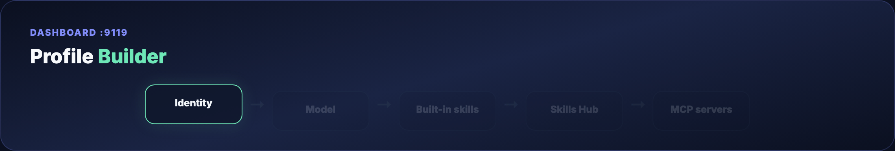

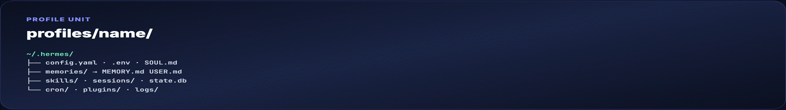

**GUI ↔ CLI parity (prose):** Name field = `hermes profile create coder`. Description = `--description` or profile describe. Model picker = `coder config set model <id>`. Skill toggles = `coder skills list`. Hub install = `coder skills install <slug>`. MCP = edit `mcp_servers` in `config.yaml` or `coder mcp install`.

Docs: [Web Dashboard](https://hermes-agent.nousresearch.com/docs/web-dashboard) · [Profiles](https://hermes-agent.nousresearch.com/docs/profiles) · [MCP](https://hermes-agent.nousresearch.com/docs/mcp)

---

## Part 12 — Build a researcher profile (CLI walkthrough)

Equivalent to completing Profile Builder for a **researcher** agent:

```bash
hermes profile create researcher \
  --description "Reads source code and external docs, writes findings."
researcher setup
researcher config set model anthropic/claude-sonnet-4
```

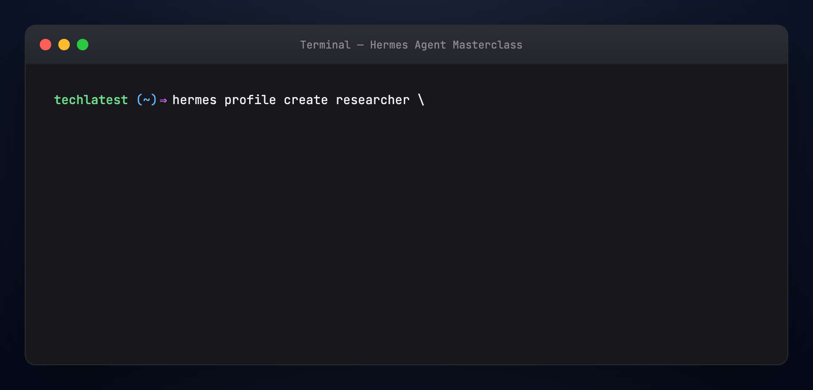

```bash
researcher skills install openai/skills/k8s
```

**MCP — filesystem (stdio)** in `config.yaml` ([full example](./examples/config-researcher.yaml)):

```yaml
mcp_servers:
  filesystem:
    command: npx
    args:
      - "-y"
      - "@modelcontextprotocol/server-filesystem"
      - "/home/user/projects"
```

**HTTP MCP** ([fragment](./examples/config-http-mcp.yaml)):

```yaml
mcp_servers:
  docs:
    url: "https://mcp.example.com/mcp"
    headers:
      Authorization: "Bearer ${DOCS_API_KEY}"
```

> `mcp_servers` is a **map keyed by server name**, not a YAML list.

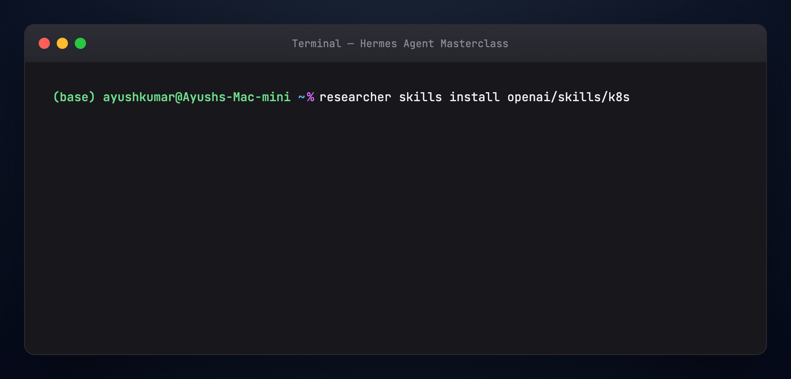

```bash
researcher chat
```

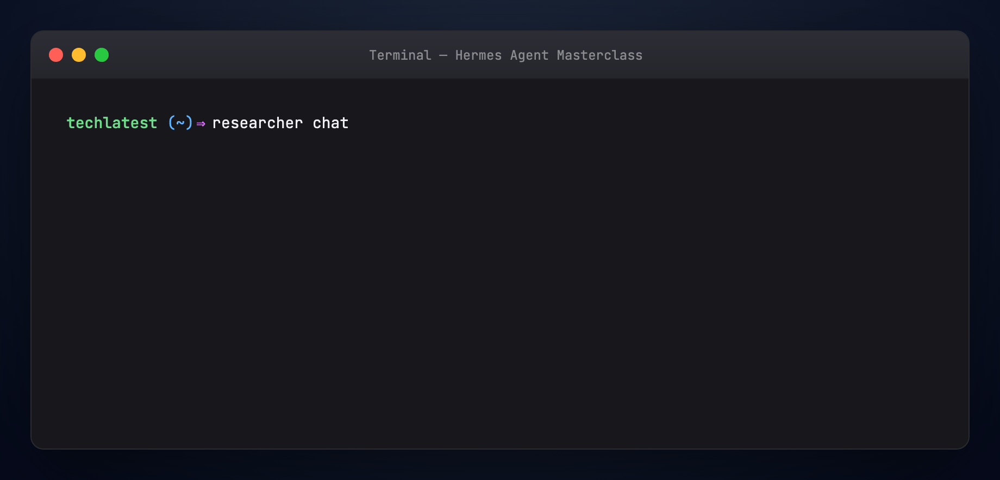

Skill/MCP changes apply on the **next session** or **gateway restart**.

---

## Part 13 — Three agents: designer, programmer, researcher

Create three isolated profiles (CLI or Profile Builder):

```bash
hermes profile create designer --clone
hermes profile create programmer --clone
hermes profile create researcher --clone
hermes profile list
```

`--clone` copies default `config.yaml` and `.env`.

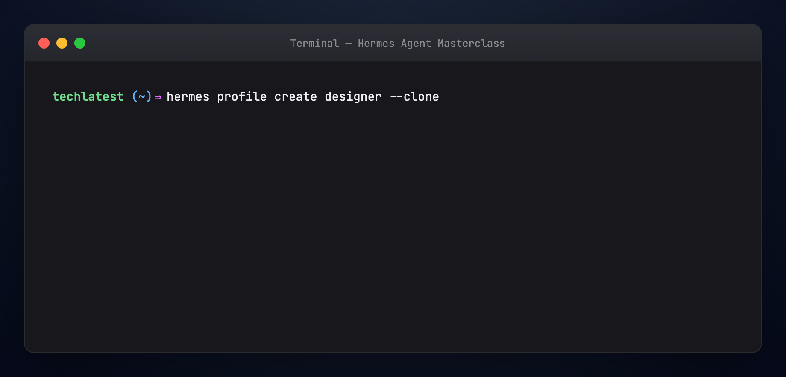

**One Telegram bot per profile** — Telegram allows one connection per token:

```bash
hermes -p designer gateway setup
hermes -p programmer gateway setup
hermes -p researcher gateway setup
```

**Use-case sketches (prose):**

- **Coder** — code-strong model, filesystem MCP scoped to one repo, git/test Hub skills  
- **Researcher** — reasoning model, doc/web skills, optional HTTP MCP; clone with `hermes profile clone` to fork  
- **Ops** — gateway + cron reports; **one bot token per profile** (token locks prevent accidental sharing)  

---

## Part 14 — SOUL.md for each agent

Copy from [examples/](./examples/):

```bash
cp examples/SOUL-designer.md ~/.hermes/profiles/designer/SOUL.md
cp examples/SOUL-programmer.md ~/.hermes/profiles/programmer/SOUL.md
cp examples/SOUL-researcher.md ~/.hermes/profiles/researcher/SOUL.md
```

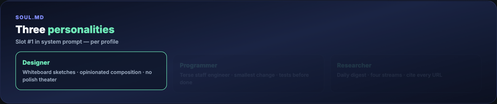

---

## Part 15 — Programmer → Claude Code

Hermes **orchestrates**; [Claude Code](../claude-code-dot-claude/TUTORIAL.md) **executes** edits, shell, and git. Works with **Claude Max** if `claude` is on PATH.

```bash
which claude
programmer chat
```

Paste once:

```text
We already have a Claude Max subscription. You are my staff engineer who
helps me with my day-to-day coding tasks, and under the hood you use
Claude Code for all the executions. Set yourself up accordingly.
```

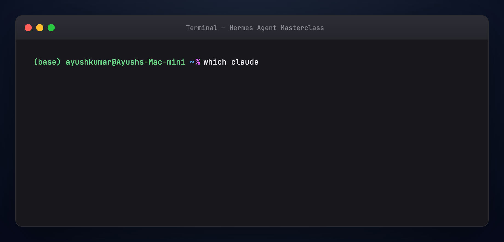

---

## Part 16 — Designer: visual style as a skill

Feed reference illustrations (CLI or Telegram), then ask the agent to create **`my-design-style`** via `skill_manage` — style fingerprint + optional OpenRouter image script (`google/gemini-2.5-flash-image`). Output: `~/.hermes/profiles/designer/skills/my-design-style/`.

Same pattern works for newsletters, threads, or any repeatable tone.

---

## Part 17 — Researcher cron digest

Gateway ticks every **60s**, runs due jobs in isolated sessions, delivers to the configured channel.

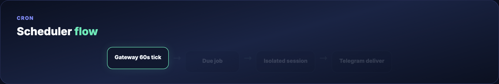

Paste into `researcher chat`:

```text
Every weekday at 8am India time, prepare a deep digest of what's new
in the AI and machine learning space over the last 24 hours. Cover
four streams: GitHub trends, lab announcements, papers, social pulse.
Cite every claim with a URL. Keep under 800 words. Deliver to Telegram.
Set this up as a recurring cron job.
```

```bash
hermes -p researcher cron list
```

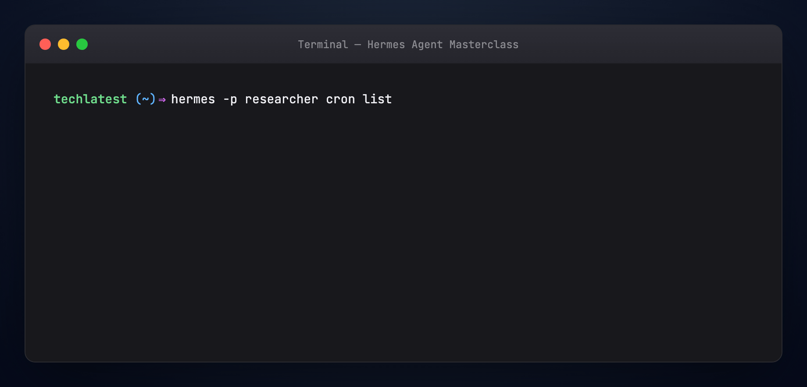

Cron variants: one-shot `/cron add 30m "..."`, interval `"every 2h"`, expression `"0 9 * * 1-5"`, attach `--skill blogwatcher`, chain with `context_from`.

---

## Part 18 — Hermes vs OpenClaw

Both are self-hosted and messaging-friendly.

**Hermes** leads with the **learning agent** — skill authoring, Curator, GEPA, MCP-heavy profiles, research tooling.

**OpenClaw** leads with the **gateway and channels** — polished Control UI, ClawHub, proactive heartbeats.

Migration: `hermes claw migrate`. Many operators pick one primary runtime and borrow skills from the other.

---

## Part 19 — Troubleshooting

**`hermes dashboard` missing** — `pip install 'hermes-agent[web]'`

**Port 9119 in use** — stop other dashboard instance

**MCP tools not showing** — restart session; check `mcp_servers` YAML map syntax

**Two profiles, one token error** — expected; use separate gateway tokens per profile

**`hermes: command not found`** — `source ~/.zshrc` or re-run installer

Docs: [Troubleshooting](https://hermes-agent.nousresearch.com/docs/)

---

## Part 20 — Verify

```bash
chmod +x guides/hermes-agent-masterclass/scripts/verify-masterclass.sh
./guides/hermes-agent-masterclass/scripts/verify-masterclass.sh
```

---

## Regenerate visuals

```bash
cd guides/hermes-agent-masterclass/assets
python3 render_terminal_gifs.py all
python3 render_diagrams.py all
python3 render_blog_poster.py
cd ../../..
./scripts/prepare-docs.sh
```

---

## Official links

- [Hermes Agent](https://github.com/NousResearch/hermes-agent) · [Docs](https://hermes-agent.nousresearch.com/docs/)  
- [Profile Builder / Web Dashboard](https://hermes-agent.nousresearch.com/docs/web-dashboard)  
- [hermes-agent-self-evolution (GEPA)](https://github.com/NousResearch/hermes-agent-self-evolution)  
- [DDDS masterclass](https://www.dailydoseofds.com/p/hermes-agent-masterclass/)  

---

## Summary

Hermes is a **learning-first agent**: `SOUL.md` frames identity; three memory tiers hold facts and history; skills evolve through `skill_manage` and the Curator; GEPA validates offline. **Profiles** isolate agents on one machine — via **Profile Builder** at `:9119` or CLI. You now have theory plus a reproducible **designer / programmer / researcher** setup with gateway, MCP, and cron.
