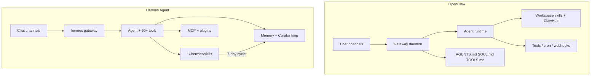
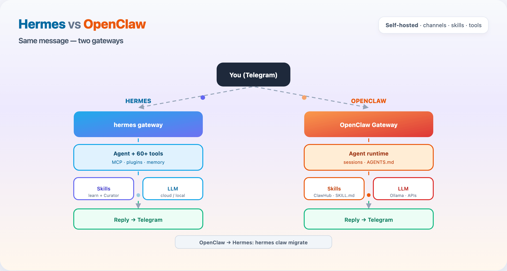

# Hermes vs OpenClaw — Which Personal Agent Should You Run?

Side-by-side comparison of **[Hermes Agent](https://github.com/NousResearch/hermes-agent)** (Nous Research) and **[OpenClaw](https://github.com/openclaw/openclaw)** — two open-source, self-hosted assistants that route chat apps to tool-using agents.

Part of the [Agentic AI Ecosystem](https://github.com/Ayush7614/agentic-ai-ecosystem).

## At a glance

| | **Hermes Agent** | **OpenClaw** |
|---|------------------|--------------|
| **Tagline** | The agent that grows with you | Your own personal AI assistant |
| **Primary runtime** | Python CLI + gateway (bash installer) | Node.js / TypeScript (`npm` global) |
| **Node requirement** | None (Python stack) | Node **22.19+** or **24** recommended |
| **Control plane** | `hermes` CLI, TUI, `hermes gateway` | `openclaw` CLI, dashboard `http://127.0.0.1:18789/` |
| **Differentiator** | Self-improving learning loop + **Curator** (v0.12+) | Channel-first gateway + **ClawHub** skills registry |
| **Skills location** | `~/.hermes/skills/<name>/SKILL.md` | `~/.openclaw/workspace/skills/<name>/SKILL.md` |
| **Workspace prompts** | Hermes profiles + memory | `AGENTS.md`, `SOUL.md`, `TOOLS.md` injected |
| **Messaging** | 18+ platforms (built-in gateway) | Discord, Telegram, WhatsApp, Slack, Signal, Teams, Matrix, iMessage, WebChat, plugins |
| **Local models** | Provider config + Ollama-compatible paths | First-class [Ollama provider](https://docs.openclaw.ai/providers/ollama) |
| **Migration** | `hermes claw migrate` (native) | — (source for Hermes migration) |
| **License** | Check upstream repo | MIT |

**Neither replaces the other outright.** OpenClaw optimizes for a polished multi-channel personal assistant on Node. Hermes optimizes for agents that **learn skills over time** and plug into a large Python-first tooling ecosystem.

## Architecture comparison



| Layer | Hermes | OpenClaw |
|-------|--------|----------|
| **Ingress** | Telegram, WhatsApp, Discord, … | Same core set + bundled channel plugins |
| **Session model** | Profiles, TUI sessions | Per-sender / per-agent isolated sessions |
| **Skill discovery** | Auto + `/skill`; agent can author new skills | Intent match on `SKILL.md`; `openclaw skills install` |
| **Automation** | `hermes cron` | Cron jobs, webhooks, Gmail Pub/Sub |
| **Sandbox** | Modal, Daytona, Vercel Sandbox, Docker image | Docker sandboxing (strongly recommended in docs) |
| **Registry** | [awesome-hermes-agent](https://github.com/0xNyk/awesome-hermes-agent) ecosystem | [ClawHub](https://clawhub.ai) |

## Animated workflow



The GIF shows the same user message flowing through each stack: **channels → gateway → agent → skills/tools → reply**.

## Quick decision matrix

| You want… | Pick |
|-----------|------|
| WhatsApp/Telegram assistant with minimal Python | **OpenClaw** — `openclaw onboard` |
| Agent that **creates and refines skills** from experience | **Hermes** — learning loop + Curator |
| **Node/TypeScript** shop, ClawHub skills, Canvas/mobile nodes | **OpenClaw** |
| **Multi-agent swarms**, ACP handoff to Codex/Claude Code | **Hermes** + [awesome-hermes-agent](https://github.com/0xNyk/awesome-hermes-agent) |
| **Gemma + local RAG** on chat (this repo's pattern) | **OpenClaw** — [openclaw-gemma-rag](../openclaw-gemma-rag/) |
| Migrate off OpenClaw without rebuilding channels | **Hermes** — `hermes claw migrate` |
| Largest single-repo assistant community (2026) | **OpenClaw** (very high GitHub traction) |
| Research-aligned stack (Nous models + tooling) | **Hermes** |

## Install both (5 minutes each)

**OpenClaw** (requires Node 22.19+):

```bash
npm install -g openclaw@latest
openclaw onboard --install-daemon
openclaw doctor
```

**Hermes**:

```bash
curl -fsSL https://hermes-agent.nousresearch.com/install.sh | bash
source ~/.zshrc   # or ~/.bashrc
hermes setup --portal
hermes doctor
```

Verify from this guide:

```bash
cd guides/hermes-vs-openclaw
chmod +x verify-comparison.sh
./verify-comparison.sh
```

## Related guides in this repo

| Guide | Role in comparison |
|-------|-------------------|
| [OpenClaw + Gemma + RAG](../openclaw-gemma-rag/) | Full OpenClaw stack with `gemma4:e2b` + RAG skill |
| [Awesome Hermes Agent](../awesome-hermes-agent/) | Hermes install + ecosystem catalog |
| [Qwen Agentic RAG](../qwen-agentic-rag/) | RAG API both assistants can call via skills/MCP |

## Full tutorial

[Read the full comparison tutorial →](TUTORIAL.md) — feature matrix, install walkthrough, skills/memory/channels deep dive, migration, security, and running both side by side.

## Links

- [Hermes Agent](https://github.com/NousResearch/hermes-agent) · [docs](https://hermes-agent.nousresearch.com/)
- [OpenClaw](https://github.com/openclaw/openclaw) · [docs](https://docs.openclaw.ai/)
- [openclaw-to-hermes](https://github.com/0xNyk/openclaw-to-hermes) (community migration helper)
