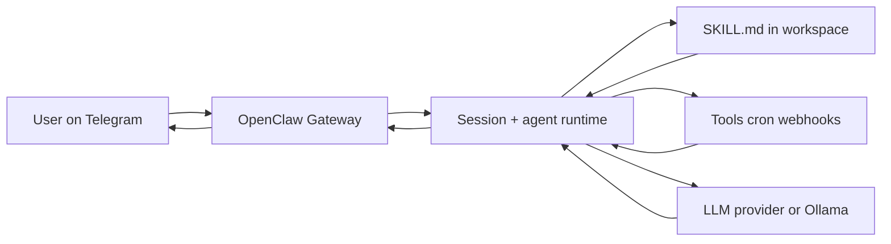
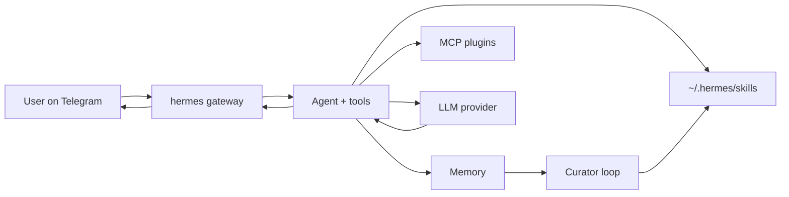
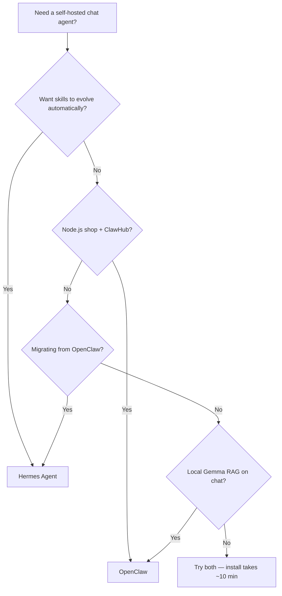

# Hermes vs OpenClaw — Full Comparison Tutorial

Walk through both stacks on your machine, compare architecture and skills, migrate from OpenClaw to Hermes if needed, and decide which runtime fits your workflow.

**Repos:** [NousResearch/hermes-agent](https://github.com/NousResearch/hermes-agent) · [openclaw/openclaw](https://github.com/openclaw/openclaw)

**Companion:** [Feature matrix](https://ayush7614.github.io/agentic-ai-ecosystem/guides/hermes-vs-openclaw/comparison/) · [OpenClaw + Gemma + RAG](https://ayush7614.github.io/agentic-ai-ecosystem/guides/openclaw-gemma-rag/) · [Awesome Hermes Agent](https://ayush7614.github.io/agentic-ai-ecosystem/guides/awesome-hermes-agent/)

---

## Part 1 — What problem do they solve?

Both projects answer: *"How do I talk to an AI agent from Telegram/WhatsApp/Discord and have it use tools on my machine?"*

They diverge on **what happens after the first week**:

| | OpenClaw | Hermes |
|---|----------|--------|
| **Product feel** | Polished personal assistant — gateway, channels, dashboard | Research-grade agent platform — tools, memory, evolution |
| **Skills** | You install or write `SKILL.md`; ClawHub registry | Agent can **author** skills; Curator maintains quality |
| **Stack** | Node.js, TypeScript, npm global | Python CLI, bash installer |
| **Sweet spot** | "Message my assistant anywhere" | "My assistant gets better at my workflows over time" |

Neither is a hosted SaaS. You run the gateway on your laptop, homelab, or VPS.

---

## Part 2 — Architecture side by side

### OpenClaw



- **Gateway** = single control plane (default `http://127.0.0.1:18789/`)
- **Workspace** = `~/.openclaw/workspace` with `AGENTS.md`, `SOUL.md`, `TOOLS.md`
- **Skills** = `~/.openclaw/workspace/skills/<name>/SKILL.md`
- **Daemon** = launchd/systemd user service after `openclaw onboard --install-daemon`

Docs: [Architecture](https://docs.openclaw.ai/concepts/architecture) · [Gateway](https://docs.openclaw.ai/gateway)

### Hermes



- **CLI + TUI** = `hermes`, `hermes --tui`
- **Gateway** = `hermes gateway` for messaging platforms
- **Skills** = procedural memory in `~/.hermes/skills/`
- **Curator** (v0.12+) = periodic grading/pruning of learned skills

Docs: [Hermes user guide](https://hermes-agent.nousresearch.com/docs/)

### Shared pattern

Both normalize inbound chat JSON → agent message → tool/skill execution → outbound reply. Both use **Markdown skills** as the extension point for custom workflows.

---

## Part 3 — Prerequisites

| Requirement | OpenClaw | Hermes |
|-------------|----------|--------|
| OS | macOS, Linux, Windows (WSL2) | macOS, Linux, WSL |
| Runtime | Node **22.19+** or **24** | Python (installer handles deps) |
| API key or local model | Yes | Yes |
| Disk | ~500MB+ for Node + workspace | ~1GB+ depending on browser tools |

Check versions:

```bash
node -v          # v22.19+ or v24 for OpenClaw
which hermes     # after Hermes install
which openclaw   # after OpenClaw install
```

OpenClaw on Node 20 fails — use [`use-node22.sh`](https://github.com/Ayush7614/agentic-ai-ecosystem/blob/main/guides/openclaw-gemma-rag/use-node22.sh) from our OpenClaw guide if needed.

---

## Part 4 — Install OpenClaw

```bash
npm install -g openclaw@latest
openclaw onboard --install-daemon
```

The onboarding wizard configures:

1. Gateway bind address and auth  
2. LLM provider (or Ollama for local models)  
3. At least one channel (Telegram is the fastest smoke test)  
4. Workspace path and bundled skills  

Verify:

```bash
openclaw doctor
openclaw status
# Dashboard (if gateway running):
# http://127.0.0.1:18789/
```

**Local model (optional):** follow the [OpenClaw + Gemma + RAG tutorial](https://ayush7614.github.io/agentic-ai-ecosystem/guides/openclaw-gemma-rag/tutorial/) to point OpenClaw at `gemma4:e2b` via Ollama.

### OpenClaw skills smoke test

```bash
openclaw skills list
openclaw skills install <skill-from-clawhub>   # example — see clawhub.ai
```

Skills load from (highest priority first):

1. `<workspace>/skills/`  
2. Project `/.agents/skills`  
3. `~/.agents/skills`  
4. `~/.openclaw/skills`  
5. Bundled skills  

See [Skills docs](https://docs.openclaw.ai/tools/skills).

---

## Part 5 — Install Hermes

```bash
curl -fsSL https://hermes-agent.nousresearch.com/install.sh | bash
source ~/.zshrc   # or ~/.bashrc
hermes setup --portal
```

`hermes setup --portal` is the fastest path to a working cloud model + tool gateway. For local-only, use `hermes model` and configure Ollama per Hermes docs.

Verify:

```bash
hermes doctor
hermes --tui
```

First TUI prompts to try:

- *"List tools you have access to"*  
- *"List skills in ~/.hermes/skills"*  
- *"What is the Curator and when does it run?"*

Full Hermes depth: [Awesome Hermes Agent tutorial](https://ayush7614.github.io/agentic-ai-ecosystem/guides/awesome-hermes-agent/tutorial/).

### Hermes gateway smoke test

```bash
hermes gateway
```

Configure channel tokens via `hermes setup` or config files. Run `hermes doctor` after any gateway change. Keep **DM pairing / allowlists** enabled until you trust exposure.

---

## Part 6 — Feature comparison (hands-on)

Use the same three prompts on both systems and compare behavior.

| Test prompt | What to observe |
|-------------|-----------------|
| *"What skills do you have?"* | OpenClaw lists workspace/ClawHub skills; Hermes lists `~/.hermes/skills` + may mention learned skills |
| *"Run a shell command: uname -a"* | Tool permission / sandbox behavior |
| *"Remember that my project codename is NEPTUNE"* | Memory persistence on next session |

Record results in a simple table:

| Test | OpenClaw | Hermes |
|------|----------|--------|
| Skill list | | |
| Shell tool | | |
| Memory | | |

Full static matrix: [feature matrix](https://ayush7614.github.io/agentic-ai-ecosystem/guides/hermes-vs-openclaw/comparison/).

---

## Part 7 — Skills: same format, different lifecycle

### OpenClaw skill anatomy

```
~/.openclaw/workspace/skills/my-skill/
├── SKILL.md          # YAML frontmatter + instructions
└── scripts/          # optional Python/shell helpers
```

Install from ClawHub:

```bash
openclaw skills install <skill-id>
openclaw skills verify <skill-id>    # trust envelope when available
```

Operator maintains skills — update via `openclaw skills update` or ClawHub sync.

### Hermes skill anatomy

```
~/.hermes/skills/my-skill/
└── SKILL.md
```

Invoke explicitly: `/skill my-skill` or let the agent auto-select.

**Learning loop:** after repeated workflows, Hermes can draft new `SKILL.md` files from session traces. **Curator** (v0.12+) reviews and prunes them on a ~7-day cycle so quality does not drift.

### Porting a skill between stacks

1. Copy the skill directory to the other runtime's skills path.  
2. Adjust tool names in `SKILL.md` (OpenClaw vs Hermes tool schemas differ).  
3. Update any script paths (`~/.openclaw` ↔ `~/.hermes`).  
4. Restart gateway / start a new session.  

Example: our [agentic-rag skill](https://github.com/Ayush7614/agentic-ai-ecosystem/blob/main/guides/openclaw-gemma-rag/skills/agentic-rag/SKILL.md) targets OpenClaw — a Hermes port would call the same LitServe RAG API with Hermes shell tool syntax.

---

## Part 8 — Channels & gateway

| Concern | OpenClaw | Hermes |
|---------|----------|--------|
| Start daemon | Installed by onboard | `hermes gateway` (or systemd per your setup) |
| Multi-channel | One gateway, many channels | One gateway, 18+ platforms |
| Config | `openclaw.json` + wizard | Hermes config under `~/.hermes/` |
| Chat commands | `/status`, `/new`, `/restart`, … | Hermes TUI + channel-specific |

**Recommendation:** enable **one channel** (Telegram) on both for comparison, then expand. Running both gateways on the same bot token will conflict — use separate bots or run one at a time.

---

## Part 9 — Models: cloud vs local

### OpenClaw + Ollama (this repo's pattern)

```bash
ollama pull gemma4:e2b
# Configure in openclaw.json — see openclaw-gemma-rag/config/
openclaw gateway restart
```

### Hermes + local model

Configure via `hermes model` or provider section in Hermes docs. Cloud APIs remain the path of least resistance for tool-heavy tasks on modest hardware.

| Workload | Suggestion |
|----------|------------|
| Phone assistant, mostly chat | Cloud model on either stack |
| Private docs, RAG, homelab | OpenClaw + [Gemma RAG guide](https://ayush7614.github.io/agentic-ai-ecosystem/guides/openclaw-gemma-rag/) |
| Heavy browser automation | Hermes with sandbox backend (Modal/Daytona) or skip browser on small VPS |

---

## Part 10 — Memory & self-improvement

| | OpenClaw | Hermes |
|---|----------|--------|
| **Session history** | Session tools (`sessions_history`, etc.) | Built-in session + TUI history |
| **Long-term memory** | Workspace files + operator-managed | Memory layer + ecosystem plugins (honcho, hindsight, plur) |
| **Automatic skill growth** | No | **Yes** — core differentiator |
| **Quality control** | Manual review, `openclaw skills verify` | **Curator** automated grading |

Choose **Hermes** when you want the agent to accumulate procedural memory. Choose **OpenClaw** when you want predictable, curator-controlled skill sets from ClawHub.

---

## Part 11 — Migrate OpenClaw → Hermes

Hermes ships a native migration path:

```bash
hermes claw migrate
```

This imports OpenClaw workspace layout, channel configuration, and compatible skills where possible.

After migration:

```bash
hermes doctor
hermes claw migrate --help   # inspect flags
# Compare cron + channel config manually
hermes gateway
```

Community fallback for older Hermes versions: [openclaw-to-hermes](https://github.com/0xNyk/openclaw-to-hermes).

**Side-by-side cutover** (recommended for production personal assistants):

1. Migrate with `hermes claw migrate`  
2. Run Hermes gateway on a **new** Telegram bot  
3. Keep OpenClaw on the old bot until Hermes passes your test checklist  
4. Switch DNS/webhooks if applicable  
5. Decommission OpenClaw daemon when satisfied  

---

## Part 12 — Security comparison

| Risk | OpenClaw mitigation | Hermes mitigation |
|------|---------------------|-------------------|
| Malicious skill | `openclaw skills verify`, review scripts | Review `SKILL.md` + scripts before enabling |
| Shell/RCE | Docker sandbox (docs strongly recommend) | Remote sandboxes, minimal VPS install (`--skip-browser`) |
| Open gateway | Local bind, auth tokens | `hermes doctor`, pairing/allowlists |
| Prompt injection via chat | Model choice, tool allowlists | Same — use strongest model available |

**Rule for both:** skills are code. Treat ClawHub and awesome-hermes-agent entries as untrusted until reviewed.

---

## Part 13 — Run both side by side (this repo)

From the repo root:

```bash
cd guides/hermes-vs-openclaw
chmod +x verify-comparison.sh
./verify-comparison.sh
```

Optional full stack:

| Terminal | Command |
|----------|---------|
| A | Start RAG API per [qwen-agentic-rag](https://ayush7614.github.io/agentic-ai-ecosystem/guides/qwen-agentic-rag/) |
| B | `openclaw gateway` (messaging assistant) |
| C | `hermes --tui` (compare tool/skill behavior) |

OpenClaw consumes RAG via the [agentic-rag skill](https://github.com/Ayush7614/agentic-ai-ecosystem/blob/main/guides/openclaw-gemma-rag/skills/agentic-rag/SKILL.md). Hermes can call the same HTTP API via a custom skill or MCP wrapper.

---

## Part 14 — Decision guide



| Profile | Pick |
|---------|------|
| Indie hacker, Telegram/WhatsApp only, loves npm | **OpenClaw** |
| ML researcher, multi-agent, Nous ecosystem | **Hermes** |
| Existing OpenClaw user, curious about learning loop | **Hermes** via `hermes claw migrate` |
| Need reproducible skill catalog, not auto-writes | **OpenClaw** + ClawHub |
| Building on this repo's RAG guides | **OpenClaw** primary; Hermes optional second runtime |

You can also run **OpenClaw for channels** and **Hermes for batch/cron evolution** against the same RAG API — they are not mutually exclusive at the API layer.

---

## Part 15 — Troubleshooting

| Symptom | OpenClaw fix | Hermes fix |
|---------|--------------|------------|
| CLI not found | `npm i -g openclaw@latest`; check `node -v` | `source ~/.zshrc`; re-run installer |
| Doctor fails | Re-run `openclaw onboard` | `hermes setup --portal` |
| Gateway won't start | `openclaw gateway restart`; check port 18789 | `hermes doctor`; check channel tokens |
| Skills missing | `openclaw skills list`; workspace path | `ls ~/.hermes/skills`; new session |
| Node too old | nvm install 22; [`use-node22.sh`](https://github.com/Ayush7614/agentic-ai-ecosystem/blob/main/guides/openclaw-gemma-rag/use-node22.sh) | N/A |
| Migration incomplete | — | `hermes claw migrate`; compare cron/channels; try [openclaw-to-hermes](https://github.com/0xNyk/openclaw-to-hermes) |
| Both fight for Telegram | Use two bot tokens | Use two bot tokens |

---

## Summary

| Dimension | Winner (typical) |
|-----------|------------------|
| Channel polish + dashboard | OpenClaw |
| Self-improving skills | Hermes |
| npm / TypeScript ecosystem | OpenClaw |
| Multi-agent + research tooling | Hermes |
| Local Gemma + RAG (this repo) | OpenClaw |
| OpenClaw → Hermes migration | Hermes (`hermes claw migrate`) |

**Next steps:**

- Deep dive OpenClaw: [openclaw-gemma-rag tutorial](https://ayush7614.github.io/agentic-ai-ecosystem/guides/openclaw-gemma-rag/tutorial/)  
- Deep dive Hermes: [awesome-hermes-agent tutorial](https://ayush7614.github.io/agentic-ai-ecosystem/guides/awesome-hermes-agent/tutorial/)  
- Feature reference: [feature matrix](https://ayush7614.github.io/agentic-ai-ecosystem/guides/hermes-vs-openclaw/comparison/)  

---

## Blog / LinkedIn angle

**Post:** short GIF of the dual-gateway workflow + 2–3 sentence verdict ("OpenClaw for channel-first assistants, Hermes when you want skills that compound").

**First comment:** links to this guide's [overview](https://ayush7614.github.io/agentic-ai-ecosystem/guides/hermes-vs-openclaw/) and [tutorial](https://ayush7614.github.io/agentic-ai-ecosystem/guides/hermes-vs-openclaw/tutorial/).
