# LLM Fine-Tuning — Full Guide

Adapt a pre-trained language model to **your task, domain, or behavior** without retraining from scratch. This guide maps the modern fine-tuning landscape — parameter-efficient methods (LoRA, QLoRA), supervised adaptation, and alignment (RLHF, DPO, GRPO) — with **original explanations**, walkthroughs, and animated visuals.

**Inspired by (references, not copies):** [Daily Dose of Data — LLMOps Part 12](https://www.dailydoseofds.com/) · [Cloud Girl — 15 fine-tuning techniques](https://priyankavergadia.substack.com/p/15-llm-fine-tuning-techniques-you)

Format matches our [OpenClaw](../openclaw/TUTORIAL.md) and [Hermes masterclass](../hermes-agent-masterclass/TUTORIAL.md) guides: **prose and lists**, terminal GIFs, diagram GIFs.

---

## What you'll understand at the end

- When **prompting and RAG** are enough — and when training pays off  
- The **five families** of adaptation (full SFT, soft prompts, PEFT, alignment, federated)  
- How **LoRA** and **QLoRA** shrink trainable parameters and VRAM  
- How **RLHF**, **DPO**, and **GRPO** shape model behavior after SFT  
- Runnable patterns with **HuggingFace PEFT + TRL**

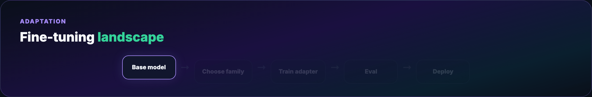

**One-GIF overview (blog hero):** [mega-finetune-everything.gif](./assets/mega-finetune-everything.gif) — ladder → families → LoRA → QLoRA → alignment → deploy (~12s).

---

## Introduction — adaptation is a ladder, not a switch

A foundation model predicts text. It was not hired for your job — it was trained to continue sequences on the internet. Fine-tuning is **onboarding**: show it examples of the outputs you want until the distribution shifts.

That sounds simple. In practice, “fine-tuning” spans:

- Updating **all** weights on domain text (continued pre-training)  
- Teaching **instruction-following** on curated `(prompt, response)` pairs (SFT)  
- Injecting **tiny adapter matrices** while freezing the base (LoRA / QLoRA)  
- Optimizing **preferences** so answers match human judgment (DPO, RLHF)  
- Training **without centralizing raw data** (federated fine-tuning)

Pick the wrong rung and you either burn GPU budget or ship a model that forgets general knowledge. Pick the right one and a **1B adapter** can beat a **70B prompt** on a narrow task.

---

## Part 1 — The adaptation ladder

Before any training job, walk this ladder top to bottom:

1. **Better prompts** — system message, few-shot examples, output schema in the prompt  
2. **RAG** — retrieve domain docs at inference; no weight updates  
3. **Tool use** — calculator, SQL, APIs; model orchestrates, doesn't memorize  
4. **Fine-tune** — when behavior must be **native**, **fast**, or **offline**  
5. **Align** — when “correct format” isn't enough; you need **preferred** behavior  

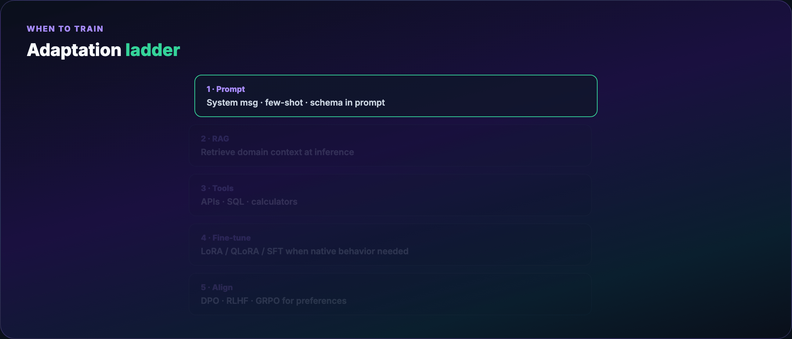

**Fine-tune when:**

- You need a **fixed output format** (JSON, legal clause structure) without fragile prompt hacks  
- Latency/cost requires a **smaller specialist** that beats a larger general model on your metric  
- Data is **proprietary** and cannot leave your environment (local QLoRA)  
- Prompt + RAG plateau on your eval set after serious iteration  

**Skip fine-tune when:**

- Fresh knowledge is the bottleneck — **RAG** or periodic re-indexing fixes that  
- You're still exploring product fit — eval harness isn't stable yet  
- A new base model drops monthly and you can't afford **re-training debt**

---

## Part 2 — Why fine-tune (and why not)

### Reasons teams fine-tune

**Domain fluency.** Medical billing codes, legacy COBOL, internal ticket taxonomy — bases saw little of this during pre-training. A few thousand in-domain examples often move accuracy more than clever prompts.

**Format reliability.** “Return valid JSON with keys `summary`, `risk_score`” works in prompts until it doesn't. SFT bakes the schema into the prior.

**Instruction following.** Chat-tuned models are themselves fine-tuned products. Base checkpoints (`Llama-3.2-base`) need SFT before they're pleasant to talk to.

**Safety and tone.** Curated datasets can suppress toxic patterns or enforce brand voice — with the caveat that narrow tuning can **hurt** unrelated capabilities.

**Efficiency.** A 3B LoRA specialist on your support macros can beat GPT-4-class models on that slice at 1/100th inference cost — if your eval proves it.

### Reasons to pause

**Catastrophic forgetting.** Heavy SFT on one task degrades others. Mitigations: LoRA (frozen base), multi-task mixes, lower learning rate, shorter training.

**Data tax.** Quality beats quantity. Bad labels teach bad habits faster than good labels teach good ones.

**Compute and ops.** Even QLoRA needs GPUs, experiment tracking, regression evals, and a plan when the base model updates.

**Maintenance loop.** Your fine-tune is a fork. New bases (Qwen 3, Llama 4, Gemma 4) may obsolete it — budget for **re-runs**.

---

## Part 3 — The five families of fine-tuning

Think of the field as a **toolbox**, not one technique. Most production stacks combine families: SFT with LoRA, then DPO on preferences.


### Family A — Foundational adaptation

Update many or all weights on new tokens.

- **Full fine-tuning** — every parameter trains; highest VRAM, highest forgetting risk  
- **Continued pre-training (CPT)** — more raw domain text before instruction tuning  
- **Instruction SFT** — `(instruction, response)` pairs; standard path to chat models  

Use when you have **budget**, **clean data at scale**, and need deep domain rewiring.

### Family B — Soft prompting

Keep weights frozen; learn **continuous prompt vectors** prepended to activations.

- **Prompt tuning** — learn embeddings at input layer only  
- **Prefix tuning / P-tuning** — virtual tokens across layers  
- **P-tuning v2** — deeper prefix injection  

Tiny storage (kilobytes), zero merge step, but often **weaker** than LoRA on hard tasks. Good for multi-tenant “personalities” with strict memory caps.

### Family C — Parameter-efficient fine-tuning (PEFT)

Freeze the base; train **small structural patches**.

- **LoRA** — low-rank deltas on attention/MLP projections (default choice)  
- **QLoRA** — LoRA + 4-bit frozen base (consumer-GPU friendly)  
- **AdaLoRA** — adaptive rank budget across layers  
- **DoRA** — magnitude + direction decomposition of updates  
- **IA³** — learned scalers on activations (very few params)  
- **Adapters** — bottleneck FFN modules inserted per layer  

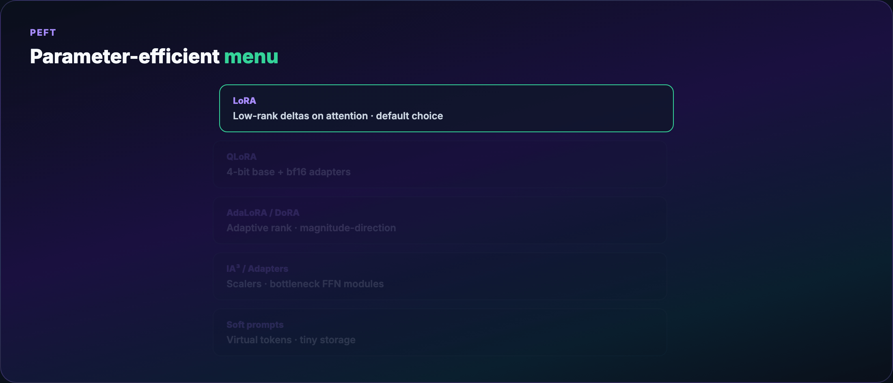

### Family D — Alignment

After SFT, models may still be **verbose, sycophantic, or unsafe**. Alignment methods optimize **preferences**.

- **RLHF** — reward model + reinforcement learning (PPO)  
- **DPO** — direct preference optimization; no separate RM at train time  
- **ORPO / KTO / SimPO** — variants reducing reference models or simplifying data  
- **GRPO** — group-relative policy optimization; popular in reasoning RL (DeepSeek-R1 line)  

### Family E — Federated & privacy-preserving

Train adapters on-device or per-tenant; aggregate updates without pooling raw text. Useful for healthcare, finance, and keyboard-personalization — higher engineering complexity, different threat model.

---

## Part 4 — LoRA in depth

**Low-Rank Adaptation** assumes weight **changes** during fine-tuning live in a low-dimensional subspace. Instead of updating a full matrix \(W \in \mathbb{R}^{d \times d}\), learn:

\[
W' = W + \frac{\alpha}{r} \cdot BA
\]

where \(B \in \mathbb{R}^{d \times r}\), \(A \in \mathbb{R}^{r \times d}\), and rank \(r \ll d\) (often 8–64).

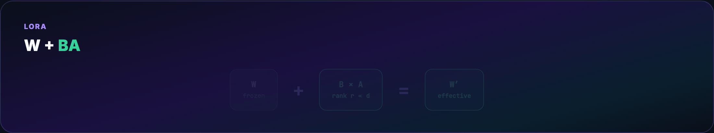

### Why it works

Large models are **over-parameterized**. Empirically, task-specific movement in weight space is low-rank. LoRA trains only \(A\) and \(B\); \(W\) stays frozen — preserving pre-trained knowledge and slashing optimizer memory.

**Example (4096×4096 projection, r=8):**

- Full update: ~16.8M trainable params per matrix  
- LoRA: \((4096 \times 8) \times 2 \approx 65\)K — **~0.4%**  

Across all targeted layers, total trainable params are often **0.1–1%** of the base.

### Hyperparameters

| Knob | Role |
|------|------|
| `r` | Rank — higher = more capacity, more VRAM |
| `lora_alpha` | Scales the adapter; common pattern `alpha = 2r` |
| `target_modules` | Which layers get adapters — `q_proj`, `v_proj` common; add `k_proj`, `o_proj`, MLP for harder tasks |
| `lora_dropout` | Regularization on adapter path |

### Initialization

\(B\) starts at zero so \(BA = 0\) at step zero — the model begins identical to the base. Gradients flow only through adapters.

### Inference options

**Merge:** compute \(W' = W + \frac{\alpha}{r} BA\) once; deploy like a normal checkpoint — zero runtime overhead.

**Hot-swap:** keep base + multiple small adapter files; load per tenant/task — one 7B base, dozens of 50MB LoRAs.

### Where to apply LoRA

Transformers repeat attention + MLP blocks. Most recipes target **attention projections** first; add MLP (`gate_proj`, `up_proj`, `down_proj`) when task needs factual recall or style depth.

LoRA tends to need **fewer examples** than full fine-tuning because the base prior stays intact.

---

## Part 5 — Quantization and QLoRA

LoRA reduces **trainable** params. Quantization reduces **stored** precision.

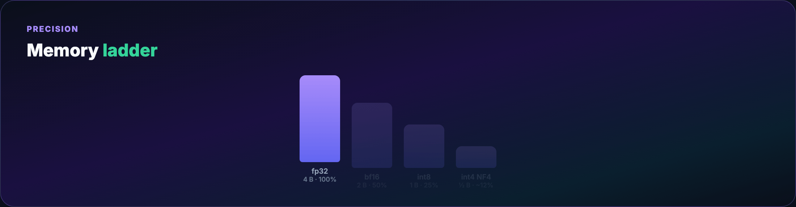

### Quantization basics

- **fp32** — training reference; 4 bytes/weight  
- **bf16/fp16** — standard mixed-precision training; 2 bytes/weight  
- **int8 / int4** — inference (and QLoRA storage); 1 or 0.5 bytes/weight  

Fewer bits → rounding error. Inference often tolerates 4-bit with minimal quality loss; **training** in 4-bit directly is unstable.

### QLoRA recipe

1. Load base weights in **4-bit NF4** (NormalFloat 4-bit — levels tuned for Gaussian weight distributions)  
2. Keep **LoRA adapters in bf16/fp16**  
3. Forward pass: dequantize 4-bit → compute in higher precision → discard  
4. Backward: gradients update **adapters only**  

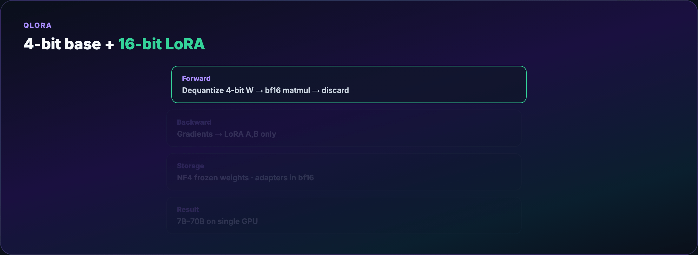

**Trade-off:** dequantization adds wall-clock time. The alternative on a 24GB card is often **no training at all**.

QLoRA democratized 7B–70B adaptation on **single high-end GPUs** and cloud spot instances.

### Inference quantization

Serving in 4-bit/8-bit (GPTQ, AWQ, bitsandbytes) cuts memory and raises throughput. Common pattern: **train QLoRA → merge → quantize for deploy**, or serve base + adapter with vLLM/llama.cpp.

---

## Part 6 — Supervised fine-tuning workflow

A practical SFT pipeline:

1. **Define eval first** — holdout prompts + automatic metrics (exact match, JSON schema, LLM-judge)  
2. **Curate data** — dedupe, filter toxicity, balance task types  
3. **Choose base** — instruct checkpoint if you want chat; base + SFT if you need full control  
4. **Pick method** — LoRA default; QLoRA if VRAM-bound  
5. **Train** — watch loss **and** eval; early-stop on eval regression  
6. **Merge or serve adapter** — A/B against prompt-only baseline  
7. **Regression suite** — general knowledge probes to catch forgetting  

See [examples/lora_train.py](./examples/lora_train.py) for a minimal HuggingFace Trainer + PEFT script.


---

## Part 7 — Alignment after SFT

SFT teaches **what to say**. Alignment teaches **what we'd prefer** among valid answers — shorter, safer, more honest, better reasoning.

---

## Part 8 — RLHF (classic three-stage)

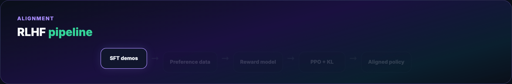

**Stage 1 — SFT.** Human-written demonstrations: `(prompt, ideal_response)`.

**Stage 2 — Reward model (RM).** Train a classifier on **preference pairs** `(prompt, chosen, rejected)`. The RM scores how good a completion is.

**Stage 3 — RL fine-tune.** Policy model generates completions; PPO (or similar) maximizes RM score with a **KL penalty** to the SFT model so it doesn't drift into gibberish.

**Strengths:** flexible reward shaping, long-horizon optimization.

**Costs:** brittle training, RM hacking, heavy infra (separate RM, rollout generation, multiple models in memory).

---

## Part 9 — DPO and preference learning

**Direct Preference Optimization** skips the explicit RM and PPO loop. Given pairs `(x, y_w, y_l)` — prompt, winner, loser — DPO updates the policy so it increases likelihood of winners vs losers relative to a **frozen reference** model.


**Why teams like it:** one training loop, stable-ish, works with LoRA, fits HuggingFace TRL.

**Beta (`β`):** controls how far you drift from the reference — higher = stay closer to SFT.

Related: **ORPO** (odds ratio), **KTO** (binary good/bad without strict pairs), **SimPO** (simplified preference objective).

Example: [examples/dpo_train.py](./examples/dpo_train.py)

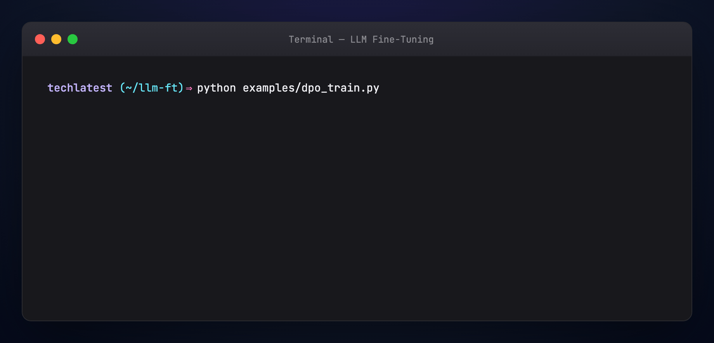

---

## Part 10 — GRPO (group-relative optimization)

**GRPO** samples **multiple completions per prompt**, scores them (rule-based verifier, unit tests, RM, or outcome check), and updates the policy using **relative rankings within the group** — no per-token value network like classic PPO.

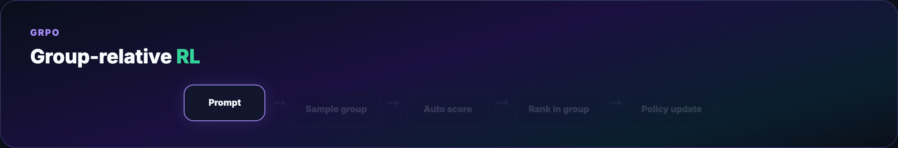

Popular for **math, code, and reasoning** RL where you can automatically verify answers. DeepSeek-R1-style training brought GRPO into mainstream conversation.

**When to consider GRPO:** you have cheap automatic scoring and want exploration beyond static preference datasets.

---

## Part 11 — Hands-on: install stack

```bash
pip install "transformers>=4.44" peft accelerate datasets bitsandbytes trl
# CUDA machine for QLoRA; MPS/CPU can run small LoRA demos slowly
```

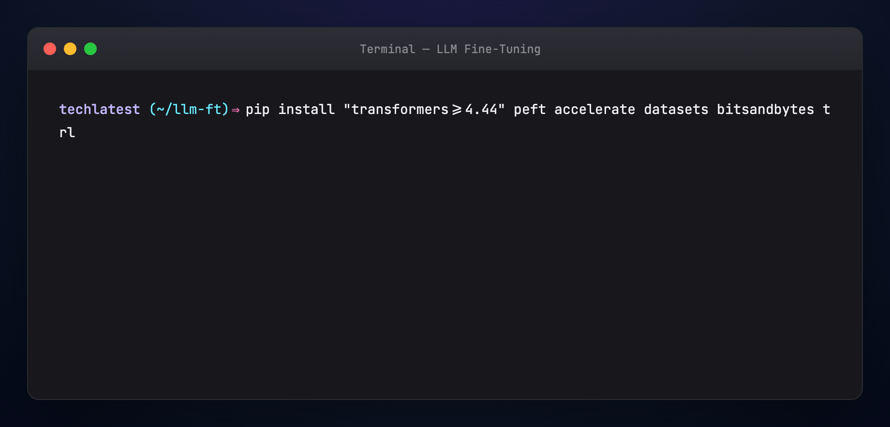

---

## Part 12 — Hands-on: LoRA SFT

```bash
python examples/lora_train.py
# inspect trainable params ~0.x% of base
```

Key lines: `LoraConfig(r=16, lora_alpha=32, target_modules=[...])`, `get_peft_model`, standard `Trainer`.

After training:

```bash
python - <<'PY'
from peft import PeftModel
from transformers import AutoModelForCausalLM, AutoTokenizer
base = "meta-llama/Llama-3.2-1B-Instruct"
model = AutoModelForCausalLM.from_pretrained(base, device_map="auto")
model = PeftModel.from_pretrained(model, "./lora-out/adapter")
model = model.merge_and_unload()
model.save_pretrained("./merged-model")
PY
```

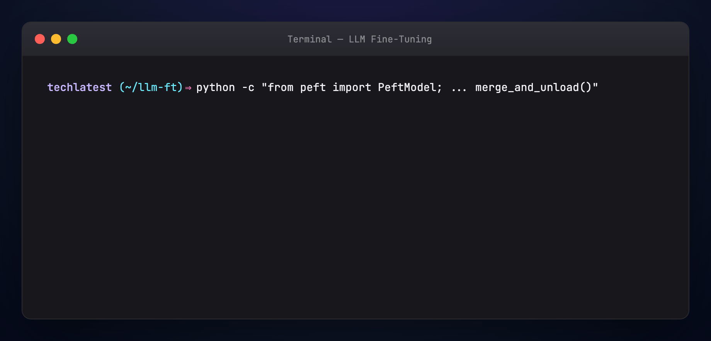

---

## Part 13 — Hands-on: QLoRA via TRL CLI

```bash
chmod +x examples/qlora_train.sh
./examples/qlora_train.sh
```

Uses `--load_in_4bit`, `--bnb_4bit_quant_type nf4`, `--use_peft`. Tune `gradient_accumulation_steps` to fit VRAM.

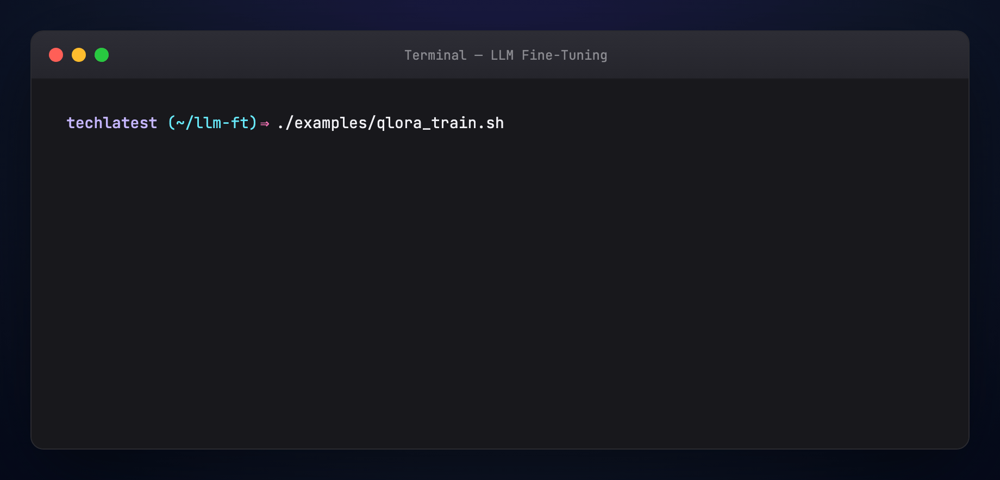

---

## Part 14 — Model merging and multi-adapter serving

**Merge LoRA into base** for simplest deployment.

**Model merging (SLERP / TIES / DARE)** — combine multiple fine-tunes into one checkpoint for blended capabilities; experimental, can produce unpredictable blends — always eval.

**Multi-LoRA serving** — vLLM and friends load one base + swap adapters per request — great for multi-tenant SaaS.

---

## Part 15 — Choosing a technique (decision guide)

**Start with prompts + eval.** No training until metrics plateau.

**Need domain + format, have 1–10K examples, one GPU:** **QLoRA** SFT.

**Need chat behavior on base model:** **LoRA SFT** on instruct data.

**Model is helpful but rambling / unsafe / off-brand:** **DPO** on preference data (often 10K–100K pairs).

**Need reasoning with verifiable rewards:** explore **GRPO** / RL with automated graders.

**Can't move data off device:** **federated LoRA** or on-prem QLoRA.

**Many tenants, tiny footprints:** **soft prompts** or **per-tenant LoRA files**.

---

## Part 16 — Evaluation and LLMOps hooks

Fine-tuning without eval is gambling. Borrow from LLMOps Part 11 patterns:

- **Holdout prompts** from production logs (redacted)  
- **Schema validators** for JSON/XML outputs  
- **LLM-as-judge** with human-labeled calibration set  
- **Regression probes** — MMLU slice, general instruction following  
- **Trace tooling** (Langfuse, W&B) — link training runs to online metrics  

Retrain when: base model leapfrogs you, data drift shifts intent, or safety incidents trace to model not prompt.

---

## Part 17 — Troubleshooting

**Loss down, eval flat** — data mislabeled, train/eval mismatch, or rank too low.

**Model forgot general skills** — lower LR, fewer epochs, LoRA instead of full FT, mix general examples.

**OOM on QLoRA** — reduce seq length, increase grad accumulation, lower rank, try 8-bit base.

**DPO collapse / repetitive text** — lower beta, check preference label noise, shorten responses in data.

**Merged model worse than adapter** — merge in fp32; verify `lora_alpha` and target modules match training.

---

## Regenerate visuals

```bash
cd guides/llm-fine-tuning/assets
python3 render_mega_gif.py
python3 render_diagrams.py all
python3 render_terminal_gifs.py all
python3 render_blog_poster.py
cd ../../..
./scripts/prepare-docs.sh
```

---

## Further reading

- [LoRA paper](https://arxiv.org/abs/2106.09685) · [QLoRA paper](https://arxiv.org/abs/2305.14314)  
- [DPO paper](https://arxiv.org/abs/2305.18290)  
- [HuggingFace PEFT](https://huggingface.co/docs/peft) · [TRL](https://huggingface.co/docs/trl)  
- [Daily Dose of Data — LLMOps series](https://www.dailydoseofds.com/)  
- [Cloud Girl — fine-tuning techniques overview](https://priyankavergadia.substack.com/p/15-llm-fine-tuning-techniques-you)

---

## Summary

Fine-tuning is not one lever — it's a **family of levers**. **LoRA/QLoRA** make adaptation cheap enough to try; **SFT** teaches tasks and formats; **DPO/RLHF/GRPO** align behavior to human or automatic preferences. Climb the adaptation ladder before you train, eval before and after, and treat every checkpoint as a product with a maintenance story.
