# Loop Engineering — Full Visual Guide

Design AI systems that **act, observe, and repeat** until a goal is met — not one-shot prompts with you as the checkpoint between every step.

**References (original guide, not copies):** [Cloud Girl — Loop Engineering](https://priyankavergadia.substack.com/) · [MindStudio — Loop Engineering for coding agents](https://www.mindstudio.ai/blog/loop-engineering)

Format matches our [LLM Fine-Tuning](../llm-fine-tuning/TUTORIAL.md) and [OpenClaw](../openclaw/TUTORIAL.md) guides: prose, lists, **animated diagram + terminal GIFs**.

---

## What you'll understand at the end

- Why **manual prompt-review cycles** hit a ceiling before model quality does  
- What a **single-agent loop** is — and when you need a **fleet**  
- **Open vs closed loops** — exploration vs production budgets  
- The **five parts** of a well-engineered loop (goal, tools, context, termination, errors)  
- Common **patterns**: retry, plan-execute-verify, explore-narrow, human-in-the-loop  
- How frameworks (LangGraph, Swarm, Hermes, OpenClaw) map to loop infrastructure  

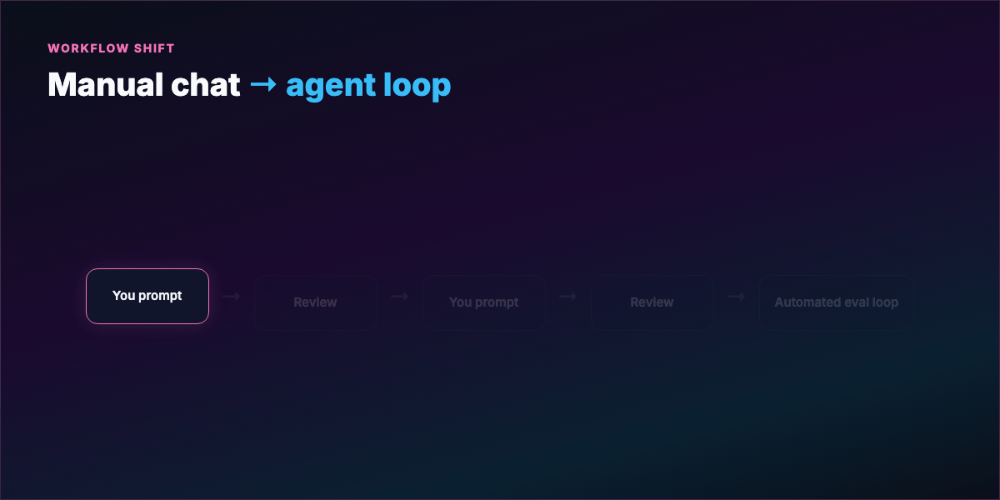

**One-GIF overview (blog hero):** [mega-loop-everything.gif](./assets/mega-loop-everything.gif) — manual chat → ReAct → eval gate → five parts → open/closed → patterns (~12s).

---

## Introduction — you were the loop

For years the default workflow was identical whether you were drafting email or refactoring a repo:

1. Open chat  
2. Type a request  
3. Review output  
4. Type the next request  

**You** were the revision cycle. That made sense when models were unreliable — a human gate at every step stopped errors from compounding.

Models improved. The workflow didn't. **Loop engineering** automates the checkpoint: you define the goal and the pass/fail standard; the agent runs **research → produce → evaluate → fix → repeat** until the bar clears or a stop rule fires.

This is the architecture behind serious coding agents (Claude Code, Codex-style agents, Hermes ReAct runtime) and production agentic workflows.

---

## Part 1 — The one-task problem

Every time you prompt for the next micro-step, you decide things the agent should decide:

- Where to look in the codebase  
- Whether the draft is good enough  
- What still needs work  

That's hiring a writer and approving every paragraph. You get output — but you're **running the operation**, not delegating it.

The fix isn't necessarily a bigger model. It's **rewiring the control flow** from linear chat to a **goal-driven loop**.

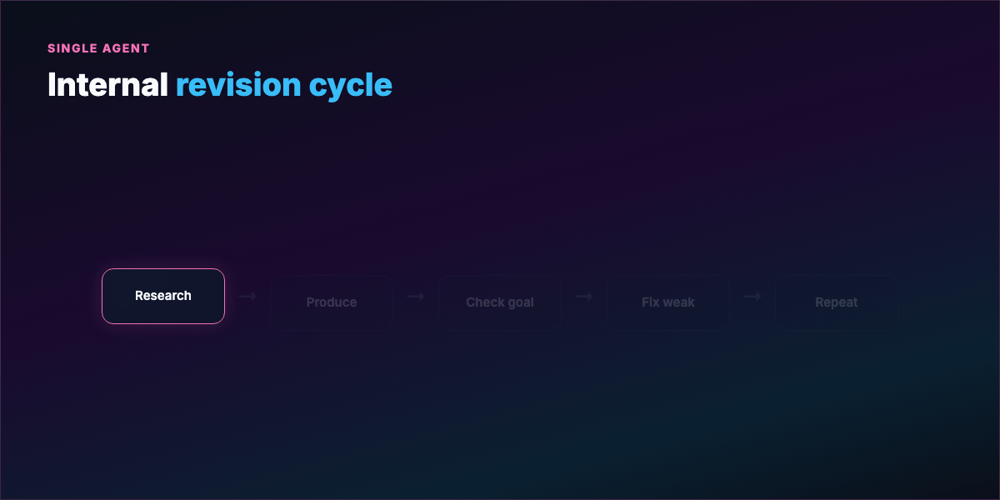

---

## Part 2 — What a loop actually is

A loop is a repeating cycle:

1. **Act** — tool call, code write, search, shell command  
2. **Observe** — stdout, test results, linter, API response  
3. **Reason** — what failed, what to try next  
4. **Repeat** until **termination**  

This traces to **ReAct** (Reason + Act): interleave thinking with environment feedback instead of guessing once and stopping.

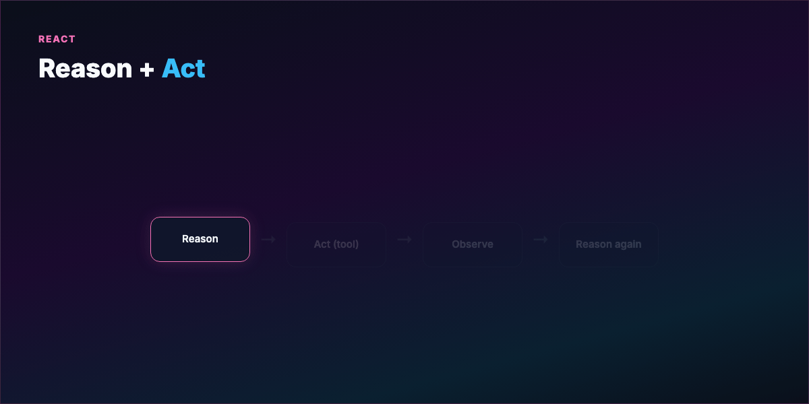

**Analogy:** A writer revising their own manuscript — draft, read with fresh eyes, mark weak sections, fix, read again — **without** asking the editor after every sentence. You hand over the **revision cycle**, not just the first draft.

---

## Part 3 — What makes or breaks the loop

Almost none of the engineering is "pick a smarter model." Two design choices dominate:

**Evaluation gate** — What counts as passing? Vague ("looks good") → infinite loops or arbitrary stops. Concrete ("all pytest green + ruff clean") → auditable exits.

**Stopping condition** — Success, max iterations, no-progress streak, escalation to human.

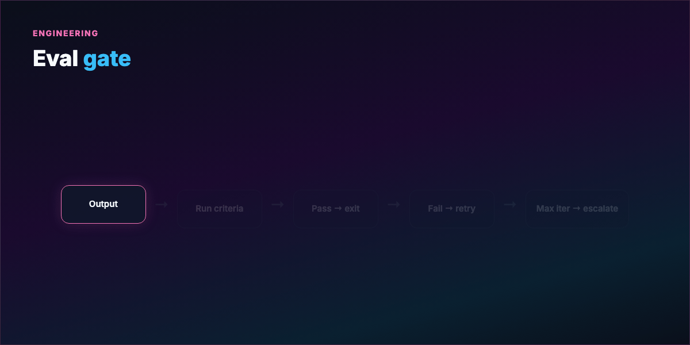

See [examples/eval-gate.yaml](./examples/eval-gate.yaml) for a harness template.

---

## Part 4 — When one agent isn't enough

A single looping agent handles **bounded** tasks well. Real projects mix cognitive modes:

- Research vs planning vs execution vs review  
- Long context → **lost-in-the-middle** — front and back of window get more attention  

Forcing one agent to be researcher, planner, implementer, and reviewer is like asking your best writer to fact-check every claim, copy-edit, and run the press.

**Fleet looping:** an **orchestrator** owns the goal, decomposes work, assigns **specialists**, each running their own sub-loop. Subagents handle narrow slices. **Eval gates at every layer** stop bad work from propagating.

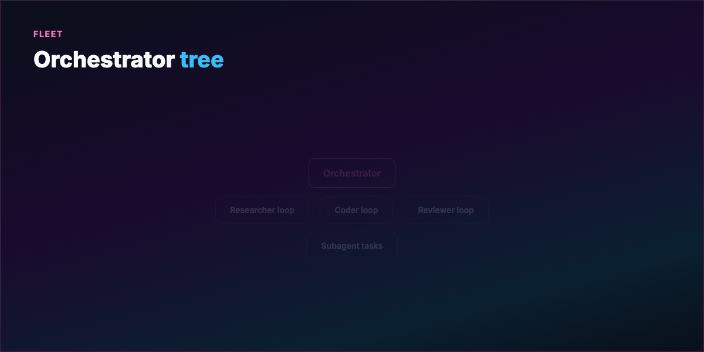

Cross-link: [Hermes masterclass](../hermes-agent-masterclass/TUTORIAL.md) (ReAct + 90-turn cap) · [OpenClaw](../openclaw/TUTORIAL.md) (gateway + multi-agent sessions).

---

## Part 5 — Open loops vs closed loops

**Open looping** — wide operational space, vague path, room to explore. Can discover solutions you didn't spec. On a research budget, exciting.

**Costs:** reasoning chains that go nowhere, context bloat, compounding API bills. Loose requirements → **slop at scale** — output that looks finished but misses the bar.

**Closed looping** — human architect defines path **before** execution: clear goal, defined steps, eval gate per step, explicit stop. Agents still loop — **inside your frame**.

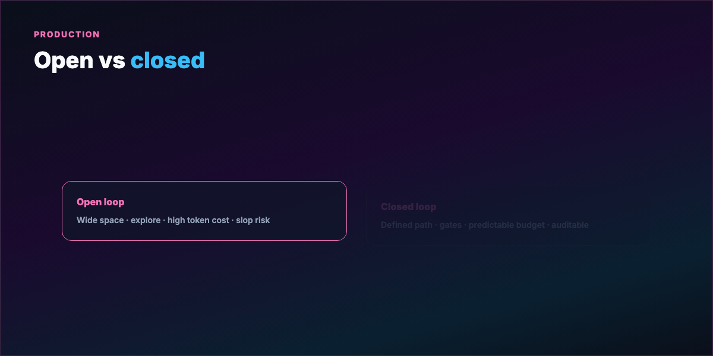

**Failure contrast:**

- **Open loop fails** → keeps going, burns tokens, plausible wrong output  
- **Closed loop fails** → **stops at gate**, trace shows where, fix eval and rerun  

Production default: **closed first**. Expand operational space once the gated loop works.

---

## Part 6 — Five parts of a well-engineered loop

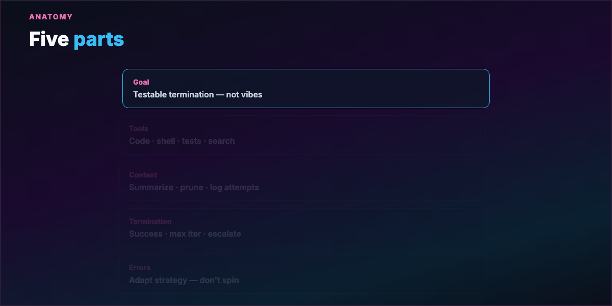

**1. Clear goal** — Specific enough to evaluate. "All unit tests pass" not "make the app better."

**2. Tool set** — Loop quality = ability to **touch reality**: run code, read/write files, shell, tests, search docs. No tools → guessing loop.

**3. Context management** — Each iteration adds tokens. Summarize history, log attempts, prune noise before the next turn.

**4. Termination logic** — Success conditions, failure exits (max iters, repeated same error), escalation paths.

**5. Error handling** — Recoverable vs hard blockers; **change strategy** after repeated failure — not identical retries.

---

## Part 7 — Common loop patterns

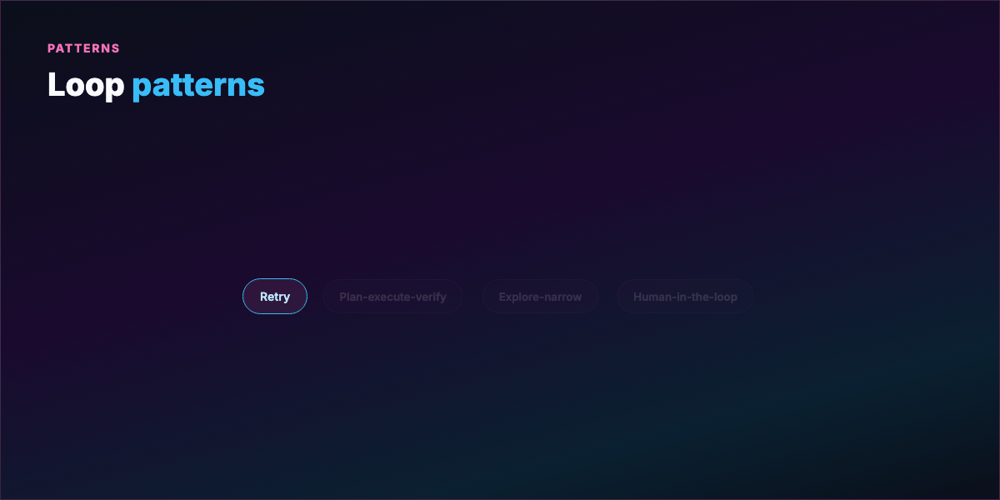

**Retry loop** — Try → check pass/fail → retry. Best for atomic tasks with clear criteria (one function + one test).

**Plan-execute-verify** — Plan steps, execute one, verify before next. Refactors, multi-file features. Must **revise plan** when step 2 invalidates step 5.

**Explore-narrow** — Try multiple approaches, score intermediates, commit to best path. Debugging unknown errors. Watch context explosion — prune early.

**Human-in-the-loop** — Pause on ambiguity or high-risk action; resume after approval. Production deploys, irreversible ops. Too many interrupts → you're the loop again.

---

## Part 8 — Frameworks and what they solve

Building loops from scratch is tedious. Frameworks differ in **state, failure recovery, and debugging** — not just syntax.

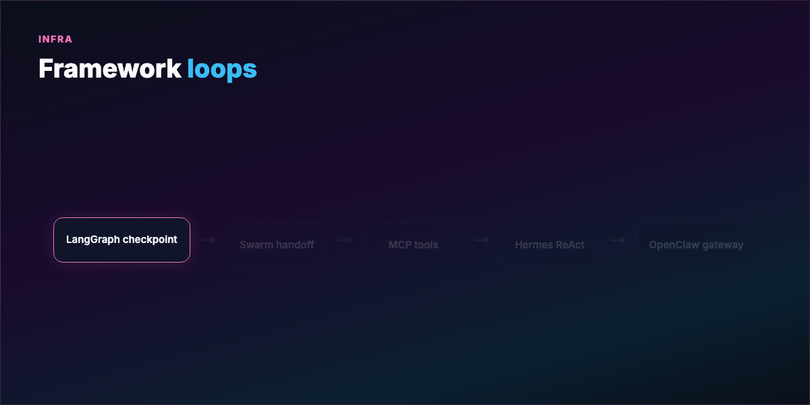

**LangGraph** — Loop as **stateful graph**; checkpoint after each node; resume mid-crash without losing context. Long-running fleets.

**OpenAI Swarm** — **Stateless handoffs**; full context passed explicitly each hop. Clean debugging, assembly-line workflows.

**Microsoft Agent Framework** — Async message passing; parallel branches; separate harness vs production loops with human review gates.

**Anthropic / MCP** — Standard tool discovery; orchestrator attaches capabilities without per-integration glue; interrupt before dangerous ops.

**Hermes Agent** — Synchronous ReAct core, skill learning, gateway + cron for proactive loops. See [masterclass](../hermes-agent-masterclass/TUTORIAL.md).

**OpenClaw** — Channel-first gateway, isolated agent sessions, skills + heartbeat. See [masterclass](../openclaw/TUTORIAL.md).

Pick by **failure modes your team can tolerate**, not benchmark hype.

---

## Part 9 — Context and token hygiene

Each iteration appends: patches, stack traces, decisions. Unbounded history → token limits and **forgotten early attempts**.

Practices:

- **Structured feedback** — relevant code snippet + intent + "same error as iter 3?" flag  
- **Rolling summary** — "Fix A failed (TypeError), Fix B partial, tests fail line 47"  
- **Tool call budgets** — max calls per iteration; budget exhaustion = failure signal  
- **Summarize every N iterations** — compress log, keep last K errors  

---

## Part 10 — Hands-on: minimal closed loop

```bash
cd guides/loop-engineering
python examples/minimal_closed_loop.py
```

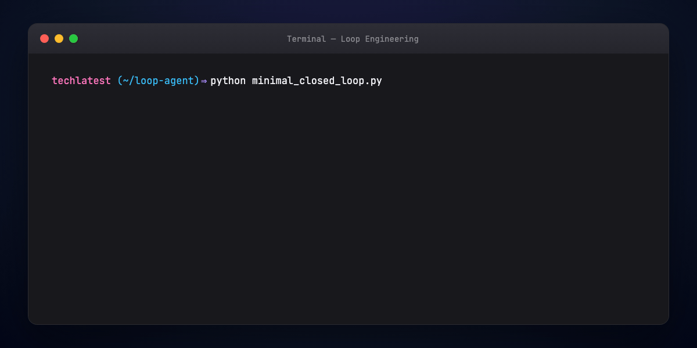

The script loops: propose patch → run eval → exit on success or escalate after `MAX_ITER`.

Wire real `run_tests()` to pytest; replace `agent_step()` with your LLM + tool calls.

---

## Part 11 — Hands-on: eval gate config

Copy [eval-gate.yaml](./examples/eval-gate.yaml) into your harness:

- **success** — measurable metrics (exit codes, counts)  
- **failure** — max iterations + no-progress streak  
- **escalation** — human review payload  
- **context** — summarize cadence  

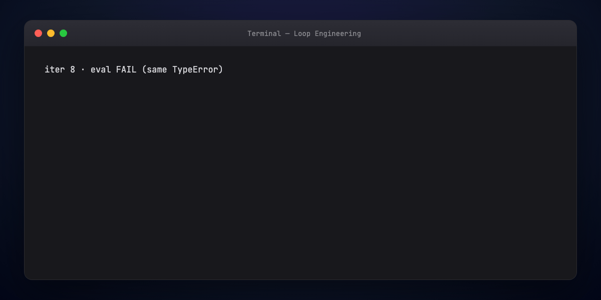

---

## Part 12 — Multi-agent loop sketch

Orchestrator pseudoflow:

```text
goal → decompose → for each subtask:
         assign specialist → specialist loops until sub-eval passes
       → integrator merges → global eval → done or rework branch
```

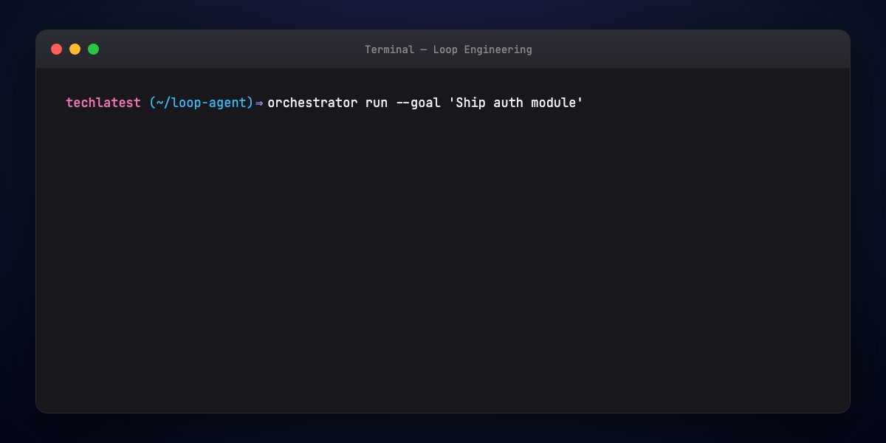

Start **single closed loop** first. Add fleet when you hit context ceiling or role confusion.

---

## Part 13 — Where to start

Build a loop when:

- Same work type repeats and quality should **compound**  
- Success is **verifiable**, not vibes  
- You spend time driving steps the agent could navigate  

**Don't** loop everything — one-shot summarization doesn't need ten iterations.

**Starter recipe:**

1. Write termination condition on paper  
2. Wire one eval gate (tests or schema validator)  
3. Single agent, max 8–10 iterations  
4. Log every iter; summarize history  
5. Test **failure cases** before happy path  

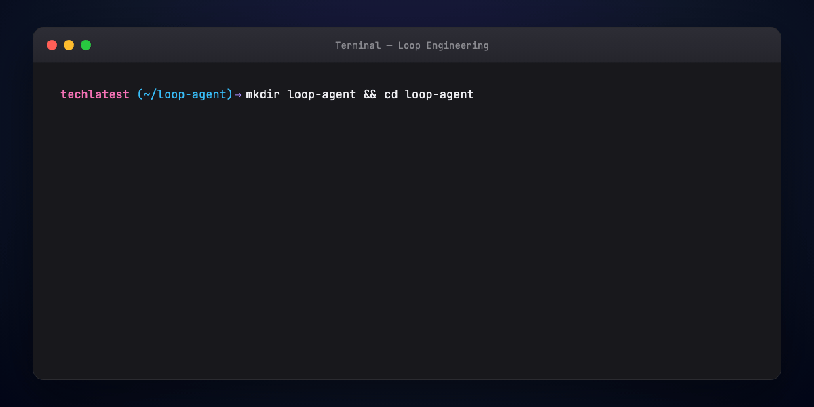

---

## Part 14 — Failure modes checklist

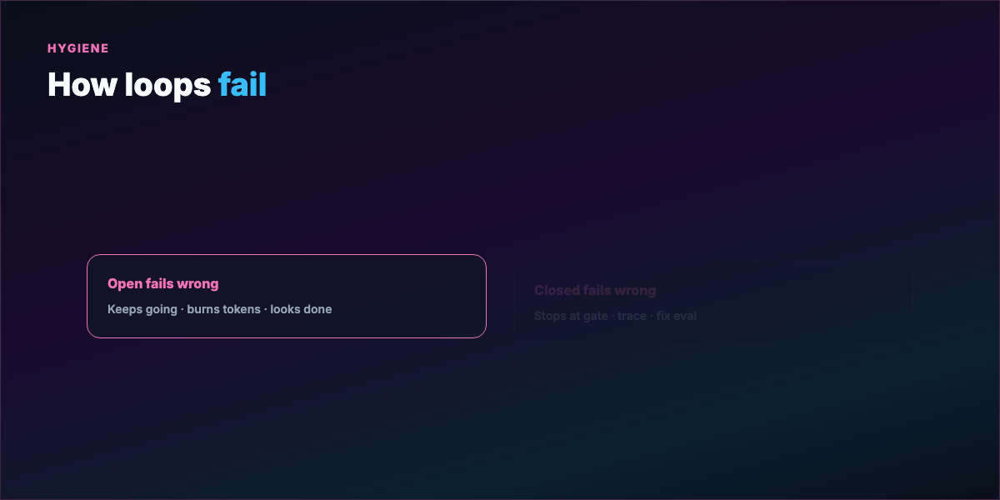

- **No exit condition** — runs forever or stops randomly  
- **Same error, same fix** — spinning, not learning  
- **Context overflow** — model forgets task  
- **Vague goal** — can't detect done  
- **No tools** — pure hallucination loop  
- **Open loop + loose spec** — expensive slop  

Test deliberately: ambiguous goals, broken tools, unsolvable tasks (verify exit works).

---

## Part 15 — Loop engineering vs agentic AI

**Agentic AI** — autonomous action toward goals (broad).  
**Loop engineering** — **discipline of structuring** those actions in feedback cycles with explicit gates.

Most agentic systems are loops under the hood. Quality differences usually come from **loop design**, not base model alone.

---

## Regenerate visuals

All diagram and terminal GIFs render at **1200×600 px** (Medium/blog hero size).

```bash
cd guides/loop-engineering/assets
python3 render_mega_gif.py
python3 render_diagrams.py all
python3 render_terminal_gifs.py all
python3 render_blog_poster.py
cd ../../..
./scripts/prepare-docs.sh
```

---

## Further reading

- ReAct: [Yao et al.](https://arxiv.org/abs/2210.03629)  
- [LangGraph docs](https://langchain-ai.github.io/langgraph/)  
- [Hermes Agent — ReAct runtime](../hermes-agent-masterclass/TUTORIAL.md#part-1--how-hermes-is-structured)  
- [Cloud Girl — Loop Engineering](https://priyankavergadia.substack.com/)  

---

## Summary

**Loop engineering** moves you from expensive autocomplete to **goal-driven automation**. Define pass/fail gates and stop rules; let agents run the revision cycle. Start **closed, single-agent**; add fleet and openness when evals prove the frame. The model got better — your **workflow** should too.
