# Model Context Protocol (MCP) — Full Visual Guide

Connect AI hosts — Cursor, Claude Desktop, VS Code Copilot — to **your** databases, repos, APIs, and local files through a **standard wire protocol**, not one-off integrations per app.

**References (original guide, not copies):** [Daily Dose of Data — Visual Guide to MCP](https://www.dailydoseofds.com/p/visual-guide-to-model-context-protocol-mcp/) · [Visuals MCP — App MCP servers](https://harrybin.de/posts/visuals-mcp-server/)

Format matches our [Loop Engineering](../loop-engineering/TUTORIAL.md) and [Hermes masterclass](../hermes-agent-masterclass/TUTORIAL.md) guides: prose, lists, **animated diagram + terminal GIFs**.

---

## What you'll understand at the end

- Why MCP is described as **USB-C for AI apps** — and what that actually means in code  
- **Host, Client, Server** roles and how one host fans out to many servers  
- The three server primitives: **Tools, Resources, Prompts**  
- **Capability exchange** at connect time — and why it beats brittle REST contracts for agents  
- How to **scaffold a server**, wire **Cursor / Claude Desktop**, and inspect tools  
- **App MCP** — servers that return UI instructions, not just markdown  

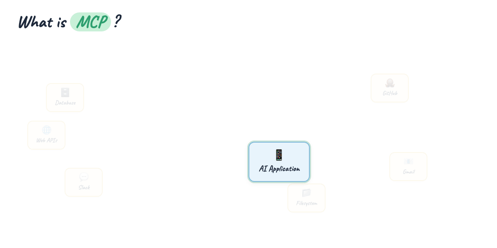

**One-GIF overview (blog hero):** [mega-mcp-everything.gif](./assets/mega-mcp-everything.gif) — USB-C → host stack → handshake → API vs MCP → build → UI apps (~12s).

---

## Introduction — the integration sprawl problem

Every serious AI host needs the same things: read files, query APIs, run shell commands, search docs, pull from Slack or GitHub. Before MCP, each integration was bespoke:

- Custom plugin API for App A  
- Different JSON schema for App B  
- Hard-coded tool definitions in the host  

You rebuilt the same bridge for every pair of (host, data source). MCP replaces N custom adapters with **one protocol** and many **servers** — each server speaks MCP on one side and your system on the other.

**Intuition:** USB-C standardized charging and data. MCP standardizes **how an AI host discovers and invokes external capabilities**.

---

## Part 1 — The USB-C mental model

At the center sits your **AI application** (the host). Around it: databases, GitHub, email, local filesystem, Slack, public web APIs. Each connection runs over the **same protocol label: MCP**.

The host doesn't embed GitHub logic or Postgres drivers. It embeds an **MCP client** that talks to **MCP servers** — one per domain (filesystem server, GitHub server, your custom weather server).

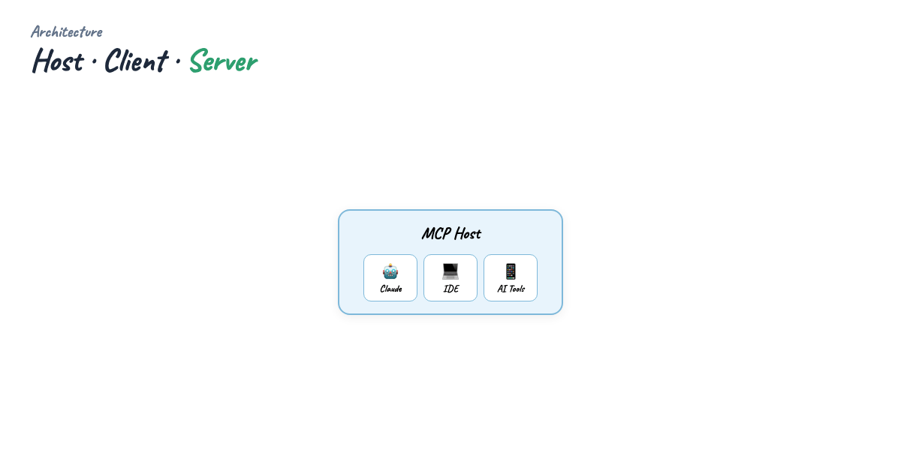

---

## Part 2 — Host, Client, Server

Three roles — don't collapse them:

| Role | What it is | Examples |
|------|------------|----------|
| **Host** | The app the human uses; runs the model and UI | Cursor, Claude Desktop, VS Code + Copilot |
| **Client** | Module inside the host that speaks MCP to servers | One client instance per server connection |
| **Server** | Adapter exposing **capabilities** to the model | `@modelcontextprotocol/server-filesystem`, your Python weather server |

One host → **many clients** → **many servers**. The model sees a unified tool surface; each server stays isolated and deployable on its own.

---

## Part 3 — What servers expose

Every MCP server advertises up to three capability families:

**Tools** — actions the model can call (fetch weather, run query, create issue).  
**Resources** — readable content (file URIs, schema docs, config snapshots).  
**Prompts** — reusable prompt templates the host can surface to users.

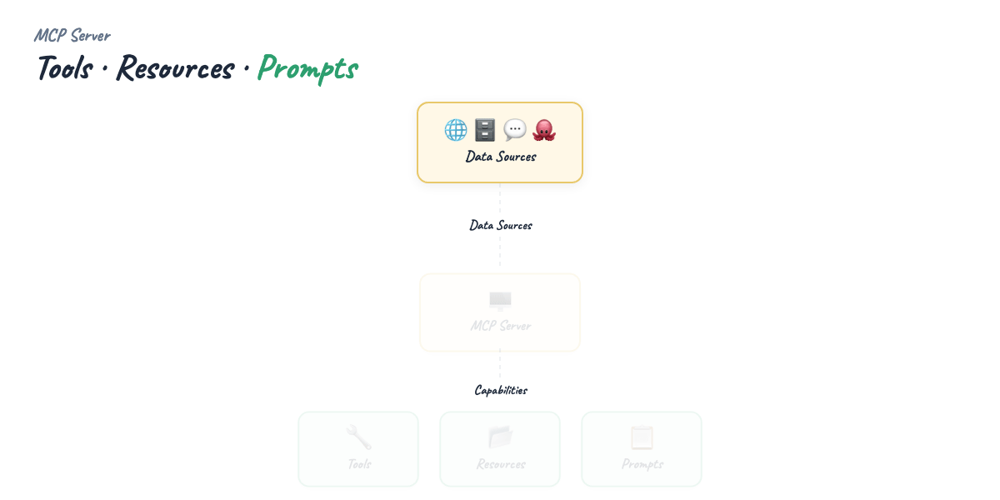

Think of tools as **verbs**, resources as **nouns**, prompts as **saved playbooks**.

---

## Part 4 — Transport layer

Client and server exchange JSON-RPC messages over a **transport**:

- **stdio** — host spawns server as subprocess; stdin/stdout carry messages. Default for local dev (`npx`, `python server.py`).  
- **SSE / HTTP** — server runs remotely; client connects over the network.  

The capability model is identical; only the pipe changes. Most tutorials and desktop hosts start with **stdio** because it's one config block and no open port.

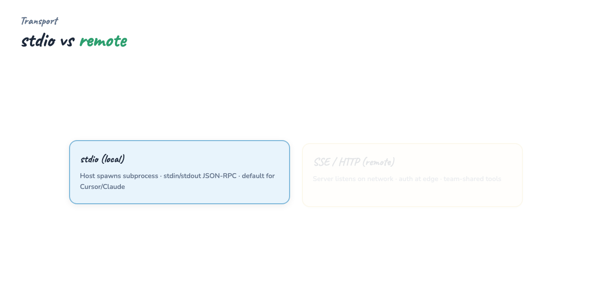

---

## Part 5 — Capability exchange (the handshake)

Before any tool runs, client and server perform a **capability exchange**:

1. Client sends **initialize** — protocol version, client info  
2. Server responds with **supported tools, resources, prompts** and JSON schemas for parameters  
3. Client sends **initialized** notification — channel is ready  

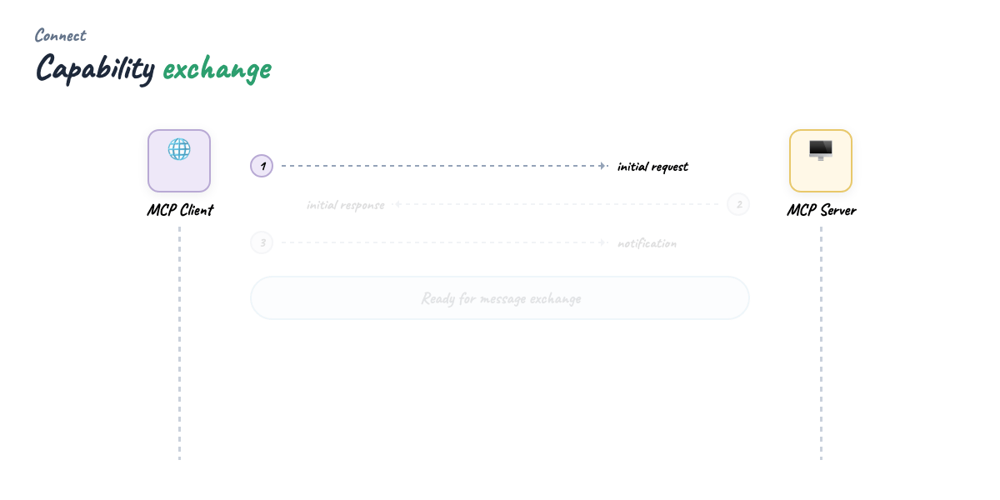

Example: a weather server might advertise `get_forecast(location, date)` with types. The host's model receives that schema in context and knows exactly which arguments to fill — no hard-coded OpenAPI doc in the host repo.

---

## Part 6 — Traditional API: rigid contracts

Classic REST: the client must know the contract **ahead of time**.

```
GET /forecast?location=NYC&date=2025-03-15
→ 200 + JSON body
```

Integrators bake `location` and `date` into their code. Works until you ship a **breaking change**.


---

## Part 7 — When APIs break clients

You add a **required** third parameter — `unit` (celsius | fahrenheit). Every client that still sends only two params gets **400 errors** or wrong defaults. Three sad integrators, three redeploys.


This is normal API versioning pain. For **autonomous agents** that must adapt without a human editing config, it's worse: the agent doesn't read your changelog.

---

## Part 8 — MCP: discover, don't hardcode

On each connection the client **asks** what the server supports. The server returns current tool schemas — including new optional fields like `unit`.

The client (and model) adapts on the **next session** without redeploying host code. No silent failure from a missing query param the model never knew about.


**Caveat:** MCP doesn't magically fix **semantic** breaking changes (renaming a tool). It fixes **discovery** — parameters and availability are first-class at connect time, not buried in external docs.

---

## Part 9 — API vs MCP (when to use which)

| | Traditional API | MCP |
|--|-----------------|-----|
| **Consumer** | Your backend, mobile app, scripts | AI hosts + agents |
| **Contract** | OpenAPI / docs you maintain | Declared at initialize |
| **Discovery** | Static integration | Dynamic per connection |
| **Best for** | Product APIs, SLAs, public dev portals | Tooling layer for LLM hosts |

Use **both**: MCP server as the agent-facing adapter; your core service stays a normal API internally.

---

## Part 10 — Build your first server

We ship a minimal **Python weather server** using the official SDK (`FastMCP`):

```python
from mcp.server.fastmcp import FastMCP

mcp = FastMCP("weather-demo")

@mcp.tool()
def get_forecast(location: str, day: str | None = None, unit: str = "celsius") -> str:
    """Stub forecast — location, optional day, unit celsius|fahrenheit."""
    ...

if __name__ == "__main__":
    mcp.run(transport="stdio")
```

Run locally:

```bash
pip install "mcp[cli]>=1.2"
python examples/minimal_weather_server.py
```

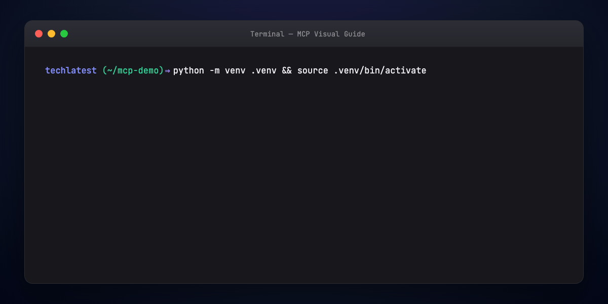

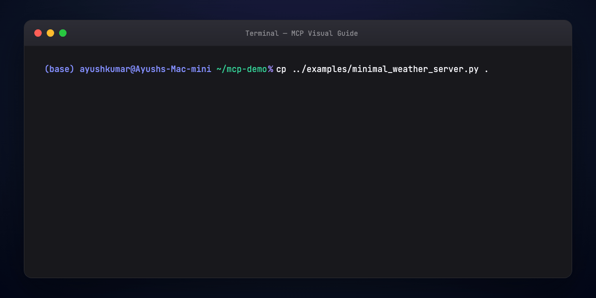

---

## Part 11 — Wire the host

**Cursor** — MCP settings JSON (Settings → MCP):

```json
{
  "mcpServers": {
    "weather-demo": {
      "command": "python",
      "args": ["examples/minimal_weather_server.py"],
      "cwd": "/path/to/guides/mcp-visual-guide"
    }
  }
}
```

**Claude Desktop** — `claude_desktop_config.json` with the same `command` / `args` pattern.


Restart the host after config changes. The client spawns your server process and runs the handshake automatically.

---

## Part 12 — Inspect and debug

Use the MCP Inspector or host UI to list tools:

```bash
npx @modelcontextprotocol/inspector python examples/minimal_weather_server.py
```

You should see `get_forecast` with parameters `location`, `day`, `unit`. Invoke it with test JSON before trusting the model.

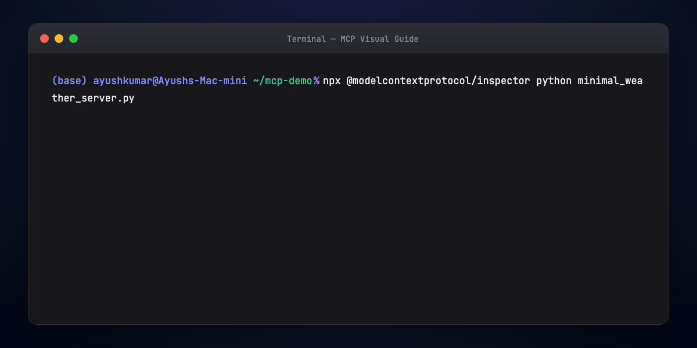

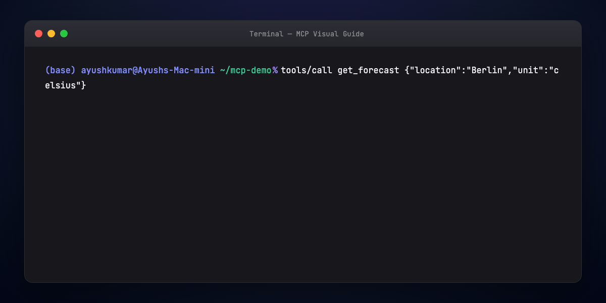

---

## Part 13 — Beyond text: App MCP (Visuals MCP pattern)

Most servers return **strings** — markdown tables, JSON blobs, file paths. That hits limits fast:

- Markdown tables don't sort or filter  
- Long lists burn context  
- Images arrive as URLs, not previews  

**App MCP** servers return **UI render instructions** plus data. The host loads a bundled React (or other) app via MCP **resources** (`text/html`), and the model passes structured tool results into that app.

Flow:

1. User: "Show EC2 instances in a sortable table"  
2. Model calls `display_table` tool  
3. Server returns columns + rows + `resourceUri: table://display`  
4. Host renders interactive grid (sort, filter, paginate)  

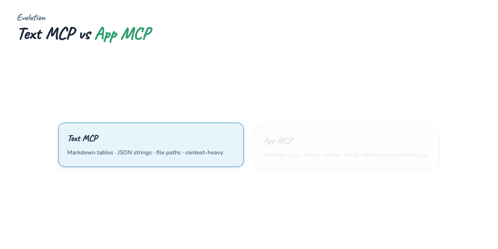

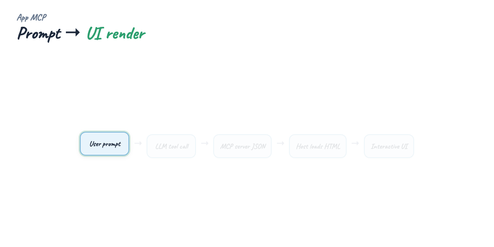

Architecture note from production App MCP servers: **one mini-app per visual** — separate Vite build, single-file HTML bundle, tool metadata pointing at `resourceUri`. See [Visuals MCP](https://harrybin.de/posts/visuals-mcp-server/) for tables, trees, master-detail layouts.

Install pattern (any server, not only visuals):

```json
{
  "mcpServers": {
    "visuals-mcp": {
      "command": "npx",
      "args": ["-y", "@harrybin/visuals-mcp"]
    }
  }
}
```

VS Code extension installs are the zero-config variant — the extension registers the server for Copilot Chat automatically.

---

## Part 14 — Production checklist

- **Scope tools narrowly** — least privilege; read-only DB user for read tools  
- **Validate inputs** — the model will hallucinate argument shapes  
- **Timeout and cancel** — long-running tools need progress or abort  
- **Version your server** — bump tool descriptions when behavior changes  
- **Log on the server** — host logs won't show your business errors  
- **stdio vs remote** — stdio for local trust boundary; HTTP for shared team servers with auth  

---

## Image placement (blog / Medium)

- **Hero →** `mega-mcp-everything.gif`  
- Intro → `diagram-usbc-hub.gif`  
- Part 1–2 → `diagram-host-stack.gif`  
- Part 3 → `diagram-server-primitives.gif`  
- Part 4 → `diagram-transport.gif`  
- Part 5 → `diagram-handshake.gif`  
- Part 6–7 → `diagram-api-rigid.gif`, `diagram-api-break.gif`  
- Part 8 → `diagram-mcp-dynamic.gif`  
- Part 10–12 → `step-01` … `step-05` terminal GIFs  
- Part 13 → `diagram-text-vs-ui.gif`, `diagram-visuals-flow.gif`  

**Blog header:** `assets/blog-poster-1200x600.png`

**Suggested title:** **Model Context Protocol: USB-C for AI Tools (and Why APIs Break Agents)**  
**Subtitle:** Host/client/server architecture, capability exchange, and the shift from markdown dumps to interactive App MCP.

---

## Regenerate visuals

```bash
cd guides/mcp-visual-guide/assets
python3 render_mega_gif.py
python3 render_diagrams.py all
python3 render_terminal_gifs.py all
python3 render_blog_poster.py
cd ../../..
./scripts/prepare-docs.sh
```

---

## Further reading

- [Model Context Protocol — specification](https://modelcontextprotocol.io/)  
- [Anthropic — MCP announcement](https://www.anthropic.com/news/model-context-protocol)  
- [MCP Python SDK](https://github.com/modelcontextprotocol/python-sdk)  
- [Visuals MCP](https://harrybin.de/posts/visuals-mcp-server/) · [@harrybin/visuals-mcp on npm](https://www.npmjs.com/package/@harrybin/visuals-mcp)  
- [Daily Dose of Data — Visual Guide to MCP](https://www.dailydoseofds.com/p/visual-guide-to-model-context-protocol-mcp/)

---

## Summary

MCP is a **client-server protocol** between AI hosts and the outside world. **Hosts** run **clients**; **servers** expose **tools, resources, and prompts** after a **capability handshake**. Compared to rigid REST contracts, MCP lets agents **discover** current parameters instead of failing on undeclared fields. Start with a **stdio server** in Python or TypeScript, wire **Cursor or Claude Desktop**, inspect with the **MCP Inspector**, then explore **App MCP** when markdown isn't enough.
