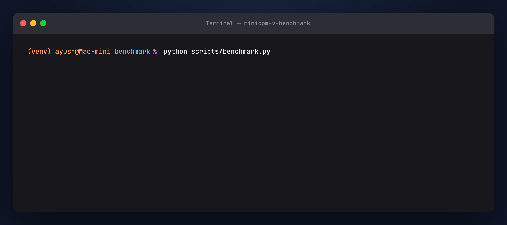
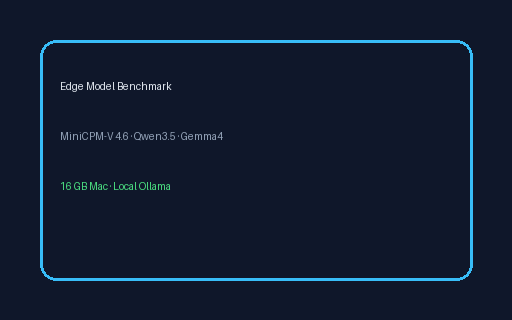
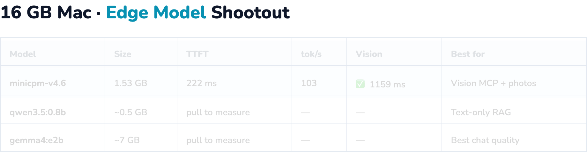

# MiniCPM-V Benchmark — Full Tutorial

Reproducibly compare **MiniCPM-V 4.6**, **Qwen3.5-0.8B**, and **Gemma4-E2B** on your
**16 GB Mac** using local Ollama — the same stack as our agentic guides.

---

## Media assets (copy for Medium)

| Asset | URL |
|-------|-----|
| Benchmark terminal GIF | `https://ayush7614.github.io/agentic-ai-ecosystem/guides/minicpm-v-benchmark/assets/step-benchmark-run.gif` |
| Comparison table GIF | `https://ayush7614.github.io/agentic-ai-ecosystem/guides/minicpm-v-benchmark/assets/benchmark-comparison.gif` |
| Vision test card PNG | `https://ayush7614.github.io/agentic-ai-ecosystem/guides/minicpm-v-benchmark/assets/benchmark_card.png` |

---

## What you'll understand

- What **TTFT** (time to first token) and **tokens/sec** mean for agent UX
- Why **disk size ≠ RAM** at inference time
- When MiniCPM-V's **1.6 GB vision** beats Gemma's **~7 GB** — and when it doesn't
- How to re-run [`scripts/benchmark.py`](./scripts/benchmark.py) after model updates



---

## Introduction — why benchmark edge models?

You already picked a stack from our guides:

- **Qwen3.5-0.8B** — text-only RAG ([Qwen Agentic RAG](../qwen-agentic-rag/TUTORIAL.md))
- **Gemma4-E2B** — chat + vision at ~7 GB ([OpenClaw + Gemma](../openclaw-gemma-rag/TUTORIAL.md))
- **MiniCPM-V 4.6** — vision at ~1.6 GB ([MCP](../minicpm-v-mcp-server/TUTORIAL.md) · [OpenClaw photos](../openclaw-minicpm-v/TUTORIAL.md))

This guide measures **TTFT**, **throughput**, and **vision latency** on *your* Mac so you pick with data, not marketing slides.

---

## Part 1 — Models under test

| Ollama tag | Size | Vision | Role in ecosystem |
|------------|------|--------|-------------------|
| `minicpm-v4.6` | ~1.6 GB | ✅ | Vision MCP + OpenClaw photos |
| `qwen3.5:0.8b` | ~0.5 GB | ❌ | Qwen Agentic RAG crew |
| `gemma4:e2b` | ~7 GB | ✅ | OpenClaw + RAG chat |

```bash
ollama pull minicpm-v4.6
ollama pull qwen3.5:0.8b
ollama pull gemma4:e2b
```

---

## Part 2 — Methodology

### Text benchmark

- **Prompt:** fixed cross-validation explainer (3 sentences)
- **Streaming:** Ollama `/api/chat` with `stream: true`
- **TTFT:** time until first content chunk
- **Throughput:** `eval_count / generation_seconds`

### Vision benchmark

- **Image:** `samples/benchmark_card.png` (also in [`assets/benchmark_card.png`](./assets/benchmark_card.png))
- **Prompt:** read visible text and list model names
- **Latency:** total non-streaming request time
- **Skipped** for text-only models (Qwen3.5-0.8B)

**Vision test card:**



---

## Part 3 — Run the benchmark

```bash
cd guides/minicpm-v-benchmark
python -m venv .venv && source .venv/bin/activate
pip install -r requirements.txt
python generate_sample.py
python scripts/benchmark.py
```


Outputs:

- `results/benchmark.json` — raw numbers
- `results/report.md` — markdown table + text previews

Options:

```bash
python scripts/benchmark.py --models minicpm-v4.6,qwen3.5:0.8b
SKIP_PULL=0 python scripts/benchmark.py   # auto-pull missing models
```

**Verified sample (16 GB Mac, minicpm-v4.6):**

| Metric | Value |
|--------|-------|
| Size | 1.53 GB |
| TTFT | ~222 ms |
| Throughput | ~103 tok/s |
| Vision latency | ~1159 ms |

Re-run on your machine after pulling all three models for a full shootout.

---

## Part 4 — Reading the results



### MiniCPM-V 4.6

- **Smallest model with vision** in this shootout (~1.6 GB)
- Adds OCR / screenshot understanding without Gemma-scale RAM
- Official claims ~1.5× throughput vs Qwen3.5-0.8B on vision workloads — verify locally

### Qwen3.5-0.8B

- Best when you need **text-only** agentic RAG and minimum footprint
- No vision benchmark row — use MiniCPM-V for images

### Gemma4-E2B

- Strongest **general chat** of the three in most qualitative checks
- ~7 GB — comfortable on 16 GB Mac if you close other apps

---

## Part 5 — Pick a stack

| Your goal | Model | Guide |
|-----------|-------|-------|
| Vision in Cursor (MCP) | minicpm-v4.6 | [MCP server](../minicpm-v-mcp-server/TUTORIAL.md) |
| Photos on Telegram | minicpm-v4.6 | [OpenClaw + MiniCPM-V](../openclaw-minicpm-v/TUTORIAL.md) |
| Text RAG crew | qwen3.5:0.8b or gemma4:e2b | [Qwen RAG](../qwen-agentic-rag/TUTORIAL.md) |
| Best chat quality + vision | gemma4:e2b | [OpenClaw + Gemma](../openclaw-gemma-rag/TUTORIAL.md) |

**Hybrid pattern:** Qwen or Gemma for text agents + MiniCPM-V MCP server for screenshots — only ~1.6 GB extra when vision tools run.


---

## Troubleshooting

| Issue | Fix |
|-------|-----|
| Model not installed | `ollama pull <tag>` or `SKIP_PULL=0` |
| Wildly different second run | First run warms cache; compare run 2 vs run 2 |
| Vision error on Qwen | Expected — text-only model |

---

## Next steps

- **[MiniCPM-V MCP Server](../minicpm-v-mcp-server/TUTORIAL.md)** — vision tools in Cursor  
- **[OpenClaw + MiniCPM-V](../openclaw-minicpm-v/TUTORIAL.md)** — photo assistant on messaging  

---

## License

Guide: MIT · Model weights: respective licenses
