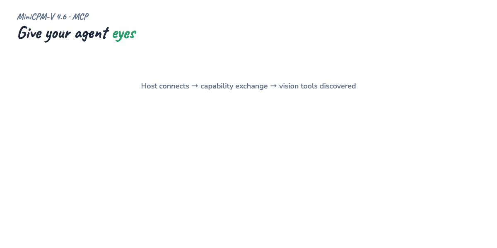
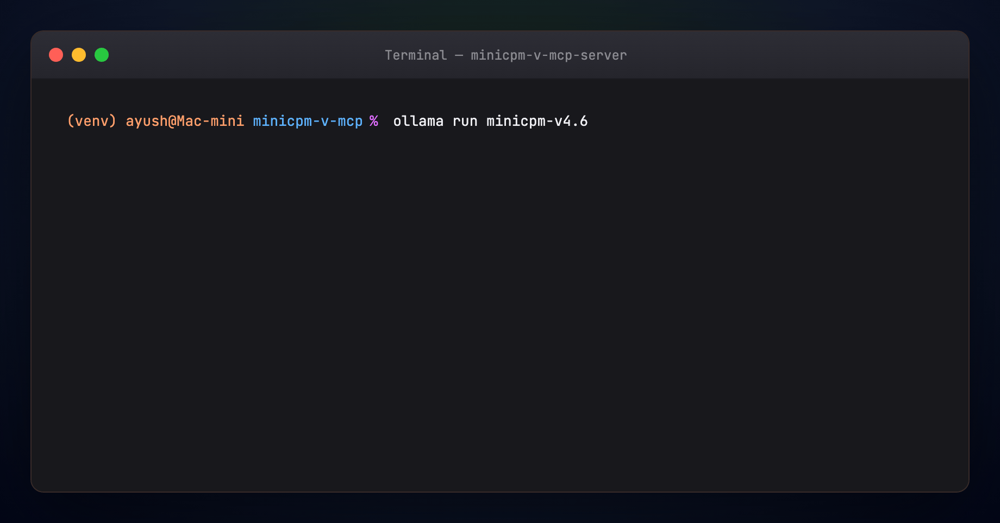
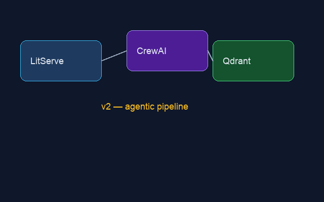
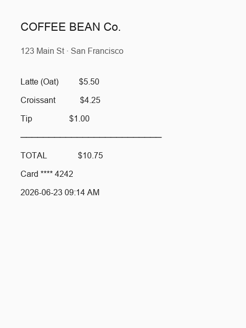
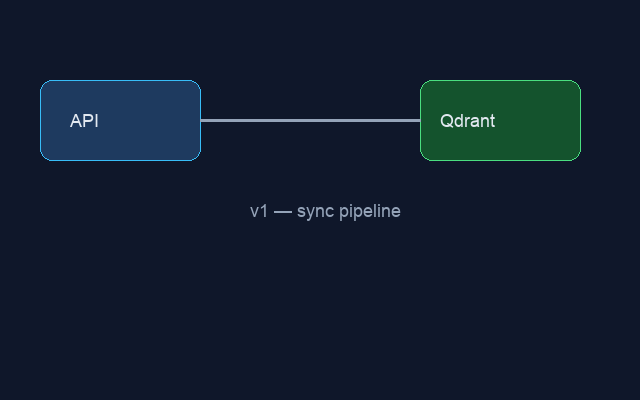
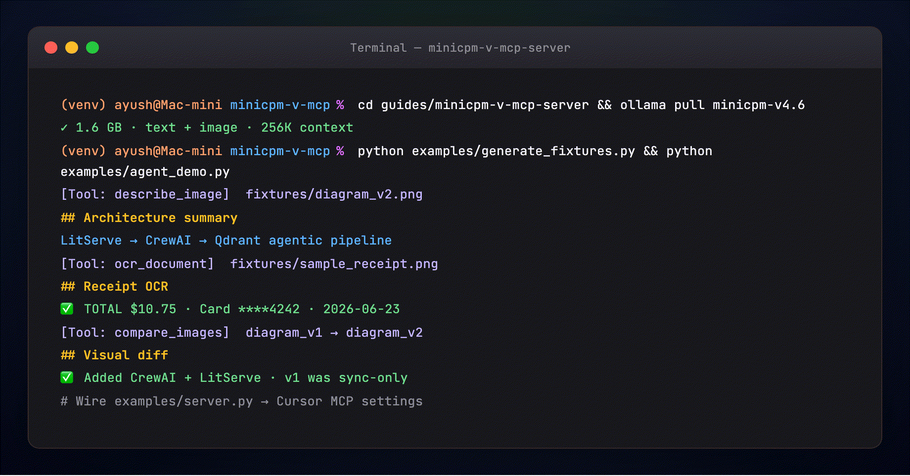

# MiniCPM-V MCP Server — Full Tutorial

Give your coding agent **eyes.** Instead of uploading screenshots to a cloud
vision API, you run a small **MCP server** backed by **MiniCPM-V 4.6** on Ollama
and expose three tools — `describe_image`, `ocr_document`, `compare_images` — so
Cursor, Claude Desktop, and Hermes all see images the same way.

Format matches our [Stripe Projects MCP](../stripe-projects-mcp/TUTORIAL.md)
and [MCP Visual Guide](../mcp-visual-guide/TUTORIAL.md) guides: prose, runnable
Python, terminal GIFs at each step, and architecture diagrams.

---

## Media assets (copy for Medium)

Paste these **full URLs** into Medium if relative paths do not resolve:

| Asset | URL |
|-------|-----|
| Architecture GIF | `https://ayush7614.github.io/agentic-ai-ecosystem/guides/minicpm-v-mcp-server/assets/diagram-capability-exchange.gif` |
| Ollama pull terminal | `https://ayush7614.github.io/agentic-ai-ecosystem/guides/minicpm-v-mcp-server/assets/step-ollama-minicpm.gif` |
| Agent demo terminal | `https://ayush7614.github.io/agentic-ai-ecosystem/guides/minicpm-v-mcp-server/assets/step-mcp-vision-demo.gif` |
| Sample receipt | `https://ayush7614.github.io/agentic-ai-ecosystem/guides/minicpm-v-mcp-server/assets/sample_receipt.png` |
| Diagram v1 (before) | `https://ayush7614.github.io/agentic-ai-ecosystem/guides/minicpm-v-mcp-server/assets/diagram_v1.png` |
| Diagram v2 (after) | `https://ayush7614.github.io/agentic-ai-ecosystem/guides/minicpm-v-mcp-server/assets/diagram_v2.png` |

---

## What you'll understand at the end

- Why **vision belongs in MCP** — reusable tools vs one-off `ollama run` commands
- How **MiniCPM-V 4.6** fits a 16 GB Mac (~1.6 GB model, text + image input)
- The three tools and when to use each
- Wiring the server into **Cursor** and **Claude Desktop**
- Running the **agent demo** offline (`OLLAMA_MOCK=1`) or live with Ollama



---

## Introduction — agents without eyes

Your agent can grep code, run tests, and provision infra — but the moment someone
pastes a **screenshot**, a **receipt**, or a **Figma export**, the loop breaks unless
you bolt on a vision API. That means API keys, cloud latency, and pixels leaving your
machine.

MiniCPM-V 4.6 is built for the opposite: **1.3B parameters**, **~1.6 GB** on disk,
**256K context**, and native **text + image** input via Ollama. Wrap it in MCP and
every host discovers the same three vision tools at connect time.

---

## Part 1 — MiniCPM-V 4.6 on Ollama

From the [Ollama model page](https://ollama.com/library/minicpm-v4.6):

| Tag | Size | Context | Input |
|-----|------|---------|-------|
| `minicpm-v4.6:latest` | 1.6 GB | 256K | Text, Image |
| `minicpm-v4.6:1b` | 1.6 GB | 256K | Text, Image |

```bash
ollama pull minicpm-v4.6
ollama run minicpm-v4.6 "Describe this image" --image ./photo.jpg
```



This guide uses the same model through Ollama's **HTTP API** so the MCP server can
batch tool calls without spawning a CLI per request.

---

## Part 2 — Why MCP for vision

You could write a Python script that calls Ollama and paste output into chat. But
then Cursor, Claude Desktop, and Hermes each need their own glue.

MCP collapses that. You write **one server**; hosts discover tools at **capability
exchange**. Add a fourth tool later and every host sees it on reconnect — no
host-side changes.


| Role | Here |
|------|------|
| **Host** | Cursor / Claude Desktop / Hermes |
| **Client** | MCP client inside the host |
| **Server** | `minicpm-vision` — vision tools backed by Ollama |

If host/client/server isn't second nature yet, read the
[MCP Visual Guide](../mcp-visual-guide/TUTORIAL.md) first.

---

## Part 3 — Quick start

```bash
cd guides/minicpm-v-mcp-server
python -m venv .venv && source .venv/bin/activate
pip install -r requirements.txt
cp .env.example .env

ollama pull minicpm-v4.6
python examples/generate_fixtures.py
python examples/agent_demo.py
```

---

## Part 4 — The vision backend

[`examples/vision_backend.py`](./examples/vision_backend.py) encodes images as
base64 and POSTs to `OLLAMA_HOST/api/chat`:

```python
payload = {
    "model": VISION_MODEL,  # minicpm-v4.6
    "messages": [{"role": "user", "content": prompt, "images": images_b64}],
    "stream": False,
}
```

Environment variables (see [`.env.example`](./.env.example)):

| Variable | Default | Purpose |
|----------|---------|---------|
| `OLLAMA_HOST` | `http://127.0.0.1:11434` | Ollama base URL |
| `OLLAMA_VISION_MODEL` | `minicpm-v4.6` | Vision model tag |
| `OLLAMA_MOCK` | `0` | Set `1` for offline demo without Ollama |

---

## Part 5 — The three tools

[`examples/server.py`](./examples/server.py) is a `FastMCP` server.

### `describe_image`

General-purpose image Q&A. Pass a custom `question` for targeted queries.

**Sample input** — architecture diagram the demo describes:



### `ocr_document`

Structured OCR prompt — markdown headings, bullet lists, tables. Ideal for
receipts, invoices, and whiteboard photos.

**Sample input** — coffee shop receipt:



### `compare_images`

Two paths + optional `focus` (e.g. `"navigation bar"`). Returns similarities,
differences, and UI change notes.

**Sample inputs** — before and after pipeline:

| Before (`diagram_v1.png`) | After (`diagram_v2.png`) |
|---------------------------|--------------------------|
|  |  |

Each tool returns **JSON** with `result`, `tool`, paths, and `model`.

---

## Part 6 — Agent demo (terminal walkthrough)

[`examples/agent_demo.py`](./examples/agent_demo.py) runs all three scenarios:

```bash
python examples/generate_fixtures.py
python examples/agent_demo.py
```



The terminal shows the same flow your MCP host runs:

```
[Tool: describe_image]  path=fixtures/diagram_v2.png
[Tool: ocr_document]    path=fixtures/sample_receipt.png
[Tool: compare_images]  v1 → v2 pipeline diagrams
```

Offline smoke test (no Ollama):

```bash
OLLAMA_MOCK=1 python examples/agent_demo.py
```

---

## Part 7 — Wire into Cursor

Copy [`examples/cursor_mcp.json.example`](./examples/cursor_mcp.json.example) into
Cursor → Settings → MCP. Use **absolute paths** for `cwd`.

Restart Cursor — you should see `describe_image`, `ocr_document`, `compare_images`.

Try: *"Use ocr_document on /path/to/receipt.png and summarize the total."*

---

## Part 8 — Wire into Claude Desktop

Add the server block from
[`examples/claude_desktop_config.json.example`](./examples/claude_desktop_config.json.example)
to `~/Library/Application Support/Claude/claude_desktop_config.json` on macOS.

Restart Claude Desktop. Vision tools appear alongside your other MCP servers.

---

## Part 9 — Sample fixtures

[`examples/generate_fixtures.py`](./examples/generate_fixtures.py) creates:

| File | Purpose | Preview |
|------|---------|---------|
| `sample_receipt.png` | OCR demo |  |
| `diagram_v1.png` | Compare — before |  |
| `diagram_v2.png` | Compare — after |  |

Copies for the docs site and Medium live under [`assets/`](./assets/).

---

## Troubleshooting

| Symptom | Fix |
|---------|-----|
| `Cannot reach Ollama` | Start Ollama app; verify `curl http://127.0.0.1:11434/api/tags` |
| `model not found` | `ollama pull minicpm-v4.6` |
| Slow first call | Normal — model loads into RAM; subsequent calls faster |
| MCP host shows no tools | Check absolute `cwd` in config; restart host |

---

## Next steps

- **[OpenClaw + MiniCPM-V](../openclaw-minicpm-v/TUTORIAL.md)** — send photos on Telegram/WhatsApp
- **[MiniCPM-V Benchmark](../minicpm-v-benchmark/TUTORIAL.md)** — compare vs Qwen3.5-0.8B and Gemma4-E2B
- **[Qwen Agentic RAG](../qwen-agentic-rag/TUTORIAL.md)** — text RAG crew; pair with this guide for multimodal agents

---

## License

Guide: MIT · MiniCPM-V: Apache-2.0
