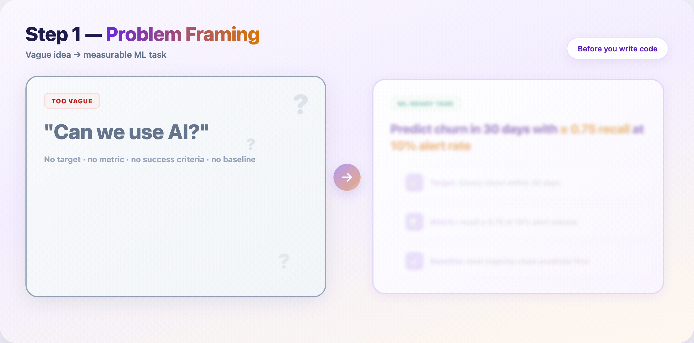
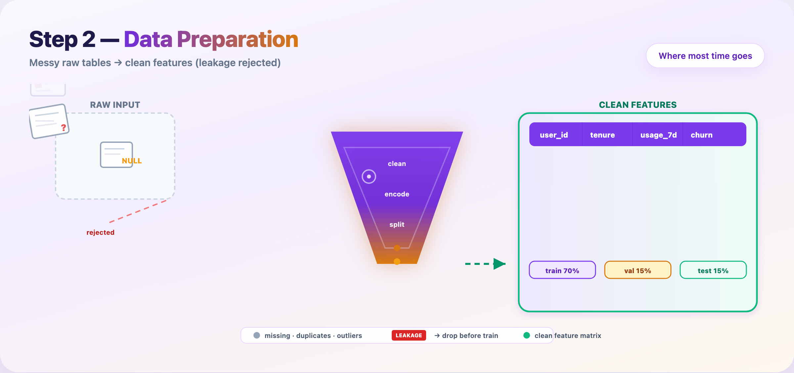
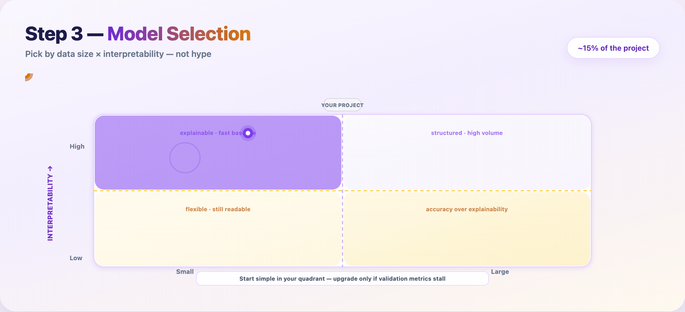
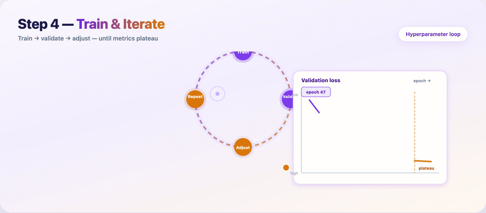
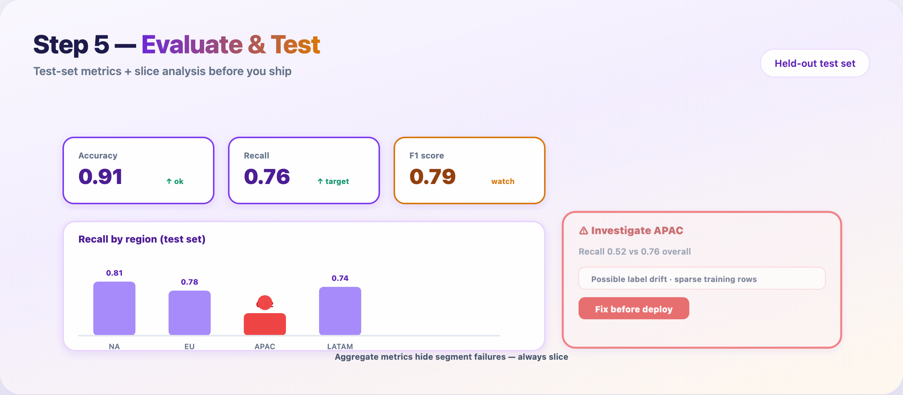
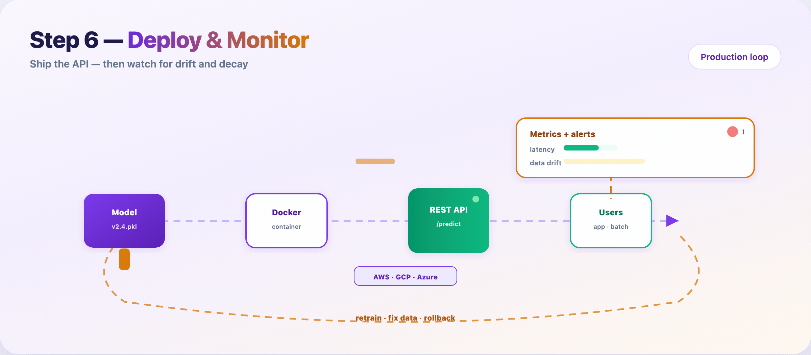

# 10 Steps to Build a Machine Learning Model — Explained Visually

Most tutorials jump straight to `model.fit()`. Real projects don’t.

Shipping a model means ten distinct stages — from scoping the problem to watching it decay in production. Picking the algorithm is **one** of those ten, not the whole job.

This guide walks through all ten. Each major stage has a GIF so you can see the flow, not just read a bullet list.

**Hero image:** `assets/blog-poster-1200x600.png`  
**Overview GIF:** `assets/gif-01-pipeline-overview.gif`

---

## How to read this guide

| Layer | What it covers |
|-------|----------------|
| **10 steps** (this article) | What practitioners actually do week by week |
| **6 macro stages** (GIF 1) | How teams talk about the lifecycle in planning meetings |
| **7 GIFs** | One visual per critical transition — some steps share a GIF |

The six macro stages are: **Problem → Data → Model → Train → Evaluate → Deploy**. Steps 1–10 zoom in inside that frame.

---

## Step 1 — Define the problem and success metrics

Before notebooks open, write down what “done” looks like.

- What decision should the model support?
- What metric matches the cost of being wrong? (precision vs recall, MAE vs RMSE)
- What baseline must you beat? (rules, majority class, last year’s manual process)

**Deliverable:** one-page brief — use case, constraints, KPIs, baseline.



---

## Step 2 — Run a feasibility check

Not every idea needs machine learning.

Ask plainly:

- Do you have labeled examples (or a realistic labeling plan)?
- Is the signal in the data, or is this a product/process fix?
- Can you get to a MVP metric in the time you have?

If the answer is no, fix data collection or product scope first. Cheaper than training the wrong model.

**Deliverable:** go / no-go note with risks listed.

---

## Step 3 — Collect raw data

Gather examples that match the problem you defined in Step 1.

- Pull from warehouses, APIs, logs, human labelers, or public datasets
- Track **provenance** — source, timestamp, version, PII rules
- Store raw data immutable; never overwrite the source copy

**Common mistake:** training on a convenience sample that doesn’t match production traffic.

---

## Step 4 — Clean and explore (EDA)

Open the data before you trust it.

- Profile distributions, missing rates, duplicates, unit bugs
- Plot labels over time — sudden shifts often mean pipeline breaks
- Document findings; EDA notes become onboarding material later

**Time spent here:** often 20–40% of the project calendar. That’s normal.

---

## Step 5 — Engineer features

Turn raw columns into signals the model can learn from.

- Ratios, aggregates, encodings, text tokens, date parts, embeddings
- Keep feature definitions in code (not one-off notebook cells)
- Version feature logic with the same discipline as model weights

**Rule:** if you can’t explain a feature to a teammate, don’t ship it.

---

## Step 6 — Split data and kill leakage

Lock your evaluation story before training hype starts.

- **Train / validation / test** — test set stays sealed until the end
- Time-based splits for forecasting; group splits when rows aren’t independent
- Reject columns that encode the future (`future_spend`, post-outcome fields)



**Deliverable:** feature matrix + split indices + leakage audit checklist.

---

## Step 7 — Choose a modeling approach

Match method to data size and interpretability — not Twitter hype.

| Data | Need explanations? | Often start with |
|------|-------------------|------------------|
| Small | Yes | Logistic regression, linear models |
| Large | Yes | Random Forest, GBT + SHAP |
| Small | No | Gradient boosting (XGBoost/LightGBM) |
| Large | No | Neural networks |



Train the **simplest** candidate that could work. Upgrade only when validation metrics justify the complexity.

---

## Step 8 — Train and tune

Feed prepared data to the model. Iterate until validation performance plateaus.

Loop:

1. Train on the training set  
2. Measure on the **validation** set  
3. Adjust hyperparameters or features  
4. Repeat  

Log every run: data hash, config, metrics, runtime. Reproducibility saves you during audits and regressions.



**Stop when:** validation metric gains shrink below your noise floor — not when the leaderboard looks pretty.

---

## Step 9 — Evaluate on the held-out test set

The test set gets **one** shot. No peeking during tuning.

- Report metrics that match Step 1 KPIs
- **Slice** by region, device, cohort, language — aggregates hide failures
- Check fairness across groups; error clusters point back to Steps 4–6



If a slice fails, don’t deploy and hope. Fix data or modeling, then re-run from Step 8.

---

## Step 10 — Deploy, monitor, and retrain

Package the model, ship an API, watch it in the wild.

Typical path:

1. Serialize artifact (`v2.4.pkl`, ONNX, SavedModel)  
2. Containerize (Docker)  
3. Deploy behind `/predict` on cloud or edge  
4. Monitor latency, errors, **input drift**, **prediction drift**  
5. Retrain or rollback when alerts fire  



Models rot. User behavior shifts. Upstream schemas change. Monitoring is not optional — it’s Step 10 of the same pipeline.

---

## The ten steps at a glance

| # | Step | Macro stage | GIF |
|---|------|-------------|-----|
| 1 | Define problem & KPIs | Problem | GIF 2 |
| 2 | Feasibility check | Problem | — |
| 3 | Collect data | Data | GIF 3 |
| 4 | Clean & explore (EDA) | Data | GIF 3 |
| 5 | Feature engineering | Data | GIF 3 |
| 6 | Split & leakage audit | Data | GIF 3 |
| 7 | Choose model | Model | GIF 4 |
| 8 | Train & tune | Train | GIF 5 |
| 9 | Evaluate & test | Evaluate | GIF 6 |
| 10 | Deploy & monitor | Deploy | GIF 7 |

---

## Where the time actually goes

| Phase | Steps | Typical calendar share |
|-------|-------|------------------------|
| Planning | 1–2 | 5–10% |
| Data | 3–6 | 40–60% |
| Modeling | 7–8 | 15–25% |
| Validation | 9 | 5–10% |
| Production | 10 | 10–20% (ongoing) |

The algorithm (Steps 7–8) is often **under a quarter** of the work. The rest is clarity, data, engineering, and ops.

---

## FAQ

**Should my blog say 6 steps or 10?**  
Use **10** in the title for depth and SEO (“complete ML pipeline”). Mention the **6 macro stages** once in the intro so readers who know MLOps diagrams still feel at home.

**Do I need ten GIFs?**  
No. Seven is enough if Steps 3–6 share the data-prep funnel GIF and Steps 1–2 share the problem-framing GIF.

**What’s the single most skipped step?**  
Step 2 (feasibility) and Step 6 (leakage audit). Skipping them causes the most expensive rework.

**When do I stop training?**  
When validation metrics plateau and the model beats your Step 1 baseline on the metrics that matter for the product.

---

## Publish checklist

- [ ] Hero: `blog-poster-1200x600.png` (PNG, not GIF)
- [ ] GIF 1 after intro paragraph
- [ ] GIFs 2–7 under matching step sections
- [ ] Meta description: *Ten steps to build a machine learning model — from KPIs and data prep to training, evaluation, deployment, and monitoring.*
- [ ] LinkedIn: short hook in post; full URL in first comment

---

## Regenerate assets

```bash
cd guides/ml-model-6-steps/assets
python3 render_blog_poster.py
python3 render_gif_01.py
python3 render_gif_02.py
python3 render_gif_03.py
python3 render_gif_04.py
python3 render_gif_05_07.py all
```
