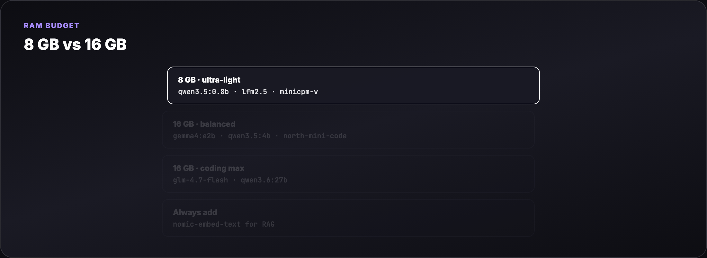

# Ollama Small Models — Local LLM Guide

The **complete guide to running Ollama on low-RAM laptops** — 8 GB and 16 GB tiers, pull → run → API workflows, and the best **2026 models** for chat, coding, vision, RAG, and agents.

**Official:** [ollama.com/search](https://ollama.com/search) · **Docs:** [github.com/ollama/ollama](https://github.com/ollama/ollama)

> Run AI locally without a GPU farm. Pick models by **RAM budget** and **task**, not hype.

## What you'll learn

- Which Ollama tags fit **8 GB** vs **16 GB** laptops (disk size ≠ RAM at inference)
- **New 2026 models**: Gemma 4, Qwen 3.5/3.6, GLM-4.7-Flash, LFM2.5, MiniCPM-V, North Mini Code
- Terminal workflow: `ollama pull` → `ollama run` → streaming response → REST API
- Task-specific picks: chat, coding, vision, embeddings, tool/agent loops
- Wiring models into [OpenClaw](../openclaw/), [PicoClaw](../picoclaw-agent-masterclass/), and [MCP](../mcp-visual-guide/) stacks



**One-GIF overview (blog hero):** [mega-ollama-small-models.gif](assets/mega-ollama-small-models.gif)

## Quick start

```bash
# Install (macOS / Linux)
curl -fsSL https://ollama.com/install.sh | sh

# 8 GB laptop — ultra-light chat
ollama pull qwen3.5:0.8b
ollama run qwen3.5:0.8b "Summarize local LLMs in 3 sentences."

# 16 GB laptop — vision + tools
ollama pull gemma4:e2b
ollama run gemma4:e2b
```

## Guide map

- **[Full tutorial](./TUTORIAL.md)** — Parts 1–16 (RAM math → model catalog → agents)
- **[Examples](./examples/)** — pull scripts for 8 GB / 16 GB, OpenClaw snippet, Modelfile
- **[Assets](./assets/)** — diagram + terminal GIFs (pull, run, response), blog poster

## Related guides

- [MiniCPM-V Benchmark](../minicpm-v-benchmark/) · [MiniCPM-V MCP Server](../minicpm-v-mcp-server/)
- [OpenClaw + Gemma RAG](../openclaw-gemma-rag/) · [Qwen Agentic RAG](../qwen-agentic-rag/)
- [PicoClaw Agent Masterclass](../picoclaw-agent-masterclass/) · [MCP Visual Guide](../mcp-visual-guide/)

**Blog header:** `assets/blog-poster-1200x600.png` · Regenerate: `cd assets && python3 render_gifs.py all && python3 render_blog_poster.py`

## License

Guide: MIT · Ollama: upstream license · Community tutorial — not affiliated with Ollama Inc.
