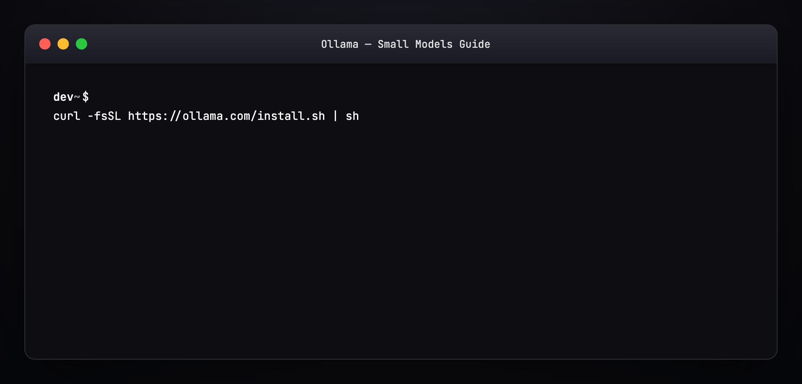
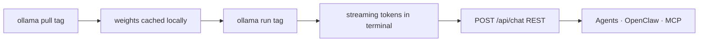
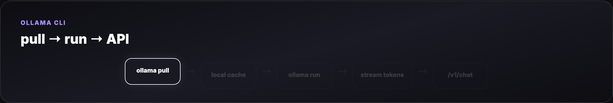
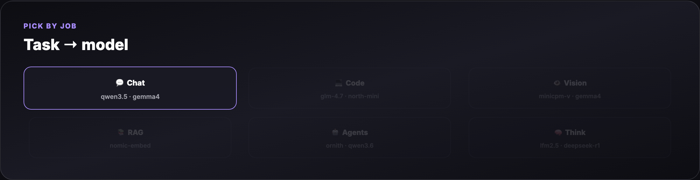
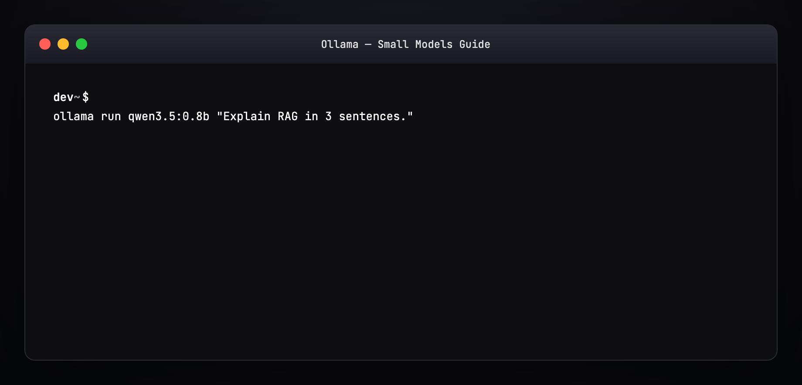
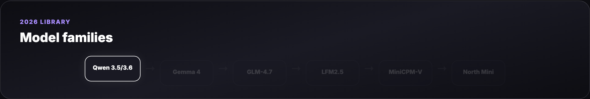
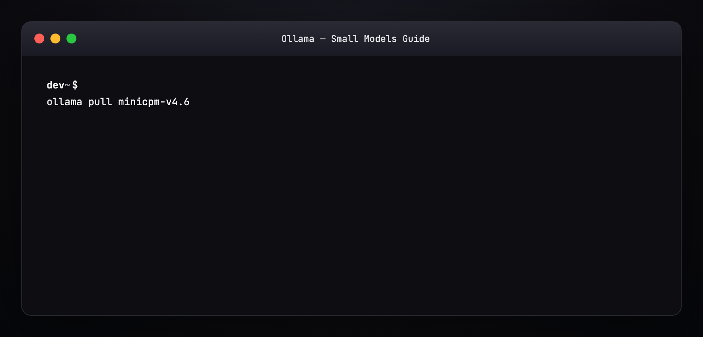
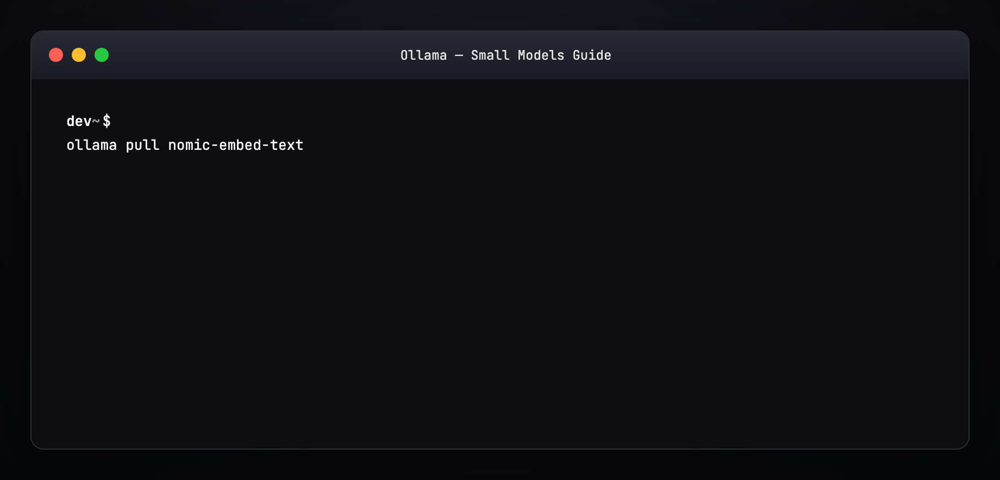

# Ollama Small Models — Full Tutorial

Everything you need to **pick, pull, and run** the best local models on an **8 GB or 16 GB laptop** — with terminal GIFs for every step from [ollama.com/search](https://ollama.com/search).

**Official:** [ollama.com](https://ollama.com/) · **Model library:** [ollama.com/search](https://ollama.com/search) · **GitHub:** [github.com/ollama/ollama](https://github.com/ollama/ollama)

This guide matches our [MiniCPM-V Benchmark](../minicpm-v-benchmark/TUTORIAL.md) and agent masterclasses: **prose and lists**, plus **diagram and terminal GIFs** at 1200×600.

---

## Media assets (copy for Medium)

| Asset | URL |
|-------|-----|
| Mega overview | `https://ayush7614.github.io/agentic-ai-ecosystem/guides/ollama-small-models/assets/mega-ollama-small-models.gif` |
| RAM tiers | `https://ayush7614.github.io/agentic-ai-ecosystem/guides/ollama-small-models/assets/diagram-ram-tiers.gif` |
| Task picker | `https://ayush7614.github.io/agentic-ai-ecosystem/guides/ollama-small-models/assets/diagram-task-picker.gif` |
| Model families | `https://ayush7614.github.io/agentic-ai-ecosystem/guides/ollama-small-models/assets/diagram-model-families.gif` |
| Pull → run workflow | `https://ayush7614.github.io/agentic-ai-ecosystem/guides/ollama-small-models/assets/diagram-pull-run-workflow.gif` |
| Blog poster | `https://ayush7614.github.io/agentic-ai-ecosystem/guides/ollama-small-models/assets/blog-poster-1200x600.png` |

---

## What you'll have at the end

- Ollama installed and verified on macOS / Linux / Windows
- A **curated model set** for your RAM tier (8 GB or 16 GB)
- GIF-backed workflows: **pull**, **run**, **generate response**, **embed**, **list/ps**
- Task-specific picks for chat, coding, vision, RAG, and agent harnesses
- API snippets to wire models into OpenClaw, PicoClaw, Cursor, and MCP servers

---

## Introduction — why small models on small laptops?

Cloud APIs are great until you need **privacy**, **offline work**, **zero per-token cost**, or **agent loops** that call a model dozens of times per task. [Ollama](https://ollama.com/) makes local inference one command: download a quantized GGUF, run it, expose a OpenAI-compatible API on `localhost:11434`.

The trap: **disk size on ollama.com ≠ RAM at inference**. A 7 GB Gemma weights file might use ~5–8 GB RAM when loaded — fine on 16 GB, painful on 8 GB with Chrome open.

This guide picks models that **actually run** on:

| Laptop RAM | Comfortable context | Strategy |
|------------|---------------------|----------|
| **8 GB** | 2K–4K tokens | Sub-2B chat, embeddings, tiny vision |
| **16 GB** | 4K–8K tokens | 2–9B chat/vision, 30B MoE with 3B active, coding specialists |


---

## Part 1 — Install Ollama

### macOS / Linux

```bash
curl -fsSL https://ollama.com/install.sh | sh
ollama --version
```

### Windows

Download the installer from [ollama.com/download](https://ollama.com/download).

### Verify the daemon

```bash
ollama serve          # usually auto-starts
curl http://localhost:11434/api/tags
```



Ollama runs a background service. Models live in `~/.ollama/models/` (override with `OLLAMA_MODELS`).

---

## Part 2 — The pull → run → respond workflow

Every model follows the same lifecycle:



| Command | What it does |
|---------|--------------|
| `ollama pull <tag>` | Download quantized weights (resume-friendly) |
| `ollama run <tag>` | Interactive REPL with streaming |
| `ollama run <tag> "prompt"` | One-shot generation |
| `ollama list` | Installed models + sizes |
| `ollama ps` | Currently loaded models + RAM |
| `ollama rm <tag>` | Free disk space |



---

## Part 3 — Task picker (what model for what job?)



| Task | Best small-model picks | Ollama tag examples |
|------|------------------------|---------------------|
| **Fast chat / notes** | Sub-1B text | `qwen3.5:0.8b`, `lfm2.5-thinking:1.2b` |
| **General chat (16 GB)** | 2–4B multimodal | `gemma4:4b`, `qwen3.5:4b` |
| **Coding / agents** | Code-tuned, tool-ready | `glm-4.7-flash`, `north-mini-code-1.0`, `qwen3.6:27b`* |
| **Vision / OCR / photos** | Lightweight VLMs | `minicpm-v4.6`, `gemma4:e2b`, `glm-ocr` |
| **RAG embeddings** | Embedding models | `nomic-embed-text`, `mxbai-embed-large` |
| **Reasoning / thinking** | Thinking tags | `lfm2.5-thinking:1.2b`, `deepseek-r1:1.5b` |

\* `qwen3.6:27b` needs 16 GB+ and patience; use `qwen3.5:4b` on tighter RAM.

---

## Part 4 — 8 GB laptop model pack

These models leave headroom for the OS, browser, and your editor.

### Tier A — daily driver (text)

| Model | Pull size | RAM (approx) | Best for |
|-------|-----------|--------------|----------|
| **[Qwen 3.5 0.8B](https://ollama.com/library/qwen3.5:0.8b)** | ~0.5 GB | ~1 GB | Fast chat, RAG crew text ([Qwen Agentic RAG](../qwen-agentic-rag/TUTORIAL.md)) |
| **[LFM2.5 Thinking 1.2B](https://ollama.com/library/lfm2.5-thinking:1.2b)** | ~0.8 GB | ~1.5 GB | On-device reasoning, hybrid architecture |
| **[Llama 3.2 1B](https://ollama.com/library/llama3.2:1b)** | ~1.3 GB | ~1.5 GB | Reliable Meta baseline |

```bash
ollama pull qwen3.5:0.8b
ollama pull lfm2.5-thinking:1.2b
```


### Tier B — vision on 8 GB (careful)

| Model | Pull size | RAM (approx) | Best for |
|-------|-----------|--------------|----------|
| **[MiniCPM-V 4.6](https://ollama.com/library/minicpm-v4.6)** | ~1.6 GB | ~2–3 GB | Photo describe, OCR, MCP vision ([MiniCPM-V MCP](../minicpm-v-mcp-server/TUTORIAL.md)) |
| **[GLM-OCR](https://ollama.com/library/glm-ocr)** | varies | ~2–4 GB | Document OCR, complex layouts |

```bash
ollama pull minicpm-v4.6
```

Close heavy apps before loading vision models on 8 GB.

### Tier C — embeddings (always add these)

| Model | Pull size | Use |
|-------|-----------|-----|
| **[nomic-embed-text](https://ollama.com/library/nomic-embed-text)** | ~0.3 GB | RAG chunk indexing |
| **[mxbai-embed-large](https://ollama.com/library/mxbai-embed-large)** | ~0.7 GB | Higher-quality embeddings |

```bash
ollama pull nomic-embed-text
```

See [examples/pull-8gb.sh](./examples/pull-8gb.sh) for a one-shot install script.

---

## Part 5 — 16 GB laptop model pack

16 GB is the sweet spot for **multimodal chat + coding + one agent loop**.

### Tier A — general + vision

| Model | Pull size | RAM (approx) | Best for |
|-------|-----------|--------------|----------|
| **[Gemma 4 E2B](https://ollama.com/library/gemma4:e2b)** | ~7 GB | ~5–8 GB | Chat + vision + tools ([OpenClaw + Gemma RAG](../openclaw-gemma-rag/TUTORIAL.md)) |
| **[Gemma 4 4B](https://ollama.com/library/gemma4:4b)** | ~3 GB | ~3–4 GB | Lighter Gemma when E2B is tight |
| **[Qwen 3.5 4B](https://ollama.com/library/qwen3.5:4b)** | ~2.5 GB | ~3 GB | Multimodal, strong utility/size ratio |

```bash
ollama pull gemma4:e2b
ollama pull qwen3.5:4b
```



### Tier B — coding and agentic (2026 new releases)

| Model | Pull size | RAM (approx) | Best for |
|-------|-----------|--------------|----------|
| **[GLM-4.7-Flash](https://ollama.com/library/glm-4.7-flash)** | ~18 GB disk / **~20B class** | ~12–14 GB | Strongest ~30B-class lightweight deploy |
| **[North Mini Code 1.0](https://ollama.com/library/north-mini-code-1.0)** | ~19 GB | ~8–10 GB | 30B MoE, **3B active** — agentic SWE |
| **[Qwen 3.6 27B](https://ollama.com/library/qwen3.6:27b)** | ~17 GB | ~14–16 GB | Agentic coding upgrade over Qwen 3.5 |
| **[Ornith 9B](https://ollama.com/library/ornith:9b)** | ~5 GB | ~6–8 GB | Self-improving agentic coding family |

```bash
ollama pull glm-4.7-flash
ollama pull north-mini-code-1.0
```


**MoE note:** North Mini Code activates only **3B parameters** per token — you get 30B-class knowledge with smaller RAM spikes than dense 30B models.

### Tier C — thinking / reasoning distillates

| Model | Pull size | Best for |
|-------|-----------|----------|
| **[DeepSeek R1 1.5B](https://ollama.com/library/deepseek-r1:1.5b)** | ~1 GB | Chain-of-thought on 8 GB |
| **[DeepSeek R1 7B](https://ollama.com/library/deepseek-r1:7b)** | ~4.7 GB | Better reasoning on 16 GB |

---

## Part 6 — New models to watch ([ollama.com/search](https://ollama.com/search))

The library updates weekly. As of **2026**, these are the standout **small-laptop** entries:

| Model | Tags | Why it matters |
|-------|------|----------------|
| **Gemma 4** | `e2b`, `4b`, `12b`, `26b` | Google’s frontier-class open family — vision + tools + thinking |
| **Qwen 3.5** | `0.8b`–`122b` | Best size ladder; multimodal at 2B+ |
| **Qwen 3.6** | `27b`, `35b` | Agentic coding improvements over 3.5 |
| **GLM-4.7-Flash** | latest | Z.ai’s 30B-class efficiency champion |
| **North Mini Code** | `1.0` | Cohere’s 3B-active MoE for developers |
| **LFM2 / LFM2.5** | `1.2b`, `24b` | Liquid AI hybrid — built for on-device |
| **MiniCPM-V 4.6** | latest | Smallest serious vision model in our stack |
| **Ornith** | `9b`, `35b` | Agentic coding, self-improving family |
| **Translategemma** | `4b`, `12b` | 55-language translation on Gemma 3 base |



Always check the model page for **parameter count**, **quantization** (Q4_K_M vs Q8), and **vision/tools/thinking** badges before pulling.

---

## Part 7 — Pull a model (terminal walkthrough)

```bash
ollama pull qwen3.5:0.8b
```

Expected output pattern:

```
pulling manifest
pulling 6a0746a1ec1a... 100%
verifying sha256 digest
writing manifest
success
```

Resume works — interrupted pulls continue where they left off.


Bulk pull for 16 GB: [examples/pull-16gb.sh](./examples/pull-16gb.sh)

---

## Part 8 — Run and generate a response

### Interactive REPL

```bash
ollama run qwen3.5:0.8b
>>> Explain retrieval-augmented generation in 3 sentences.
```

Streaming tokens appear live. `/bye` exits.

### One-shot

```bash
ollama run qwen3.5:0.8b "Write a Python function to dedupe a list preserving order."
```

### With system prompt (Modelfile)

Create [examples/Modelfile.coder](./examples/Modelfile.coder):

```
FROM qwen3.5:4b
SYSTEM You are a concise senior engineer. Output code first, then one-line explanation.
PARAMETER temperature 0.2
```

```bash
ollama create my-coder -f examples/Modelfile.coder
ollama run my-coder "FastAPI health check endpoint"
```


---

## Part 9 — Vision models (images locally)

### MiniCPM-V 4.6 (8 GB friendly)

```bash
ollama pull minicpm-v4.6
ollama run minicpm-v4.6
>>> What text is visible in this image? /path/to/screenshot.png
```

Benchmark numbers vs Gemma4-E2B: [MiniCPM-V Benchmark](../minicpm-v-benchmark/TUTORIAL.md).

### Gemma 4 E2B (16 GB sweet spot)

```bash
ollama pull gemma4:e2b
ollama run gemma4:e2b
>>> Describe this UI mockup and list accessibility issues. ./mockup.png
```



---

## Part 10 — Embeddings for RAG

```bash
ollama pull nomic-embed-text
curl http://localhost:11434/api/embeddings -d '{
  "model": "nomic-embed-text",
  "prompt": "Local LLM guide for 8GB laptops"
}'
```

Wire into:

- [Qwen Agentic RAG](../qwen-agentic-rag/TUTORIAL.md) — `qwen3.5:0.8b` + Chroma
- [OpenClaw + Gemma RAG](../openclaw-gemma-rag/TUTORIAL.md) — `gemma4:e2b` + vector store



---

## Part 11 — REST API (OpenAI-compatible)

Ollama exposes `/v1/chat/completions` for drop-in SDK use:

```bash
curl http://localhost:11434/v1/chat/completions -d '{
  "model": "qwen3.5:0.8b",
  "messages": [{"role": "user", "content": "Hello from the API"}],
  "stream": false
}'
```

Environment variables agents expect:

```bash
export OPENAI_API_BASE=http://localhost:11434/v1
export OPENAI_API_KEY=ollama   # any non-empty string
export OPENAI_MODEL=qwen3.5:0.8b
```

---

## Part 12 — Wire into agent harnesses

| Harness | Ollama config |
|---------|---------------|
| **OpenClaw** | `models.providers.ollama` + `baseUrl: http://127.0.0.1:11434/v1` — see [examples/openclaw.ollama.snippet.json5](./examples/openclaw.ollama.snippet.json5) |
| **PicoClaw** | `model_list` entry: `"model": "ollama/qwen3.5:4b"`, `"api_base": "http://localhost:11434/v1"` |
| **ZeroClaw** | `[models.ollama]` in `config.toml` |
| **Cursor / Claude Desktop** | Point MCP or proxy at `localhost:11434` |

Only **one heavy model** loaded at a time on 8–16 GB — use `ollama ps` and stop unused models:

```bash
ollama stop gemma4:e2b
```

---

## Part 13 — RAM management tips

| Symptom | Fix |
|---------|-----|
| System swap storm | Use smaller quant or smaller model (`:0.8b` not `:27b`) |
| “model requires more memory” | Close browser tabs; `ollama stop <model>` |
| Slow first token | Normal cold load; keep model warm with `ollama run` idle |
| Disk full | `ollama list` → `ollama rm` unused tags |
| Wrong model loaded | `ollama ps` shows active; agents may cache model name |

```bash
ollama list
ollama ps
```

---

## Part 14 — Recommended stacks by use case

### Stack 1 — “8 GB daily driver”

```bash
ollama pull qwen3.5:0.8b
ollama pull minicpm-v4.6
ollama pull nomic-embed-text
```

Chat + light vision + RAG. Used in our [Qwen Agentic RAG](../qwen-agentic-rag/) and [MiniCPM-V MCP](../minicpm-v-mcp-server/) guides.

### Stack 2 — “16 GB creator laptop”

```bash
ollama pull gemma4:e2b
ollama pull north-mini-code-1.0
ollama pull nomic-embed-text
```

Multimodal chat, serious coding agent, embeddings — powers [OpenClaw + Gemma RAG](../openclaw-gemma-rag/).

### Stack 3 — “16 GB coding only”

```bash
ollama pull glm-4.7-flash
ollama pull qwen3.6:27b    # if RAM allows
```

Pair with [OpenCode](../opencode-agent-masterclass/) or [OpenClaude](../openclaude-agent-masterclass/) pointing at `localhost:11434/v1`.

---

## Part 15 — Compare: cloud vs local on small hardware

| | Local Ollama | Cloud API |
|---|--------------|-----------|
| **Cost** | Free after hardware | Per-token |
| **Privacy** | Data stays on device | Data leaves machine |
| **Latency** | TTFT 0.5–3s on CPU/GPU | Network dependent |
| **Quality ceiling** | Smaller models | Largest frontier models |
| **Agent loops** | Unlimited calls | Expensive at scale |

Use local for **development, RAG, vision on photos, and agent prototyping**. Escalate hard tasks to cloud when quality gaps show.

---

## Part 16 — Hands-on checklist

```bash
# 1. Install
curl -fsSL https://ollama.com/install.sh | sh

# 2. Pick your tier
bash examples/pull-8gb.sh    # or pull-16gb.sh

# 3. Chat
ollama run qwen3.5:0.8b "What models fit 8GB RAM?"

# 4. Vision (if pulled)
ollama run minicpm-v4.6 "Describe this image" ./photo.jpg

# 5. API test
curl http://localhost:11434/api/tags

# 6. Monitor
ollama ps
```

Browse new releases weekly: [ollama.com/search](https://ollama.com/search)

---

## Regenerate visuals

```bash
cd guides/ollama-small-models/assets
python3 render_gifs.py all
python3 render_blog_poster.py
cd ../../..
./scripts/prepare-docs.sh
```

---

## Further reading

- [Ollama model library](https://ollama.com/search) · [Ollama GitHub](https://github.com/ollama/ollama)
- [MiniCPM-V Benchmark](../minicpm-v-benchmark/TUTORIAL.md)
- [OpenClaw + Gemma RAG](../openclaw-gemma-rag/TUTORIAL.md)
- [Qwen Agentic RAG](../qwen-agentic-rag/TUTORIAL.md)
- [Harness Engineering](../harness-engineering/TUTORIAL.md)

---

## Summary

**Small laptops can run serious AI** if you match **model size to RAM** and **task to model family**. Start with [Qwen 3.5 0.8B](https://ollama.com/library/qwen3.5:0.8b) on 8 GB, add [MiniCPM-V](https://ollama.com/library/minicpm-v4.6) for vision, and step up to [Gemma 4](https://ollama.com/library/gemma4) and [GLM-4.7-Flash](https://ollama.com/library/glm-4.7-flash) on 16 GB. Pull once, run anywhere, wire into your agent harness — no cloud bill required.
