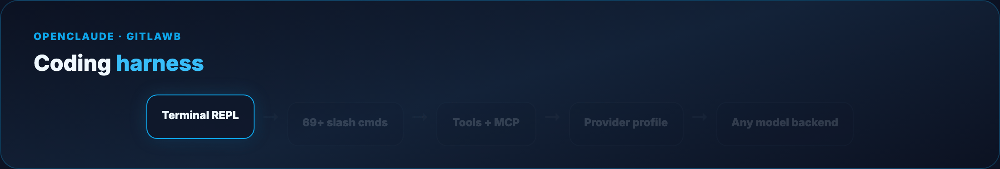

# OpenClaude Agent Masterclass

The **complete OpenClaude guide** — install, **69+ slash commands**, `/provider` profiles, MCP, skills, permissions, background sessions, and agent routing.

**Official:** [openclaude.gitlawb.com/docs](https://openclaude.gitlawb.com/docs/) · **Source:** [github.com/Gitlawb/openclaude](https://github.com/Gitlawb/openclaude)

> Open-source coding agent by **GitLawb** — *runs anywhere. uses anything.* One terminal CLI for OpenAI-compatible APIs, Gemini, GitHub Models, Ollama, Codex OAuth, and more.

## What you'll build

- OpenClaude installed via `@gitlawb/openclaude`
- Provider wired with **`/provider`** → saved `.openclaude-profile.json`
- First coding task with permission-gated tools
- **`/init`** project instructions, **`/mcp`**, **`/skills`**, **`/permissions`**
- Review workflow: **`/diff`**, **`/rewind`**, **`/cost`**
- Optional **background session** (`openclaude --bg`) and **agent routing**



**One-GIF overview (blog hero):** [mega-openclaude-everything.gif](assets/mega-openclaude-everything.gif) — install → provider → task → review → MCP in ~12s.

## Quick start

```bash
npm install -g @gitlawb/openclaude@latest
cd /path/to/your/project
openclaude
/provider          # guided setup — saves profile
> add retry logic to the fetch client, then run tests
/diff              # review changes before commit
```

## Guide map

- **[Full tutorial](./TUTORIAL.md)** — Parts 1–18 (architecture → agent routing)
- **[Examples](./examples/)** — provider env snippet, agent routing JSON, skill front-matter
- **[Assets](./assets/)** — diagram + terminal GIFs, blog poster

## Related guides

- [OpenCode Agent Masterclass](../opencode-agent-masterclass/) · [Claude Code `.claude/`](../claude-code-dot-claude/)
- [Harness Engineering](../harness-engineering/) · [MCP Visual Guide](../mcp-visual-guide/)
- [ZeroClaw Agent Masterclass](../zeroclaw-agent-masterclass/)

**Blog header:** `assets/blog-poster-1200x600.png` · Regenerate: `cd assets && python3 render_gifs.py all && python3 render_blog_poster.py`

## License

Guide: MIT · OpenClaude: upstream MIT · Community tutorial — not affiliated with GitLawb.
