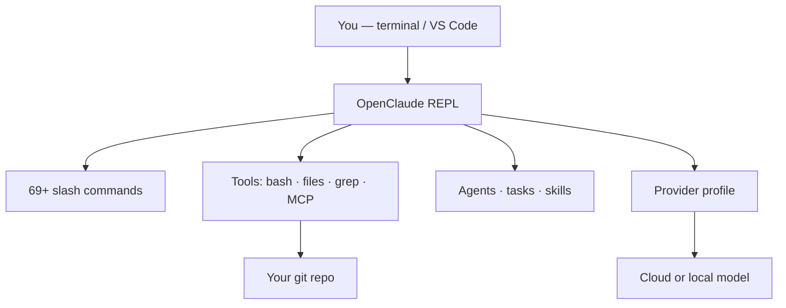
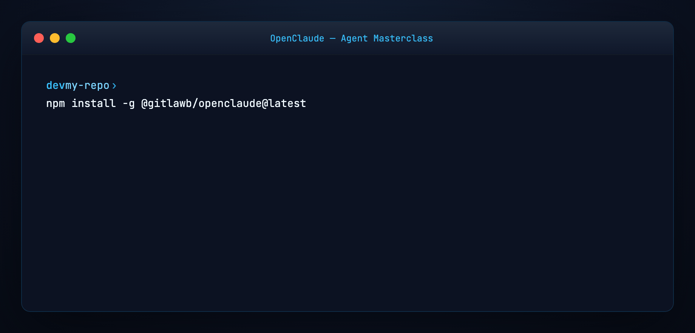
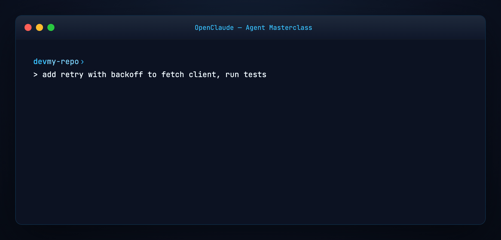
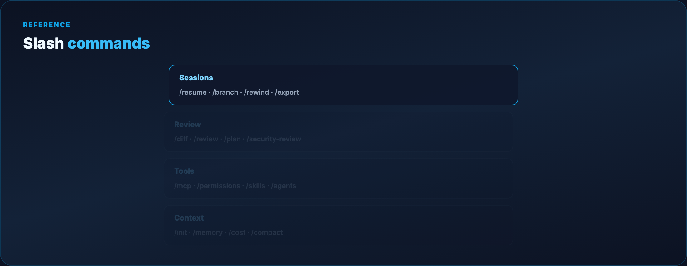
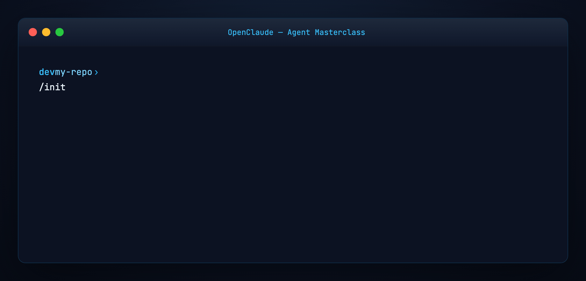
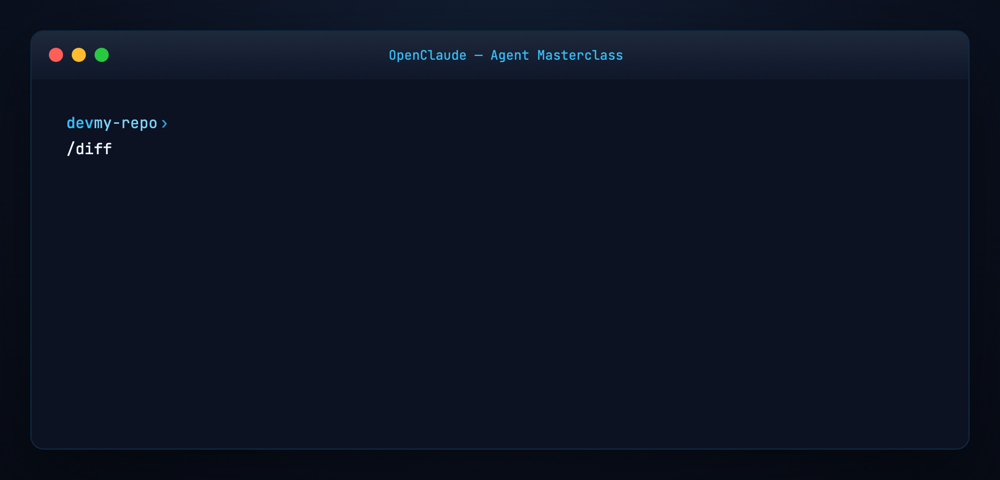
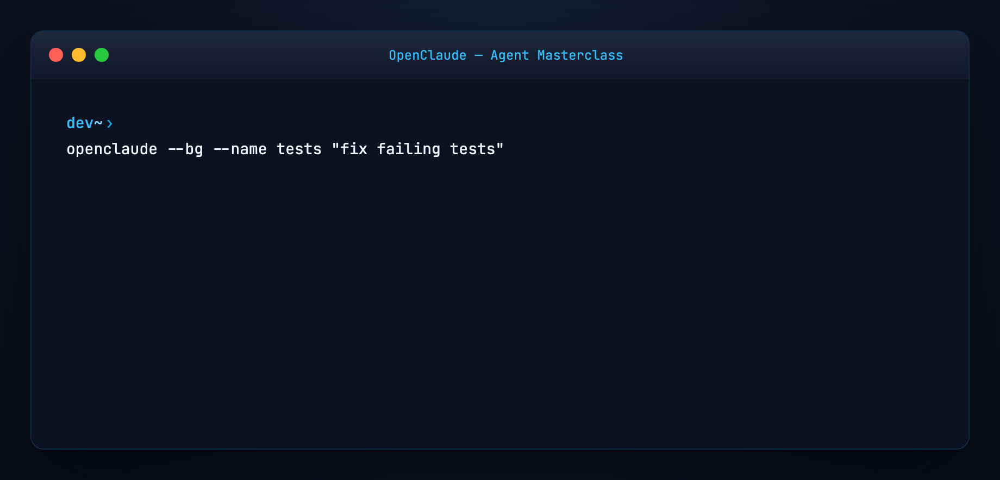
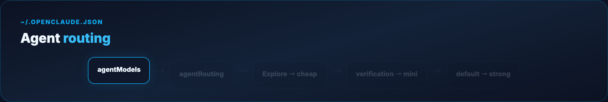

# OpenClaude Agent Masterclass — Full Tutorial

Everything you need to **install, configure, and master** [OpenClaude](https://github.com/Gitlawb/openclaude) — GitLawb's open-source terminal coding agent with 69+ slash commands, multi-provider support, MCP, skills, and permission-gated tools.

**Official docs:** [openclaude.gitlawb.com/docs](https://openclaude.gitlawb.com/docs/) · **Source:** [github.com/Gitlawb/openclaude](https://github.com/Gitlawb/openclaude) · **npm:** `@gitlawb/openclaude`

This guide matches our [OpenCode Agent Masterclass](../opencode-agent-masterclass/TUTORIAL.md) format: **prose and lists**, plus **diagram and terminal GIFs** at 1200×600.

---

## Media assets (copy for Medium)

| Asset | URL |
|-------|-----|
| Mega overview | `https://ayush7614.github.io/agentic-ai-ecosystem/guides/openclaude-agent-masterclass/assets/mega-openclaude-everything.gif` |
| Harness stack | `https://ayush7614.github.io/agentic-ai-ecosystem/guides/openclaude-agent-masterclass/assets/diagram-openclaude-stack.gif` |
| Provider profiles | `https://ayush7614.github.io/agentic-ai-ecosystem/guides/openclaude-agent-masterclass/assets/diagram-provider-profiles.gif` |
| Slash commands | `https://ayush7614.github.io/agentic-ai-ecosystem/guides/openclaude-agent-masterclass/assets/diagram-slash-commands.gif` |
| Agent routing | `https://ayush7614.github.io/agentic-ai-ecosystem/guides/openclaude-agent-masterclass/assets/diagram-agent-routing.gif` |
| Blog poster | `https://ayush7614.github.io/agentic-ai-ecosystem/guides/openclaude-agent-masterclass/assets/blog-poster-1200x600.png` |

---

## What you'll have at the end

- OpenClaude installed (`npm install -g @gitlawb/openclaude@latest`)
- A **provider profile** saved via `/provider` (or env vars for Ollama/OpenAI)
- Confidence running tasks, reviewing diffs, and rewinding bad edits
- **`/init`** project instructions, **`/mcp`**, **`/skills`**, **`/permissions`** configured
- Optional **background sessions** and **per-agent model routing**

---

## Introduction — runs anywhere, uses anything

OpenClaude is a **terminal-first coding agent harness** maintained by [GitLawb](https://gitlawb.com). One CLI drives cloud APIs and local backends: OpenAI-compatible servers, Gemini, GitHub Models, Codex OAuth, Ollama, Fireworks, OpenRouter, GitLawb Opengateway, OpenCode Zen, and more.

Unlike a chat wrapper, OpenClaude ships a full **tool loop**: bash, file read/write/edit, grep, glob, subagents, MCP servers, web tools, and **69+ slash commands** for sessions, review, memory, and configuration.

The tagline is literal: **runs anywhere** (macOS, Linux, Windows, Android install path) and **uses anything** (swap providers without swapping workflows).


**Docs hub:** [openclaude.gitlawb.com/docs](https://openclaude.gitlawb.com/docs/)

---

## Part 1 — How OpenClaude is structured



**Layers:**

1. **REPL** — interactive session with streaming tokens and tool progress  
2. **Slash commands** — `/provider`, `/diff`, `/mcp`, `/permissions`, …  
3. **Tools** — permission-gated execution; first sensitive use asks approval  
4. **Providers** — saved profiles in `.openclaude-profile.json` or env vars  
5. **Extensions** — MCP, plugins, skills, LSP (`/lsp`), VS Code extension  

OpenClaude does **not** auto-load project `.env` files. Prefer **`/provider`** for credentials, or `openclaude --provider-env-file .env` when you need env-based setup.

---

## Part 2 — Prerequisites

- **Node.js ≥ 22.0.0** (npm install path)  
- **ripgrep** (`rg`) — install system-wide; OpenClaude errors if missing  
- A **git repository** (or empty directory) to work in  
- API key, OAuth path, or local **Ollama** for inference  

```bash
node -v          # v22+
rg --version
openclaude --version   # after install
```

---

## Part 3 — Install

```bash
npm install -g @gitlawb/openclaude@latest
```

Arch Linux (community AUR):

```bash
paru -S openclaude
```

Verify and upgrade:

```bash
openclaude --version
npm view @gitlawb/openclaude dist-tags
npm install -g @gitlawb/openclaude@latest
```



---

## Part 4 — Wire a provider (`/provider`)

Start inside your project:

```bash
cd your-repo
openclaude
```

Run guided setup:

```
/provider
```

This saves **provider profiles** — recommended over raw env vars for most users. Profiles persist in **`.openclaude-profile.json`** (user-level).

**Other onboarding paths:**

| Path | Command |
|------|---------|
| GitHub Models | `/onboard-github` |
| OpenAI env (fast) | See [examples/provider.openai.env.example](./examples/provider.openai.env.example) |
| Ollama local | `/provider` or `OPENAI_BASE_URL=http://localhost:11434/v1` |
| GitLawb Opengateway | Default on fresh install — key from [gitlawb.com/opengateway/keys](https://gitlawb.com/opengateway/keys) |


**Provider table (abbreviated)** — full list in [upstream README](https://github.com/Gitlawb/openclaude#supported-providers):

- OpenAI-compatible (OpenRouter, DeepSeek, Groq, LM Studio, …)  
- Gemini, Fireworks, ClinePass, NEAR AI, Xiaomi MiMo  
- GitHub Models, Codex OAuth, Codex CLI auth  
- Ollama (native chat API, 32k ctx request)  
- OpenCode Zen / OpenCode Go (shared `OPENCODE_API_KEY`)  

---

## Part 5 — First task (quickstart)

Brief the agent like a teammate:

```
> add retry with exponential backoff to the fetch client, then run the tests
```

OpenClaude streams its plan, tool calls, and edits live. **Nothing commits automatically** — you review first.



**Non-interactive one-shot:**

```bash
openclaude -p "explain this repo's auth flow"
```

---

## Part 6 — Slash commands map

OpenClaude ships **69+ built-in slash commands**. Type `/` for autocomplete. Full reference: [slash commands docs](https://openclaude.gitlawb.com/docs/slash-commands/).



**Essential groups:**

| Group | Commands | Purpose |
|-------|----------|---------|
| **Sessions** | `/clear`, `/compact`, `/resume`, `/branch`, `/rewind`, `/export` | History and branching |
| **Context** | `/context`, `/files`, `/init`, `/memory`, `/cost` | What the model sees |
| **Models** | `/model`, `/provider`, `/effort`, `/usage` | Provider and model control |
| **Review** | `/diff`, `/review`, `/security-review`, `/plan` | Code review before commit |
| **Tools** | `/mcp`, `/permissions`, `/skills`, `/agents`, `/lsp` | Harness configuration |
| **UI** | `/config`, `/theme`, `/keybindings`, `/vim` | Terminal UX |

Plugins and skills can register **additional** slash commands.

---

## Part 7 — Project instructions (`/init`)

Initialize harness instructions for the repo:

```
/init
```

Creates project documentation the agent reads on demand — same **harness primitive** as OpenCode's `AGENTS.md` and our [Harness Engineering](../harness-engineering/TUTORIAL.md) guide. **Commit the generated file to git.**

Also useful: **`/wiki init`** for an OpenClaude project wiki, **`/memory`** for persistent user-level memory, **`/dream`** for session consolidation.

---

## Part 8 — Permissions and safety

Tool use is **permission-gated**. First use of sensitive operations prompts approval; persist rules with:

```
/permissions
```

This separates **model intent** from **runtime allowance** — core harness engineering. Tune allow/deny rules per project.



---

## Part 9 — MCP servers

Attach external tools via Model Context Protocol:

```
/mcp
```

Enable/disable servers by name. Same MCP standard as our [MCP Visual Guide](../mcp-visual-guide/TUTORIAL.md) and [MiniCPM-V MCP Server](../minicpm-v-mcp-server/TUTORIAL.md).

Combine with **`/lsp`** for language-server code intelligence in the loop.

---

## Part 10 — Skills and custom agents

**Skills** — packaged workflows with front-matter; list with `/skills`. Example: [examples/skill.example.md](./examples/skill.example.md).

**Agents** — configure subagents with `/agents`. Custom agents support **`maxSteps`** to cap tool loops:

```markdown
---
name: bounded-researcher
maxSteps: 8
---
```

Built-in routable agents include **`Explore`**, **`Plan`**, and **`verification`** (read-only auditor before completion).

---

## Part 11 — Review workflow

Before committing:

```
/diff          # uncommitted + per-turn diffs
/rewind        # restore code and/or conversation
/cost          # session spend
/security-review   # branch security pass
```



Enable **`/auto-fix`** to run lint/test after AI edits. Use **`/plan`** for plan mode (similar in spirit to OpenCode's Plan agent).

---

## Part 12 — Background sessions

Long tasks without blocking your terminal:

```bash
openclaude --bg "fix failing tests"
openclaude --bg --name auth-refactor "refactor auth middleware"
openclaude ps
openclaude logs auth-refactor -f
openclaude kill auth-refactor
```

Background jobs are **local child processes** — not a network daemon. Logs live under `~/.openclaude/bg-sessions/` (or `OPENCLAUDE_CONFIG_DIR`).



---

## Part 13 — Resume and fork conversations

```bash
openclaude --continue
openclaude --resume <session-id>
openclaude --continue --fork-session
```

**Fork** branches conversation history to a new session ID — it does **not** create a git worktree or filesystem copy.

Inside a session: **`/branch`**, **`/resume`**, **`/export`**.

---

## Part 14 — Agent model routing

Route different agents to different models via `~/.openclaude.json`:

```json
{
  "agentModels": { "mini": { "model": "gpt-5-mini" } },
  "agentRouting": {
    "Explore": "mini",
    "verification": "mini",
    "default": "glm-default"
  }
}
```

Full example: [examples/agent-routing.example.json](./examples/agent-routing.example.json).



**Note:** `/provider` sets the **global** session provider. `agentModels` + `agentRouting` override **per subagent** without changing the parent session.

---

## Part 15 — VS Code extension

OpenClaude bundles a **VS Code extension** (`vscode-extension/openclaude-vscode`) for launch integration and theme support. Use **`/ide`** inside a session to manage IDE integrations.

Terminal remains the **power surface**; the extension bridges editor ↔ agent.

---

## Part 16 — OpenClaude vs OpenCode vs Claude Code

| | OpenClaude | OpenCode | Claude Code |
|---|------------|----------|-------------|
| **Maintainer** | GitLawb | Anomaly | Anthropic |
| **Provider setup** | `/provider` profiles | `/connect` | Anthropic-native |
| **Commands** | 69+ slash cmds | TUI shortcuts | IDE-integrated |
| **Strength** | Multi-provider CLI depth | LSP + desktop app | Deep IDE harness |

See [OpenCode masterclass](../opencode-agent-masterclass/TUTORIAL.md) for the Anomaly stack. Many teams pick **OpenClaude** when they need **maximum provider flexibility** in one terminal workflow.

---

## Part 17 — Troubleshooting

| Symptom | Fix |
|---------|-----|
| `ripgrep not found` | `brew install ripgrep` / `apt install ripgrep` |
| Provider errors | `/provider` or `/doctor` |
| Ollama context truncation | Set `OPENCLAUDE_OLLAMA_NUM_CTX` or `OLLAMA_CONTEXT_LENGTH` |
| Subagent overload (Copilot) | `GITHUB_COPILOT_MAX_SUBAGENTS=1` (default) |
| Stale npm version | `npm install -g @gitlawb/openclaude@latest` |

Run **`/doctor`** and **`/status`** for connectivity, model, and tool health.

---

## Part 18 — Hands-on checklist

```bash
npm install -g @gitlawb/openclaude@latest
cd your-repo && openclaude
/provider
/init && git add -A && git commit -m "Add OpenClaude project instructions"
> implement feature X and run tests
/diff
/permissions    # tune rules
/mcp            # optional servers
```

---

## Regenerate visuals

```bash
cd guides/openclaude-agent-masterclass/assets
python3 render_gifs.py all
python3 render_blog_poster.py
cd ../../..
./scripts/prepare-docs.sh
```

---

## Further reading

- [OpenClaude docs](https://openclaude.gitlawb.com/docs/) · [Quickstart](https://openclaude.gitlawb.com/docs/quickstart/) · [Slash commands](https://openclaude.gitlawb.com/docs/slash-commands/)
- [GitHub — Gitlawb/openclaude](https://github.com/Gitlawb/openclaude)
- [Harness Engineering](../harness-engineering/TUTORIAL.md)
- [OpenCode Agent Masterclass](../opencode-agent-masterclass/TUTORIAL.md)

---

## Summary

**OpenClaude** is GitLawb's **provider-agnostic coding harness**: one terminal, saved provider profiles, permission-gated tools, 69+ slash commands, MCP/skills/agents, and review primitives (`/diff`, `/rewind`) that keep you in control.

Install once, run `/provider`, brief it like a teammate, review with `/diff`, and route subagents to cheaper models when you scale up.

The model changes. The harness — permissions, commands, profiles, review — is what makes it shippable.
