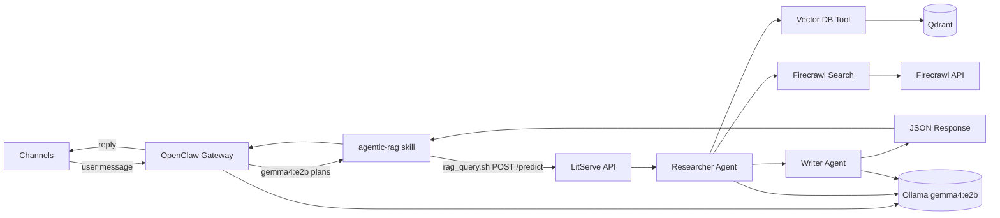
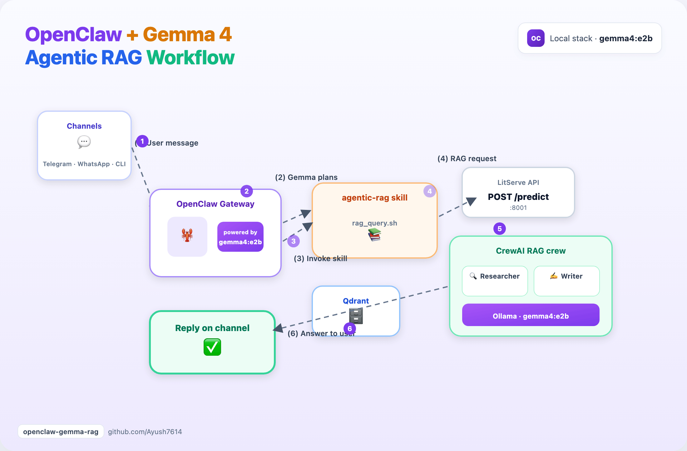

# OpenClaw + Gemma 4 E2B + Agentic RAG

Run a **private messaging assistant** (OpenClaw) on **`gemma4:e2b`**, with a **local RAG crew** (CrewAI + Qdrant) behind an **`agentic-rag` skill**.

Part of the [Agentic AI Ecosystem](https://github.com/Ayush7614/agentic-ai-ecosystem).

## Architecture



1. User messages **OpenClaw** on Telegram, WhatsApp, or CLI  
2. **gemma4:e2b** handles chat and may invoke the **agentic-rag** skill  
3. Skill runs `rag_query.sh` → **LitServe** `POST /predict` on port **8001**  
4. **CrewAI** Researcher + Writer use **Qdrant** (and optional Firecrawl)  
5. Answer returns through OpenClaw to the channel  

| Layer | Role |
|-------|------|
| **OpenClaw** | Channels, sessions, tools, skills, daemon |
| **gemma4:e2b** | Fast local chat + tool planning (~7GB) |
| **agentic-rag skill** | Calls your LitServe `/predict` endpoint |
| **qwen-agentic-rag** | Two-agent RAG API (same `gemma4:e2b` via `.env`) |

## Animated workflow



## Prerequisites

- **Node 22.19+ or 24** (OpenClaw)
- **Ollama** with `gemma4:e2b` pulled
- **Python 3.10+** and working [qwen-agentic-rag](https://github.com/Ayush7614/agentic-ai-ecosystem/tree/main/guides/qwen-agentic-rag) stack (Qdrant data + `server.py`)
- **curl** and **jq** (for the skill scripts)

## Quick start

### 1. RAG API (terminal A)

```bash
cd guides/qwen-agentic-rag
python -m venv .venv && source .venv/bin/activate
pip install -r requirements.txt
ollama pull gemma4:e2b
cp ../openclaw-gemma-rag/env.rag.example .env   # OLLAMA_MODEL=ollama/gemma4:e2b
python setup_vectordb.py   # once
python server.py           # default http://127.0.0.1:8001
```

### 2. OpenClaw + Gemma (terminal B)

```bash
cd guides/openclaw-gemma-rag && source ./use-node22.sh   # Node 22+ required
ollama pull gemma4:e2b
npm install -g openclaw@latest
openclaw onboard --install-daemon
openclaw models set ollama/gemma4:e2b
```

Merge `config/openclaw.snippet.json5` (in this guide folder) into `~/.openclaw/openclaw.json`, then:

```bash
cd guides/openclaw-gemma-rag
chmod +x install-skill.sh skills/agentic-rag/scripts/*.sh
./install-skill.sh
openclaw gateway restart
```

### 3. Test

```bash
# RAG health
RAG_API_URL=http://127.0.0.1:8001 ./skills/agentic-rag/scripts/rag_health.sh

# OpenClaw agent (uses gemma; may call RAG skill for ML questions)
openclaw agent --message "What is cross-validation? Use the knowledge base if helpful." --thinking low
```

## Project layout

| Path | Purpose |
|------|---------|
| `skills/agentic-rag/SKILL.md` | OpenClaw skill instructions |
| `skills/agentic-rag/scripts/rag_query.sh` | POST query to LitServe |
| `install-skill.sh` | Copy skill into `~/.openclaw/workspace/skills/` |
| `use-node22.sh` / `.nvmrc` | Switch to Node 22+ for OpenClaw CLI |
| `env.rag.example` | Gemma `.env` for the RAG crew |
| `test-local.sh` | Smoke test: Ollama, RAG API, skill scripts |
| `assets/openclaw-gemma-rag-workflow.gif` | Animated architecture diagram |
| `assets/render_workflow_gif.py` | Regenerate GIF from HTML source |
| `config/openclaw.snippet.json5` | Model + skill env sample config |
| `TUTORIAL.md` | Full setup (channels, security, troubleshooting) |

## Full tutorial

See [TUTORIAL.md](./TUTORIAL.md).

## Hardware (16GB Mac)

- This guide uses **one model**: `gemma4:e2b` (~7.2GB) for OpenClaw and the RAG crew
- Ollama loads it once; both layers share the same tag
- Close other apps during crew runs; first RAG answer can take several minutes

## Related guides

| Guide | Overlap |
|-------|---------|
| [Hermes vs OpenClaw](../hermes-vs-openclaw/) | Compare OpenClaw with Hermes; migration via `hermes claw migrate` |
| [Awesome Hermes Agent](../awesome-hermes-agent/) | Hermes install + ecosystem |
| [Qwen Agentic RAG](../qwen-agentic-rag/) | RAG API this skill calls |

## Docs

- [OpenClaw Ollama provider](https://docs.openclaw.ai/providers/ollama)
- [OpenClaw Skills](https://docs.openclaw.ai/tools/skills)
- [qwen-agentic-rag guide](https://ayush7614.github.io/agentic-ai-ecosystem/guides/qwen-agentic-rag/)
