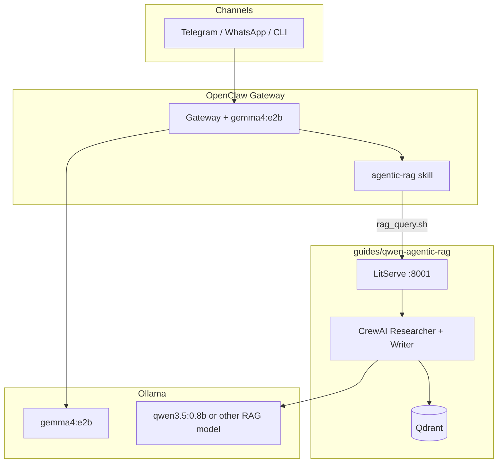

# OpenClaw + Gemma 4 E2B + Agentic RAG

Run a **private messaging assistant** (OpenClaw) on **`gemma4:e2b`**, with a **local RAG crew** (CrewAI + Qdrant) behind an **`agentic-rag` skill**.

Part of the [Agentic AI Ecosystem](https://github.com/Ayush7614/agentic-ai-ecosystem).

## Architecture



| Layer | Role |
|-------|------|
| **OpenClaw** | Channels, sessions, tools, skills, daemon |
| **gemma4:e2b** | Fast local chat + tool planning (~7GB) |
| **agentic-rag skill** | Calls your LitServe `/predict` endpoint |
| **qwen-agentic-rag** | Two-agent RAG API (separate Ollama model tag is fine) |

## Prerequisites

- **Node 22.19+ or 24** (OpenClaw)
- **Ollama** with `gemma4:e2b` pulled
- **Python 3.10+** and working [qwen-agentic-rag](https://github.com/Ayush7614/agentic-ai-ecosystem/tree/main/guides/qwen-agentic-rag) stack (Qdrant data + `server.py`)
- **curl** and **jq** (for the skill scripts)

## Quick start

### 1. RAG API (terminal A)

```bash
cd guides/qwen-agentic-rag
python -m venv .venv && source .venv/bin/activate
pip install -r requirements.txt
cp .env.example .env
ollama pull qwen3.5:0.8b   # RAG crew model; 16GB Mac-friendly
python setup_vectordb.py   # once
python server.py           # default http://127.0.0.1:8001
```

### 2. OpenClaw + Gemma (terminal B)

```bash
ollama pull gemma4:e2b
npm install -g openclaw@latest
openclaw onboard --install-daemon
openclaw models set ollama/gemma4:e2b
```

Merge `config/openclaw.snippet.json5` (in this guide folder) into `~/.openclaw/openclaw.json`, then:

```bash
cd guides/openclaw-gemma-rag
chmod +x install-skill.sh skills/agentic-rag/scripts/*.sh
./install-skill.sh
openclaw gateway restart
```

### 3. Test

```bash
# RAG health
RAG_API_URL=http://127.0.0.1:8001 ./skills/agentic-rag/scripts/rag_health.sh

# OpenClaw agent (uses gemma; may call RAG skill for ML questions)
openclaw agent --message "What is cross-validation? Use the knowledge base if helpful." --thinking low
```

## Project layout

| Path | Purpose |
|------|---------|
| `skills/agentic-rag/SKILL.md` | OpenClaw skill instructions |
| `skills/agentic-rag/scripts/rag_query.sh` | POST query to LitServe |
| `install-skill.sh` | Copy skill into `~/.openclaw/workspace/skills/` |
| `config/openclaw.snippet.json5` | Model + skill env sample config |
| `TUTORIAL.md` | Full setup (channels, security, troubleshooting) |

## Full tutorial

See [TUTORIAL.md](./TUTORIAL.md).

## Hardware (16GB Mac)

- **OpenClaw chat:** `gemma4:e2b` (~7.2GB quantized)
- **RAG crew:** `qwen3.5:0.8b` (or `gemma4:e2b` if you accept serial loading — not both loaded at once on 16GB)
- Run one heavy Ollama model at a time, or set `keep_alive` lower on the smaller tag

## Docs

- [OpenClaw Ollama provider](https://docs.openclaw.ai/providers/ollama)
- [OpenClaw Skills](https://docs.openclaw.ai/tools/skills)
- [qwen-agentic-rag guide](https://ayush7614.github.io/agentic-ai-ecosystem/guides/qwen-agentic-rag/)
