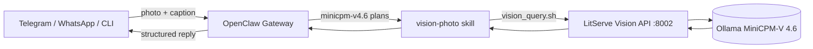
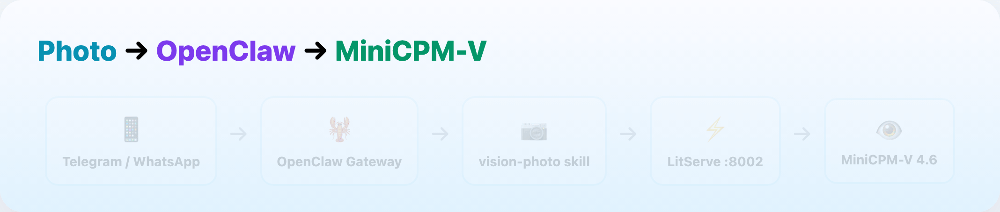
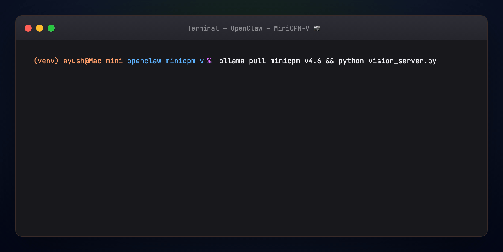

# OpenClaw + MiniCPM-V 4.6 — Photo Assistant on Telegram/WhatsApp

Run a **private messaging assistant** on **`minicpm-v4.6`** (~1.6 GB) with a **vision-photo skill** that sends photos to a local **LitServe API** and returns structured answers on any channel.

Part of the [Agentic AI Ecosystem](https://github.com/Ayush7614/agentic-ai-ecosystem).

## Architecture



1. User sends a **photo** on Telegram, WhatsApp, or CLI  
2. **MiniCPM-V 4.6** handles chat and invokes the **vision-photo** skill  
3. Skill POSTs to **LitServe** `http://127.0.0.1:8002/predict`  
4. MiniCPM-V analyzes the image locally — OCR, summary, suggested channel reply  
5. Answer returns through OpenClaw to the same channel  

| Layer | Role |
|-------|------|
| **OpenClaw** | Channels, sessions, skills, daemon |
| **minicpm-v4.6** | 1.3B vision model — chat + image input (~1.6 GB) |
| **vision-photo skill** | Shells out to `vision_query.sh` |
| **vision_server.py** | LitServe API wrapping Ollama vision calls |

## Animated workflow





## Prerequisites

- **Node 22.12+** or **24** (OpenClaw)
- **Ollama** with `minicpm-v4.6` pulled (~1.6 GB)
- **Python 3.10+**, **curl**, **jq**

## Quick start

### 1. Vision API (terminal A)

```bash
cd guides/openclaw-minicpm-v
python -m venv .venv && source .venv/bin/activate
pip install -r requirements.txt
cp .env.example .env

ollama pull minicpm-v4.6
python generate_sample.py
python vision_server.py    # http://127.0.0.1:8002
```

Verify:

```bash
python client.py --image samples/receipt.png --query "What is the total?"
```

### 2. OpenClaw + MiniCPM-V (terminal B)

```bash
cd guides/openclaw-minicpm-v && source ./use-node22.sh
npm install -g openclaw@latest
openclaw onboard --install-daemon
openclaw models set ollama/minicpm-v4.6
```

Merge `config/openclaw.snippet.json5` into `~/.openclaw/openclaw.json`, then:

```bash
chmod +x install-skill.sh skills/vision-photo/scripts/*.sh
./install-skill.sh
openclaw gateway restart
```

### 3. Test

```bash
./test-local.sh

openclaw agent --message "Analyze samples/receipt.png — what is the total?" --thinking low
```

## Project layout

| Path | Purpose |
|------|---------|
| `vision_server.py` | LitServe POST `/predict` — image_path + query |
| `vision_backend.py` | Ollama MiniCPM-V 4.6 client |
| `client.py` | CLI test client |
| `skills/vision-photo/` | OpenClaw skill + scripts |
| `install-skill.sh` | Copy skill to `~/.openclaw/workspace/skills/` |
| `test-local.sh` | Smoke test Ollama + API + skill |
| `TUTORIAL.md` | Full walkthrough (channels, security, troubleshooting) |

## Hardware (16 GB Mac)

- **MiniCPM-V 4.6** uses ~1.6 GB disk and ~2–4 GB RAM — much lighter than Gemma4-E2B (~7 GB)
- Ideal when you want **vision on messaging** without loading a second large model
- First vision call: 10–30 s model load; later calls faster

## Related guides

| Guide | Overlap |
|-------|---------|
| [MiniCPM-V MCP Server](../minicpm-v-mcp-server/) | Same model as MCP tools in Cursor |
| [OpenClaw + Gemma + RAG](../openclaw-gemma-rag/) | Text RAG skill pattern (this guide adds photos) |
| [MiniCPM-V Benchmark](../minicpm-v-benchmark/) | vs Qwen3.5-0.8B and Gemma4-E2B |

## Full tutorial

See [TUTORIAL.md](./TUTORIAL.md).
