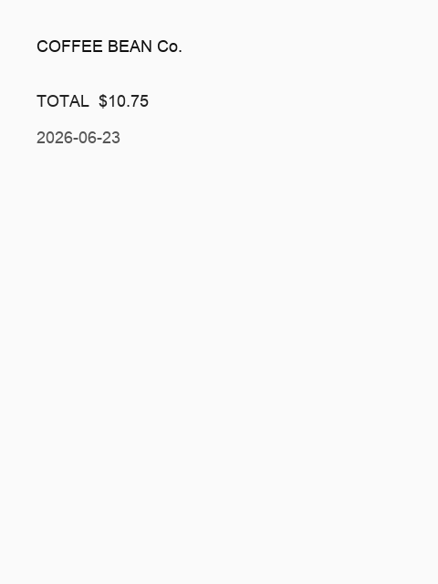

# OpenClaw + MiniCPM-V 4.6 — Full Tutorial

Build a **photo assistant** on Telegram, WhatsApp, or CLI using **MiniCPM-V 4.6**
— a 1.3B vision model that runs comfortably on a **16 GB Mac** — with a local
**LitServe API** and an OpenClaw **vision-photo** skill.

---

## Media assets (copy for Medium)

| Asset | URL |
|-------|-----|
| Workflow GIF | `https://ayush7614.github.io/agentic-ai-ecosystem/guides/openclaw-minicpm-v/assets/openclaw-minicpm-v-workflow.gif` |
| Telegram / terminal demo | `https://ayush7614.github.io/agentic-ai-ecosystem/guides/openclaw-minicpm-v/assets/step-telegram-photo.gif` |
| Sample receipt | `https://ayush7614.github.io/agentic-ai-ecosystem/guides/openclaw-minicpm-v/assets/sample-receipt.png` |

---

## What you end up with

1. **OpenClaw Gateway** — always-on control plane  
2. **minicpm-v4.6** — conversational + vision model (~1.6 GB)  
3. **vision-photo skill** — `vision_query.sh` → POST `/predict` on port **8002**  
4. **Structured markdown replies** — summary, details, OCR text, suggested channel message  


**Flow:**

1. User sends a **photo** on Telegram, WhatsApp, or CLI  
2. **MiniCPM-V 4.6** plans and invokes the **vision-photo** skill  
3. Skill POSTs to LitServe `http://127.0.0.1:8002/predict`  
4. Structured answer returns to the same channel  

---

## Prerequisites

| Requirement | Check |
|-------------|--------|
| Node **22.12+** | `node -v` |
| Ollama | `ollama -v` |
| Python 3.10+ | `python3 --version` |
| curl + jq | `curl --version && jq --version` |

---

## Part 1 — Pull MiniCPM-V 4.6

From [Ollama](https://ollama.com/library/minicpm-v4.6):

```bash
ollama pull minicpm-v4.6
ollama run minicpm-v4.6 "Hello" --image ./photo.jpg
```

| Tag | Size | Input |
|-----|------|-------|
| `minicpm-v4.6:latest` | 1.6 GB | Text, Image |

---

## Part 2 — Vision LitServe API

**Terminal A** — start the vision server:

```bash
cd guides/openclaw-minicpm-v
python -m venv .venv && source .venv/bin/activate
pip install -r requirements.txt
cp .env.example .env
python generate_sample.py
python vision_server.py
```


Server prints: `Vision API on http://127.0.0.1:8002/predict`

**Request shape:**

```json
{
  "query": "What is the total on this receipt?",
  "image_path": "/absolute/path/to/receipt.png"
}
```

**Response:**

```json
{
  "output": "## Summary\n…",
  "model": "minicpm-v4.6",
  "image_path": "…"
}
```

**Sample image** the API reads:



Test with [`client.py`](./client.py):

```bash
python client.py --image samples/receipt.png --query "OCR this receipt"
```

Expected sections in the output: **Summary**, **Details**, **Text found**, **Suggested reply**.

---

## Part 3 — Install OpenClaw

**Terminal B:**

```bash
cd guides/openclaw-minicpm-v
source ./use-node22.sh
npm install -g openclaw@latest
openclaw onboard --install-daemon
openclaw models set ollama/minicpm-v4.6
```

Merge [`config/openclaw.snippet.json5`](./config/openclaw.snippet.json5) into
`~/.openclaw/openclaw.json` — sets primary model and `VISION_API_URL`.

---

## Part 4 — Install vision-photo skill

```bash
chmod +x install-skill.sh skills/vision-photo/scripts/*.sh
./install-skill.sh
openclaw gateway restart
```

The skill tells the agent to run:

```bash
vision_query.sh "/path/to/image.jpg" "user question"
```

See [`skills/vision-photo/SKILL.md`](./skills/vision-photo/SKILL.md).

---

## Part 5 — Telegram / WhatsApp

Follow [OpenClaw channels docs](https://docs.openclaw.ai/) for your platform.
Keep **DM pairing** enabled for security.

When a user sends a photo:

1. OpenClaw saves media to a local path  
2. Agent invokes **vision-photo** with path + caption  
3. LitServe returns structured markdown  
4. Agent sends **Suggested reply** to the channel  


Example channel reply from the demo receipt:

> Your receipt total is **$10.75** ☕

---

## Part 6 — Smoke test

```bash
./test-local.sh
```

Runs: Ollama check → sample image → API health → skill script query.


---

## Troubleshooting

| Symptom | Fix |
|---------|-----|
| `Cannot reach Ollama` | Start Ollama; `ollama pull minicpm-v4.6` |
| Vision API connection refused | `python vision_server.py` in terminal A |
| Skill not found | `./install-skill.sh` + `openclaw gateway restart` |
| Slow first reply | Normal — model cold start |

---

## Next steps

- **[MiniCPM-V MCP](../minicpm-v-mcp-server/TUTORIAL.md)** — same model in Cursor as MCP tools  
- **[MiniCPM-V Benchmark](../minicpm-v-benchmark/TUTORIAL.md)** — compare edge models on 16 GB Mac  
- **[OpenClaw + Gemma + RAG](../openclaw-gemma-rag/TUTORIAL.md)** — add text RAG crew alongside photos  

---

## License

Guide: MIT · MiniCPM-V: Apache-2.0
