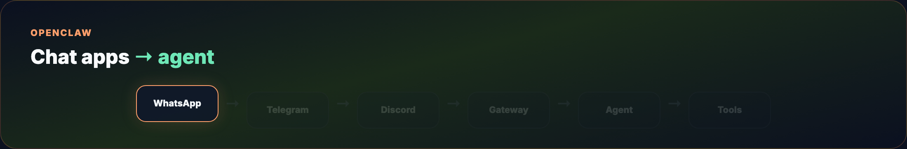

# OpenClaw — Personal AI Assistant

Build a **self-hosted AI assistant** that clears your inbox, runs shell commands, browses the web, and answers on **WhatsApp, Telegram, Discord**, or a dozen other channels — all from hardware you control.

Based on [openclaw.ai](https://openclaw.ai/) and [OpenClaw docs](https://docs.openclaw.ai/). Part of the [Agentic AI Ecosystem](https://github.com/Ayush7614/agentic-ai-ecosystem).

> **Tagline (official):** *The AI that actually does things.*

## What you'll build

- **OpenClaw Gateway** running locally (default dashboard `http://127.0.0.1:18789/`)
- **Onboarded** provider, workspace, and at least one chat channel
- **Persistent memory** and workspace files (`SOUL.md`, skills)
- Optional **ClawHub skill**, **cron job**, and **local model** (Ollama)

## Architecture



## Quick start

```bash
curl -fsSL https://openclaw.ai/install.sh | bash
openclaw onboard --install-daemon
openclaw dashboard
```

Or npm:

```bash
npm install -g openclaw@latest
openclaw onboard --install-daemon
```

## Guide map

- [Tutorial](./TUTORIAL.md) — full walkthrough from install to skills, cron, and multi-agent
- [Examples](./examples/) — sample `openclaw.json` snippets and SOUL template
- [Assets](./assets/) — terminal + diagram GIFs (no table visuals)

## Related guides

- [OpenClaw + Gemma + RAG](../openclaw-gemma-rag/) — local `gemma4:e2b` + RAG skill
- [Hermes vs OpenClaw](../hermes-vs-openclaw/) — when to pick OpenClaw vs Hermes
- [Hermes Agent Masterclass](../hermes-agent-masterclass/) — learning-loop alternative

## Links

- [openclaw.ai](https://openclaw.ai/) · [Docs](https://docs.openclaw.ai/) · [GitHub](https://github.com/openclaw/openclaw) · [ClawHub](https://clawhub.ai) · [Discord](https://discord.gg/openclaw)

**Blog header:** `assets/blog-poster-1200x600.png` (regenerate: `cd assets && python3 render_blog_poster.py`)

## License

Guide: MIT · OpenClaw: MIT (upstream)
