# OpenClaw — Full Tutorial

Everything you need to **install, configure, and extend** [OpenClaw](https://openclaw.ai/) — the open-source personal AI assistant that runs on your machine and talks to you on the chat apps you already use.

**Official home:** [openclaw.ai](https://openclaw.ai/) · **Docs:** [docs.openclaw.ai](https://docs.openclaw.ai/) · **Source:** [github.com/openclaw/openclaw](https://github.com/openclaw/openclaw)

This guide follows the product story on the homepage (install → gateway → memory → tools → skills → channels → automation), uses **prose and lists only** (no comparison tables), and ships **terminal + diagram GIFs** like our Hermes masterclass.

---

## What you'll have at the end

- OpenClaw installed with the **Gateway daemon** running  
- Browser **Control UI** at `http://127.0.0.1:18789/`  
- At least one **messaging channel** (Telegram recommended for first test)  
- A configured **workspace** with `SOUL.md` and optional **ClawHub skill**  
- Understanding of **cron**, **heartbeats**, and **multi-agent routing**  

---

## Introduction — the AI that actually does things

OpenClaw is built for a simple promise: message an assistant from your phone and it **does real work** on your computer — email triage, calendar checks, shell commands, browser tasks, file edits, and custom workflows via skills.

Unlike a chat-only bot, OpenClaw is **self-hosted**. Your context, skills, and session history live on **your** hardware. You pick the model (Anthropic, OpenAI, Google, local Ollama, and more). You control which channels can reach the agent and who is on the allowlist.

Community feedback on [openclaw.ai](https://openclaw.ai/) consistently highlights the same strengths: persistent memory, persona onboarding, proactive cron/heartbeats, and the ability to **extend the system by chatting** (skills, plugins, even prompt hot-reload).


---

## Part 1 — How OpenClaw is structured

OpenClaw centers on one long-running process: the **Gateway**. It is the control plane for:

- **Chat channels** — WhatsApp, Telegram, Discord, Slack, Signal, iMessage, Matrix, Teams, WebChat, and plugin channels  
- **Agent runtime** — tool use, sessions, memory, skills  
- **Control UI** — browser dashboard for chat, config, and diagnostics  
- **Companion apps** — macOS menu bar, Windows tray, iOS/Android **nodes** (camera, voice, Canvas)  

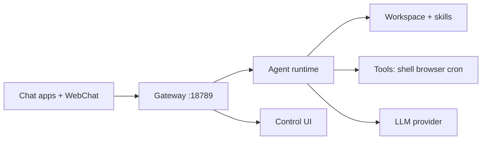

**Docs:** [Architecture](https://docs.openclaw.ai/concepts/architecture) · [Gateway](https://docs.openclaw.ai/gateway)

The Gateway is the **single source of truth** for sessions and routing. CLI commands (`openclaw agent`, `openclaw onboard`) and the dashboard all talk to the same core.

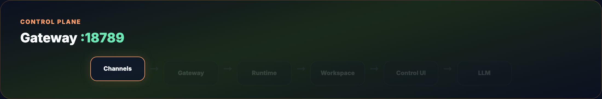

---

## Part 2 — Prerequisites

You need **Node.js 24** (recommended) or **Node 22.19+** for compatibility. OpenClaw fails on older Node versions — if you are stuck on Node 20, use the Node 22 helper from our [OpenClaw + Gemma guide](../openclaw-gemma-rag/use-node22.sh).

You also need:

- macOS, Linux, Windows 10+, or WSL2  
- An API key from your chosen provider **or** a local Ollama install  
- ~5 minutes for onboarding; more if you add WhatsApp or iMessage pairing  

Check:

```bash
node -v    # v22.19+ or v24
which npm
```

---

## Part 3 — Install

Three paths match [openclaw.ai](https://openclaw.ai/#quick-start):

### One-liner (macOS, Linux, WSL)

```bash
curl -fsSL https://openclaw.ai/install.sh | bash
```

The installer can pull Node and dependencies. On macOS, first run may prompt for Administrator access (Homebrew).

### npm global

```bash
npm install -g openclaw@latest
```

### Hackable / from source

```bash
curl -fsSL https://openclaw.ai/install.sh | bash -s -- --install-method git
git clone https://github.com/openclaw/openclaw.git
cd openclaw && corepack enable && pnpm install
pnpm openclaw onboard
```

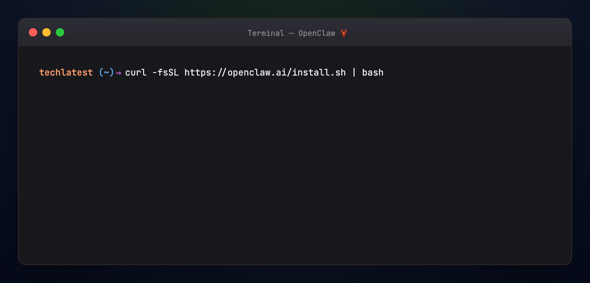

Switch release channels later:

```bash
openclaw update --channel stable   # or dev
```

**Companion apps (beta):** native macOS (15+) and Windows tray apps from [openclaw.ai](https://openclaw.ai/) — gateway control, chat, and node features without living in the terminal.

---

## Part 4 — Onboard the Gateway

Run the guided wizard:

```bash
openclaw onboard --install-daemon
```

The wizard walks through:

1. **Gateway bind** and authentication  
2. **LLM provider** and model (API key or Ollama)  
3. **Workspace** path (default under `~/.openclaw/`)  
4. **Channel** setup (Telegram is the fastest smoke test)  
5. **Daemon** install (launchd on macOS, systemd on Linux) so the Gateway survives reboots  

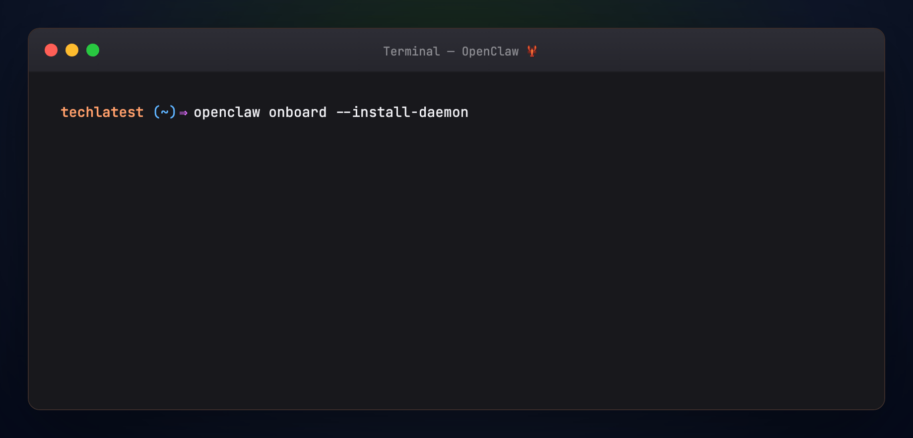

Verify:

```bash
openclaw doctor
openclaw gateway status
```

---

## Part 5 — Open the Control UI

```bash
openclaw dashboard
```

Default URL: **http://127.0.0.1:18789/**

From the dashboard you can chat, inspect sessions, edit config, and diagnose channel connections. Remote access patterns (Tailscale, SSH tunnel) are documented under [Remote access](https://docs.openclaw.ai/remote).

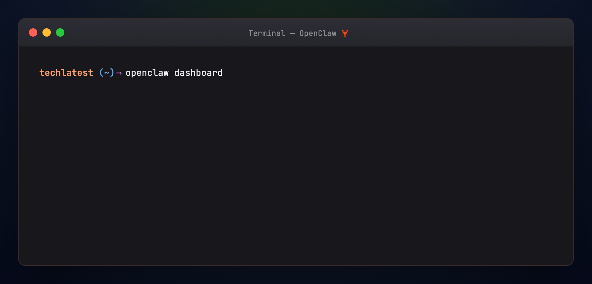

CLI chat without the browser:

```bash
openclaw agent --message "What can you do on this machine?" --thinking low
```

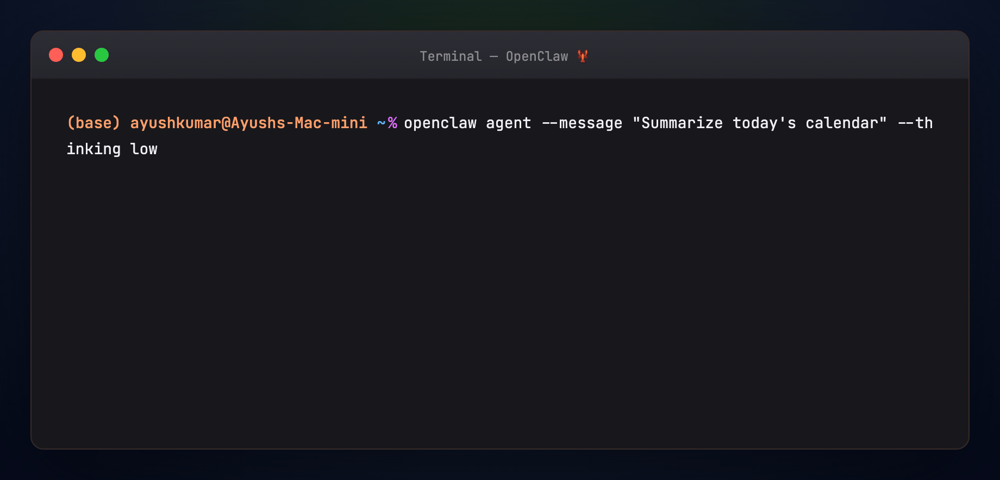

---

## Part 6 — What lives on disk

After onboarding, OpenClaw owns a home directory. Knowing the layout makes debugging easier.

```
~/.openclaw/
├── openclaw.json          # Main config (channels, models, security)
├── workspace/             # Agent workspace
│   ├── AGENTS.md
│   ├── SOUL.md            # Persona / identity
│   ├── TOOLS.md
│   └── skills/            # Installed + custom skills
│       └── <name>/
│           └── SKILL.md
├── credentials/           # Channel tokens (permissions-sensitive)
├── sessions/              # Session metadata
└── …                      # Logs, cron output, plugin state
```

**`openclaw.json`** is the source of truth for non-secret settings. Secrets and tokens route to appropriate credential stores.

**`SOUL.md`** defines who the agent is — tone, boundaries, and behavior. It is the identity layer (similar in spirit to Hermes `SOUL.md`, but living in the workspace).

**`skills/`** is where procedural knowledge lives — bundled skills, ClawHub installs, and agent-authored skills.

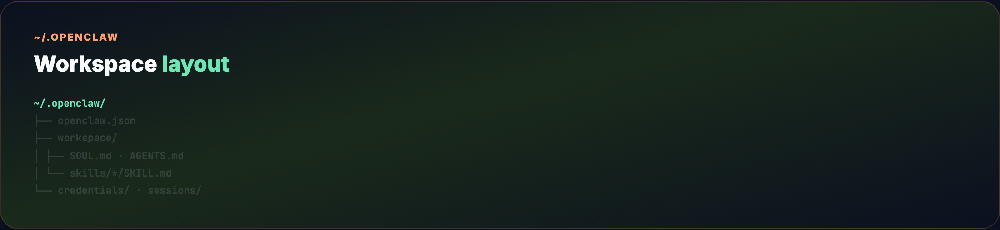

Copy a starter soul from this guide:

```bash
cp guides/openclaw/examples/SOUL.md ~/.openclaw/workspace/SOUL.md
```

---

## Part 7 — Capabilities (from the homepage)

OpenClaw advertises six pillars on [openclaw.ai](https://openclaw.ai/#what-it-does). Here is what each means in practice.

**Runs on your machine.** macOS, Windows, or Linux. Connect Anthropic, OpenAI, Google, or local models. Data stays on your infrastructure unless a tool explicitly calls an external API.

**Any chat app.** One Gateway serves many channels. DMs and group chats are supported; group behavior often uses mention rules so the bot does not reply to every message.

**Persistent memory.** The agent remembers preferences and context across sessions — your assistant becomes specific to you, not a generic chatbot.

**Browser control.** Navigate pages, fill forms, extract data. Useful for research, booking flows, and admin panels that have no API.

**Full system access (configurable).** Read/write files, run shell commands, execute scripts. You choose sandbox vs full access based on trust and host environment.

**Skills and plugins.** Install community skills from ClawHub, add channel plugins, or describe a new workflow in chat and let the agent draft a skill.

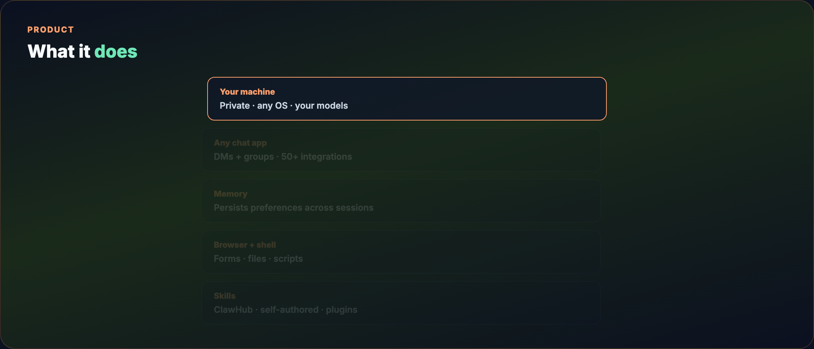

---

## Part 8 — Connect messaging channels

Telegram is the quickest first channel: create a bot with [@BotFather](https://t.me/BotFather), paste the token during onboarding or in config.

WhatsApp and iMessage require additional pairing steps documented in the [Channels hub](https://docs.openclaw.ai/channels).

Minimal allowlist snippet — merge into `~/.openclaw/openclaw.json` (full example in [examples/openclaw-channels.snippet.json](./examples/openclaw-channels.snippet.json)):

```json5
{
  channels: {
    whatsapp: {
      allowFrom: ["+15555550123"],
      groups: { "*": { requireMention: true } },
    },
  },
  messages: { groupChat: { mentionPatterns: ["@openclaw"] } },
}
```

Restart after config changes:

```bash
openclaw gateway restart
```

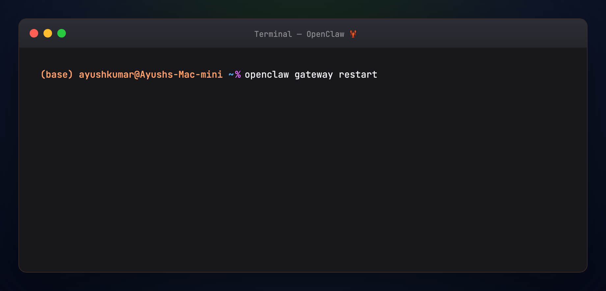

**Security:** start restrictive — allowlist phone numbers and require mentions in groups. See [Security](https://docs.openclaw.ai/security).

Supported surfaces include WhatsApp, Telegram, Discord, Slack, Signal, iMessage, Google Chat, Matrix, Microsoft Teams, Zalo, WebChat, and plugin channels — [50+ integrations](https://openclaw.ai/integrations) on the marketing site.

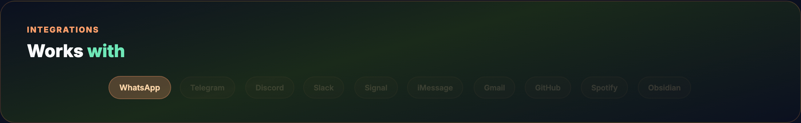

---

## Part 9 — Skills and ClawHub

Skills are Markdown with YAML frontmatter — the agent loads descriptions cheaply and pulls full instructions when a task matches.

Install from ClawHub:

```bash
openclaw skills search calendar
openclaw skills install <skill-slug>
```

Browse [clawhub.ai](https://clawhub.ai). Recent OpenClaw releases emphasize **Skill Cards** and security scanning (SkillSpector) for hub skills — see the [Skill Workshop blog post](https://openclaw.ai/blog).

The agent can also **author skills** from conversation — e.g. “build a skill that checks my WHOOP metrics” — matching patterns described in community shoutouts on the homepage.

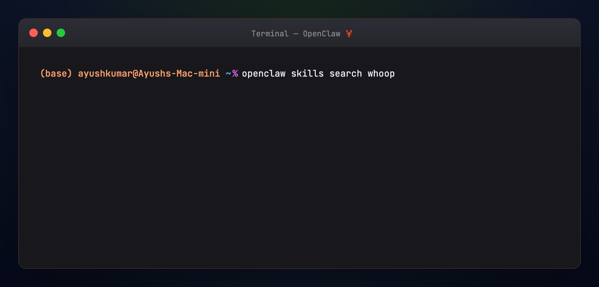

**Skill Workshop (2026):** review and approve proposed skills before they change agent behavior — product direction toward safer self-modification.

Progressive loading keeps token use sane:

- **Catalog view** — names and descriptions only  
- **Full skill** — load `SKILL.md` when triggered  
- **References** — optional deep files inside the skill folder  


Team-private skills: host a git repo and install by slug, same pattern as Hermes Skills Hub taps.

---

## Part 10 — Models and local inference

Set or switch models:

```bash
openclaw models list
openclaw models set anthropic/claude-sonnet-4
# or local:
openclaw models set ollama/gemma4:e2b
```

For a full **local stack** (Ollama + RAG skill), follow [OpenClaw + Gemma + RAG](../openclaw-gemma-rag/TUTORIAL.md).

Providers are swappable without rebuilding the Gateway — the agent runtime handles translation to supported API formats.

---

## Part 11 — Proactive automation: cron and heartbeats

OpenClaw is designed to be **proactive**, not only reactive.

**Cron jobs** schedule isolated agent runs — daily briefings, inbox sweeps, reminders. Describe schedules in natural language or use cron syntax. Jobs persist in config and survive Gateway restarts.

Example prompt inside a chat session:

```text
Every weekday at 8am, summarize my calendar and unread priority emails.
Deliver the summary here. Set this up as a recurring cron job.
```

List jobs:

```bash
openclaw cron list
```

**Heartbeats** are periodic check-ins — the agent may reach out when something needs attention (community reports surprise check-ins during heartbeats). Configure through workspace and gateway settings per docs.

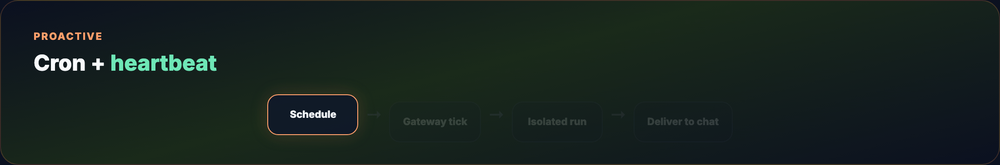

Useful variants:

- One-shot delay: `/cron add 30m "Remind me to check the build"`  
- Interval: `/cron add "every 2h" "Check server status"`  
- Attach a skill: run a job with `--skill <name>` so the agent loads a playbook first  

---

## Part 12 — Multi-agent routing

One Gateway can route **multiple isolated agents** — different workspaces, sessions, or senders. Useful for “work agent” vs “personal agent”, or separate Telegram bots.

Concepts:

- **Session isolation** — conversations do not leak context across routes  
- **Workspace per agent** — distinct `SOUL.md`, skills, and tools  
- **Sender-based routing** — map channels or users to different agents  

Docs: [Multi-agent routing](https://docs.openclaw.ai/multi-agent)

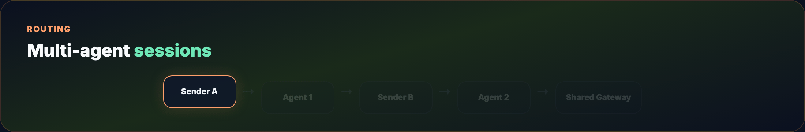

Compare with Hermes **profiles** ([Hermes Profile Builder](../hermes-profile-builder/TUTORIAL.md)) — both solve isolation; OpenClaw optimizes for channel-first routing, Hermes for CLI profile aliases and learning loop.

---

## Part 13 — Nodes, voice, and Canvas

**Mobile nodes** pair iOS/Android apps with the Gateway for camera capture, voice workflows, and Canvas (visual workspace). The macOS/Windows companion apps expose tray controls and local node mode.

Docs: [Nodes](https://docs.openclaw.ai/nodes)

This is how users run “fix production from a dog walk” workflows — phone chat triggers agent execution on a home server or Mac mini.

---

## Part 14 — OpenClaw vs Hermes (prose only)

Both are self-hosted, messaging-friendly agent runtimes. Neither is a hosted SaaS.

**OpenClaw** leads with the **Gateway and channels** — the product feels like “message your computer from WhatsApp.” Skills extend behavior; the community hub (ClawHub) is large; onboarding and Control UI are polished for personal assistants.

**Hermes** leads with the **learning agent** — runtime skill authoring, Curator maintenance, optional GEPA offline validation, and research-oriented tooling (MCP, profiles, training pipeline). See [Hermes Agent Masterclass](../hermes-agent-masterclass/TUTORIAL.md).

You can migrate between them: `hermes claw migrate` imports OpenClaw-style config into Hermes. Full side-by-side: [Hermes vs OpenClaw](../hermes-vs-openclaw/TUTORIAL.md).

Pick OpenClaw when channel UX, ClawHub, and dashboard-first setup matter most. Pick Hermes when the self-improving skill library and experiment loop matter most. Many operators run one primary runtime and borrow skills from the other ecosystem.

---

## Part 15 — Troubleshooting

**`openclaw: command not found`** — reinstall globally or ensure npm global bin is on `PATH`.

**Gateway will not start** — run `openclaw doctor`; check port 18789 conflicts.

**Node version errors** — upgrade to Node 22.19+ or 24.

**Channel connected but no replies** — verify allowlists, mention rules in groups, and bot token.

**Model errors** — confirm API key in config; test with `openclaw agent --message hi`.

**Docs entry:** [Troubleshooting](https://docs.openclaw.ai/help/troubleshooting)

---

## Part 16 — Verify this guide

```bash
chmod +x guides/openclaw/scripts/verify-openclaw.sh
./guides/openclaw/scripts/verify-openclaw.sh
```

---

## Image placement (Medium / blog)

Match visuals to section breaks:

- After intro → `diagram-gateway-flow.gif`  
- Part 1 architecture → `diagram-gateway-arch.gif`  
- Install → `step-01-install.gif`  
- Onboard → `step-02-onboard.gif`  
- Dashboard → `step-03-dashboard.gif`  
- CLI agent → `step-04-agent.gif`  
- Workspace → `diagram-workspace.gif`  
- Capabilities → `diagram-capabilities.gif`  
- Channels → `step-05-channels.gif` then `diagram-channels.gif`  
- Skills → `step-06-skills.gif` + `diagram-skill-levels.gif`  
- Cron → `diagram-cron-heartbeat.gif`  
- Multi-agent → `diagram-multi-agent.gif`  

---

## Official links

- [openclaw.ai](https://openclaw.ai/) — product home  
- [docs.openclaw.ai](https://docs.openclaw.ai/) — documentation  
- [github.com/openclaw/openclaw](https://github.com/openclaw/openclaw) — source  
- [clawhub.ai](https://clawhub.ai) — skill registry  
- [Discord community](https://discord.gg/openclaw)  

---

## Regenerate visuals

```bash
cd guides/openclaw/assets
python3 render_terminal_gifs.py all
python3 render_diagrams.py all
cd ../../..
./scripts/prepare-docs.sh
```

---

## Summary

OpenClaw is a **Gateway-first personal agent**: install with `openclaw onboard`, chat from the dashboard or your favorite messaging app, extend with **skills** and **cron**, and keep data on your machine. Start with Telegram and the Control UI, tighten security with allowlists, then add ClawHub skills and automation once the loop feels natural.
