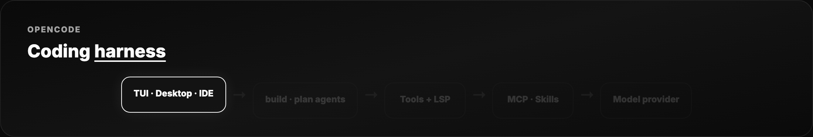

# OpenCode Agent Masterclass

The **complete OpenCode guide** — install, providers, **Build vs Plan** agents, `AGENTS.md`, tools, rules, MCP, skills, and multi-surface usage (TUI, desktop, IDE).

**Official:** [opencode.ai](https://opencode.ai/) · **Docs:** [opencode.ai/docs](https://opencode.ai/docs/) · **Source:** [github.com/anomalyco/opencode](https://github.com/anomalyco/opencode)

> Open-source AI coding agent. Terminal TUI, desktop app (beta), and IDE extension — 75+ model providers, LSP-aware, privacy-first.

## What you'll build

- OpenCode installed and connected to a model provider (Zen, Anthropic, OpenAI, Ollama, or Copilot)
- Project initialized with **`/init`** → committed **`AGENTS.md`**
- Fluency in **Build** vs **Plan** agents (`Tab` to switch)
- MCP servers and **Agent Skills** wired into your workflow
- Terminal walkthroughs: plan → build feature, `@` file refs, `/undo`, `/share`



**One-GIF overview (blog hero):** [mega-opencode-everything.gif](assets/mega-opencode-everything.gif) — install → connect → init → Plan/Build → MCP → share in ~12s.

## Quick start

```bash
curl -fsSL https://opencode.ai/install | bash
cd /path/to/your/project
opencode
/connect          # pick provider + paste API key
/init             # generates AGENTS.md — commit it
```

Press **Tab** to switch **Plan** (read-only analysis) ↔ **Build** (full access).

## Guide map

- **[Full tutorial](./TUTORIAL.md)** — Parts 1–18 (architecture → SDK/plugins)
- **[Examples](./examples/)** — `AGENTS.md` sample, rules snippet, MCP config
- **[Assets](./assets/)** — diagram + terminal GIFs, blog poster

## Related guides

- [Harness Engineering](../harness-engineering/) · [Loop Engineering](../loop-engineering/)
- [Claude Code `.claude/`](../claude-code-dot-claude/) · [MCP Visual Guide](../mcp-visual-guide/)
- [OpenClaw](../openclaw/) · [ZeroClaw Agent Masterclass](../zeroclaw-agent-masterclass/)
- [OpenClaude Agent Masterclass](../openclaude-agent-masterclass/)

**Blog header:** `assets/blog-poster-1200x600.png` · Regenerate: `cd assets && python3 render_blog_poster.py && python3 render_gifs.py all`

## License

Guide: MIT · OpenCode: upstream MIT · Not affiliated with Anomaly — community tutorial only.
