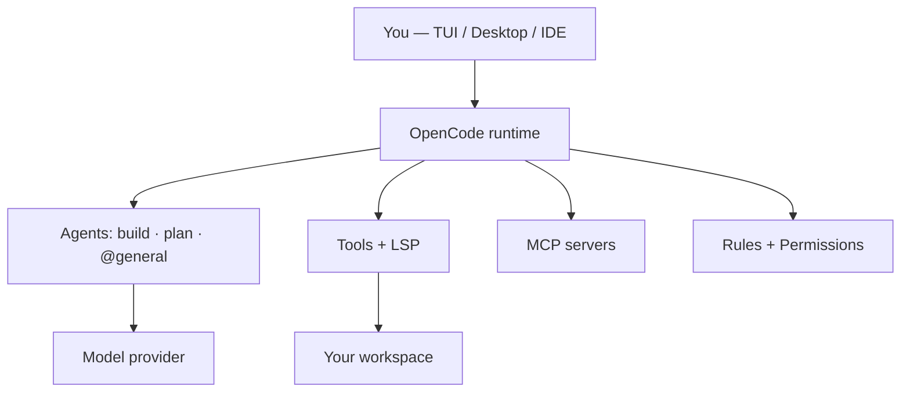
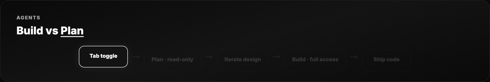
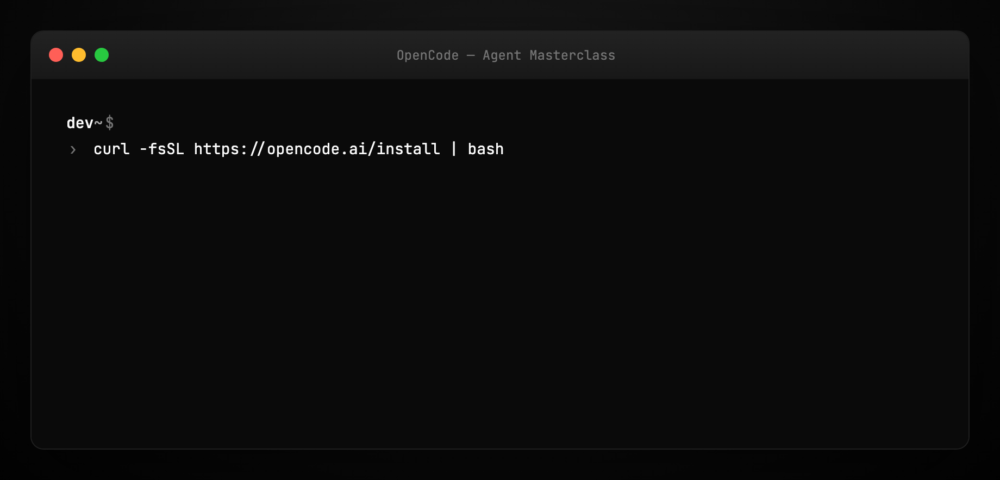
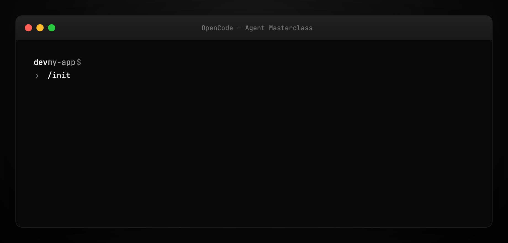
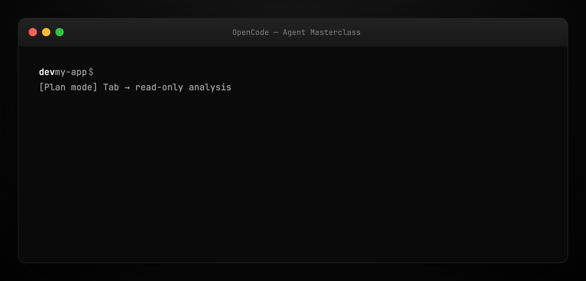
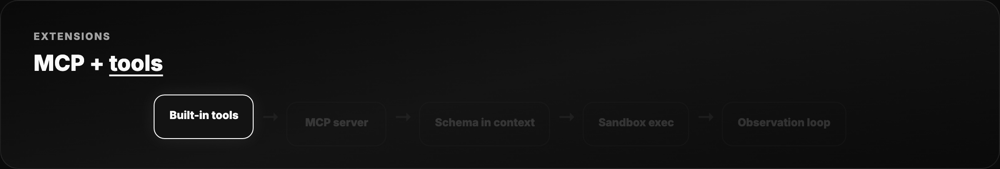
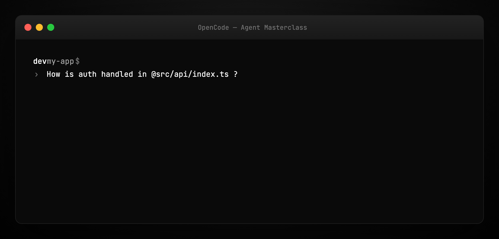
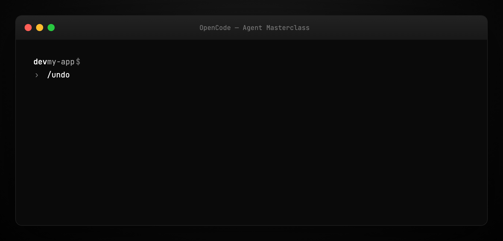

# OpenCode Agent Masterclass — Full Tutorial

Everything you need to **install, configure, and master** [OpenCode](https://opencode.ai/) — the open-source AI coding agent with 179k+ GitHub stars, available as a terminal TUI, desktop app, and IDE extension.

**Official:** [opencode.ai](https://opencode.ai/) · **Docs:** [opencode.ai/docs](https://opencode.ai/docs/) · **Source:** [github.com/anomalyco/opencode](https://github.com/anomalyco/opencode)

This guide matches our [Hermes Agent Masterclass](../hermes-agent-masterclass/TUTORIAL.md) and [OpenClaw](../openclaw/TUTORIAL.md) format: **prose and lists**, plus **terminal and diagram GIFs** at 1200×600.

---

## Media assets (copy for Medium)

| Asset | URL |
|-------|-----|
| Mega overview | `https://ayush7614.github.io/agentic-ai-ecosystem/guides/opencode-agent-masterclass/assets/mega-opencode-everything.gif` |
| Harness stack | `https://ayush7614.github.io/agentic-ai-ecosystem/guides/opencode-agent-masterclass/assets/diagram-opencode-stack.gif` |
| Build vs Plan | `https://ayush7614.github.io/agentic-ai-ecosystem/guides/opencode-agent-masterclass/assets/diagram-build-plan.gif` |
| MCP + tools | `https://ayush7614.github.io/agentic-ai-ecosystem/guides/opencode-agent-masterclass/assets/diagram-mcp-tools.gif` |
| Blog poster | `https://ayush7614.github.io/agentic-ai-ecosystem/guides/opencode-agent-masterclass/assets/blog-poster-1200x600.png` |

---

## What you'll have at the end

- OpenCode installed via curl, npm, or Homebrew
- A provider connected (`/connect`) — Zen, Anthropic, OpenAI, Ollama, or Copilot login
- Project **`AGENTS.md`** from `/init`, committed to git
- **Build** and **Plan** agent modes mastered (`Tab` toggle)
- MCP servers, rules, permissions, and skills configured
- Confidence with `/undo`, `/redo`, `/share`, and `@` file references

---

## Introduction — the coding agent that meets you where you work

OpenCode is not another chat wrapper. It is a **full agent harness** for software work: file edits, shell execution, LSP-aware code intelligence, MCP tool servers, subagents, and multi-session parallelism — all from a terminal UI that also ships as a desktop app and VS Code extension.

The project’s pitch is direct: **privacy-first**, **provider-agnostic** (75+ models via [Models.dev](https://models.dev)), and **open source** under MIT. OpenCode does not store your code or context on their servers when you use local or bring-your-own-key providers.

Community scale matters here: 179k+ stars, 900+ contributors, and a release cadence that ships weekly. That velocity shows up in the product — Plan/Build agents, Zen curated models, ACP support, and a plugin ecosystem documented under [Develop → Ecosystem](https://opencode.ai/docs/).


---

## Part 1 — How OpenCode is structured

OpenCode wraps the model in a **coding harness** with distinct layers:

1. **Surfaces** — TUI (`opencode`), desktop app, IDE extension, web  
2. **Agents** — `build` (full access) and `plan` (read-only analysis)  
3. **Tools** — file ops, search, bash, web, code intelligence, subagent spawn  
4. **Configuration** — rules, permissions, policies, formatters, keybinds  
5. **Extensions** — MCP servers, Agent Skills, custom tools, LSP servers  
6. **Model routing** — any provider with API keys or OAuth (Copilot, ChatGPT Plus)  



The harness owns **when** the model can write files, **which** tools appear in context, and **how** sessions persist. The model owns reasoning inside that boundary.

**Docs map:** [Tools](https://opencode.ai/docs/) · [Rules](https://opencode.ai/docs/) · [Agents](https://opencode.ai/docs/) · [MCP servers](https://opencode.ai/docs/) · [SDK](https://opencode.ai/docs/)



---

## Part 2 — Prerequisites

- **Terminal:** WezTerm, Alacritty, Ghostty, or Kitty recommended ([docs](https://opencode.ai/docs/))
- **macOS, Linux, or WSL** — native Windows supported via Scoop/Chocolatey; WSL preferred
- **API key** from your chosen provider, **or** OpenCode Zen subscription, **or** local Ollama
- **Git repo** for the project you want to work in (for `/init` → `AGENTS.md`)

```bash
node -v    # optional if using npm install path
which opencode   # after install
```

---

## Part 3 — Install

### One-liner (recommended)

```bash
curl -fsSL https://opencode.ai/install | bash
```

Install path priority: `$OPENCODE_INSTALL_DIR` → `$XDG_BIN_DIR` → `$HOME/bin` → `$HOME/.opencode/bin`.

### Package managers

```bash
npm install -g opencode-ai          # or bun / pnpm / yarn
brew install anomalyco/tap/opencode # macOS/Linux — most up to date tap
```

### Desktop app (beta)

Download from [opencode.ai/download](https://opencode.ai/) — macOS (ARM/x64), Windows, Linux (.deb / .rpm / AppImage).



---

## Part 4 — Configure providers

Launch OpenCode and connect a model:

```bash
cd /path/to/your/project
opencode
```

Inside the TUI:

```
/connect
```

**OpenCode Zen** (recommended for beginners): curated models benchmarked for coding agents — sign in at [opencode.ai/auth](https://opencode.ai/auth), paste API key.

**Other providers:** Anthropic, OpenAI, Google, Groq, local Ollama, and more. You can also log in with **GitHub Copilot** or **ChatGPT Plus/Pro** OAuth per [docs](https://opencode.ai/docs/).

Tip: Zen removes the “which model actually works for agents?” guesswork. Self-hosters often pair OpenCode with **Ollama** for fully offline runs.

---

## Part 5 — Initialize the project (`/init`)

After `/connect`, initialize harness files:

```
/init
```

OpenCode analyzes your repository and writes **`AGENTS.md`** at the project root — project structure, conventions, and patterns the agent should respect.

**Commit `AGENTS.md` to git.** This is the same harness primitive we teach in [Harness Engineering](../harness-engineering/TUTORIAL.md): a durable instruction map, not a one-off prompt.

See [examples/AGENTS.md.example](./examples/AGENTS.md.example) for the shape OpenCode generates.



---

## Part 6 — Build vs Plan agents

OpenCode ships two first-class agents — switch with **`Tab`**:

| Agent | Mode | Best for |
|-------|------|----------|
| **build** | Full access — edits, bash, tools | Implementing features, refactors, fixes |
| **plan** | Read-only — no file edits; bash asks permission | Exploring unfamiliar code, designing before coding |

**Workflow OpenCode recommends:**

1. Switch to **Plan** (`Tab`)  
2. Describe the feature in detail — talk like you would to a junior dev  
3. Iterate on the plan; drag-drop reference images into the terminal  
4. Switch to **Build** (`Tab`)  
5. Say: *“Sounds good — go ahead and make the changes.”*

Also available: **`@general`** subagent for complex multi-step search tasks (used internally; you can invoke explicitly).



---

## Part 7 — Tools layer

Tools are the agent’s hands. OpenCode categories include:

- **File operations** — read, write, patch  
- **Search** — ripgrep, glob, `@` fuzzy file picker  
- **Execution** — bash with permission gates  
- **Web** — fetch docs and references  
- **Code intelligence** — **LSP enabled** — loads language servers automatically so the LLM gets symbols, diagnostics, and completions context  
- **Subagents** — `@general` and custom agents  

The harness validates tool calls, enforces permissions, and formats observations back into the loop. See [Configure → Tools](https://opencode.ai/docs/) and [Permissions](https://opencode.ai/docs/).

---

## Part 8 — Rules, permissions, and policies

**Rules** — project-level instructions (often markdown) that shape agent behavior beyond `AGENTS.md`.

**Permissions** — per-tool allow/deny; Plan agent defaults to stricter bash gating.

**Policies** — organizational guardrails when using OpenCode in teams.

This is harness **safety architecture**: the model proposes; the runtime permits. Aligns with [Harness Engineering Part 8](../harness-engineering/TUTORIAL.md) hooks and ratchets — mistakes become permanent constraints.

Example rule snippet: [examples/rules.example.md](./examples/rules.example.md)

---

## Part 9 — MCP servers

OpenCode supports **Model Context Protocol** servers — the same standard covered in our [MCP Visual Guide](../mcp-visual-guide/TUTORIAL.md).

Wire MCP in OpenCode config so the agent can call external tools: databases, browsers, Stripe, vision servers, etc.

```json
{
  "mcpServers": {
    "filesystem": {
      "command": "npx",
      "args": ["-y", "@modelcontextprotocol/server-filesystem", "/path/to/allowed"]
    }
  }
}
```

See [examples/opencode.mcp.example.json](./examples/opencode.mcp.example.json) and [Configure → MCP servers](https://opencode.ai/docs/).



---

## Part 10 — Agent Skills

**Agent Skills** are packaged capability bundles — progressive disclosure so the context window isn’t flooded with every tool definition at startup. OpenCode loads skill front-matter when relevant.

Skills complement MCP: MCP = wire protocol to servers; Skills = curated workflows and instructions the harness injects on demand.

Docs: [Configure → Agent Skills](https://opencode.ai/docs/)

---

## Part 11 — Daily usage patterns

### Ask questions (explore codebase)

Use **`@`** to fuzzy-search files:

```
How is authentication handled in @packages/functions/src/api/index.ts
```

### Add features (plan → build)

See Part 6. Give context, examples, and reference images (drag into terminal).

### Direct changes (no plan phase)

For straightforward work:

```
We need auth on /settings. Mirror the pattern in @packages/functions/src/notes.ts
and apply it in @packages/functions/src/settings.ts
```

### Images in prompts

Drag and drop PNG/JPG into the TUI — OpenCode attaches them to the prompt (useful for UI mockups).



---

## Part 12 — Undo, redo, share

**Undo a bad edit:**

```
/undo
```

Restores files and returns your original message so you can refine the prompt. Run `/undo` multiple times for multi-step rollback.

**Redo:**

```
/redo
```

**Share session with team:**

```
/share
```

Creates a link to the current conversation (not shared by default). Useful for debugging agent loops with teammates.

---

## Part 13 — Multi-session and LSP

OpenCode supports **multiple parallel agent sessions** on the same project — each with isolated context. Great for splitting frontend/backend tasks.

**LSP integration** means the harness feeds semantic code intelligence to the model without you manually pasting types and diagnostics. This is a major differentiator vs raw chat UIs.

---

## Part 14 — Surfaces beyond the terminal

| Surface | Use case |
|---------|----------|
| **TUI** | Primary power-user interface |
| **Desktop** | GUI for those who prefer windows over terminals |
| **IDE extension** | Code-adjacent agent in VS Code / compatible editors |
| **Web** | Documented under [Usage → Web](https://opencode.ai/docs/) |

The **same harness** runs behind each surface — models feel consistent because the tool layer is shared ([Codex parallel](https://openai.com/): one harness, many clients).

---

## Part 15 — SDK, Server, and Plugins

For builders extending OpenCode:

- **SDK** — programmatic access to the agent harness  
- **Server** — run OpenCode as a service other clients attach to  
- **Plugins** — extend behavior without forking core  
- **Ecosystem** — community projects ([docs](https://opencode.ai/docs/))

If you ship a derivative project, OpenCode asks you to clarify in README that it is **not** official — see upstream [CONTRIBUTING](https://github.com/anomalyco/opencode/blob/dev/CONTRIBUTING.md).

---

## Part 16 — OpenCode in the agent landscape

**vs Claude Code:** Both are coding harnesses. Claude Code is Anthropic-native with deep IDE integration; OpenCode is **provider-neutral** and terminal-first with open source transparency.

**vs OpenClaw:** OpenClaw is a **personal assistant gateway** (Telegram, WhatsApp, cron). OpenCode is a **repo coding agent**. Many teams use both — OpenClaw for life ops, OpenCode for shipping code. See [OpenClaw masterclass](../openclaw/TUTORIAL.md).

**vs ZeroClaw:** ZeroClaw is a Rust **multi-channel runtime** with security policy and hardware hooks. OpenCode optimizes for **developer UX in git repos**. See [ZeroClaw masterclass](../zeroclaw-agent-masterclass/TUTORIAL.md).

**Harness link:** OpenCode embodies [Harness Engineering](../harness-engineering/TUTORIAL.md) — `AGENTS.md`, permissions, verification via LSP/tests, scoped Plan mode.

---

## Part 17 — Troubleshooting

| Symptom | Fix |
|---------|-----|
| `opencode: command not found` | Re-run install; check `$PATH` includes `~/.opencode/bin` |
| Provider errors | Re-run `/connect`; verify API key billing |
| Agent edits wrong files | Strengthen `AGENTS.md`; add rules; use Plan first |
| Context feels stale | Re-run `/init` after major restructure |
| Old version bugs | Remove pre-0.1.x installs before upgrading (upstream note) |

---

## Part 18 — Hands-on checklist

```bash
curl -fsSL https://opencode.ai/install | bash
cd your-repo && opencode
/connect
/init && git add AGENTS.md && git commit -m "Add OpenCode AGENTS.md"
# Tab → Plan → describe feature → Tab → Build → implement
/share    # optional — link for teammate
```



---

## Regenerate visuals

```bash
cd guides/opencode-agent-masterclass/assets
python3 render_gifs.py all
python3 render_blog_poster.py
cd ../../..
./scripts/prepare-docs.sh
```

---

## Further reading

- [OpenCode docs](https://opencode.ai/docs/) · [GitHub](https://github.com/anomalyco/opencode)
- [Harness Engineering](../harness-engineering/TUTORIAL.md)
- [MCP Visual Guide](../mcp-visual-guide/TUTORIAL.md)
- [Claude Code `.claude/`](../claude-code-dot-claude/TUTORIAL.md)

---

## Summary

**OpenCode** is a production-grade **coding agent harness**: provider-flexible, LSP-aware, MCP-ready, with Plan/Build agent modes and first-class `AGENTS.md` initialization. Install once, `/connect`, `/init`, and treat the TUI as mission control for your repo — not a chat sidebar.

The model writes the code. The harness decides what it’s allowed to touch, what it sees, and when “done” means done.
