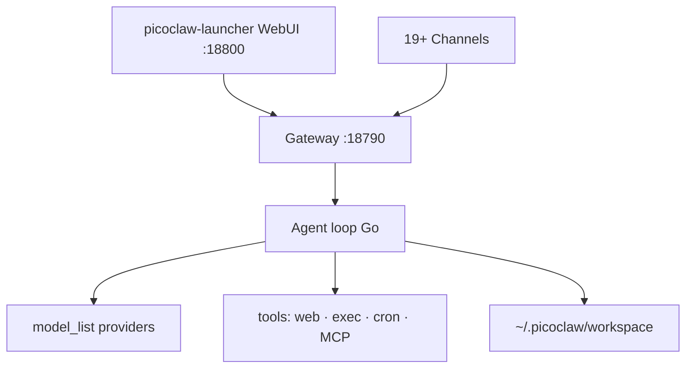
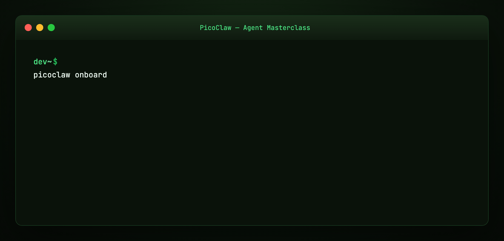
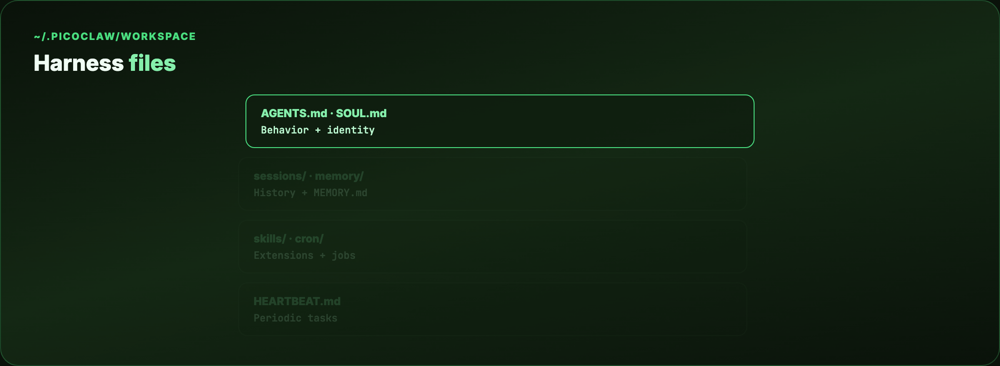
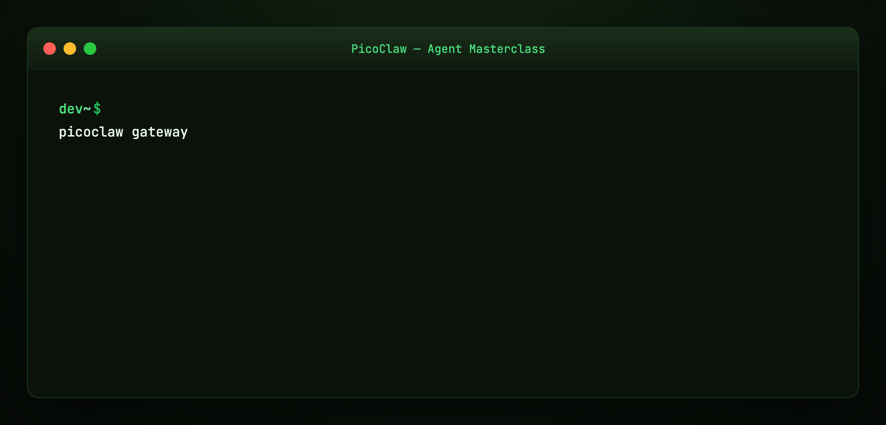
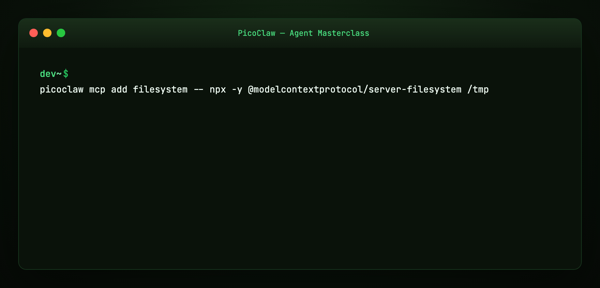
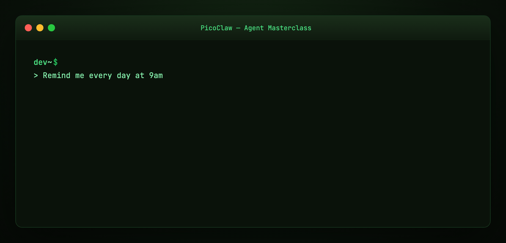

# PicoClaw Agent Masterclass — Full Tutorial

Everything you need to **install, configure, and deploy** [PicoClaw](https://github.com/sipeed/picoclaw) — Sipeed's ultra-lightweight Go AI assistant for $10 boards, old phones, and full desktops.

**Official docs:** [docs.picoclaw.io](https://docs.picoclaw.io/) · **Download:** [picoclaw.io](https://picoclaw.io/) · **Source:** [github.com/sipeed/picoclaw](https://github.com/sipeed/picoclaw)

This guide matches our [ZeroClaw](../zeroclaw-agent-masterclass/TUTORIAL.md) and [OpenClaw](../openclaw/TUTORIAL.md) format: **prose and lists**, plus **diagram and terminal GIFs** at 1200×600.

---

## Media assets (copy for Medium)

| Asset | URL |
|-------|-----|
| Mega overview | `https://ayush7614.github.io/agentic-ai-ecosystem/guides/picoclaw-agent-masterclass/assets/mega-picoclaw-everything.gif` |
| Harness stack | `https://ayush7614.github.io/agentic-ai-ecosystem/guides/picoclaw-agent-masterclass/assets/diagram-picoclaw-stack.gif` |
| Workspace | `https://ayush7614.github.io/agentic-ai-ecosystem/guides/picoclaw-agent-masterclass/assets/diagram-workspace-anatomy.gif` |
| Channels | `https://ayush7614.github.io/agentic-ai-ecosystem/guides/picoclaw-agent-masterclass/assets/diagram-channels-map.gif` |
| Blog poster | `https://ayush7614.github.io/agentic-ai-ecosystem/guides/picoclaw-agent-masterclass/assets/blog-poster-1200x600.png` |

---

## What you'll have at the end

- PicoClaw running via **WebUI launcher** (`http://localhost:18800`) or CLI
- LLM provider configured (OpenRouter, Ollama, Zhipu, OpenAI, …)
- **Telegram** (or another channel) connected through the **gateway**
- Workspace harness files understood (`AGENTS.md`, `SOUL.md`, `USER.md`)
- Optional **MCP**, **ClawHub skills**, **web search**, and **cron** jobs

---

## Introduction — AI on $10 hardware

PicoClaw is an **independent open-source project by Sipeed**, written in **Go from scratch** — not a fork of OpenClaw, NanoBot, or ZeroClaw. It was **AI-bootstrapped**: ~95% of core code agent-generated, human-refined.

The numbers from [docs.picoclaw.io](https://docs.picoclaw.io/):

| Metric | PicoClaw | Typical alternatives |
|--------|----------|---------------------|
| **RAM** | <10MB core* | OpenClaw >1GB, NanoBot >100MB |
| **Boot** | <1s on 0.6GHz | OpenClaw >500s, NanoBot >30s |
| **Cost** | $10 Linux board | Mac mini $599 |
| **Binary** | Single Go binary | Node/Python stacks |

\*Recent builds may use 10–20MB during rapid development; optimization is on the roadmap.


**Security notice:** Official domains only — **picoclaw.io** and **sipeed.com**. No official crypto tokens. Early-stage software — not production-hardened before v1.0.

---

## Part 1 — Architecture



**Components:**

- **picoclaw-launcher** — browser UI for provider, channel, gateway config ([Getting Started](https://docs.picoclaw.io/docs/getting-started))
- **Gateway** — HTTP server for webhooks + channel orchestration (default `127.0.0.1:18790`)
- **Agent** — tool loop with SubTurn, Hooks, EventBus (v0.2.4+)
- **Workspace** — sessions, memory, skills, harness markdown files
- **`.security.yml`** — API keys separated from `config.json` (v1+ migration)

---

## Part 2 — Install paths

### Recommended: picoclaw.io download

Visit **[picoclaw.io](https://picoclaw.io/)** — auto-detects platform (Linux ARM/x86, macOS, Windows, Android APK).

### GitHub releases

```bash
wget https://github.com/sipeed/picoclaw/releases/latest/download/picoclaw_Linux_x86_64.tar.gz
tar xzf picoclaw_Linux_x86_64.tar.gz
```

### Build from source (Go 1.25+)

```bash
git clone https://github.com/sipeed/picoclaw.git && cd picoclaw
make deps && make build && make build-launcher
```

### Docker

```bash
git clone https://github.com/sipeed/picoclaw.git && cd picoclaw
docker compose -f docker/docker-compose.yml --profile launcher up -d
# http://localhost:18800
```


---

## Part 3 — WebUI quickstart (recommended)

```bash
picoclaw-launcher
# Browser → http://localhost:18800
```

**Four steps in the UI:**

1. **Configure Provider** — add LLM API key / pick model  
2. **Configure Channel** — e.g. Telegram bot token  
3. **Start Gateway**  
4. **Chat**

Remote/Docker/VM access:

```bash
picoclaw-launcher -public
# or PICOCLAW_GATEWAY_HOST=0.0.0.0
```

Full WebUI docs: [docs.picoclaw.io](https://docs.picoclaw.io/)

---

## Part 4 — CLI path (`onboard`)

For headless / edge devices without launcher UI:

```bash
picoclaw onboard
```

Creates `~/.picoclaw/config.json` and workspace.

```bash
picoclaw agent -m "What is 2+2?"
picoclaw agent          # interactive
picoclaw gateway        # for chat apps
```



Example config: [examples/config.minimal.json](./examples/config.minimal.json)

---

## Part 5 — Configuration (`config.json` v2)

Config file: **`~/.picoclaw/config.json`** — schema version **2** ([Configuration Overview](https://docs.picoclaw.io/docs/configuration)).

| Section | Purpose |
|---------|---------|
| `version` | Schema (current: `2`) |
| `agents.defaults` | Default model, workspace, limits |
| `model_list` | LLM providers (`protocol/model` format) |
| `channels` | Telegram, Discord, Slack, … |
| `tools` | Web search, exec, cron, skills, MCP |
| `bindings` | Route messages to specific agents |
| `gateway` | Host, port, log level |
| `heartbeat` | Periodic tasks (every 30 min checks `HEARTBEAT.md`) |

**Secrets** go in **`.security.yml`**, not `config.json` — share config safely, keep keys in `.gitignore`.

Environment overrides: `PICOCLAW_HOME`, `PICOCLAW_CONFIG`, `PICOCLAW_AGENTS_DEFAULTS_MODEL_NAME`, etc.

---

## Part 6 — Providers (30+ LLMs)

Use **`protocol/model`** in `model_list`:

```json
{
  "model_list": [
    {
      "model_name": "gpt-main",
      "model": "openai/gpt-5.4"
    },
    {
      "model_name": "local-llama",
      "model": "ollama/llama3.1:8b",
      "api_base": "http://localhost:11434/v1"
    }
  ],
  "agents": {
    "defaults": { "model_name": "gpt-main" }
  }
}
```

**Supported families** (abbreviated): OpenAI, Anthropic, Gemini, OpenRouter, Zhipu, DeepSeek, Qwen, Groq, Ollama, vLLM, LiteLLM, GitHub Copilot OAuth, AWS Bedrock, Azure, and more — see [upstream provider table](https://github.com/sipeed/picoclaw#-providers-llm).

**Free-tier starting points** ([Getting Started API comparison](https://docs.picoclaw.io/docs/getting-started)):

| Service | Free tier |
|---------|-----------|
| OpenRouter | 200K tokens/month |
| Brave Search | 2000 queries/month |
| Tavily | 1000 queries/month |
| Groq / Cerebras | Free inference tiers |

---

## Part 7 — Workspace harness files

Default workspace: **`~/.picoclaw/workspace/`**



```
~/.picoclaw/workspace/
├── sessions/       # conversation history
├── memory/         # long-term MEMORY.md
├── cron/           # scheduled jobs DB
├── skills/         # custom SKILL.md files
├── AGENTS.md       # behavior guide
├── SOUL.md         # agent identity
├── USER.md         # user preferences
├── TOOLS.md        # tool descriptions
└── HEARTBEAT.md    # periodic task prompts
```

Same **harness primitives** as [Harness Engineering](../harness-engineering/TUTORIAL.md) — map-not-encyclopedia instructions on disk.

---

## Part 8 — Channels (19+ chat apps)

Talk to PicoClaw on the apps you already use:


| Channel | Difficulty | Notes |
|---------|------------|-------|
| **Telegram** | Easy | Bot token, long polling |
| **Discord** | Easy | Bot token + intents |
| **WhatsApp** | Easy | QR or bridge |
| **Slack** | Easy | Socket Mode |
| **QQ, LINE, WeCom, Feishu, DingTalk** | Medium | Popular in Asia |
| **Matrix, IRC, MQTT** | Medium | Self-hosted friendly |

**Telegram example:** [examples/channel.telegram.json](./examples/channel.telegram.json)

**Troubleshooting:** Only one `picoclaw gateway` instance — "Conflict: terminated by other getUpdates" means a duplicate bot poller.



Gateway default: `127.0.0.1:18790`. Webhook channels share one HTTP server.

---

## Part 9 — Web search

Enable in `tools.web` — strongly recommended for real-world tasks ([Getting Started](https://docs.picoclaw.io/docs/getting-started)).

| Engine | API key | Notes |
|--------|---------|-------|
| DuckDuckGo | No | Built-in fallback |
| Brave | Yes | 2000 free/month |
| Tavily | Yes | AI-agent optimized |
| Baidu | Yes | China content |
| SearXNG | Self-host | Metasearch |

Without search configured, you'll see **"API key configuration issue"** — expected until you add a key or use DuckDuckGo fallback.

---

## Part 10 — MCP (Model Context Protocol)

Native MCP support — extend tools without forking core:

```json
{
  "tools": {
    "mcp": {
      "enabled": true,
      "servers": {
        "filesystem": {
          "enabled": true,
          "command": "npx",
          "args": ["-y", "@modelcontextprotocol/server-filesystem", "/tmp"]
        }
      }
    }
  }
}
```

CLI management:

```bash
picoclaw mcp add filesystem -- npx -y @modelcontextprotocol/server-filesystem /tmp
picoclaw mcp list
picoclaw mcp test filesystem
```

See [examples/mcp.example.json](./examples/mcp.example.json) and our [MCP Visual Guide](../mcp-visual-guide/TUTORIAL.md).



Web UI also supports MCP server management (v0.2.9+).

---

## Part 11 — Skills (ClawHub)

Skills load from **`SKILL.md`** in workspace:

```bash
picoclaw skills search "web scraping"
picoclaw skills install <skill-name>
```

Configure registries in `tools.skills.registries` (ClawHub, GitHub). Progressive capability extension — same pattern as OpenClaw skills and OpenCode Agent Skills.

---

## Part 12 — Cron and heartbeat

**Cron tool** — natural language scheduling:

- "Remind me in 10 minutes"  
- "Remind me every 2 hours"  
- "Remind me at 9am daily"  

Jobs stored in `~/.picoclaw/workspace/cron/`.

**Heartbeat** — checks `HEARTBEAT.md` every ~30 minutes for periodic autonomous tasks. Configure in `config.json` → `heartbeat` section.



---

## Part 13 — Vision pipeline

Send **images and files** to the agent — automatic base64 encoding for multimodal LLMs. Useful on MaixCam deployments and desktop chat.

---

## Part 14 — Smart model routing

Rule-based routing sends simple queries to **cheap/local models**, complex ones to stronger APIs — saves cost on edge hardware with intermittent cloud access.

Configure via `bindings` and agent defaults in [Configuration](https://docs.picoclaw.io/docs/configuration).

---

## Part 15 — Edge and Android deployment

**Hardware targets:**

- **LicheeRV-Nano** (~$10) — RISC-V home assistant  
- **Raspberry Pi Zero 2 W** — `make build-linux-arm` or `arm64`  
- **MaixCAM / NanoKVM** — camera and server ops  
- **Android** — APK from [picoclaw.io/download](https://picoclaw.io/download/) or Termux  

PicoClaw's pitch: give a **decade-old phone** a second life as your AI assistant.

---

## Part 16 — PicoClaw vs OpenClaw vs ZeroClaw

| | PicoClaw | OpenClaw | ZeroClaw |
|---|----------|----------|----------|
| **Language** | Go | TypeScript | Rust |
| **RAM** | ~10MB | >1GB | Small binary |
| **Focus** | Edge / $10 HW | Full desktop assistant | Security-first runtime |
| **UI** | WebUI launcher | Control UI + nodes | Gateway dashboard |

PicoClaw wins when **RAM and boot time** matter. OpenClaw/ZeroClaw win when you need **maximum channel depth and desktop integration** on a full machine.

See [OpenClaw masterclass](../openclaw/TUTORIAL.md) · [ZeroClaw masterclass](../zeroclaw-agent-masterclass/TUTORIAL.md).

---

## Part 17 — Troubleshooting

| Symptom | Fix |
|---------|-----|
| Web search API error | Add Brave/Tavily key or use DuckDuckGo |
| Telegram conflict | Stop duplicate `picoclaw gateway` |
| macOS blocked launcher | System Settings → Privacy → Open Anyway |
| Content filtering (Zhipu) | Rephrase or switch model |
| High RAM vs advertised | Recent PR merges; optimization planned |

Docs: [Getting Started troubleshooting](https://docs.picoclaw.io/docs/getting-started)

---

## Part 18 — Hands-on checklist

```bash
# Desktop path
picoclaw-launcher
# WebUI: Provider → Channel → Gateway → Chat

# CLI path
picoclaw onboard
picoclaw agent -m "Summarize this project's README"
picoclaw gateway

# Extras
picoclaw mcp list
picoclaw skills search "calendar"
```

---

## Regenerate visuals

```bash
cd guides/picoclaw-agent-masterclass/assets
python3 render_gifs.py all
python3 render_blog_poster.py
cd ../../..
./scripts/prepare-docs.sh
```

---

## Further reading

- [PicoClaw docs](https://docs.picoclaw.io/) · [GitHub](https://github.com/sipeed/picoclaw) · [picoclaw.io](https://picoclaw.io/)
- [Configuration](https://docs.picoclaw.io/docs/configuration) · [Getting Started](https://docs.picoclaw.io/docs/getting-started)
- [Harness Engineering](../harness-engineering/TUTORIAL.md)
- [OpenClaw](../openclaw/TUTORIAL.md)

---

## Summary

**PicoClaw** proves agent harnesses don't need gigabytes of RAM. A **Go binary**, a **WebUI launcher**, **30+ providers**, **19+ channels**, MCP, skills, and workspace harness files — all runnable on hardware that costs less than lunch.

Download from [picoclaw.io](https://picoclaw.io/), configure in the browser, start the gateway, and chat from Telegram. The model is swappable. The **edge-native harness** is the product.
