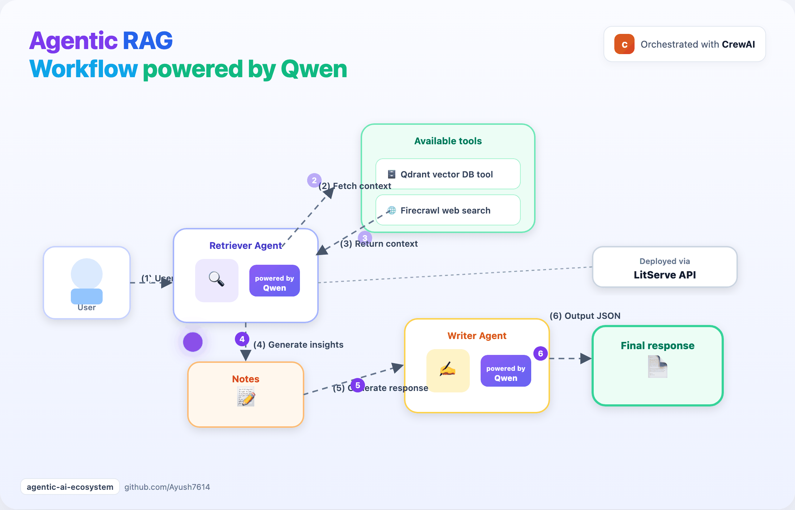

# Qwen Agentic RAG (local)

100% private Agentic RAG powered by **Qwen** (Ollama), **CrewAI**, **Firecrawl**, **Qdrant**, **LitServe**, and **Gradio**.

Part of the [Agentic AI Ecosystem](https://github.com/Ayush7614/agentic-ai-ecosystem).

## Architecture



1. User query hits the **LitServe** API  
2. **Retriever** agent chooses **Qdrant** (ML FAQ) or **Firecrawl** (web)  
3. **Writer** agent returns the final answer as JSON  

## Quick start

```bash
cd guides/qwen-agentic-rag
python -m venv .venv
source .venv/bin/activate
pip install -r requirements.txt

cp .env.example .env
# Add your FIRECRAWL_API_KEY to .env (optional for web search)

# Pull a local model (0.8b fits 16GB Macs; larger tags need more RAM)
ollama pull qwen3.5:0.8b

# Build the vector DB (uses ./qdrant_storage by default)
python setup_vectordb.py

# Start the API
python server.py
```

In another terminal (CLI or web UI):

```bash
python client.py --query "What is cross-validation and why is it important?"
python ui.py   # http://127.0.0.1:7860
```

## Project layout

| File | Purpose |
|------|---------|
| `server.py` | LitServe API + CrewAI agents |
| `client.py` | Simple HTTP client |
| `ui.py` | Gradio web UI |
| `rag_code.py` | Embeddings + Qdrant retrieval |
| `tools.py` | CrewAI tool for vector search |
| `setup_vectordb.py` | One-time knowledge-base setup |
| `TUTORIAL.md` | Full step-by-step walkthrough |

## Hardware notes (16GB RAM)

- Prefer `qwen3.5:0.8b` or similar small tags (see `.env.example`)
- Avoid `qwen3.6:27b` on 16GB machines — it can freeze or crash the system
- First response may be slow while models load

## Full tutorial

See [TUTORIAL.md](./TUTORIAL.md) for the complete code walkthrough.

## OpenClaw + Gemma integration

Expose this API to Telegram/WhatsApp via OpenClaw and `gemma4:e2b`: [openclaw-gemma-rag](../openclaw-gemma-rag/).
