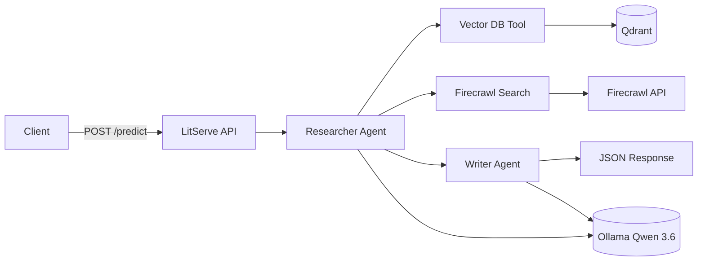

# Deploy a Qwen 3.6 Agentic RAG — Step-by-Step Walkthrough

Today we'll build and deploy an **Agentic RAG** powered by Alibaba's latest **Qwen 3.6**, running fully on your machine.

## What you'll build

A private API where two AI agents collaborate:

1. **Researcher Agent** — retrieves context from a vector database or the web
2. **Writer Agent** — turns that research into a polished answer

## Tool stack

| Tool | Role |
|------|------|
| **Qwen 3.6** (via Ollama) | Local LLM — no cloud API needed |
| **CrewAI** | Multi-agent orchestration |
| **Firecrawl** | Web search when the vector DB doesn't have the answer |
| **Qdrant** | Local vector database for your knowledge base |
| **LitServe** | Production-style HTTP API deployment |

## Architecture



**Flow:**

1. Client sends a query to LitServe
2. Researcher Agent picks the right tool (vector DB or Firecrawl)
3. Writer Agent synthesizes the final answer
4. LitServe returns JSON to the client

---

## Prerequisites

### 1. Remove old models (optional cleanup)

If you had other Ollama models taking disk space:

```bash
ollama list
ollama rm gemma4:e2b   # example — use your model name
```

### 2. Pull Qwen 3.6

On a **16GB Mac**, use the 27B variant:

```bash
ollama pull qwen3.6:27b
```

Verify:

```bash
ollama run qwen3.6:27b "Say hello in one sentence."
```

### 3. Install Python dependencies

```bash
python -m venv .venv
source .venv/bin/activate
pip install -r requirements.txt
```

### 4. Environment variables

```bash
cp .env.example .env
```

Edit `.env`:

```env
FIRECRAWL_API_KEY=fc-...
OLLAMA_MODEL=ollama/qwen3.6:27b
OLLAMA_BASE_URL=http://localhost:11434
```

Get a Firecrawl key at [firecrawl.dev](https://www.firecrawl.dev/).

### 5. Start Qdrant

```bash
docker run -p 6333:6333 -p 6334:6334 qdrant/qdrant
```

### 6. Build the knowledge base

```bash
python setup_vectordb.py
```

This embeds 20 ML FAQ chunks into Qdrant using `nomic-embed-text-v1.5`.

---

## Step-by-step implementation

The entire server lives in `server.py`. LitServe calls four methods in order:

`setup()` → `decode_request()` → `predict()` → `encode_response()`

---

### Step 1 — Set up the LLM

CrewAI integrates with Ollama through its `LLM` class. We point it at your local Qwen 3.6 model:

```python
from crewai import LLM
import os

OLLAMA_MODEL = os.getenv("OLLAMA_MODEL", "ollama/qwen3.6:27b")
OLLAMA_BASE_URL = os.getenv("OLLAMA_BASE_URL", "http://localhost:11434")

llm = LLM(
    model=OLLAMA_MODEL,
    base_url=OLLAMA_BASE_URL,
)
```

**Why `qwen3.6:27b`?** Qwen 3.6 adds stronger agentic reasoning and tool use. On 16GB RAM, the 27B quantized model (~17GB) is the practical choice.

---

### Step 2 — Define the Research Agent and Task

The Researcher gets **two tools**:

- `ml_faq_retrieval_tool` — searches your Qdrant vector DB
- `FirecrawlSearchTool` — searches the web for fresh or out-of-scope topics

```python
from crewai import Agent, Task
from crewai_tools import FirecrawlSearchTool
from tools import ml_faq_retrieval_tool

researcher_agent = Agent(
    role="Researcher",
    goal="Research the user's query using the vector database and web search tools",
    backstory=(
        "You are a research assistant. Prefer the ML FAQ retrieval tool for "
        "machine-learning questions. Use Firecrawl web search for recent or "
        "general topics not covered in the knowledge base."
    ),
    verbose=True,
    tools=[ml_faq_retrieval_tool, FirecrawlSearchTool()],
    llm=llm,
)

researcher_task = Task(
    description=(
        "Research the user's query and collect the most relevant context: {query}. "
        "Use the ML FAQ tool first for ML topics. Fall back to Firecrawl for everything else."
    ),
    expected_output="A bullet list of key findings with sources (vector DB or web).",
    agent=researcher_agent,
)
```

#### Vector DB tool (`tools.py`)

The custom tool wraps Qdrant retrieval:

```python
from crewai.tools import tool
from rag_code import COLLECTION_NAME, EmbedData, QdrantVDB, Retriever

@tool("Machine Learning FAQ Retrieval Tool")
def ml_faq_retrieval_tool(query: str) -> str:
    """Retrieve relevant ML FAQ documents from the vector database."""
    retriever = Retriever(QdrantVDB(COLLECTION_NAME), EmbedData())
    return retriever.search(query)
```

The agent **decides** which tool to call — that's what makes this "agentic" RAG instead of a fixed retrieve-then-generate pipeline.

---

### Step 3 — Define the Writer Agent and Task

The Writer receives the Researcher's output via `context=[researcher_task]`:

```python
writer_agent = Agent(
    role="Writer",
    goal="Write a clear, accurate answer using the researcher's findings",
    backstory=(
        "You synthesize research into concise, well-structured answers. "
        "Cite whether information came from the knowledge base or the web."
    ),
    verbose=True,
    llm=llm,
)

writer_task = Task(
    description=(
        "Using the research findings, write a final answer for: {query}. "
        "Keep it concise, factual, and easy to read."
    ),
    expected_output="A polished answer to the user's query.",
    agent=writer_agent,
    context=[researcher_task],
)
```

---

### Step 4 — Set up the Crew

Orchestrate both agents inside LitServe's `setup()` method (runs once at startup):

```python
from crewai import Crew

self.crew = Crew(
    agents=[researcher_agent, writer_agent],
    tasks=[researcher_task, writer_task],
    verbose=True,
)
```

---

### Step 5 — Decode request

Extract the user query from the incoming JSON body:

```python
def decode_request(self, request):
    query = request.get("query", "").strip()
    if not query:
        raise ValueError("Missing required field: query")
    return query
```

Example request:

```json
{"query": "What is cross-validation and why is it important?"}
```

---

### Step 6 — Predict

Pass the query to the Crew. The `{query}` placeholder in task descriptions is filled from `inputs`:

```python
def predict(self, query):
    result = self.crew.kickoff(inputs={"query": query})
    return result.raw if hasattr(result, "raw") else str(result)
```

Behind the scenes:

1. Researcher runs and may call vector DB and/or Firecrawl
2. Writer reads those findings and drafts the answer
3. Qwen 3.6 powers both agents through Ollama

---

### Step 7 — Encode response

Return the final answer as JSON:

```python
def encode_response(self, output):
    return {"output": output}
```

---

### Step 8 — Start the server

```python
if __name__ == "__main__":
    api = AgenticRAGAPI()
    server = ls.LitServer(api, timeout=False)
    server.run(port=8000)
```

`timeout=False` is important — agent crews with tool calls can take several minutes on local hardware.

---

## Client code

`client.py` sends a POST to `/predict`:

```python
import requests

payload = {"query": "What is Qwen 3.6?"}
response = requests.post("http://127.0.0.1:8000/predict", json=payload, timeout=600)
print(response.json()["output"])
```

Run it:

```bash
# Terminal 1
python server.py

# Terminal 2
python client.py --query "How do I avoid overfitting?"
python client.py --query "What is the latest news about Qwen 3.6?"
```

The second query should trigger **Firecrawl** because it's not in the ML FAQ knowledge base.

---

## Full server code

For reference, here is the complete `server.py`:

```python
import os

import litserve as ls
from crewai import Agent, Crew, LLM, Task
from crewai_tools import FirecrawlSearchTool
from dotenv import load_dotenv

from tools import ml_faq_retrieval_tool

load_dotenv()

OLLAMA_MODEL = os.getenv("OLLAMA_MODEL", "ollama/qwen3.6:27b")
OLLAMA_BASE_URL = os.getenv("OLLAMA_BASE_URL", "http://localhost:11434")


class AgenticRAGAPI(ls.LitAPI):
    def setup(self, device):
        llm = LLM(model=OLLAMA_MODEL, base_url=OLLAMA_BASE_URL)

        researcher_agent = Agent(
            role="Researcher",
            goal="Research the user's query using the vector database and web search tools",
            backstory="...",
            verbose=True,
            tools=[ml_faq_retrieval_tool, FirecrawlSearchTool()],
            llm=llm,
        )

        writer_agent = Agent(
            role="Writer",
            goal="Write a clear, accurate answer using the researcher's findings",
            backstory="...",
            verbose=True,
            llm=llm,
        )

        researcher_task = Task(
            description="Research the user's query: {query}",
            expected_output="Key findings with sources.",
            agent=researcher_agent,
        )

        writer_task = Task(
            description="Write a final answer for: {query}",
            expected_output="A polished answer.",
            agent=writer_agent,
            context=[researcher_task],
        )

        self.crew = Crew(
            agents=[researcher_agent, writer_agent],
            tasks=[researcher_task, writer_task],
            verbose=True,
        )

    def decode_request(self, request):
        return request["query"]

    def predict(self, query):
        return self.crew.kickoff(inputs={"query": query}).raw

    def encode_response(self, output):
        return {"output": output}


if __name__ == "__main__":
    api = AgenticRAGAPI()
    server = ls.LitServer(api, timeout=False)
    server.run(port=8000)
```

---

## Agentic RAG vs classic RAG

| Classic RAG | Agentic RAG (this tutorial) |
|-------------|----------------------------|
| Fixed: always retrieve → generate | Agent chooses tools dynamically |
| Single LLM call | Multi-agent pipeline |
| One data source | Vector DB + web fallback |
| Hard to extend | Add tools without rewriting the pipeline |

---

## Troubleshooting

| Issue | Fix |
|-------|-----|
| `connection refused` on port 6333 | Start Qdrant with Docker |
| Ollama model not found | Run `ollama pull qwen3.6:27b` |
| Very slow responses | Normal on 16GB RAM; close other apps |
| Firecrawl errors | Check `FIRECRAWL_API_KEY` in `.env` |
| Empty vector results | Run `python setup_vectordb.py` first |

---

## What's next

- Replace the sample FAQ with your own documents in `rag_code.py`
- Add a Gradio UI in front of the LitServe API
- Swap Firecrawl for another search provider
- Deploy LitServe behind Docker or Lightning AI Cloud

---

## Summary

You deployed a **fully private Qwen 3.6 Agentic RAG**:

- **Qwen 3.6** runs locally via Ollama
- **CrewAI** orchestrates Researcher + Writer agents
- **Qdrant** stores your knowledge base
- **Firecrawl** fills gaps with live web data
- **LitServe** exposes everything as a clean REST API

Done!
