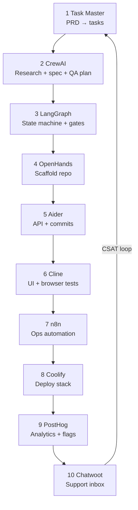
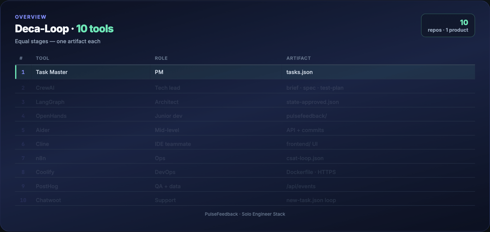

# Solo Engineer Stack — 10 Repos, One Product

Build a **complete SaaS** — from PRD to deployed app with analytics and support — using **10 open-source tools with equal weight**. No tool is optional garnish; each owns one lane in a closed feedback loop.

Inspired by [The Solo Engineer Stack (Techlatest.net, Apr 2026)](https://techlatest.net) · Part of the [Agentic AI Ecosystem](https://github.com/Ayush7614/agentic-ai-ecosystem).

## What you build: PulseFeedback

A minimal **feature-feedback SaaS**:

- Users submit feedback via a web form  
- Team triages in a dashboard  
- Support replies through **Chatwoot**  
- **PostHog** tracks funnels, flags, and replays  
- Low CSAT scores **loop back** into **Task Master** for the next sprint  

Every tool in the stack ships a **concrete artifact** — not a mention in a bullet list.

## The Deca-Loop (10 equal stages)





| # | Tool | Role | You ship |
|---|------|------|----------|
| 1 | [Task Master](https://github.com/eyaltoledano/claude-task-master) | PM | `tasks.json` from PRD |
| 2 | [CrewAI](https://github.com/crewAIInc/crewai) | Tech lead | Market brief + tech spec + test plan |
| 3 | [LangGraph](https://github.com/langchain-ai/langgraph) | Architect | Orchestrator graph + approval gates |
| 4 | [OpenHands](https://github.com/OpenHands/OpenHands) | Junior dev | Repo scaffold + CI skeleton |
| 5 | [Aider](https://github.com/Aider-AI/aider) | Mid-level dev | API modules + git history |
| 6 | [Cline](https://github.com/cline/cline) | IDE teammate | Frontend + E2E verification |
| 7 | [n8n](https://github.com/n8n-io/n8n) | Ops | Deploy + notify + CSAT webhooks |
| 8 | [Coolify](https://github.com/coollabsio/coolify) | DevOps | Production URLs + SSL |
| 9 | [PostHog](https://github.com/posthog/posthog) | QA + data | Events, flags, replay |
| 10 | [Chatwoot](https://github.com/chatwoot/chatwoot) | Support | Inbox + AI bot handoff |

## Live demo (run this first)

**Real app, real UI, real API** — show everything in a browser in 5 minutes.


```bash
cd guides/solo-engineer-stack
chmod +x scripts/demo.sh
./scripts/demo.sh
```

Open **http://localhost:8080** — five tabs map to the stack:

| Tab | Tool stage |
|-----|------------|
| Submit + Dashboard | OpenHands · Aider · Cline (the `pulsefeedback/` app) |
| Analytics | PostHog (`/api/events`) |
| Support | Chatwoot + n8n CSAT loop |
| 10 Tools | Live status for all repos |

Full recording script: **[DEMO.md](./DEMO.md)**

```bash
docker compose up -d    # app on :8080 + n8n on :5678
./scripts/verify-stack.sh   # all 10 stages have artifacts
pytest tests/ -q        # 4 API tests
```

## Guide map

| Doc | Contents |
|-----|----------|
| **[DEMO.md](./DEMO.md)** | **5-min live demo script for blog/video** |
| [Tutorial](./TUTORIAL.md) | **Full walkthrough — every part runnable** |
| [Stack reference](./STACK.md) | Equal config snippets for all 10 repos |
| [Sample PRD](./examples/prd-pulsefeedback.md) | Input for Task Master |
| [PulseFeedback app](./pulsefeedback/) | Runnable FastAPI + UI (stages 4–6 output) |
| [Orchestrator](./orchestrator/graph.py) | LangGraph state machine |
| [Terminal GIFs](./assets/) | Animated snippets for every tutorial part |

### Regenerate GIFs

```bash
cd assets && python3 render_stack_screenshots.py gif
```

## Prerequisites

| Item | Notes |
|------|-------|
| LLM API | Claude, GPT, or local OpenAI-compatible (see [Gemma 4 12B](../gemma-4-12b/)) |
| VPS or cloud VM | Coolify target — 4 GB RAM minimum for full stack |
| GitHub repo | OpenHands + Aider + Cline work against real git |
| ~2–3 days | First full loop; faster on repeat |

## Related guides

| Guide | Overlap |
|-------|---------|
| [Gemma 4 12B](../gemma-4-12b/) | Local LLM for all 10 tools via OpenAI-compatible API |
| [Qwen Agentic RAG](../qwen-agentic-rag/) | CrewAI + private LLM patterns |
| [Claude Code `.claude/`](../claude-code-dot-claude/) | Team rules while using Cline |

## License

Guide: MIT · Upstream tools: respective licenses
