# Solo Engineer Stack — Full Tutorial

Build **PulseFeedback** — a real, runnable feature-feedback SaaS — using **10 open-source repos with equal weight**.

Every part maps to **files you can run, open in a browser, or show on camera**. Nothing is slide-deck-only.

Based on [The Solo Engineer Stack (Techlatest.net, Apr 2026)](https://techlatest.net) · Live demo: **[DEMO.md](./DEMO.md)**

---

## Table of contents

1. [Part 0 — Live demo first](#part-0--live-demo-first)  
2. [Part 0b — Repo layout & architecture](#part-0b--repo-layout--architecture)  
3. [Part 1 — Task Master (PM)](#part-1--task-master-pm)  
4. [Part 2 — CrewAI (tech lead)](#part-2--crewai-tech-lead)  
5. [Part 3 — LangGraph (architect)](#part-3--langgraph-architect)  
6. [Part 4 — OpenHands (junior dev)](#part-4--openhands-junior-dev)  
7. [Part 5 — Aider (mid-level dev)](#part-5--aider-mid-level-dev)  
8. [Part 6 — Cline (IDE teammate)](#part-6--cline-ide-teammate)  
9. [Part 7 — n8n (operations)](#part-7--n8n-operations)  
10. [Part 8 — Coolify (DevOps)](#part-8--coolify-devops)  
11. [Part 9 — PostHog (QA + data)](#part-9--posthog-qa--data)  
12. [Part 10 — Chatwoot (support)](#part-10--chatwoot-support)  
13. [Part 11 — Close the loop](#part-11--close-the-loop)  
14. [Part 12 — One-command verification](#part-12--one-command-verification)  
15. [Part 13 — Troubleshooting](#part-13--troubleshooting)  

---

## Part 0 — Live demo first

**Do this before reading further.** The whole tutorial assumes PulseFeedback is running on your machine.

```bash
git clone https://github.com/Ayush7614/agentic-ai-ecosystem.git
cd agentic-ai-ecosystem/guides/solo-engineer-stack
cp .env.example .env
python3 -m venv .venv && source .venv/bin/activate
pip install -r requirements.txt
chmod +x scripts/*.sh scripts/*/*.sh 2>/dev/null || chmod +x scripts/demo.sh scripts/verify-stack.sh
./scripts/demo.sh
```

### What you should see

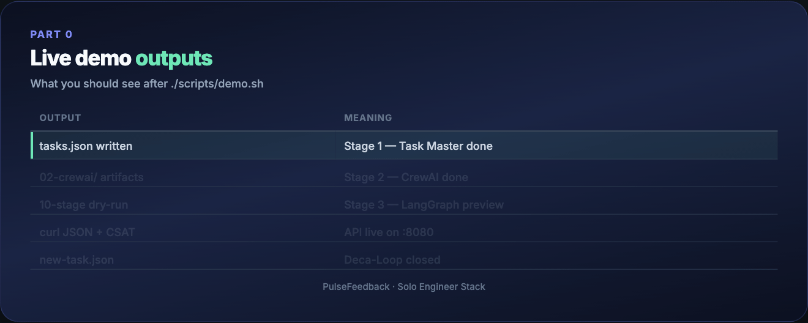

| Output | Meaning |
|--------|---------|
| `Wrote artifacts/01-task-master/tasks.json` | Stage 1 done |
| `Wrote mock artifacts to artifacts/02-crewai/` | Stage 2 done |
| 10-stage dry-run list | Stage 3 preview |
| `curl` JSON for feedback + CSAT | API live |
| `artifacts/11-csat-loop/new-task.json` | Deca-Loop closed |

Open **http://localhost:8080**:

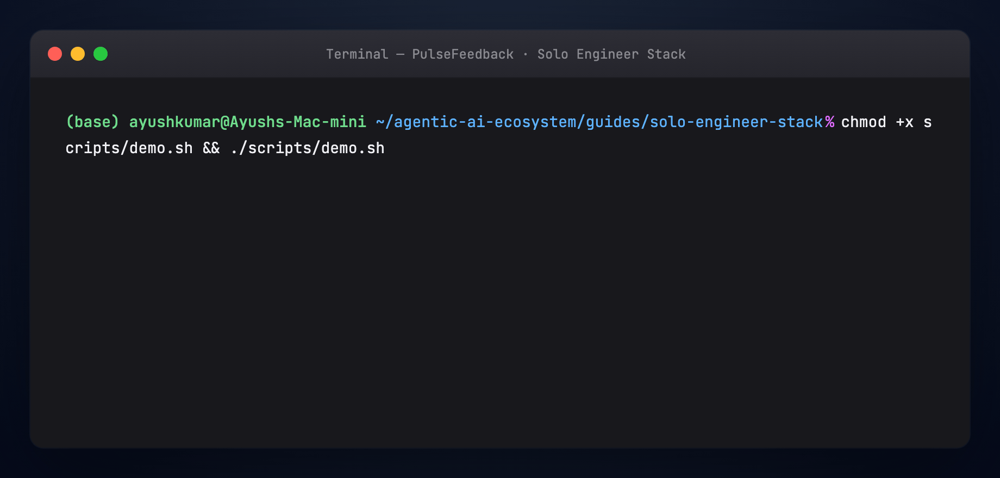

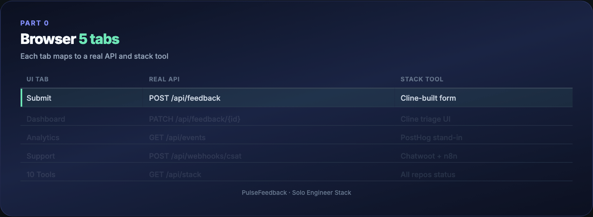

| UI tab | Real API | Stack tool |
|--------|----------|------------|
| Submit | `POST /api/feedback` | Cline-built form |
| Dashboard | `PATCH /api/feedback/{id}` | Cline triage UI |
| Analytics | `GET /api/events` | PostHog stand-in |
| Support | `POST /api/webhooks/csat` | Chatwoot + n8n loop |
| 10 Tools | `GET /api/stack` | All repos status |

### Prove it with tests

```bash
pytest tests/ -q
# 4 passed — health, CRUD, CSAT loop, stack endpoint
```

Blog/video script: **[DEMO.md](./DEMO.md)**

---

## Part 0b — Repo layout & architecture

### What lives in this folder

```
guides/solo-engineer-stack/
├── pulsefeedback/              # ← THE PRODUCT (stages 4–6 output)
│   ├── backend/main.py         #   FastAPI — all routes
│   ├── frontend/               #   Dashboard UI (HTML/CSS/JS)
│   └── Dockerfile              #   Coolify deploy (stage 8)
├── artifacts/                  # ← One folder per tool stage
│   ├── 01-task-master/tasks.json
│   ├── 02-crewai/brief.md, spec.md, test-plan.md
│   ├── 03-langgraph/state-approved.json
│   └── 11-csat-loop/new-task.json   # created on CSAT ≤ 2
├── scripts/
│   ├── demo.sh                 # full live demo
│   ├── verify-stack.sh         # check all artifacts
│   ├── 01-task-master/generate_tasks.py
│   ├── 02-crewai/run_crew.py
│   └── 03-langgraph/approve_gate.py
├── orchestrator/graph.py       # LangGraph Deca-Loop
├── n8n/workflows/csat-loop.json
├── examples/prd-pulsefeedback.md
├── tests/test_api.py
└── docker-compose.yml          # app + n8n
```

### Old team → 10 tools

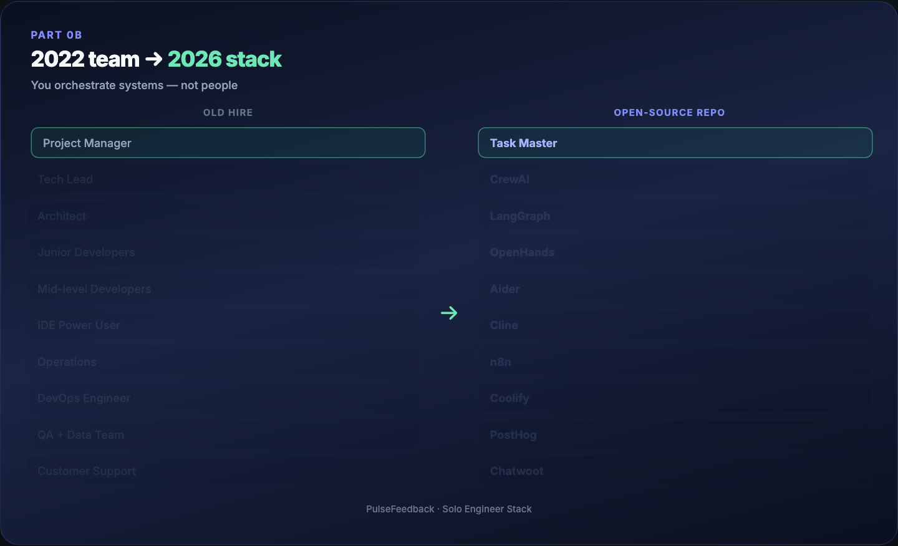

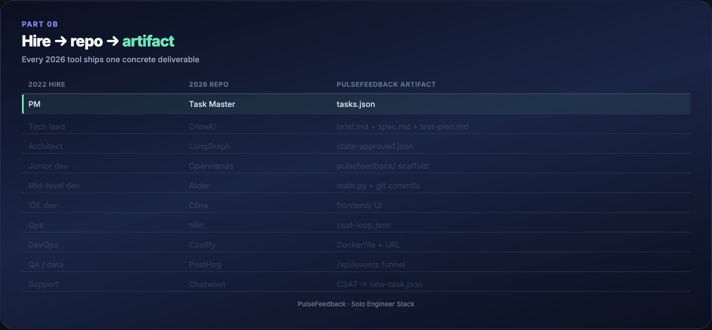

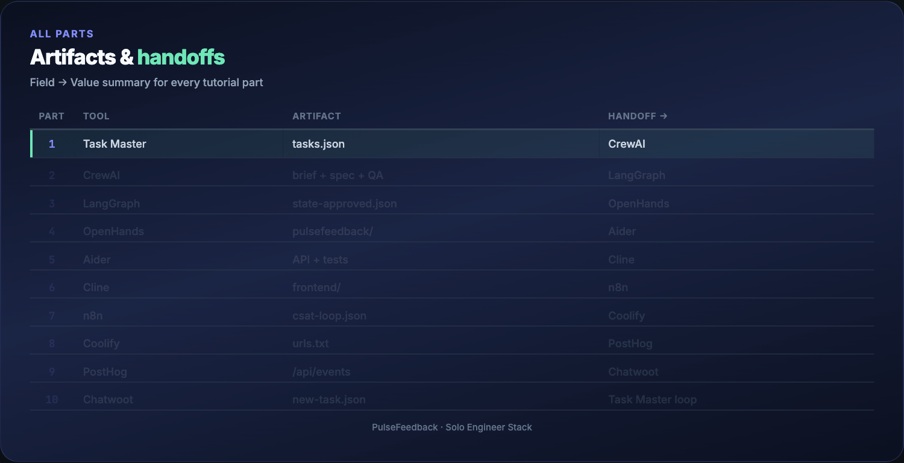

| 2022 hire | 2026 repo | PulseFeedback artifact |
|-----------|-----------|------------------------|
| PM | Task Master | `tasks.json` |
| Tech lead | CrewAI | `brief.md` + `spec.md` + `test-plan.md` |
| Architect | LangGraph | `orchestrator/graph.py` + approval JSON |
| Junior dev | OpenHands | `pulsefeedback/` scaffold |
| Mid-level dev | Aider | API in `main.py` + git commits |
| IDE dev | Cline | `frontend/` UI |
| Ops | n8n | `n8n/workflows/*.json` |
| DevOps | Coolify | `Dockerfile` + live URL |
| QA / data | PostHog | `/api/events` + funnel |
| Support | Chatwoot | `/api/webhooks/csat` + widget |

### Deca-Loop (equal stages)

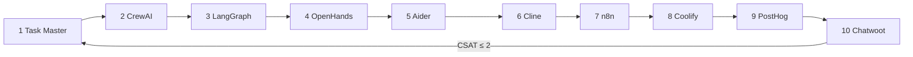
```mermaid
flowchart LR
    TM[1 Task Master] --> CR[2 CrewAI] --> LG[3 LangGraph]
    LG --> OH[4 OpenHands] --> AI[5 Aider] --> CL[6 Cline]
    CL --> N8[7 n8n] --> CO[8 Coolify] --> PH[9 PostHog] --> CW[10 Chatwoot]
    CW -->|CSAT ≤ 2| TM
```

**Rule:** Each tool ships **one artifact** before the next starts. ~30 minutes per tool on first run.

---

## Part 1 — Task Master (PM)

**Repo:** [eyaltoledano/claude-task-master](https://github.com/eyaltoledano/claude-task-master)

**Job:** Turn the PRD into **10 epics** — one per stack tool.

### Run now (included script — no npm install)

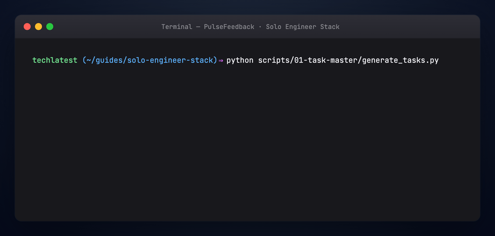

```bash
python scripts/01-task-master/generate_tasks.py
cat artifacts/01-task-master/tasks.json | python -m json.tool
```

You get 10 epics (`E1`–`E10`) tagged `crewai`, `langgraph`, `openhands`, … `task_master`.

### Input PRD

```bash
cat examples/prd-pulsefeedback.md
```

### Extend with real Task Master (optional)

```bash
git clone https://github.com/eyaltoledano/claude-task-master.git ~/claude-task-master
cd ~/claude-task-master && npm install && cp .env.example .env
# Set ANTHROPIC_API_KEY or OPENAI_* in .env

npx task-master parse-prd \
  "$(pwd)/../agentic-ai-ecosystem/guides/solo-engineer-stack/examples/prd-pulsefeedback.md"
npx task-master list
# Merge LLM output into artifacts/01-task-master/tasks.json if desired
```

### Verify

```bash
test -f artifacts/01-task-master/tasks.json && echo "Part 1 OK"
jq '.epics | length' artifacts/01-task-master/tasks.json   # should print 10
```

> **Handoff:** Part 1 → row in [table-handoff-summary.gif](assets/table-handoff-summary.gif)

| Field | Value |
|-------|-------|
| **Artifact** | `artifacts/01-task-master/tasks.json` |
| **Handoff → Part 2** | PRD + `tasks.json` |

---

## Part 2 — CrewAI (tech lead)

**Repo:** [crewAIInc/crewai](https://github.com/crewAIInc/crewai)

**Job:** Three agents → three documents (equal weight).

### Run now — offline demo (no API key)

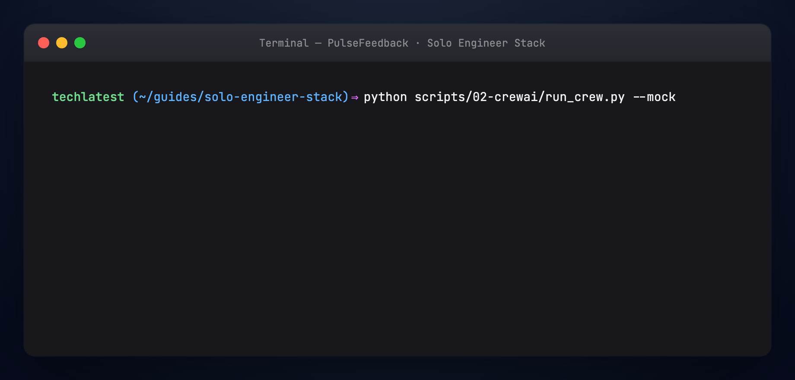

```bash
python scripts/02-crewai/run_crew.py --mock
ls -la artifacts/02-crewai/
```

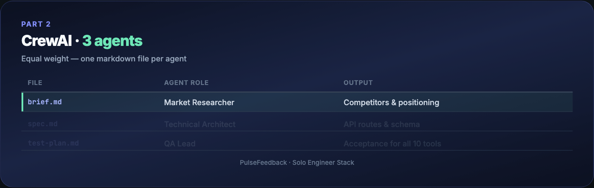

| File | Agent role |
|------|------------|
| `brief.md` | Market Researcher |
| `spec.md` | Technical Architect |
| `test-plan.md` | QA Lead |

> **Medium / blog:** use the GIF above instead of the markdown table.

### Run live (needs LLM)

```bash
pip install crewai   # or uncomment in requirements.txt
export OPENAI_API_KEY=sk-...
export CREWAI_MODEL=gpt-4o
python scripts/02-crewai/run_crew.py
```

The live script uses three CrewAI agents defined in `scripts/02-crewai/run_crew.py`:

- **Researcher** — competitor landscape  
- **Architect** — API routes + schema (matches `pulsefeedback/backend/main.py`)  
- **QA Lead** — acceptance tests (matches `tests/test_api.py`)  

### Verify

```bash
grep -l "POST /api/feedback" artifacts/02-crewai/spec.md && echo "Part 2 OK"
```

> **Handoff:** Part 2 → [table-handoff-summary.gif](assets/table-handoff-summary.gif)

| Field | Value |
|-------|-------|
| **Artifact** | `artifacts/02-crewai/{brief,spec,test-plan}.md` |
| **Handoff → Part 3** | All three files + `tasks.json` |

---

## Part 3 — LangGraph (architect)

**Repo:** [langchain-ai/langgraph](https://github.com/langchain-ai/langgraph)

**Job:** Enforce the Deca-Loop order + **human approval gate** before code ships.

### Run now — preview all 10 stages

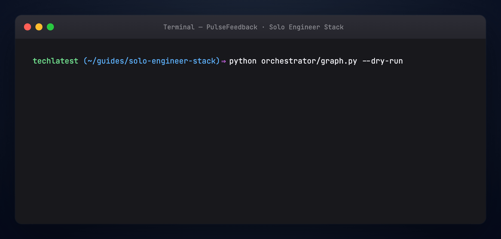

```bash
python orchestrator/graph.py --dry-run
```

### Run now — pass approval gate

```bash
pip install langgraph langchain-openai   # for invoke path
python scripts/03-langgraph/approve_gate.py
cat artifacts/03-langgraph/state-approved.json
```

### Simulate CSAT loop (returns to Task Master)

```bash
pip install langgraph
python orchestrator/graph.py --csat 1.5
# Final stage: task_master
```

### What the graph does

File: `orchestrator/graph.py`

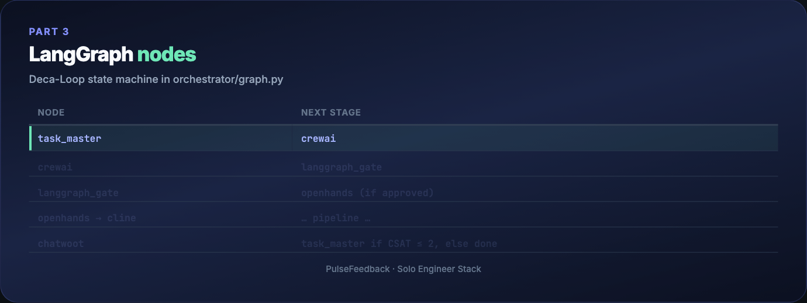

| Node | Next stage |
|------|------------|
| `task_master` | `crewai` |
| `crewai` | `langgraph_gate` |
| `langgraph_gate` | `openhands` (only if `human_approved=True`) |
| … | … |
| `chatwoot` | `task_master` if CSAT ≤ 2, else `done` |

### Verify

```bash
test -f artifacts/03-langgraph/state-approved.json && echo "Part 3 OK"
```

> **Handoff:** Part 3 → [table-handoff-summary.gif](assets/table-handoff-summary.gif)

| Field | Value |
|-------|-------|
| **Artifact** | `artifacts/03-langgraph/state-approved.json` |
| **Handoff → Part 4** | Approved spec → start building |

---

## Part 4 — OpenHands (junior dev)

**Repo:** [OpenHands/OpenHands](https://github.com/OpenHands/OpenHands)

**Job:** Scaffold repo — folders, Dockerfile, stub routes, CI skeleton.

### What's already in the repo (reference implementation)

OpenHands would generate this structure. **We ship it ready to run:**

```bash
tree pulsefeedback -L 2
# pulsefeedback/
# ├── backend/main.py      ← FastAPI app
# ├── backend/database.py  ← SQLite
# ├── backend/schemas.py
# ├── frontend/index.html  ← UI shell
# ├── frontend/app.js
# └── Dockerfile
```

Start the app manually:

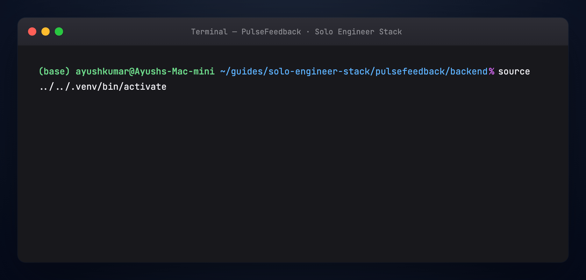

```bash
cd pulsefeedback/backend
source ../../.venv/bin/activate
uvicorn main:app --reload --port 8080
# open http://localhost:8080
```

### Extend with real OpenHands (optional — for blog footage)

```bash
git clone https://github.com/OpenHands/OpenHands.git ~/OpenHands
cd ~/OpenHands
export LLM_MODEL=gpt-4o
export LLM_API_KEY=$OPENAI_API_KEY
export LLM_BASE_URL=${OPENAI_API_BASE:-https://api.openai.com/v1}
docker compose up
```

Paste into OpenHands UI:

```
Scaffold a feedback SaaS from artifacts/02-crewai/spec.md in a new repo.
Include: FastAPI, SQLite, static frontend, Dockerfile, pytest.
Match routes: POST/GET/PATCH /api/feedback, POST /api/events, POST /api/webhooks/csat.
Compare your output to github.com/Ayush7614/agentic-ai-ecosystem/tree/main/guides/solo-engineer-stack/pulsefeedback
```

### Verify

```bash
curl -sf http://localhost:8080/health | python -m json.tool
# {"status":"ok","product":"PulseFeedback",...}
```

> **Handoff:** Part 4 → [table-handoff-summary.gif](assets/table-handoff-summary.gif)

| Field | Value |
|-------|-------|
| **Artifact** | `pulsefeedback/` directory |
| **Handoff → Part 5** | Running backend on port 8080 |

---

## Part 5 — Aider (mid-level dev)

**Repo:** [Aider-AI/aider](https://github.com/Aider-AI/aider)

**Job:** Implement API logic with **one git commit per feature**.

### What's already implemented

These routes exist in `pulsefeedback/backend/main.py`:

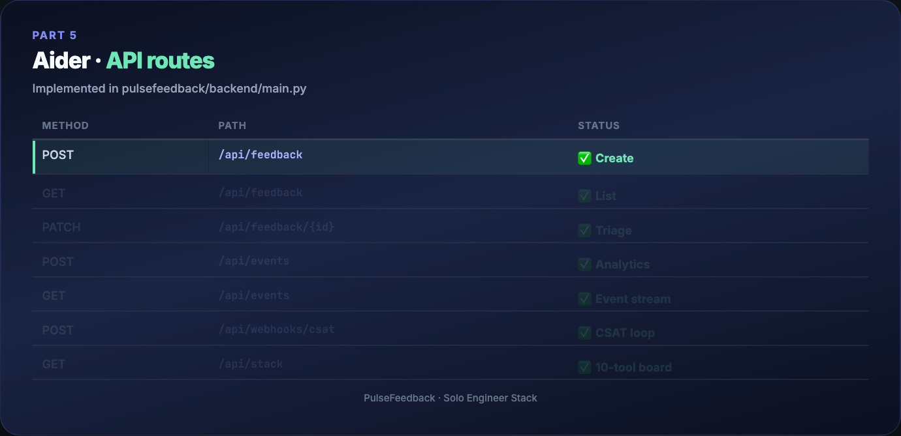

| Method | Path | Status |
|--------|------|--------|
| `POST` | `/api/feedback` | ✅ Create feedback |
| `GET` | `/api/feedback` | ✅ List (?status= filter) |
| `PATCH` | `/api/feedback/{id}` | ✅ Update status |
| `POST` | `/api/events` | ✅ Analytics capture |
| `GET` | `/api/events` | ✅ Event stream |
| `POST` | `/api/webhooks/csat` | ✅ CSAT loop |
| `GET` | `/api/stack` | ✅ 10-tool status |

### Test with curl (show on camera)

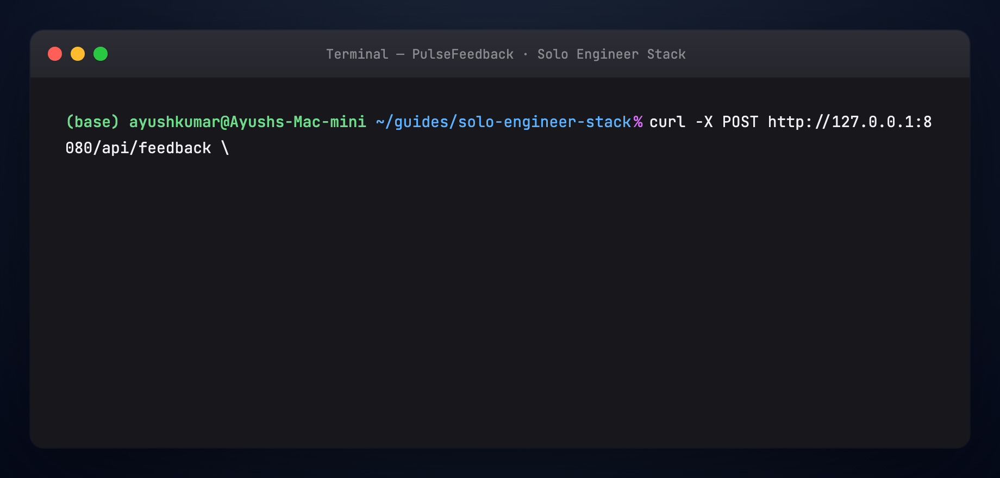

```bash
# Create
curl -X POST http://localhost:8080/api/feedback \
  -H 'Content-Type: application/json' \
  -d '{"title":"Dark mode","body":"Please add dark theme","email":"demo@example.com"}'

# List
curl http://localhost:8080/api/feedback | python -m json.tool

# Triage
curl -X PATCH http://localhost:8080/api/feedback/1 \
  -H 'Content-Type: application/json' \
  -d '{"status":"triaged"}'
```

### Extend with real Aider (optional)

```bash
pip install aider-chat
cd pulsefeedback/backend

aider --model openai/gpt-4o \
  --openai-api-base "${OPENAI_API_BASE:-https://api.openai.com/v1}" \
  --openai-api-key "$OPENAI_API_KEY" \
  main.py schemas.py database.py
```

Example prompts (one commit each):

1. *"Add email validation on POST /api/feedback"*  
2. *"Add DELETE /api/feedback/{id} for admin"*  
3. *"Add test in ../../tests/test_api.py"*  

Save git log for artifact:

```bash
git log --oneline -10 > ../../artifacts/05-aider/git-log.txt
```

### Verify

```bash
pytest tests/test_api.py::test_feedback_crud -q && echo "Part 5 OK"
```

> **Handoff:** Part 5 → [table-handoff-summary.gif](assets/table-handoff-summary.gif)

| Field | Value |
|-------|-------|
| **Artifact** | Working API + `tests/test_api.py` |
| **Handoff → Part 6** | API stable → build UI |

---

## Part 6 — Cline (IDE teammate)

**Repo:** [cline/cline](https://github.com/cline/cline)

**Job:** Build dashboard UI + verify in browser.

### What's already in the repo

```bash
ls pulsefeedback/frontend/
# index.html  app.js  style.css
```

The UI has **5 tabs** wired to real APIs:

1. **Submit** — form → `POST /api/feedback`  
2. **Dashboard** — cards → `PATCH /api/feedback/{id}`  
3. **Analytics** — table → `GET /api/events`  
4. **Support** — CSAT form → `POST /api/webhooks/csat`  
5. **10 Tools** — grid → `GET /api/stack`  

### Demo in browser (no Cline required)

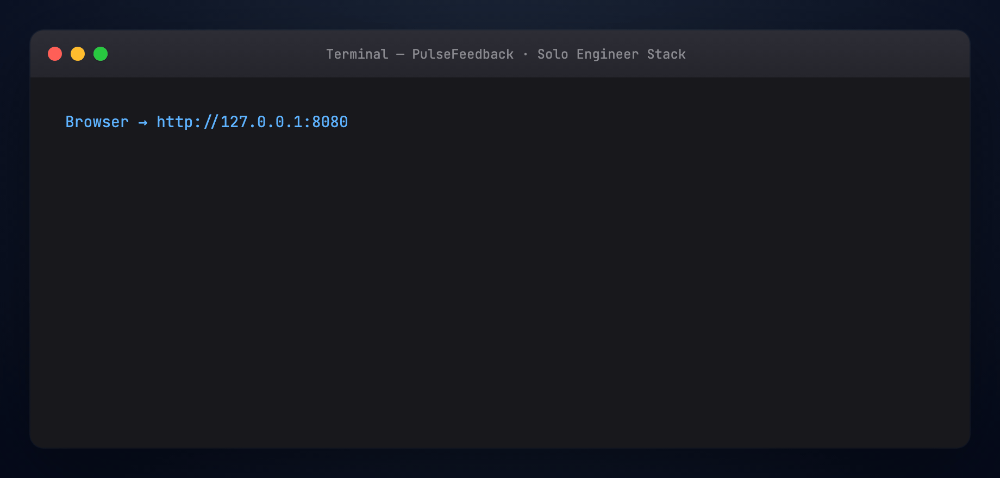

```bash
./scripts/demo.sh
# open http://localhost:8080
# Submit → Dashboard → change status → Analytics → Support (score 1)
```

### Extend with real Cline in Cursor (optional)

1. Install **Cline** extension in Cursor  
2. Settings → API Provider → OpenAI Compatible  
3. Open `guides/solo-engineer-stack/pulsefeedback/frontend/`  
4. Prompt:

```
Add a search filter to the Dashboard tab that filters feedback cards by title.
Use the existing GET /api/feedback endpoint. Verify in browser.
Acceptance: see artifacts/02-crewai/test-plan.md
```

### Verify

```bash
curl -sf http://localhost:8080/ | grep -q PulseFeedback && echo "Part 6 OK"
```

> **Handoff:** Part 6 → [table-handoff-summary.gif](assets/table-handoff-summary.gif)

| Field | Value |
|-------|-------|
| **Artifact** | `pulsefeedback/frontend/` + working browser flow |
| **Handoff → Part 7** | App runs end-to-end locally |

---

## Part 7 — n8n (operations)

**Repo:** [n8n-io/n8n](https://github.com/n8n-io/n8n)

**Job:** Three workflows — deploy, notify, CSAT loop.

### Run now — start n8n

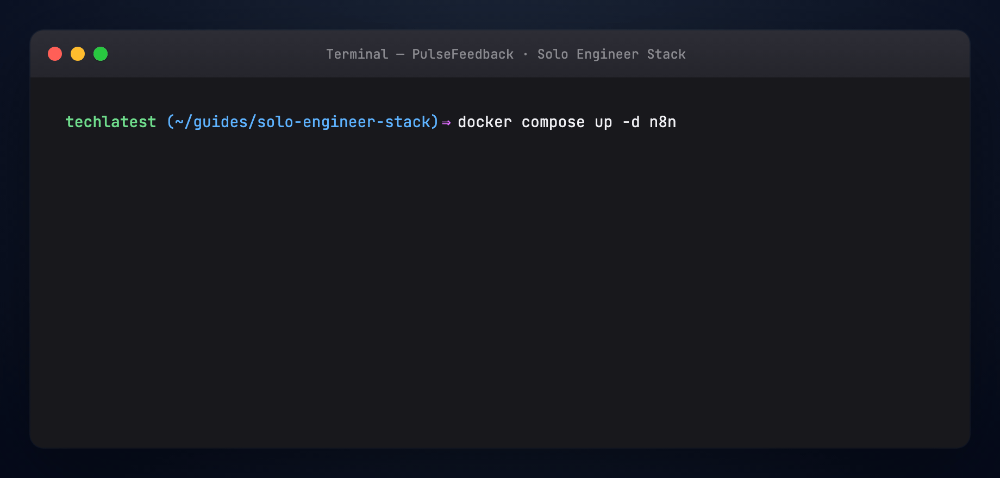

```bash
docker compose up -d n8n
open http://localhost:5678
```

### Import real workflow (included)

1. n8n UI → **Workflows** → **Import from file**  
2. Select `n8n/workflows/csat-loop.json`  
3. Activate workflow → copy webhook URL  

Workflow path:

```
Webhook (CSAT) → HTTP POST host.docker.internal:8080/api/webhooks/csat → IF loop_triggered
```

### Test CSAT without n8n (direct — always works)

```bash
curl -X POST http://localhost:8080/api/webhooks/csat \
  -H 'Content-Type: application/json' \
  -d '{"score":1,"comment":"Support bot failed"}'

cat artifacts/11-csat-loop/new-task.json
```

Expected `new-task.json`:

```json
{
  "source": "chatwoot_csat",
  "title": "Fix support issue from low CSAT",
  "next_tool": "task_master",
  ...
}
```

### Test through n8n webhook

```bash
# Replace WEBHOOK_ID after import
curl -X POST http://localhost:5678/webhook/csat \
  -H 'Content-Type: application/json' \
  -d '{"score":2,"comment":"via n8n"}'
```

### Optional workflows to add in n8n UI

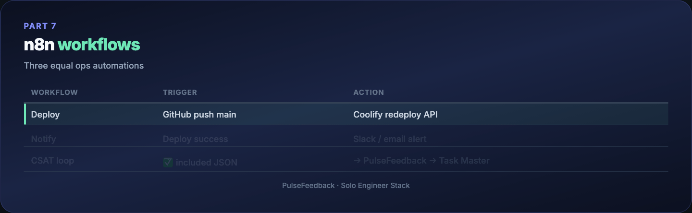

| Workflow | Trigger | Action |
|----------|---------|--------|
| Deploy | GitHub push `main` | Coolify redeploy API |
| Notify | Deploy success | Slack / email |
| CSAT loop | ✅ included JSON | → PulseFeedback → Task Master file |

Save workflow IDs:

```bash
mkdir -p artifacts/07-n8n
echo "csat-loop: imported from n8n/workflows/csat-loop.json" > artifacts/07-n8n/workflow-ids.txt
```

### Verify

```bash
test -f n8n/workflows/csat-loop.json && echo "Part 7 OK"
curl -sf http://localhost:5678/healthz && echo "n8n running"
```

> **Handoff:** Part 7 → [table-handoff-summary.gif](assets/table-handoff-summary.gif)

| Field | Value |
|-------|-------|
| **Artifact** | `n8n/workflows/csat-loop.json` + running n8n |
| **Handoff → Part 8** | Webhooks wired → deploy |

---

## Part 8 — Coolify (DevOps)

**Repo:** [coollabsio/coolify](https://github.com/coollabsio/coolify)

**Job:** HTTPS deploy for app + services.

### Run now — Docker (local production preview)

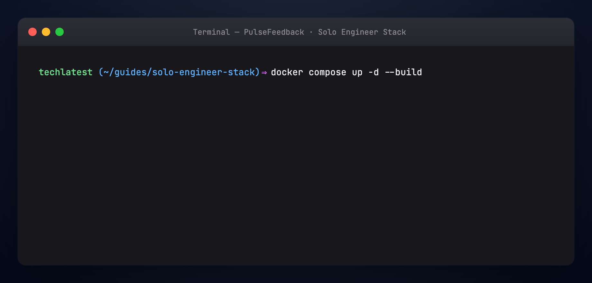

```bash
docker compose up -d --build
curl -sf http://localhost:8080/health
open http://localhost:8080
```

This builds `pulsefeedback/Dockerfile`:

- FastAPI on port **8080**  
- Mounts `./artifacts` for CSAT loop files  
- `STACK_ROOT=/app` for correct paths inside container  

### Deploy to Coolify (VPS)

1. Install Coolify on a VPS → [coolify.io/docs](https://coolify.io/docs)  
2. **New resource** → Docker Compose or Dockerfile  
3. Point at your fork / `guides/solo-engineer-stack/pulsefeedback/`  
4. Set domain + enable SSL  
5. Pair with n8n workflow from Part 7 for auto-redeploy  

Save URLs:

```bash
mkdir -p artifacts/08-coolify
cat > artifacts/08-coolify/urls.txt <<EOF
APP_URL=http://localhost:8080
N8N_URL=http://localhost:5678
# Production:
# APP_URL=https://feedback.yourdomain.com
EOF
```

### Verify

```bash
test -f pulsefeedback/Dockerfile && echo "Part 8 OK"
docker compose ps
```

> **Handoff:** Part 8 → [table-handoff-summary.gif](assets/table-handoff-summary.gif)

| Field | Value |
|-------|-------|
| **Artifact** | `artifacts/08-coolify/urls.txt` + live URL |
| **Handoff → Part 9** | App reachable on HTTPS or localhost |

---

## Part 9 — PostHog (QA + data)

**Repo:** [PostHog/posthog](https://github.com/posthog/posthog)

**Job:** Product analytics — events, funnel, feature flags.

### Run now — local event API (already wired)

Every UI action hits `POST /api/events`. View the stream:

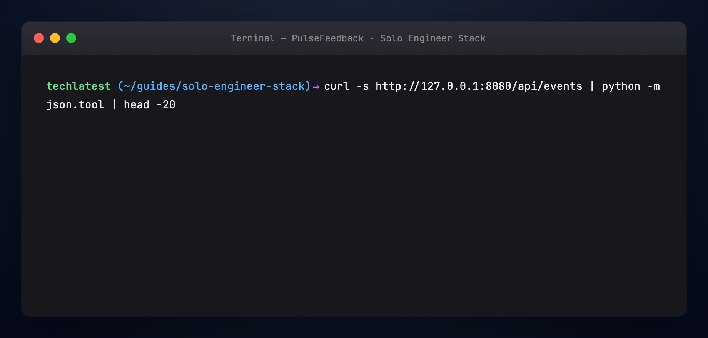

```bash
# Submit feedback in browser, then:
curl http://localhost:8080/api/events | python -m json.tool
```

Or open the **Analytics** tab at http://localhost:8080.

Events captured automatically:

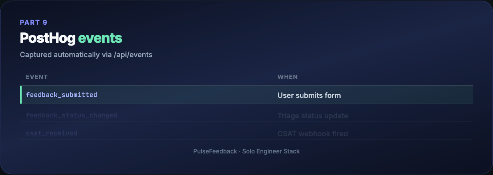

| Event | When |
|-------|------|
| `feedback_submitted` | User submits form |
| `feedback_status_changed` | Triage status update |
| `csat_received` | CSAT webhook fired |

### Wire real PostHog (production)

1. Create project at [posthog.com](https://posthog.com) or self-host  
2. Add to `pulsefeedback/frontend/index.html` (before `app.js`):

```html
<script>
  !function(t,e){...}(document,window.posthog||[]);
  posthog.init('phc_YOUR_KEY', { api_host: 'https://app.posthog.com' })
</script>
```

3. Mirror events — in `app.js` after successful submit:

```javascript
if (window.posthog) posthog.capture('feedback_submitted', { id: out.id });
```

4. Create funnel: `feedback_submitted` → `feedback_status_changed`  
5. Create feature flag `new-triage-ui` — 50% rollout  

Set in `.env`:

```bash
POSTHOG_API_KEY=phc_...
POSTHOG_HOST=https://app.posthog.com
```

### QA checklist (from `artifacts/02-crewai/test-plan.md`)

```bash
pytest tests/ -q                                    # API
curl -sf http://localhost:8080/api/events | jq length   # events > 0 after demo
```

- [ ] Submit feedback → event appears in Analytics tab  
- [ ] Triage status → `feedback_status_changed` event  
- [ ] CSAT 1 → `csat_received` with `loop_triggered: true`  

### Verify

```bash
curl -sf http://localhost:8080/api/events | python -m json.tool | head -5
echo "Part 9 OK"
```

> **Handoff:** Part 9 → [table-handoff-summary.gif](assets/table-handoff-summary.gif)

| Field | Value |
|-------|-------|
| **Artifact** | Event stream at `/api/events` (+ PostHog project in prod) |
| **Handoff → Part 10** | Metrics live → add support |

---

## Part 10 — Chatwoot (support)

**Repo:** [chatwoot/chatwoot](https://github.com/chatwoot/chatwoot)

**Job:** Support inbox + CSAT → loop back to Task Master.

### Run now — CSAT loop (no Chatwoot install required)

The **Support** tab at http://localhost:8080 simulates Chatwoot CSAT.

Or via curl:

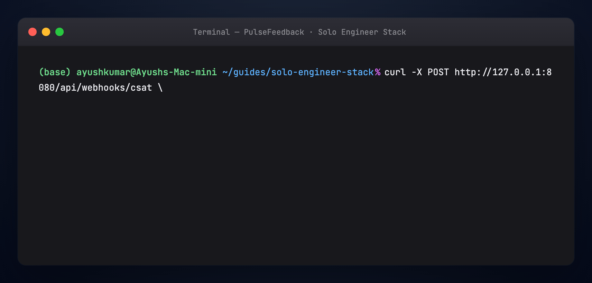

```bash
curl -X POST http://localhost:8080/api/webhooks/csat \
  -H 'Content-Type: application/json' \
  -d '{"score":1,"comment":"I need human help"}'

cat artifacts/11-csat-loop/new-task.json
cat artifacts/11-csat-loop/events.jsonl
```

This is the **Deca-Loop closing** — low CSAT creates a Task Master task file.

### Wire real Chatwoot (production)

1. Deploy Chatwoot via Coolify or [chatwoot.com/docs](https://www.chatwoot.com/docs)  
2. Create **Website inbox** → copy widget script  
3. Add widget to a landing page (or `pulsefeedback/frontend/index.html`)  
4. Configure CSAT survey after conversation  
5. Point CSAT webhook to n8n → `n8n/workflows/csat-loop.json` → PulseFeedback  

`.env`:

```bash
CHATWOOT_URL=https://support.yourdomain.com
CHATWOOT_ACCOUNT_ID=1
CHATWOOT_API_TOKEN=...
```

### n8n bridge (tools #7 + #10)

```
Chatwoot CSAT → n8n webhook → POST /api/webhooks/csat → new-task.json → Task Master
```

### Verify

```bash
curl -sf -X POST http://localhost:8080/api/webhooks/csat \
  -H 'Content-Type: application/json' \
  -d '{"score":1}' | grep -q loop_triggered
echo "Part 10 OK"
```

> **Handoff:** Part 10 → [table-handoff-summary.gif](assets/table-handoff-summary.gif)

| Field | Value |
|-------|-------|
| **Artifact** | `artifacts/11-csat-loop/new-task.json` |
| **Handoff → Part 11** | Loop closed |

---

## Part 11 — Close the loop

The stack only works when it **feeds itself**:

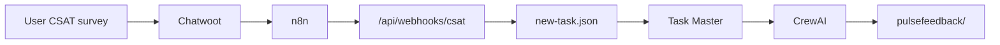
```mermaid
flowchart LR
    User[User CSAT survey]
    CW[Chatwoot]
    N8[n8n]
    API["/api/webhooks/csat"]
    ART["new-task.json"]
    TM[Task Master]
    CR[CrewAI]
    APP[pulsefeedback/]

    User --> CW --> N8 --> API --> ART --> TM --> CR --> APP
```

### Full loop demo (terminal)


```bash
./scripts/demo.sh
# Watch: CSAT → new-task.json → re-run generate_tasks.py for next sprint
python scripts/01-task-master/generate_tasks.py
python orchestrator/graph.py --csat 1.5
```

### Weekly solo-founder ritual

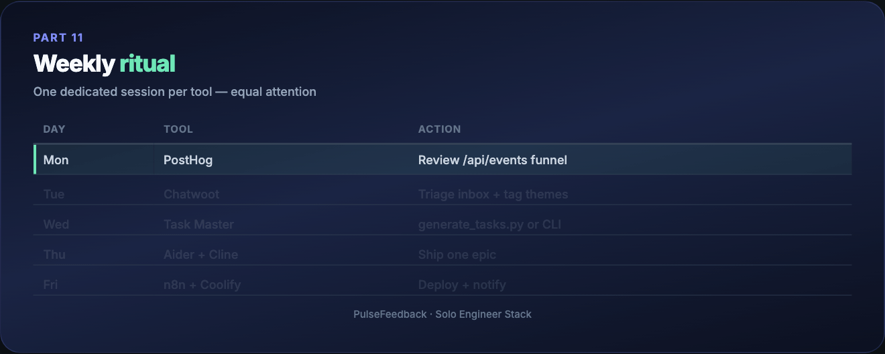

| Day | Tool | Action |
|-----|------|--------|
| Mon | PostHog | Review `/api/events` or PostHog funnel |
| Tue | Chatwoot | Triage inbox + tag themes |
| Wed | Task Master | `generate_tasks.py` or Task Master CLI |
| Thu | Aider + Cline | Ship one epic on `pulsefeedback/` |
| Fri | n8n + Coolify | Deploy + Slack notify |

---

## Part 12 — One-command verification

Run before recording a blog or presenting:

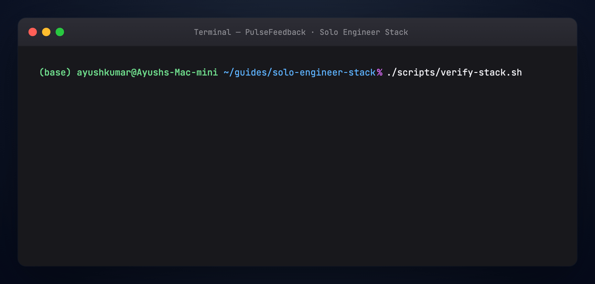

```bash
chmod +x scripts/verify-stack.sh
./scripts/verify-stack.sh
./scripts/demo.sh
pytest tests/ -q
```

Expected:

```
All checks passed. Run ./scripts/demo.sh for live demo.
4 passed
```

### API reference (quick)

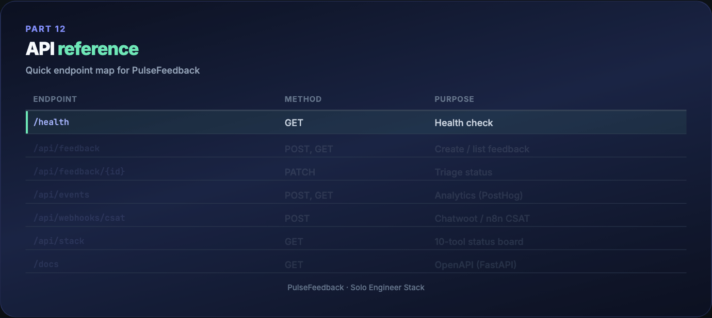

| Endpoint | Method | Purpose |
|----------|--------|---------|
| `/health` | GET | Health check |
| `/api/feedback` | POST, GET | Create / list feedback |
| `/api/feedback/{id}` | PATCH | Triage status |
| `/api/events` | POST, GET | Analytics (PostHog) |
| `/api/webhooks/csat` | POST | Chatwoot / n8n CSAT |
| `/api/stack` | GET | 10-tool status board |
| `/docs` | GET | OpenAPI (FastAPI) |

---

## Part 13 — Troubleshooting

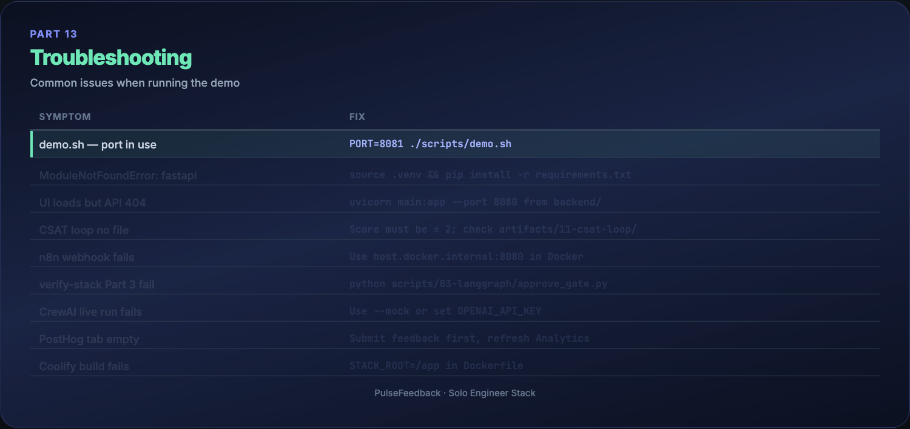

| Symptom | Fix |
|---------|-----|
| `./scripts/demo.sh` — port in use | `PORT=8081 ./scripts/demo.sh` |
| `ModuleNotFoundError: fastapi` | `source .venv/bin/activate && pip install -r requirements.txt` |
| UI loads but API 404 | Run from `pulsefeedback/backend`: `uvicorn main:app --port 8080` |
| CSAT loop no file | Score must be **≤ 2**; check `artifacts/11-csat-loop/` |
| n8n webhook fails | App must run; use `host.docker.internal:8080` in Docker |
| `verify-stack` fails Part 3 | `pip install langgraph && python scripts/03-langgraph/approve_gate.py` |
| CrewAI live run fails | Use `--mock` or set `OPENAI_API_KEY` |
| PostHog tab empty | Submit feedback in browser first, then refresh Analytics |
| Coolify build fails | Ensure `STACK_ROOT=/app` in Dockerfile (already set) |

---

## What's next

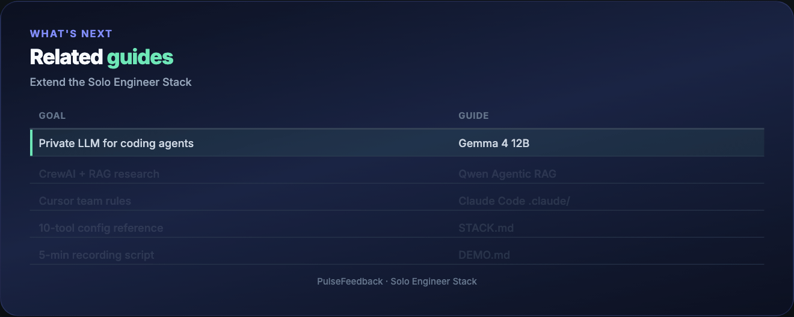

| Goal | Guide |
|------|-------|
| Private LLM for all coding agents | [Gemma 4 12B](../gemma-4-12b/) |
| CrewAI + RAG research tool | [Qwen Agentic RAG](../qwen-agentic-rag/) |
| Cursor team rules | [Claude Code `.claude/`](../claude-code-dot-claude/) |
| Equal config for all 10 repos | [STACK.md](./STACK.md) |
| 5-min recording script | [DEMO.md](./DEMO.md) |

### Regenerate terminal GIFs

Same pipeline as [Anthropic Cybersecurity Skills](../anthropic-cybersecurity-skills/TUTORIAL.md#part-4--installation-options):

```bash
cd guides/solo-engineer-stack/assets
pip install playwright
python -m playwright install chromium
python3 render_stack_screenshots.py gif              # all 13 GIFs
python3 render_stack_screenshots.py gif --only 05-aider  # one step
./scripts/prepare-docs.sh   # from repo root — copies assets/ to docs/
```

| GIF | Tutorial part |
|-----|---------------|
| `step-00-demo.gif` | Part 0 — live demo |
| `step-01-task-master.gif` | Part 1 |
| `step-02-crewai.gif` | Part 2 |
| `step-03-langgraph.gif` | Part 3 |
| `step-04-openhands.gif` | Part 4 |
| `step-05-aider.gif` | Part 5 |
| `step-06-cline.gif` | Part 6 |
| `step-07-n8n.gif` | Part 7 |
| `step-08-coolify.gif` | Part 8 |
| `step-09-posthog.gif` | Part 9 |
| `step-10-chatwoot.gif` | Part 10 |
| `step-11-verify-stack.gif` | Part 12 — verification |
| `step-12-csat-loop.gif` | Part 11 — close loop |

### Table GIFs (Medium — use instead of markdown tables)

All tables in this tutorial have animated GIF + static PNG in `assets/`:

| GIF | Tutorial section |
|-----|------------------|
| `table-demo-output.gif` | Part 0 — demo outputs |
| `table-ui-tabs.gif` | Part 0 — browser tabs |
| `team-vs-stack-table.gif` | Part 0b — 2022 → 2026 |
| `table-hire-artifacts.gif` | Part 0b — hire + artifact |
| `table-handoff-summary.gif` | Parts 1–10 — handoffs |
| `crewai-agents-table.gif` | Part 2 — CrewAI agents |
| `table-langgraph-nodes.gif` | Part 3 — LangGraph |
| `table-api-routes.gif` | Part 5 — API routes |
| `table-n8n-workflows.gif` | Part 7 — n8n |
| `table-posthog-events.gif` | Part 9 — PostHog |
| `table-weekly-ritual.gif` | Part 11 — weekly ritual |
| `table-api-reference.gif` | Part 12 — API reference |
| `table-troubleshooting.gif` | Part 13 — troubleshooting |
| `table-whats-next.gif` | What's next |
| `deca-loop-tools-table.gif` | README — 10 tools |

Regenerate all:

```bash
cd guides/solo-engineer-stack/assets
python3 render_table_gifs.py all
```

Source: `tutorial-tables.html` · Static PNGs: same name with `.png`

Terminal prompt user: **techlatest** (matches ecosystem blog style).

---

**Upstream repos:** [OpenHands](https://github.com/OpenHands/OpenHands) · [Aider](https://github.com/Aider-AI/aider) · [Cline](https://github.com/cline/cline) · [Task Master](https://github.com/eyaltoledano/claude-task-master) · [CrewAI](https://github.com/crewAIInc/crewai) · [LangGraph](https://github.com/langchain-ai/langgraph) · [n8n](https://github.com/n8n-io/n8n) · [Coolify](https://github.com/coollabsio/coolify) · [PostHog](https://github.com/posthog/posthog) · [Chatwoot](https://github.com/chatwoot/chatwoot)
