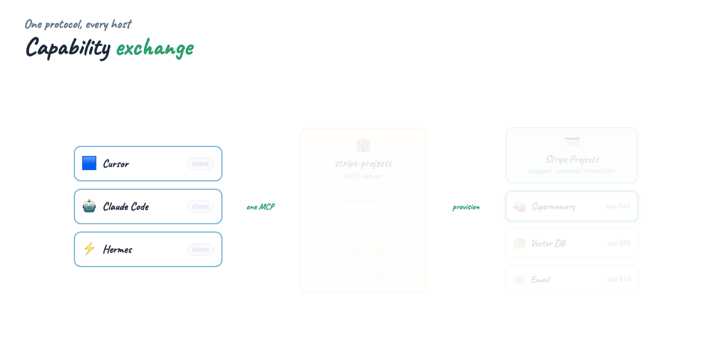

# Stripe Projects MCP Server — Give Your Agent a (Safe) Credit Card

Build an **MCP server** that exposes `provision`, `list`, `rotate_key`, and
`teardown` tools so **any** MCP host — Cursor, Claude Code, Hermes — can stand up
real infrastructure through **one protocol**. The agent never touches your root
key: every service comes back as a **capped, scoped, revocable** credential
through Stripe Projects.

The headline provider is **[Supermemory](https://supermemory.ai)** — provision it
once and the *same* agent immediately gets cross-session memory it just paid for.

**The moment:** the same provisioning call works across every agent, because it's
just MCP tools. Add a provider once → every host gets it at the next capability
exchange.

## What you'll learn

- **The "safe credit card" pattern** — why agents should get scoped, capped keys, not your root key
- **One protocol, many hosts** — expose `provision / list / rotate_key / teardown` as MCP tools so Cursor, Claude Code, and Hermes all provision the same way
- **Provider registry** — add a provisionable service (Supermemory, a vector DB, an email sender) as one entry, not a new tool
- **Provision → use in one loop** — mint a Supermemory key, write it to `.env`, then store and recall memories in the next turn
- **Spend guardrails** — hard caps, mock invoices, key rotation, and teardown that stops billing
- **Capability exchange** — host/client/server handshake, reused from the [MCP Visual Guide](https://github.com/Ayush7614/agentic-ai-ecosystem/tree/main/guides/mcp-visual-guide)
- Runnable **Python MCP server** + an end-to-end **agent demo** that runs fully offline



**Blog mega-GIF:** [mega-stripe-projects-everything.gif](./assets/mega-stripe-projects-everything.gif)

## Quick start

```bash
pip install "mcp[cli]>=1.2"
cd guides/stripe-projects-mcp

# 1. See the whole story run offline (provision → use memory → rotate → teardown)
python examples/agent_demo.py

# 2. Run the server for a real MCP host
python examples/server.py        # stdio transport
# then add examples/cursor_mcp.json snippet to Cursor → MCP settings
```

In your host, ask the agent: **"provision supermemory with a $20 cap, then remember
that I deploy on Fridays."** It calls `provision`, the key lands in `.env`, and the
next `memory.add` just works.

## Guide map

- **[Full tutorial](./TUTORIAL.md)** — the safe-credit-card pattern, building the four tools, wiring hosts, and the Supermemory loop
- **[Examples](./examples/)** — MCP server, provider registry, simulated Stripe Projects backend, agent demo, host configs
- **[Assets](./assets/)** — capability-exchange diagram + flow GIFs

## How the four tools map to Stripe Projects

| MCP tool | What it does | Stripe Projects action |
|----------|--------------|------------------------|
| `provision(name, provider, cap)` | Mint a scoped key for a service | Create a project + spend cap, return a scoped key |
| `list_projects()` | Show status, cap, and spend | Read projects + invoice usage |
| `rotate_key(name)` | Kill the old key, mint a new one | Roll the project's API key |
| `teardown(name)` | Revoke the key, stop billing | Archive the project |

> The included backend **simulates** Stripe Projects so the guide runs offline.
> Swap the `Backend` method bodies for real CLI/API calls to go live — the return
> shapes are what the rest of the guide depends on.

## Related guides

- [MCP Visual Guide](https://github.com/Ayush7614/agentic-ai-ecosystem/tree/main/guides/mcp-visual-guide) — host/client/server, capability exchange, building servers
- [Hermes Agent Masterclass](https://github.com/Ayush7614/agentic-ai-ecosystem/tree/main/guides/hermes-agent-masterclass) — agents that consume MCP tools
- [Harness Engineering](https://github.com/Ayush7614/agentic-ai-ecosystem/tree/main/guides/harness-engineering) — the environment and guardrails around the agent
- [Loop Engineering](https://github.com/Ayush7614/agentic-ai-ecosystem/tree/main/guides/loop-engineering) — the act/observe/repeat loop that drives tool calls

## License

Guide: MIT · MCP spec & SDKs and Supermemory: respective licenses
