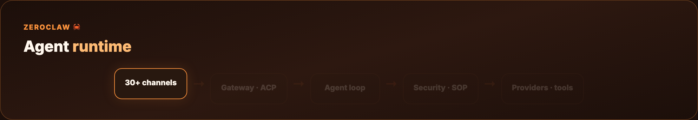

# ZeroClaw Agent Masterclass

The **complete ZeroClaw guide** — Rust agent runtime, `config.toml`, multi-channel inbox, security policy, gateway dashboard, SOP engine, and always-on service.

**Official:** [zeroclawlabs.ai](https://www.zeroclawlabs.ai/) · **Docs:** [docs.zeroclawlabs.ai](https://docs.zeroclawlabs.ai/) · **Source:** [github.com/zeroclaw-labs/zeroclaw](https://github.com/zeroclaw-labs/zeroclaw)

> Fast, small, fully autonomous personal assistant infrastructure — any OS, any provider, any channel. You own the agent, the data, and the machine.

## What you'll build

- ZeroClaw installed (prebuilt binary or source build)
- Working **`~/.zeroclaw/config.toml`** — provider + agent + risk profile + one channel
- **Supervised** autonomy with approval gates (YOLO optional for dev boxes)
- **Telegram or Discord** channel talking to the same agent loop as CLI
- Optional **gateway dashboard**, **SOP** trigger, and **systemd/launchctl** service



**One-GIF overview (blog hero):** [mega-zeroclaw-everything.gif](assets/mega-zeroclaw-everything.gif) — install → quickstart → config → channel → service in ~12s.

## Quick start

```bash
curl -fsSL https://raw.githubusercontent.com/zeroclaw-labs/zeroclaw/master/install.sh | bash
zeroclaw quickstart
zeroclaw agent -a main
zeroclaw service install && zeroclaw service start
```

## Guide map

- **[Full tutorial](./TUTORIAL.md)** — Parts 1–18 (philosophy → hardware → OpenClaw comparison)
- **[Examples](./examples/)** — minimal `config.toml`, Telegram channel block, SOP snippet
- **[Assets](./assets/)** — architecture GIFs, terminal walkthroughs, blog poster

## Related guides

- [OpenClaw](../openclaw/) · [Hermes vs OpenClaw](../hermes-vs-openclaw/)
- [OpenCode Agent Masterclass](../opencode-agent-masterclass/)
- [Harness Engineering](../harness-engineering/) · [MCP Visual Guide](../mcp-visual-guide/)

**Blog header:** `assets/blog-poster-1200x600.png` · Regenerate: `cd assets && python3 render_blog_poster.py && python3 render_gifs.py all`

## License

Guide: MIT · ZeroClaw: MIT OR Apache-2.0 upstream · Not affiliated with ZeroClaw Labs — community tutorial only.
