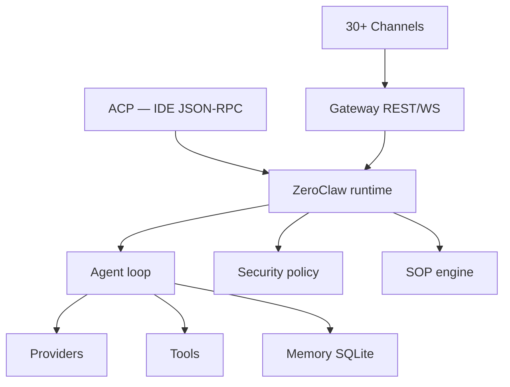
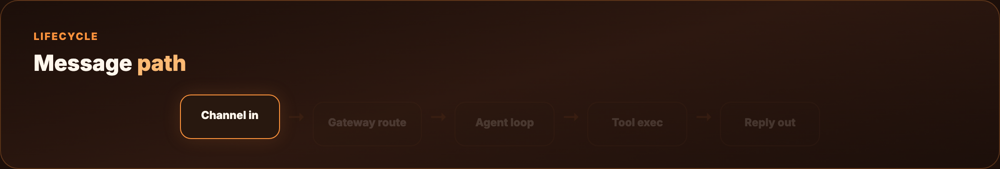
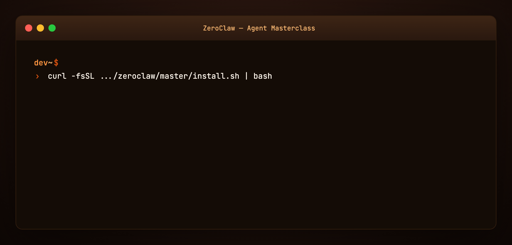
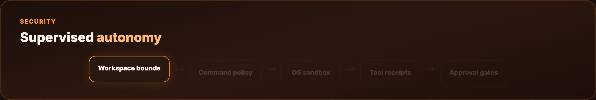
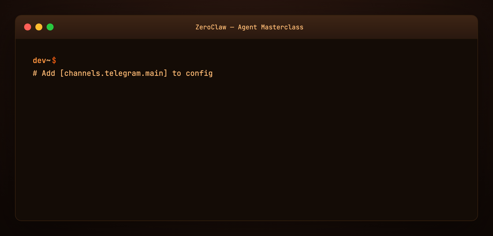
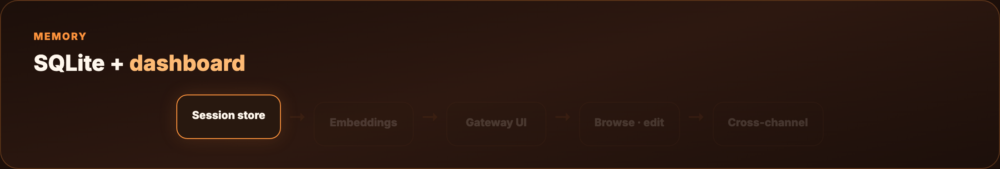
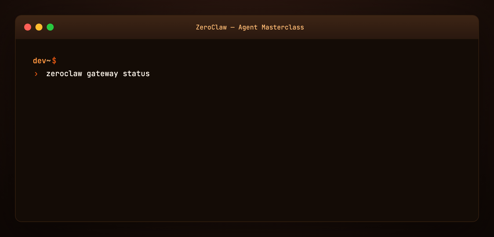
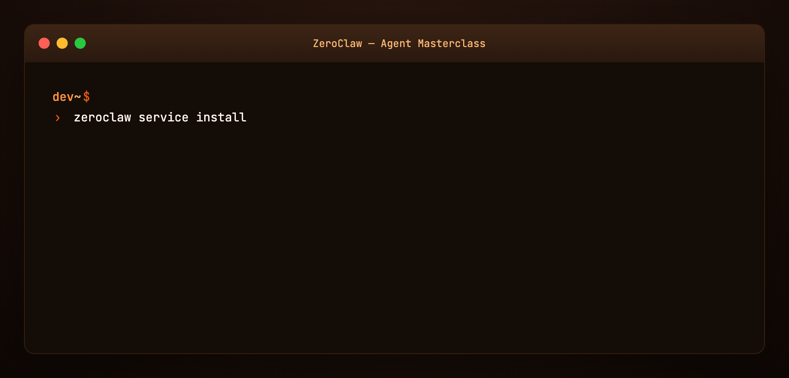

# ZeroClaw Agent Masterclass — Full Tutorial

Everything you need to **install, configure, and run** [ZeroClaw](https://github.com/zeroclaw-labs/zeroclaw) — the Rust agent runtime for a personal AI assistant you fully own: providers, channels, tools, security policy, gateway, and SOP engine.

**Official:** [zeroclawlabs.ai](https://www.zeroclawlabs.ai/) · **Docs:** [docs.zeroclawlabs.ai](https://docs.zeroclawlabs.ai/) · **Source:** [github.com/zeroclaw-labs/zeroclaw](https://github.com/zeroclaw-labs/zeroclaw)

This guide matches our [OpenClaw](../openclaw/TUTORIAL.md) and [Hermes Agent Masterclass](../hermes-agent-masterclass/TUTORIAL.md) format: **prose and lists**, plus **diagram and terminal GIFs** at 1200×600.

---

## Media assets (copy for Medium)

| Asset | URL |
|-------|-----|
| Mega overview | `https://ayush7614.github.io/agentic-ai-ecosystem/guides/zeroclaw-agent-masterclass/assets/mega-zeroclaw-everything.gif` |
| Runtime stack | `https://ayush7614.github.io/agentic-ai-ecosystem/guides/zeroclaw-agent-masterclass/assets/diagram-zeroclaw-stack.gif` |
| Config anatomy | `https://ayush7614.github.io/agentic-ai-ecosystem/guides/zeroclaw-agent-masterclass/assets/diagram-config-anatomy.gif` |
| Security layers | `https://ayush7614.github.io/agentic-ai-ecosystem/guides/zeroclaw-agent-masterclass/assets/diagram-security-layers.gif` |
| Blog poster | `https://ayush7614.github.io/agentic-ai-ecosystem/guides/zeroclaw-agent-masterclass/assets/blog-poster-1200x600.png` |

---

## What you'll have at the end

- ZeroClaw installed (prebuilt or from source)
- **`~/.zeroclaw/config.toml`** with provider, agent, risk profile, and one channel
- CLI chat via `zeroclaw agent -a main`
- **Telegram or Discord** (or CLI-only) on the same agent loop
- Understanding of **supervised** autonomy, tool receipts, and optional **YOLO** dev mode
- Optional **gateway dashboard** and **systemd/launchctl** always-on service

---

## Introduction — you own the agent, the data, the machine

ZeroClaw is an **agent runtime** shipped as a single Rust binary. It connects to LLM providers (Anthropic, OpenAI, Ollama, and ~20 more), delivers messages across **30+ channels** (Discord, Telegram, Matrix, email, webhooks, voice, CLI), and executes **tools** — shell, browser, HTTP, hardware, custom MCP servers.

Everything runs **on your hardware** with **your keys**. Default posture is **security-first**: supervised autonomy, workspace boundaries, OS sandboxes, and cryptographic **tool receipts** on every action.

The project crossed **32k GitHub stars** with a 100% Rust codebase — fast cold start, small binaries (minimal preset ~6.6 MB), and feature flags for embedded or server deployments.


**Official repo only:** [github.com/zeroclaw-labs/zeroclaw](https://github.com/zeroclaw-labs/zeroclaw) — beware impersonation forks.

---

## Part 1 — Architecture



**Layers:**

- **Channels** — inbound/outbound adapters per platform  
- **Gateway** — HTTP/WebSocket API + web dashboard  
- **Agent loop** — ReAct-style tool use with routing and fallbacks  
- **Security** — autonomy levels, sandboxes, command policy, receipts  
- **SOP engine** — event-triggered procedures (cron, MQTT, webhook)  
- **Providers / Tools / Memory** — pluggable backends  

Full diagrams: [Architecture overview](https://docs.zeroclawlabs.ai/) (upstream book).



---

## Part 2 — Four design opinions (philosophy)

ZeroClaw documents four opinions that shape every config decision:

1. **You own the stack** — no mandatory cloud; keys stay local  
2. **Security defaults beat YOLO defaults** — supervised mode first  
3. **Swap anything** — providers, channels, tools via TOML aliases  
4. **One runtime, many surfaces** — CLI, gateway, ACP, channels share the loop  

Read upstream [Philosophy](https://github.com/zeroclaw-labs/zeroclaw/tree/master/docs/book/src/philosophy) for the full essay.

---

## Part 3 — Prerequisites

- **macOS, Linux, Windows, FreeBSD, NixOS**, or Docker  
- **No Rust required** for prebuilt install (source build needs Rust toolchain)  
- API key or local **Ollama** endpoint  
- For Telegram/Discord: bot token from platform developer portal  

```bash
zeroclaw --version   # after install
```

---

## Part 4 — Install

### One-liner

```bash
curl -fsSL https://raw.githubusercontent.com/zeroclaw-labs/zeroclaw/master/install.sh | bash
```

The installer asks: **prebuilt** (seconds) or **source** (custom features). Both run **`zeroclaw quickstart`** at the end unless `--skip-quickstart`.

### Useful flags

```bash
./install.sh --prebuilt              # skip prompt
./install.sh --source --preset minimal   # ~6.6 MB kernel preset
./install.sh --with-gateway          # force gateway support
./install.sh --dry-run --prebuilt    # preview only
./install.sh --uninstall             # remove
```

Platform notes: Linux · macOS · Windows · Docker — in upstream [setup docs](https://github.com/zeroclaw-labs/zeroclaw/tree/master/docs/book/src/setup).



---

## Part 5 — Quickstart and config.toml

```bash
zeroclaw quickstart    # wizard: provider, model, write config
zeroclaw agent -a main # interactive CLI chat
```

Config lives at **`~/.zeroclaw/config.toml`**.

A **minimal V3 config** needs four section shapes:

1. **`[providers.models.<type>.<alias>]`** — model endpoint  
2. **`[agents.<alias>]`** — agent personality + provider reference  
3. **`[risk.<alias>]`** — autonomy and approval gates  
4. **`[channels.<type>.<alias>]`** — optional messaging surface  

See [examples/config.minimal.toml](./examples/config.minimal.toml) for a copy-ready starter.


---

## Part 6 — Providers

ZeroClaw is **provider-agnostic**. Universal schema:

```toml
[providers.models.ollama.local]
type = "ollama"
base_url = "http://127.0.0.1:11434"
model = "llama3.2"

[agents.main]
model_provider = "ollama.local"
system_prompt_file = "~/.zeroclaw/agents/main.md"
```

**Fallback chains** keep the agent alive when a provider flakes — configure routing in upstream [providers/routing](https://github.com/zeroclaw-labs/zeroclaw/tree/master/docs/book/src/providers).

**OpenAI Codex subscription** uses auth profiles (not raw `api_key` on the provider entry):

```toml
[providers.models.openai.coding]
model = "gpt-5-codex"
wire_api = "responses"
requires_openai_auth = true
```

Point agent: `model_provider = "openai.coding"`. Check `zeroclaw auth status` if streaming falls back to non-streaming chat.

---

## Part 7 — Agents and risk profiles

Each **`[agents.<alias>]`** entry defines one agent personality:

- System prompt (inline or file)  
- Model provider reference  
- Tool allow-list  
- Linked **risk profile**  

**Risk profiles** gate autonomy:

| Level | Behavior |
|-------|----------|
| **supervised** (default) | Medium-risk needs approval; high-risk blocked |
| **YOLO** | Dev/trusted boxes — minimal gates ([upstream YOLO doc](https://github.com/zeroclaw-labs/zeroclaw/tree/master/docs/book/src/getting-started)) |



---

## Part 8 — Channels

One agent loop, many inboxes. Configure per-channel blocks:

```toml
[channels.telegram.main]
bot_token_env = "TELEGRAM_BOT_TOKEN"
allowed_users = [123456789]
agent = "main"
```

Supported families include **Discord, Telegram, Matrix, email, webhooks, voice**, and more — see [channels overview](https://github.com/zeroclaw-labs/zeroclaw/tree/master/docs/book/src/channels).

**Test flow:**

1. Create bot (e.g. Telegram `@BotFather`)  
2. Add channel block to config  
3. Export token env var  
4. `zeroclaw service restart`  
5. Message bot → same agent as CLI  



Example: [examples/channel.telegram.toml](./examples/channel.telegram.toml)

---

## Part 9 — Security deep dive

ZeroClaw’s security model is harness engineering done in Rust:

- **Workspace boundaries** — agent cannot escape configured roots  
- **Command policy** — allow/deny shell patterns  
- **OS sandboxes** — Landlock, Bubblewrap, Seatbelt, Docker depending on platform  
- **Tool receipts** — cryptographic record of each tool invocation  
- **Autonomy gates** — human approval for medium/high risk  

Default is **supervised**. Use **YOLO** only on isolated dev machines.

Cross-read: [Harness Engineering](../harness-engineering/TUTORIAL.md) verification + scope subsystems.

---

## Part 10 — Tools

Built-in tool families:

- **Shell** — scripted automation with policy checks  
- **Browser** — fetch, interact, verify UI work  
- **HTTP** — API calls  
- **Hardware** — GPIO/I2C/SPI on Pi, STM32, Arduino, ESP32 ([Hardware docs](https://github.com/zeroclaw-labs/zeroclaw/tree/master/docs/book/src/hardware))  
- **MCP** — attach custom MCP servers like any modern harness  

Tools connect through the agent loop; receipts log every action for audit.

---

## Part 11 — Memory

ZeroClaw persists memory in **SQLite** with optional embeddings — searchable across sessions. The gateway dashboard exposes **memory browsing** and editing.

Unlike Hermes’s three-tier Markdown snapshot model ([Hermes masterclass Part 6](../hermes-agent-masterclass/TUTORIAL.md)), ZeroClaw centralizes memory in the runtime database with dashboard UX.



---

## Part 12 — Gateway and dashboard

Enable gateway at install (`--with-gateway`) or in config. Provides:

- **HTTP / WebSocket** API for clients  
- **Web dashboard** — chat, config editor, cron, tool inspection, memory browser  

Useful for headless servers: run ZeroClaw on a VPS, chat from browser or phone channel.



---

## Part 13 — SOP engine

**Standard Operating Procedures** — event-triggered workflows:

- Triggers: **cron**, **MQTT**, **webhook**, **peripheral** events  
- **Approval gates** before destructive steps  
- **Resumable runs** if interrupted  

Example snippet: [examples/sop.example.toml](./examples/sop.example.toml)

Think of SOPs as **deterministic backbone + agent intelligence where it matters** — similar to CrewAI Flows or OpenClaw cron, but native to the runtime.

---

## Part 14 — ACP (Agent Client Protocol)

ZeroClaw speaks **ACP** — JSON-RPC 2.0 over stdio — for IDE and editor integration. Your editor becomes a channel into the same agent loop as Telegram.

Docs: [channels/acp](https://github.com/zeroclaw-labs/zeroclaw/tree/master/docs/book/src/channels/acp)

Parallels **OpenCode’s IDE extension** ([OpenCode masterclass Part 14](../opencode-agent-masterclass/TUTORIAL.md)) — different protocol, same idea: **harness follows the developer**.

---

## Part 15 — Always-on service

Register as OS service:

```bash
zeroclaw service install   # systemd · launchctl · Windows Service
zeroclaw service start
zeroclaw service status
```

Now channels stay connected while you close the laptop terminal — the runtime keeps running.



---

## Part 16 — Hardware and edge (optional)

ZeroClaw targets **edge and embedded** seriously — Raspberry Pi agents with GPIO, firmware crates, minimal preset builds. Skip this part if you only need desktop assistant workflows.

Entry: upstream [Hardware index](https://github.com/zeroclaw-labs/zeroclaw/tree/master/docs/book/src/hardware).

---

## Part 17 — ZeroClaw vs OpenClaw vs OpenCode

**ZeroClaw vs OpenClaw:** Both are personal assistant runtimes. OpenClaw is Node/TypeScript with a rich skill marketplace and WhatsApp focus. ZeroClaw is **Rust-native**, security-policy-first, with SOP engine and hardware paths. See [Hermes vs OpenClaw](../hermes-vs-openclaw/TUTORIAL.md) for gateway comparison patterns.

**ZeroClaw vs OpenCode:** OpenCode optimizes **repo coding** in TUI/IDE. ZeroClaw optimizes **multi-channel life + ops** with enterprise-style security. Many builders use OpenCode in git and ZeroClaw for always-on inbox automation.

**ZeroClaw vs Hermes:** Hermes emphasizes **learning loops** (skills, Curator, GEPA). ZeroClaw emphasizes **runtime security, channels, and SOP automation**.

---

## Part 18 — Troubleshooting

| Symptom | Fix |
|---------|-----|
| `command not found` | Re-run `install.sh`; check `$PATH` |
| Provider auth fails | `zeroclaw auth status`; re-run quickstart |
| Streaming fallback message | Usually transient — check provider health |
| Channel silent | Verify token env, `allowed_users`, service running |
| Approval spam | Tune risk profile; not YOLO on prod |
| Impersonation fork | Use **only** `zeroclaw-labs/zeroclaw` official repo |

Security issues: **security@zeroclaw.dev** — do not file public CVEs.

---

## Regenerate visuals

```bash
cd guides/zeroclaw-agent-masterclass/assets
python3 render_gifs.py all
python3 render_blog_poster.py
cd ../../..
./scripts/prepare-docs.sh
```

---

## Further reading

- [ZeroClaw GitHub](https://github.com/zeroclaw-labs/zeroclaw) · [Docs book](https://docs.zeroclawlabs.ai/)
- [OpenClaw masterclass](../openclaw/TUTORIAL.md)
- [OpenCode Agent Masterclass](../opencode-agent-masterclass/TUTORIAL.md)
- [Harness Engineering](../harness-engineering/TUTORIAL.md)

---

## Summary

**ZeroClaw** is a **Rust agent harness** for people who want full ownership: one config file, many channels, enforced security, optional gateway UI, and SOP automation. Run `quickstart`, point an agent at your provider, wire Telegram, install the service — and you have a private assistant that doesn’t phone home.

The model is interchangeable. The runtime — policy, channels, receipts, memory — is the product you actually live with.
